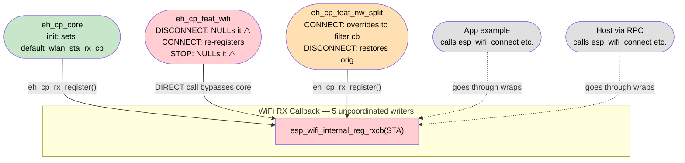
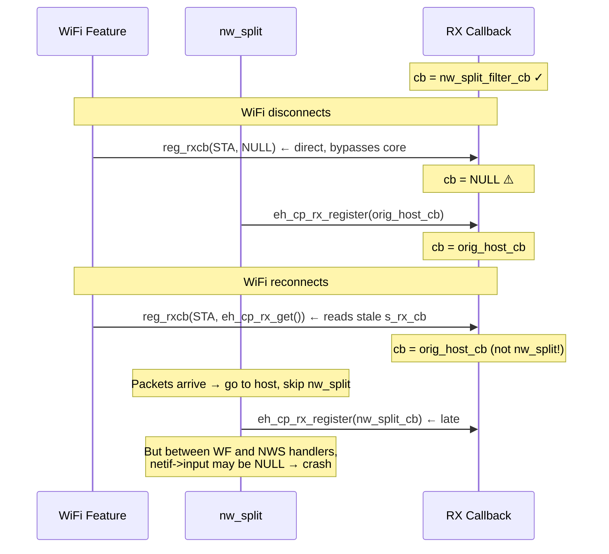
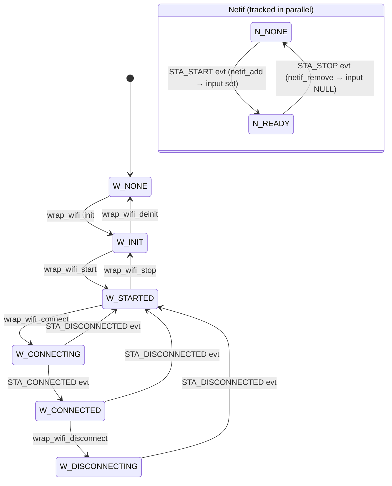
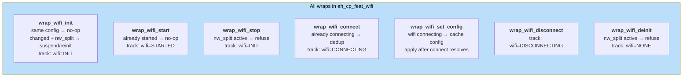
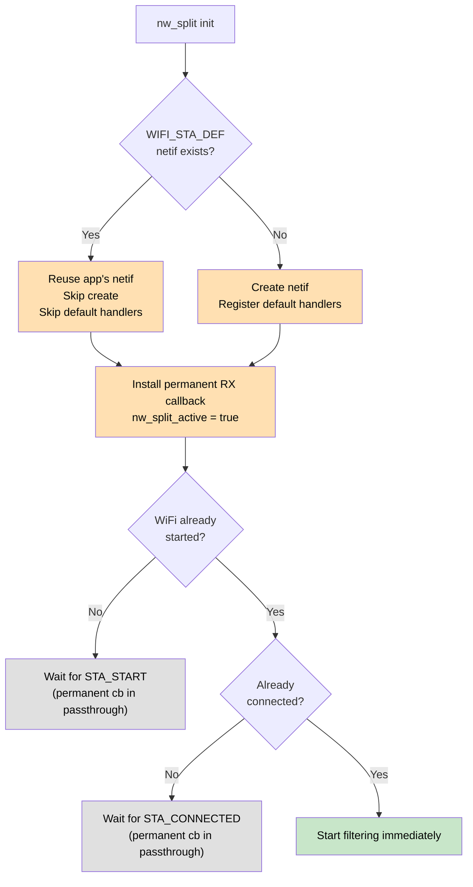
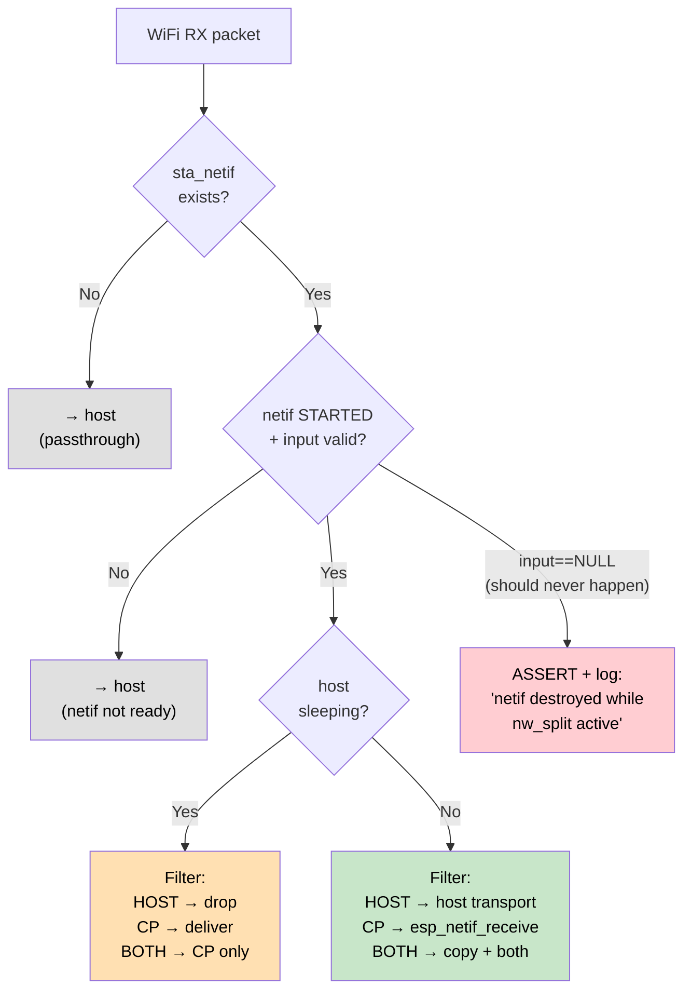
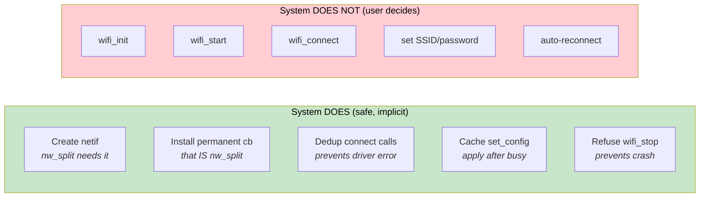
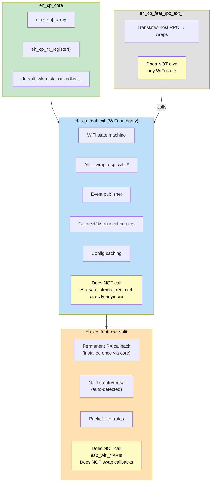

<!-- %% me.br-260416nso.o %% - always -->
# Brainstorm: Network Split — Wrap-Layer WiFi State Management

**Date**: 2026-04-16  |  **Status**: Active
**Trigger**: `nw_split_ps` crash — NULL `netif->input` in `wlanif_input:177`

Color key for all diagrams:
- 🟩 `#c8e6c9` = safe / hosted core
- 🟦 `#bbdefb` = WiFi feature (wrap owner)
- 🟧 `#ffe0b2` = nw_split
- 🟥 `#ffcdd2` = error / conflict
- ⬜ `#e0e0e0` = passthrough / no-op

---

## 1. The Problem: 5 Actors, No Coordinator

Five actors modify WiFi RX callback and WiFi state without coordination.



**The crash sequence:**



---

## 2. The Solution: Wrap Layer in `eh_cp_feat_wifi`

### Why `eh_cp_feat_wifi`, not `eh_cp_core`

```
eh_cp_core          — transport, handshake, s_rx_cb[], eh_cp_rx_register()
  └─ eh_cp_feat_wifi  — WiFi authority: state, wraps, event publishing
       └─ eh_cp_feat_nw_split  — packet routing (sits ON TOP of WiFi)
            └─ eh_cp_feat_host_ps  — sleep flag
```

`eh_cp_feat_wifi` already owns:
- `__wrap_esp_wifi_connect()` + dedup logic
- `s_station_connecting`, `s_wifi_started` state
- `s_pending_sta_config` caching
- All STA/AP event handlers
- The direct `esp_wifi_internal_reg_rxcb` calls (which need fixing)

Moving ALL wraps here consolidates WiFi authority in one place.
Core stays lean: transport + handshake + callback array.


### State Machine



### What Each Wrap Does



---

## 3. Auto-Detection: Zero Kconfig for Ownership

nw_split detects the system state at init and adapts. No ownership Kconfig needed.



**All valid app patterns — zero config required:**

| Pattern | App code | nw_split detects | Result |
|---------|----------|-----------------|--------|
| A | `eh_cp_init()` only, host drives WiFi via RPC | No netif, no WiFi | Creates netif, waits for host |
| B | `eh_cp_init()` → `wifi_init` → `wifi_start` → `connect` | No netif, no WiFi at init | Creates netif, app drives WiFi |
| C | `create_netif()` → `eh_cp_init()` → `wifi_start` | Netif exists | Reuses netif, app drives WiFi |
| D | `create_netif` → `wifi_start` → `connect` → `eh_cp_init()` | Everything running | Reuses netif, starts filtering immediately |

---

## 4. Permanent RX Callback

Installed once at nw_split init. Never swapped. All routing in one place.



**What this eliminates:**

| Removed | Was |
|---------|-----|
| `s_sta_rx_overridden` flag | Tracked override state |
| `s_sta_netif_input_ready` flag | Racy cached readiness |
| `nw_split_try_override_sta_rx_cb()` | 18 lines, called from 2 events |
| `eh_cp_feat_nw_split_reset_rx_override()` | Full state reset |
| `nw_split_get_active_sta_netif()` runtime lookup | Key-based hunt every packet |
| STA_CONNECTED/DISCONNECTED callback swap | Override/restore dance |

---

## 5. Not Presumptuous — What the System Does vs Doesn't



---

## 6. Code Changes

### File ownership after changes



### All changes

| File | Change | Why |
|------|--------|-----|
| **`eh_cp_feat_wifi/CMakeLists.txt`** | Add all `--wrap=esp_wifi_*` linker flags | Centralize wraps in WiFi authority |
| **`eh_cp_feat_wifi/src/eh_cp_feat_wifi_state.c`** | **NEW**: state struct + all wrap implementations | Single WiFi state machine |
| **`eh_cp_feat_wifi/include/eh_cp_feat_wifi_state.h`** | **NEW**: query API (`is_started`, `is_connecting`, `netif_is_ready`, etc.) | Features read state |
| **`eh_cp_feat_wifi/src/eh_cp_feat_wifi_event_publisher.c`** | **REMOVE** 3 direct `esp_wifi_internal_reg_rxcb` calls (lines 265, 332, 350) | Stop bypassing core. Permanent cb handles it. |
| **`eh_cp_feat_rpc_ext_mcu/src/.._handler_req_wifi.c`** | **MOVE** `__wrap_esp_wifi_init` to WiFi feature | Was in wrong component |
| **`eh_cp_feat_rpc_ext_mcu/CMakeLists.txt`** | **REMOVE** `--wrap=esp_wifi_init` | Moved to WiFi feature |
| **`eh_cp_feat_nw_split/src/eh_cp_feat_nw_split.c`** | Remove override dance (~80 lines). Install permanent cb once at init. Simplify event handlers. | Permanent callback design |
| **`eh_cp_core/src/eh_cp_core.c`** | No structural changes. `eh_cp_rx_register()` stays here. | Core keeps callback array |

### Phased implementation

| Phase | Scope | What it fixes |
|-------|-------|---------------|
| **P1** | Remove 3 direct `reg_rxcb` calls from WiFi feature | Fixes the 5th-actor bypass — may fix the crash alone |
| **P2** | Move `__wrap_esp_wifi_init` to WiFi feature, add `__wrap_esp_wifi_stop` guard | Prevents netif destruction during nw_split |
| **P3** | Permanent RX callback in nw_split (remove override dance) | Eliminates all callback-swap TOCTOU races |
| **P4** | Add `__wrap_esp_wifi_set_config` caching, `__wrap_esp_wifi_connect` dedup (extend existing) | Handles 4-actor connect contention gracefully |
| **P5** | Auto-detect netif at nw_split init | Zero Kconfig for ownership |

P1 alone is a 3-line fix that likely resolves the immediate crash.

---

## 7. Open Questions

**Q1**: WiFi feature's `reg_rxcb(NULL)` on disconnect was intentional — it prevents
packets reaching a stale callback after disconnect. With permanent callback,
the callback handles disconnect state internally (passthrough). Is removing
the NULL safe, or should we gate it (`if !nw_split_active`)?

**Q2**: `__wrap_esp_wifi_init` reinit path calls `esp_wifi_stop()` + `deinit()`.
With the wrap guard, this returns `ESP_ERR_INVALID_STATE` when nw_split is active.
Should we instead implement suspend/resume so reinit works? Or is refusing acceptable for v1?

**Q3**: Should the WiFi feature's existing `s_pending_sta_config` caching merge with
the new wrap-layer config caching, or stay separate? They serve similar purposes.
Merging avoids double-caching; keeping separate preserves existing behavior.

<!-- %% me.br-260416nso.c %% -->
