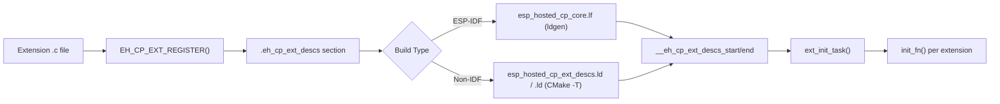

# Linker Auto-Init — IDF vs Non-IDF (Quick Start)
<!-- Last updated: 2026-03-14 -->

This document explains how extension auto-init works, and how to wire the
linker pieces for **ESP-IDF** and **non-IDF** builds.

The goal is simple:

1. Each extension calls `EH_CP_EXT_REGISTER()` at file scope.
2. All descriptors land in the `.eh_cp_ext_descs` section.
3. Core’s `ext_init_task` walks the section and calls each `init_fn`.

---

## Symbols Used

Primary symbols (used by core):
- `__eh_cp_ext_descs_start`
- `__eh_cp_ext_descs_end`

Non-IDF compatibility aliases:
- `__start_eh_cp_ext_descs`
- `__stop_eh_cp_ext_descs`

---

## ESP-IDF Build (ldgen / `.lf`)

ESP-IDF uses **ldgen**. The linker section is defined in:

`components/coprocessor/esp_hosted_cp_core/esp_hosted_cp_core.lf`

Key properties:
- `KEEP` prevents GC of `.eh_cp_ext_descs`
- `SURROUND(eh_cp_ext_descs)` emits `__eh_cp_ext_descs_start/end`

**No `.ld` scripts should be injected in IDF builds.**

---

## Non-IDF Build (GCC + CMake)

Two options:

1. **Include-style fragment**  
   Add to your main linker script:
   ```
   INCLUDE "esp_hosted_cp_ext_descs.ld"
   ```
   File:  
   `components/coprocessor/esp_hosted_cp_core/esp_hosted_cp_ext_descs.ld`

2. **CMake helper (GNU ld)**  
   Use the helper to inject `-T esp_hosted_cp_ext_descs_insert.ld`:
   ```
   include(esp_hosted_cp_core_linker.cmake)
   esp_hosted_cp_core_add_linker_fragment(my_app)
   ```
   File:  
   `components/coprocessor/esp_hosted_cp_core/esp_hosted_cp_core_linker.cmake`

Recommended guard:
```
if(NOT ESP_PLATFORM)
    include(esp_hosted_cp_core_linker.cmake)
    esp_hosted_cp_core_add_linker_fragment(${PROJECT_NAME})
endif()
```

---

## Mermaid Diagram



---

## Notes

- If a feature flag is **disabled**, its extension does not compile and its
  descriptor is not emitted — no init occurs.
- IDF and non-IDF linker flows must remain **separate** to avoid fragile builds.
- If one extension calls APIs from another, the call site must be guarded by the
  provider’s feature flag (no stubs).
