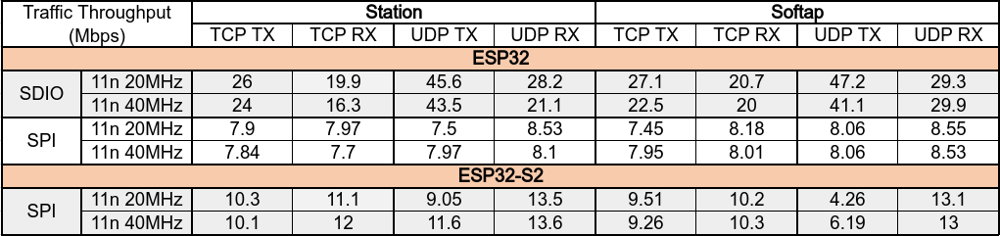

# ESP-Hosted

# Index
* [**1. Introduction**](#1-introduction)  
	* [Connectivity Feature](#11-connectivity-features)  
	* [Supported ESP boards](#12-supported-esp-boards)  
	* [Supported Hosts](#13-supported-hosts)  
	* [Supported Transports](#14-supported-transports)  
	* [Feature Matrix](#15-feature-matrix)  
* [**2. Get Started**](#2-get-started)  
	* [Getting Started With Linux Host](#21-getting-started-with-linux-host)  
	* [Getting Started With MCU host](#22-getting-started-with-mcu-host)  
* [**3. Design**](#3-design)  
	* [System Architecture](#31-system-architecture)  
	* [Transport layer communication protocol](#32-transport-layer-communication-protocol)  
	* [Integration Guide](#33-integration-guide)  
* [**4. Performance And Validation**](#4-performance-and-validation)

---

# 1. Introduction

ESP-Hosted solution provides a way to use ESP board as a communication processor for Wi-Fi and Bluetooth/BLE connectivity. It basically adds a network interface and a HCI interface to host, allowing it to communicate with other devices.

Following features are provided as a part of this solution:
* A standard 802.3 network interface is provided to host for transmitting and receiving 802.3 frames
* A standard HCI interface is provided to host over which Bluetooth/BLE is supported
* A control interface to configure and control Wi-Fi on ESP board

For end to end working of this solution, host needs to be equipped with corresponding TCP/IP, TLS and Bluetooth/BLE stack.

Please note that this project doesn't provide a standard 802.11 interface to the host. For the control path between the host and ESP board, ESP-Hosted uses a custom implementation based on [Protobuf](https://developers.google.com/protocol-buffers).

### 1.1 Connectivity Features

ESP-Hosted solution provides following WLAN and BT/BLE features to host:
- WLAN Features:
	- 802.11b/g/n
	- WLAN Station
	- WLAN Soft AP
- BT/BLE Features:
	- ESP32 supports v4.2 BR/EDR and BLE
	- ESP32-C3 supports v5.0 BLE

### 1.2 Supported ESP boards

ESP-Hosted solution is supported on following ESP boards:
- ESP32
- ESP32S2
- ESP32C3

### 1.3 Supported Hosts

* ESP-Hosted solution supports following Linux based and MCU based hosts out of the box.
	* Linux Based Hosts
		* Raspberry-Pi 3 Model B
		* Raspberry-Pi 3 Model B+
		* Raspberry-Pi 4 Model B
	* MCU Based Hosts
		* STM32 Discovery Board (STM32F469I-DISCO)
* It is relatively easy to port this solution to other Linux and MCU platforms.

### 1.4 Supported Transports

ESP-Hosted uses SDIO or SPI bus for interfacing ESP boards and host platform. Not all host platforms support both these interfaces. Further section depicts supported host platforms and corresponding transport interface, ESP boards and feature set.

### 1.5 Feature Matrix
##### 1.5.1 Linux Host
Below table explains which feature is supported on which transport interface for Linux based host.

| ESP device | Transport Interface | WLAN support | Virtual serial interface | BT/BLE support | BLE 5.0 support |
|:---------:|:-------:|:---------:|:--------:|:--------:|:--------:|
| ESP32 | SDIO | Yes | Yes | Yes | NA |
| ESP32 | SPI | Yes | Yes | Yes | NA |
| ESP32 | UART | No | No | Yes | NA |
| ESP32-S2 | SDIO | NA | NA | NA | NA |
| ESP32-S2 | SPI | Yes | Yes | NA | NA |
| ESP32-S2 | UART | No | No | NA | NA |
| ESP32-C3 | SDIO | NA | NA | NA | NA |
| ESP32-C3 | SPI | Yes | Yes | Yes | Yes |
| ESP32-C3 | UART | No | No | Yes | Yes |

##### 1.5.2 MCU Host
Below table explains which feature is supported on which transport interface for MCU based host.

| ESP device | Transport Interface | WLAN support | Virtual serial interface | BT/BLE support |
|:------------:|:-------:|:---------:|:--------:|:--------:|
| ESP32 | SDIO | No | No | No |
| ESP32 | SPI | Yes | Yes | Yes\* |
| ESP32 | UART | No | No | Yes\*\* |
| ESP32-S2 | SDIO | NA | NA | NA |
| ESP32-S2 | SPI | Yes | Yes | NA |
| ESP32-S2 | UART | No | No | NA |
| ESP32-C3 | SDIO | NA | NA | NA |
| ESP32-C3 | SPI | Yes | Yes | Yes\* |
| ESP32-C3 | UART | No | No | Yes\* |

\* BT/BLE over SPI
> BT/BLE support over SPI is not readily available. In order to implement it, one needs to:
> 
> Port BT/BLE stack to MCU, \
> Add a new virtual serial interface using the serial interface API's provided in host driver of ESP-Hosted solution.
> HCI implementation in Linux Driver `host/linux/host_driver/esp32` could be used as reference. Search keyword: `ESP_HCI_IF`
> Register this serial interface with BT/BLE stack as a HCI interface.

\*\* BT/BLE over UART
> BT/BLE support over UART is not readily available. In order to implement this, one needs to:
>
> Port BT/BLE stack to MCU, \
> Register the UART serial interface as a HCI interface with BT/BLE stack
> With the help of this UART interface, BT/BLE stack can directly interact with BT controller present on ESP32 bypassing host driver and firmware
> ESP Hosted host driver and a firmware plays no role in this communication

---

# 2. Get Started
This section describes how to setup and use ESP-Hosted solution. Since ESP-Hosted solution supports two distinct platforms, procedure to use it vastly differs.

### 2.1 Getting Started With Linux Host
Please refer [Getting Started](docs/Linux_based_host/Linux_based_readme.md) guide for Linux host.

### 2.2 Getting Started With MCU Host
Please refer [Getting Started](docs/MCU_based_host/MCU_based_readme.md) guide for MCU host.

---

# 3. Design
This section describes the overall design of ESP-Hosted solution. There are 3 aspects to it:
* System Architecture
* Transport layer communication protocol
* API Reference

### 3.1 System Architecture

This section discusses building blocks of the ESP-Hosted solution for the supported host platforms.

These building blocks can be broadly classified as:
* ESP Host Software  
This includes ESP Host driver and control interface implementation.

* ESP Firmware  
This includes ESP peripheral driver and implementation of control commands.

* Third party components  
This includes components that are essential for end to end working of entire system but are not maintained or implemented as a part of this project.

##### 3.1.1 ESP Host Software

The components of ESP host software are dependent on host platform that is being used. Please refer following documents:

1. [System Architecture: Linux based host](docs/Linux_based_host/Linux_based_architecture.md)
2. [System Architecture: MCU based host](docs/MCU_based_host/MCU_based_architecture.md)

##### 3.1.2 ESP Firmware
This implements ESP-Hosted solution part that runs on ESP boards. ESP firmware is agnostic of the host platform. It consists of following.

* ESP Application  
This implements:
	* SDIO transport layer
	* SPI transport layer
	* Virtual serial interface driver
	* Control interface command implementation
	* Bridges data path between Wi-Fi, HCI controller driver of ESP and Host platform
* ESP-IDF Components  
ESP firmware mainly uses following components from ESP-IDF. Please check [ESP-IDF documentation](https://docs.espressif.com/projects/esp-idf/en/latest/esp32/get-started/index.html) for more details.
	* SDIO Slave driver
	* SPI Slave driver
	* Wi-Fi driver
	* HCI controller driver
	* Protocomm Layer

##### 3.1.3 Third Party Components
Third components such as following are essential for end to end working of ESP-Hosted Solution. Implementation or porting of these third party compoenent is not in scope of this project.
* TCP/IP and TLS stack
* BT/BLE stack
* UART driver
* Protobuf

### 3.2 Transport layer communication protocol
This section describes the data communication protocol used at the transport layer. This protocol is agnostic of host platforms that is being used. Please refer following links to get more information on communication protocol per transport interface type.
* [SDIO Communication Protocol](docs/sdio_protocol.md)
* [SPI Communication Protocol](docs/spi_protocol.md)

##### 3.2.1 Payload Format
This section explains the payload format used for data transfer on SDIO and SPI interfaces.

* Host and peripheral makes use of 12 byte payload header which preceeds every data packet.
* This payload header provides additional information about the data packet. Based on this header, host/peripheral consumes transmitted data packet.
* Payload format is as below

| Field | Length | Description |
|:-------:|:---------:|:--------|
| Interface type | 4 bits | Possible values: STA(0), SoftAP(1), Serial interface(2), HCI (3), Priv interface(4). Rest all values are reserved |
| Interface number | 4 bits | Unused |
| Flags | 1 byte | Additional flags like `MORE_FRAGMENT` in fragmentation |
| Packet length | 2 bytes | Actual length of data packet |
| Offset to packet | 2 bytes | Offset of actual data packet |
| Checksum | 2 bytes | checksum for complete packet (Includes header and payload) |
| Reserved2 | 1 byte | Not in use |
| seq_num | 2 bytes | Sequence number for serial inerface |
| Packet type | 1 byte | reserved when interface type is 0,1 and 2. Applicable only for interface type 3 and 4 |

### 3.3 Integration Guide

##### 3.3.1 Control Interface API's
This section describes control interface API's provided by ESP-Hosted Solution For higher layer applications. One can easily integrate ESP-Hosted solution with other projects using these API's. There are two flavors of these API's:

* [Python API's](docs/python_api.md)
* [C API's](docs/c_api.md)

##### 3.3.2 API's for MCU Based ESP-Hosted Solution
Below document explains the API's provided for MCU based ESP-Hosted solution
* [API's for MCU based host](docs/MCU_based_host/mcu_api.md)

# 4. Performance And Validation
### 4.1 Wi-Fi Performance in shielded environment
Following performance numbers are taken on Linux based ESP-Hosted solution.

