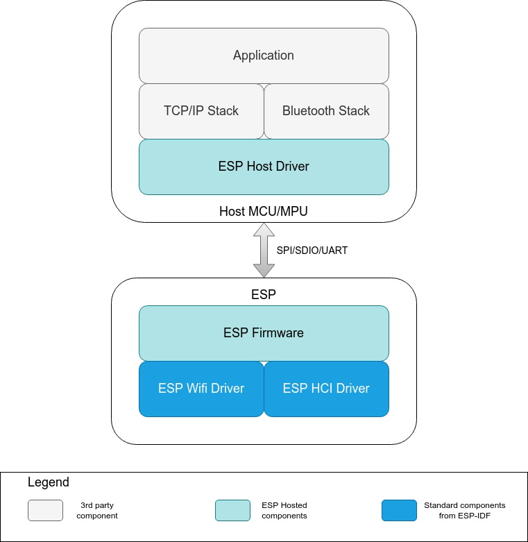

# ESP-Hosted

ESP-Hosted is an open source solution that provides a way to use Espressif SoCs and modules as a communication co-processor. This solution provides wireless connectivity (Wi-Fi and BT/BLE) to the host microprocessor or microcontroller, allowing it to communicate with other devices.

Following is the high level block diagram for ESP-Hosted. Detailed block diagram is available in subsequent sections. 

## 1. ESP-Hosted Flavours

The ESP-Hosted solution is available in two flavours as mentioned below. The differentiation factor here is the type of network interface presented to host and the way Wi-Fi on ESP SoC/module is configured/controlled. Both the flavours have their respective host and firmware software.

### 1.1 ESP-Hosted-NG

This is the Next-Generation ESP-Hosted solution specifically designed for hosts that run Linux operating system. This flavour of the solution takes a standard approach while providing a network interface to the host. This allows usage of standard Wi-Fi applications such as wpa_supplicant to be used with ESP SoCs/modules.

This solution offers following:

* 802.11 network interface which is a standard Wi-Fi interface on Linux host
* Configuration of Wi-Fi is supported through standard cfg80211 interface of Linux
* A standard HCI interface

This flavour is available in [esp_hosted_ng](esp_hosted_ng)

Please proceed with the [detailed documentation](esp_hosted_ng/README.md) for setup and usage instructions.

### 1.2 ESP-Hosted-FG

This is a first generation ESP-Hosted solution. This is a flavour, which provides a standard 802.3 (Ethernet) network interface to the host. Thought process behind this solution is to keep the host software simple while providing suite of connectivity features.

In order to achieve this, the host is presented with following:

* A standard 802.3 network interface which essentially is an Ethernet interface
* A light weight control interface to configure Wi-Fi on ESP board
* A standard HCI interface

Although this flavour supports Linux host, the nature of this solution makes it ideal to be used with MCU hosts which do not have complex communication interfaces such as Ethernet, Wi-Fi, BT/BLE etc.

This flavour is available in [esp_hosted_fg](esp_hosted_fg)

Please proceed with the [detailed documentation](esp_hosted_fg/README.md) for setup and usage instructions.

## 2. ESP-Hosted-FG vs ESP-Hosted-NG

Now that we offer two flavours of this solution, it could cause a little confusion. This section will try to explains similarities and differences in both the flavours and help you make a choice.

### 2.1 Similarities

- Both the flavours share the same aim, to conveniently use ESP's Wi-Fi and Bluetooth/BLE capabilities from host
- Both the flavours aim to support same set of ESP SoCs/modules and same set of transports like SPI/SDIO/UART for connectivity needs

### 2.2 Key Differences

- ESP-Hosted-FG supports both Linux and MCU hosts. ESP-Hosted-NG supports only Linux host.
- ESP-Hosted-FG exposes 802.3 network interface (Ethernet) to the host. Where as, ESP-Hosted-NG exposes 802.11 interface (Wi-Fi).
- ESP-Hosted-FG uses custom control path to configure Wi-Fi as opposed to ESP-Hosted-NG which uses standard nl80211/cfg80211 configuration.

Following table summarizes this entire discussion.

<table>
  <tr>
    <th>Features</th>
    <th>ESP-Hosted First Generation </th>
    <th>ESP-Hosted Next Generation </th>
  </tr>
  <tr>
    <td>Supported platforms</td>
    <td>MCU &amp; Linux host</td>
    <td>Linux only host</td>
  </tr>
  <tr>
    <td>Wi-Fi Configuration mechanism</td>
    <td>Custom control interface</td>
    <td>nl80211 / cfg80211</td>
  </tr>
  <tr>
    <td>Network Interface available</td>
    <td>802.3 Ethernet Interface</td>
    <td>802.11 Wi-Fi interface</td>
  </tr>
  <tr>
    <td>Recommended Host Type</td>
    <td>MCU Host</td>
    <td>Linux Host</td>
  </tr>
  <tr>
    <td>Wi-Fi features</td>
    <td colspan="2" style="text-align:center">802.11 b/g/n</td>
  </tr>
  <tr>
    <td>Transport Layer</td>
    <td colspan="2"  style="text-align:center">SDIO, SPI, UART</td>
  </tr>
  <tr>
    <td>Usable transport combinations</td>
    <td colspan="2"  style="text-align:center">SPI only, SPI+UART, SDIO only, SDIO+UART</td>
  </tr>
  <tr>
    <td>Wi-Fi Mode</td>
    <td>Station, SoftAP</td>
    <td>Station</td>
  </tr>
  <tr>
    <td>Wi-Fi Security Protocols</td>
    <td>Open / WPA / WPA2 / WPA3</td>
    <td>Open / WPA / WPA2</td>
  </tr>
  <tr>
    <td>Bluetooth features</td>
    <td>Classic BT, BLE 4.2, 5.0</td>
    <td>Classic BT, BLE 4.2</td>
  </tr>
  <tr>
    <td>Chipsets supported</td>
    <td>ESP32, ESP32-C3/S2/S3</td>
    <td>ESP32</td>
  </tr>
  <tr>
    <td>Iperf Throughput</td>
    <td colspan="2" style="text-align:center">25Mbps+ in RX/TX</td>
  </tr>
</table>

## 3. Our Recommendation

* If you are using MCU host, you do not have choice but to use ESP-Hosted-FG
* If you are using Linux host, we recommend ESP-Hosted-NG since it takes a standard approach which makes it compatible with widely used user space applications/services such as wpa_supplicant, Network Manager etc.

