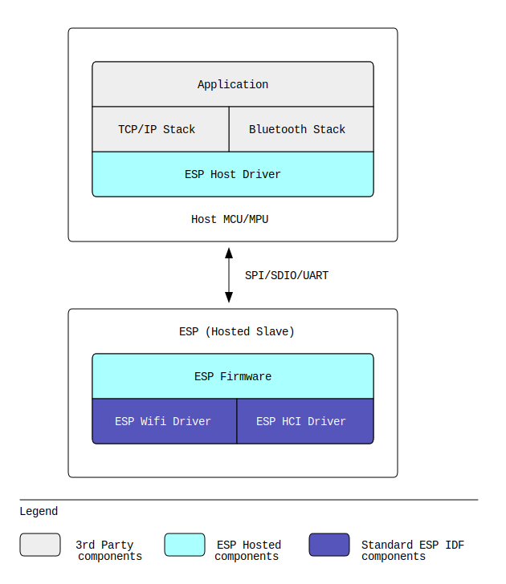
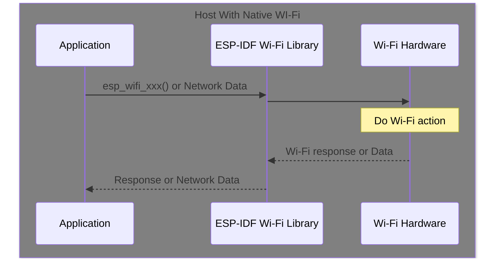
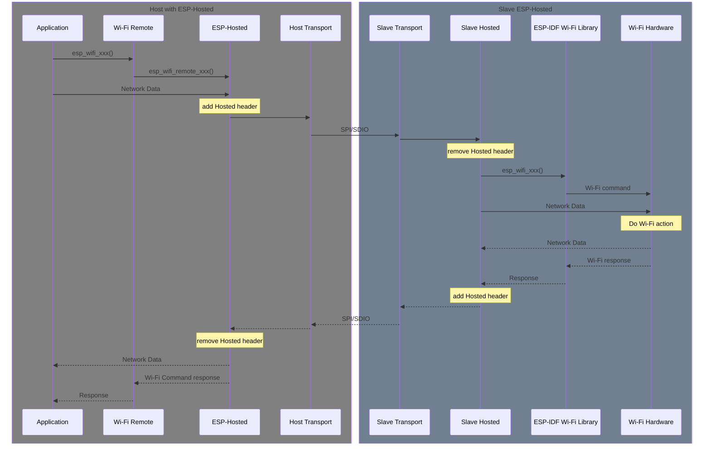

# ESP-Hosted

**Table of Contents**

- [1. Introduction](#1-introduction)
  - [1.1. ESP as MCU Host branch](#11-esp-as-mcu-host-branch)
  - [1.2. ESP-Hosted Architecture](#12-esp-hosted-architecture)
    - [1.2.1. ESP-Hosted Features](#121-esp-hosted-features)
    - [1.2.2. ESP-Hosted Bluetooth Support](#122-esp-hosted-bluetooth-support)
  - [1.3. Hosted on ESP32s with Native Wi-Fi](#13-hosted-on-esp32s-with-native-wi-fi)
- [2. Getting Started](#2-getting-started)
  - [2.1. DevKit Specific Information](#21-devkit-specific-information)
- [3. Preparing the Host to use ESP-Hosted](#3-preparing-the-host-to-use-esp-hosted)
  - [3.1. Adding required components to your ESP-IDF Project](#31-adding-required-components-to-your-esp-idf-project)
  - [3.2. Disabling Native Wi-Fi Support](#32-disabling-native-wi-fi-support)
- [4. Getting the ESP-Hosted Slave Project](#4-getting-the-esp-hosted-slave-project)
- [5. Selecting the Hardware Interface for Host and Slave](#5-selecting-the-hardware-interface-for-host-and-slave)
  - [5.1. Evaluating ESP-Hosted Hardware Interface](#51-evaluating-esp-hosted-hardware-interface)
- [6. Configuring the ESP-Hosted Components](#6-configuring-the-esp-hosted-components)
  - [6.1. Configuring the Hosted Host](#61-configuring-the-hosted-host)
  - [6.2. Configuring the Hosted Slave](#62-configuring-the-hosted-slave)
  - [6.3. Flashing and Running ESP-Hosted](#63-flashing-and-running-esp-hosted)
- [7. Verifying that ESP-Hosted is Running](#7-verifying-that-esp-hosted-is-running)
  - [7.1. Checking the Console Output](#71-checking-the-console-output)
- [8. Troubleshooting](#8-troubleshooting)
- [9. References](#9-references)

## 1. Introduction

ESP-Hosted is an open source solution that provides a way to use
Espressif SoCs and modules as a communication (slave)
co-processor. This solution provides wireless connectivity (Wi-Fi and
Bluetooth) to the host microprocessor or microcontroller, allowing it
to communicate with other devices.

This high-level block diagram shows ESP-Hosted's relationship with the
host MCU and slave co-processor.



*ESP-Hosted Block Dragram*

### 1.1. ESP as MCU Host branch

This branch uses ESP chipsets as the host processor. This allows the
ESP Wi-Fi api calls to be used on ESP chipsets that don't have native
Wi-Fi. ESP-IDF applications like the ESP-IDF Iperf Example can be
built and run on the ESP32-P4 without changes, using Hosted and a
ESP32 co-processor to provide the Wi-Fi connection.

### 1.2. ESP-Hosted Architecture

There are two parts in the ESP-Hosted solution, the Hosted slave,
which is an ESP chip, and a host MCU, which can be a generic MCU. The
ESP-Hosted Slave provides the Wi-Fi, Bluetooth and other capabilities,
which the host MCU uses through Hosted.

ESP-Hosted is an open-source and modular code, and uses RPC (Remote
Procedure Calls) for passing commands from the host to the slave. This
RPC mechanism allows the slave capabilities to be provided to the
host. These RPC calls are sent through a reliable bus communication,
such as SPI or SDIO or UART.

Data (network or Bluetooth) is encapsulated at the transport layer by
Hosted and passed through the interface, minimising overhead and
delays.

#### 1.2.1. ESP-Hosted Features

- **any MCU can be set-up as the host**. An ESP chipset is used here
  as an example. For other MCUs, you can evaluate ESP-Hosted using an
  ESP chip as the host first, and then follow-up by porting ESP-Hosted
  to your desired MCU.
- **any ESP chip with Wi-Fi and/or Bluetooth capabilities can be used
  as the Hosted slave**. Pick the desired slave device, depending on
  your product requirements. The ESP Product Selector can guide you on
  the proper ESP slave selection.
- **the RCP calls used by ESP-Hosted can be extended to provide any
  function required by the Host**. As long as the slave can support
  it. At present, the essential ESP-IDF Wi-Fi functions have been
  implemented.
- **example of ESP-Hosted in action**. It runs on the
  ESP32-P4-Function-EV-Board (see [DevKit Specific
  Information](#21-devkit-specific-information)), running the standard
  ESP-IDF Iperf example.

#### 1.2.2. ESP-Hosted Bluetooth Support

See [Bluetooth Implementation](docs/bluetooth_implementation.md) for
details on Bluetooth support by ESP-Hosted.

<details>

<summary>Sequence Diagrams for Hosted System</summary>

**Sequence Diagram for Wi-Fi on a Hosted System**

On a ESP chipset with native Wi-Fi, a Wi-Fi api call or network data
from the application is processed internally on the chip and a Wi-Fi
response is returned to the application.



*Native Wi-Fi Call*

Using Wi-Remote and ESP-Hosted, the Wi-Fi api call from the
application is converted into a Hosted Call and transported to the
slave. The slave converts the Hosted Call back into an Wi-Fi api
call. The response (optionally with data) is converted into a Hosted
Response and transported back to the host. On the host, the Hosted
Response is converted back into a Wi-Fi response (optionally with
data) is returned to the application.

For Network Data, Hosted does not do data conversion and only
encapsulates the data for transport.



*Hosted Wi-Fi Call*

</details>

<details>

<summary>Hosted on ESP32s with Native Wi-Fi</summary>

### 1.3. Hosted on ESP32s with Native Wi-Fi

You can also use Hosted on ESP chipsets that have native Wi-Fi. This
is useful for evaluating Hosted using current ESP chipsets before
migrating to ESP chipsets without native Wi-Fi as a host. This is
covered in more detail in the section [Disabling Native Wi-Fi
Support](#32-disabling-native-wi-fi-support).

</details>

## 2. Getting Started

> [!NOTE]
> See [References](#9-references) for the links to ESP-IDF and
> ESP Registry Components

**Set up ESP-IDF before trying Hosted**: see the *ESP-IDF Get Started
Guide* on getting and installing ESP-IDF on your operating system
(Linux, macOS, Windows).

**Getting extra IDF components**: extra ESP Components are required to
integrate ESP-Hosted into your ESP-IDF project. Both are available in
the ESP Registry:

- `esp_wifi_remote` (Wi-Fi Remote)
- `esp_hosted` (ESP-Hosted)

Wi-Fi Remote is an API layer that provides the standard ESP-IDF Wi-Fi
calls to the application (`esp_wifi_init()`, etc.). Wi-Fi Remote
forwards the Wi-Fi calls to ESP-Hosted, which transports the calls as
remote requests to the slave.

Responses are received from the slave by ESP-Hosted and returned to
Wi-Fi Remote, which returns the reponses to the calling app. To the
app, it is as if it made a standard ESP-IDF Wi-Fi API call.

Wi-Fi events are received by ESP-Hosted from the slave and sent to the
standard ESP-IDF event loop on the host.

Steps to integrate these components into your ESP-IDF project can be
found in the section [Preparing the Host to use
ESP-Hosted](#3-preparing-the-host-to-use-esp-hosted).

### 2.1. DevKit Specific Information

ESP-Hosted comes with a default configuration that can be directly
used with the following ESP DevKits:

- [ESP32-P4-Function-EV-Board](docs/esp32_p4_function_ev_board.md)

## 3. Preparing the Host to use ESP-Hosted

### 3.1. Adding required components to your ESP-IDF Project

Check your project's `idf_component.yml` file. If it does not contain
`espressif/esp_wifi_remote` or `espressif/esp_hosted` as dependencies,
you can add them to your project:

```
idf.py add-dependency "espressif/esp_wifi_remote"
idf.py add-dependency "espressif/esp_hosted"
```

<details>

<summary>3.2. Disabling Native Wi-Fi Support</summary>

### 3.2. Disabling Native Wi-Fi Support

For ESP Chipsets with native Wi-Fi support (the ESP32 series, for
example), you also have to disable native Wi-Fi before ESP-Hosted can used.

To do this, edit the ESP-IDF
`components/soc/<soc>/include/soc/Kconfig.soc_caps.in` file and change
all `WIFI` related configs to `n`. For example:

```
config SOC_WIFI_SUPPORTED
    bool
    # default y # original configuration
    default n
```

This should be done for all `SOC_WIFI_xxx` configs found in the file.

For ESP Chipsets without native Wi-FI, `SOC_WIFI_xxx` configs will be
`n` by default.

</details>

## 4. Getting the ESP-Hosted Slave Project

The ESP-Hosted slave project can be checked out from the ESP-Hosted
Component's example project:

```
idf.py create-project-from-example "espressif/esp_hosted:slave"
```

## 5. Selecting the Hardware Interface for Host and Slave

ESP-Hosted can currently use the SPI or SDIO (on selected ESP chips)
interfaces. See the following pages for more information on these
interfaces:

- [SPI Full Duplex interface](docs/spi_full_duplex.md)
- [SDIO interface](docs/sdio.md)
- [SPI Half Duplex interface](docs/spi_half_duplex.md)

### 5.1. Evaluating ESP-Hosted Hardware Interface

For evaluating ESP-Hosted, it is recommended to use the SPI interface
as it is easier to prototype using jumper cables. SDIO provides the
highest throughput but has tighter hardware requirements and requires
using the Host and Slave on a PCB to work correctly.

## 6. Configuring the ESP-Hosted Components

Ensure that both Host and Slave are configured to use the same
interface (SPI, SDIO) and GPIOs have been selected to match the
hardware connections.

> [!NOTE]
> You can use a lower clock speed to verify the connections. For SPI,
> you can try 10 MHz. For SDIO you can use a clock speed between 400
> kHz to 20 MHz. The actual clock used is determined by the
> hardware. Use an oscilloscope to check the actual clock frequency
> used.

> [!NOTE]
> For SDIO testing, you can set the SDIO Bus Width to 1-Bit. In 1-Bit
> mode, only `DAT0` and `DAT1` signals are used for data and are less
> affected by noise on the signal lines.

### 6.1. Configuring the Hosted Host

To configure the host, go to the directory where your ESP-IDF project
is located and execute:

```sh
idf.py set-target <soc>
idf.py menuconfig
```

The configuration options for Hosted Host can be found under **Component
config** ---> **ESP-Hosted config**.

### 6.2. Configuring the Hosted Slave

To configure the slave, go to the directory where you have checked out
the Hosted slave example project and execute:

```sh
idf.py set-target <soc>
idf.py menuconfig
```
The configuration options for the Hosted Slave can be found under **Example Configuration**.

### 6.3. Flashing and Running ESP-Hosted

Use the standard ESP-IDF `idf.py` to build, flash and (optionally)
monitor the debug output from the console on both the host and slave:

```sh
idf.py build
idf.py -p <Serial Port> flash monitor
```

## 7. Verifying that ESP-Hosted is Running

> [!NOTE]
> If you are building and connecting the ESP-Hosted Host and Slave
> on the same development system, make sure to verify which
> Serial Port refers to the Host and Slave.

### 7.1. Checking the Console Output

Once both systems have been flashed and running, you should see output
similar to the following output on the console after start-up. For
example, if you are using the SPI Interface:

For ESP-Hosted Master:

```
I (522) transport: Attempt connection with slave: retry[0]
I (525) transport: Reset slave using GPIO[54]
I (530) os_wrapper_esp: GPIO [54] configured
I (535) gpio: GPIO[54]| InputEn: 0| OutputEn: 1| OpenDrain: 0| Pullup: 0| Pulldown: 0| Intr:0
I (1712) transport: Received INIT event from ESP32 peripheral
I (1712) transport: EVENT: 12
I (1712) transport: EVENT: 11
I (1715) transport: capabilities: 0xe8
I (1719) transport: Features supported are:
I (1724) transport:        - HCI over SPI
I (1728) transport:        - BLE only
I (1732) transport: EVENT: 13
I (1736) transport: ESP board type is : 13

I (1741) transport: Base transport is set-up
```

For ESP-Hosted Slave:

```
I (492) fg_mcu_slave: *********************************************************************
I (501) fg_mcu_slave:                 ESP-Hosted-MCU Slave FW version :: 0.0.6

I (511) fg_mcu_slave:                 Transport used :: SPI only
I (520) fg_mcu_slave: *********************************************************************
I (529) fg_mcu_slave: Supported features are:
I (534) fg_mcu_slave: - WLAN over SPI
I (538) h_bt: - BT/BLE
I (541) h_bt:    - HCI Over SPI
I (545) h_bt:    - BLE only
```

## 8. Troubleshooting

If you encounter issues with using ESP-Hosted, see the following guide:

- [Troubleshooting Guide](docs/troubleshooting.md)

## 9. References

- ESP Product Selector: https://products.espressif.com/
- ESP-IDF Get Started Guide:
https://docs.espressif.com/projects/esp-idf/en/latest/esp32/get-started/
- ESP-IDF Wi-Fi API:
  https://docs.espressif.com/projects/esp-idf/en/latest/esp32/api-reference/network/esp_wifi.html
- ESP-IDF Iperf Example:
  https://github.com/espressif/esp-idf/tree/master/examples/wifi/iperf
- ESP-IDF NimBLE: https://github.com/espressif/esp-nimble
- ESP Registry: https://components.espressif.com/
- `esp_wifi_remote` Component:
  https://components.espressif.com/components/espressif/esp_wifi_remote
- esp_hosted` Component: https://components.espressif.com/components/espressif/esp_hosted
