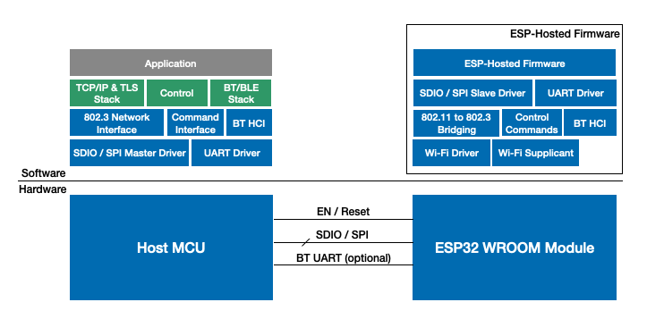

# ESP-Hosted solution

ESP-Hosted project provides a way to use ESP32 as a communication processor for Wi-Fi and Bluetooth/BLE connectivity. On the host side, ESP-Hosted offers a standard network interface for receiving and transmitting 802.3 frames. On top of the network interface, the host can use its own TCP/IP and TLS stack. For BT connectivity, a standard HCI interface is exposed to the Bluetooth host stack.

Please note that this project doesn't provide a standard 802.11 interface to the host. For the control path between the host and ESP32, ESP-Hosted uses a custom implementation based on Protobufs.

The below diagram shows hardware and software block diagram for a typical system built with ESP-Hosted.

## Connectivity Support

ESP hosted solution provides following WLAN and BT/BLE features to host:
- WLAN Features:
	- 802.11b/g/n
	- WLAN Station
	- WLAN Soft AP

- BT/BLE Features:
	- v4.2 BR/EDR and BLE

## Supported Hosts

At present Linux based host is supported and Linux driver is available as a part of this project. We support Raspberry-Pi as a host for evaluation and development purpose. The MCU host support is planned in future releases.

## Supported Transports

At present SDIO is supported as a transport where host acts as SDIO master and ESP32 acts as SDIO slave. Support for SPI transport is planned for future releases.

# Getting Started 

[Hardware Setup and Compilation](docs/Setup.md)

[Getting Started](docs/Getting_started.md)

[Protocol Design](docs/Design.md)

[Troubleshooting Guide](docs/Troubleshoot.md)
