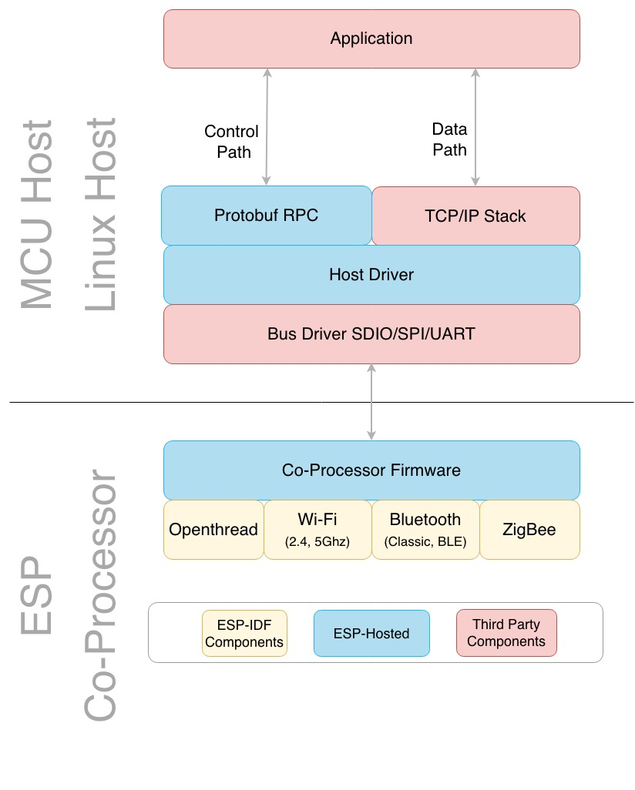

# ESP-Hosted

[](https://components.espressif.com/components/espressif/esp_hosted)

**Turn an Espressif SoC into a Wi-Fi, Bluetooth and OpenThread co-processor for your host.**
Your main processor keeps running your application, while the ESP SoC handles the heavy lifting of the radio and network stack over a simple transport bus.

It supports Linux and MCU hosts over SDIO, SPI, and UART using an Espressif SoC as the coprocessor.

## 1. Overview

This high-level block diagram shows ESP-Hosted's relationship with the host MCU or Linux host and the ESP co-processor:

<p align="center">
  
</p>

The host keeps the product logic. The ESP co-processor offloads the radio and network stack over your chosen transport bus. See [Architecture](docs/architecture.md) for the full design.

## 2. Directory Structure

### High Level

```text
esp-hosted/
├── coprocessor/            <------- co-processor code
├── common/                 <------- CP + host shared (frame, tlv, mempool, serializers)
├── docs/
│   ├── getting-started-linux.md     ⎫
│   ├── getting-started-mcu.md       ⎪
│   ├── architecture.md              ⎪
│   ├── transports/                  ⎪
│   ├── features/                    ⎬   Documentation
│   ├── design/                      ⎪
│   └── ...                          ⎭
│
├── examples/                        ⎫
│   ├── wifi/sta/                    ⎪
│   │   ├── cp/                      ⎪
│   │   ├── mcu_host/                ⎬  Examples organization
│   │   └── linux_802_3_host/        ⎪
│   ├── bluetooth/                   ⎪
│   ├── network_split/               ⎪
│   └── ...                          ⎭
│
├── host/                   <------- Host code
├── port/                   <------- Linux and MCU host porting
├── tests/
└── tools/
```

### Coprocessor

```text
coprocessor/
├── eh_cp_core/             <------- Core
├── eh_cp_transport/        <------- SPI/SDIO/UART bus drivers
└── features/                        ⎫
    ├── eh_cp_feat_bt/               ⎪
    ├── eh_cp_feat_wifi/             ⎪
    ├── eh_cp_feat_nw_split/         ⎬ (Opt) Configurable features
    ├── eh_cp_feat_host_ps/          ⎪
    └── ...                          ⎭
```

### Host

```text
host/
├── eh_host_core/           <------- Platform-agnostic core
├── features/                        ⎫
│   ├── eh_host_feat_bt/             ⎪
│   ├── eh_host_feat_wifi/           ⎪
│   ├── eh_host_feat_nw_split/       ⎬ (Opt) Configurable features
│   ├── eh_host_feat_power_save/     ⎪
│   └── ...                          ⎭
│
├── linux/                                                       ⎫
│   ├── eh_host_linux_kmod/          <--- Linux kernel module    ⎪
│   ├── eh_host_linux_python_ctypes/                             ⎬ Linux specific
│   └── eh_host_linux_vserial/       <--- Virtual serial iface   ⎭
└── mcu/
    ├── eh_host_mcu_transport/       <--- SPI/SDIO/UART bus drivers
    └── eh_host_mcu_vserial/         <--- Virtual serial iface
```

### Port

```text
port/
├── os/
│   ├── idf/                         ⎫
│   ├── posix/                       ⎬ OS-specific abstractions
│   └── stm32/                       ⎭
└── idf_components/         <------- OS agnostic - pre-ported ESP-IDF components
```

## 3. Linux host

The following guide demonstrates a **Raspberry Pi** host with an **ESP32-C5** co-processor — but the solution is not tied to that hardware.

| What | Supported | Demonstrated |
| :---: | :---: | :---: |
| Host | Any Linux platform (with porting) | Raspberry Pi 3 or 4 or 5 |
| Co-processor | **Any ESP SoC** | ESP32-C5 (also C6, C61, C3, C2, S2, S3, ESP32) |
| Buses | SDIO `\|` SDIO + UART `\|` SPI `\|` SPI + UART | All |

- **Get started:** Follow the [Linux Host](docs/getting-started-linux.md) guide to set up the Wi-Fi station example. It provides a step-by-step Raspberry Pi walkthrough for setup and verification.
- Using a different Linux platform? See the [Linux Porting](docs/porting.md#linux-host-porting) guide. 

After verifying the Wi-Fi station example, move on to the [supported examples](#5-example-layout).

## 4. MCU host

The following guide demonstrates an **ESP32-P4** host with an **ESP32-C6** co-processor — again, not a hard requirement.

| What | Supported | Demonstrated |
| :---: | :---: | :---: |
| ESP Host | Any ESP SoC | ESP32-P4 with an ESP32-C6 as co-processor |
| Non-ESP MCU Host | Any MCU (with porting) | - |
| Co-processor | Any ESP SoC | ESP32-C6 (also C5, C61, C3, C2, S2, S3, ESP32) |
| Buses | SDIO `\|` SPI Full-Duplex `\|` SPI Half-Duplex (1/2/4 bit) `\|` UART | All |

- **Get started:** Follow the [MCU Host](docs/getting-started-mcu.md) guide to set up the Wi-Fi station example.
- **Non-ESP MCU / RTOS?** See [MCU Porting](docs/porting.md#mcu-host-porting) guide.

After verifying the Wi-Fi station example, move on to the [supported examples](#5-example-layout).

## 5. Example Layout

Each example is organised by **role**. Not every example has every role — the example's own README is the source of truth.

```text
examples/<feature>/<scenario>/
├── cp/                  co-processor firmware (ESP-IDF project) — always present
├── mcu_host/            generic MCU host application
├── esp_host/            ESP-IDF host (deep sleep, OpenThread, rich console)
└── linux_802_3_host/
    ├── kmod/            Linux kernel transport module
    ├── c_app/           C user-space application
    └── py_app/          Python (ctypes) application
```

Flash `cp/` to the ESP coprocessor, then build and run one host role (`mcu_host`, `esp_host`, or the appropriate `linux_802_3_host` components) on your matching host platform. Examples are grouped by functionality:

### Wi-Fi
- [Station](examples/wifi/sta/README.md) — connect to an AP (recommended first network test).
- [Scan](examples/wifi/scan/README.md) — scan for nearby APs.
- [SoftAP](examples/wifi/softap/README.md) — co-processor as an access point.
- [AP+STA](examples/wifi/apsta/README.md) — station and SoftAP concurrently.
- [Enterprise](examples/wifi/enterprise/README.md) — WPA Enterprise client.
- [DPP](examples/wifi/dpp/README.md) — Device Provisioning Protocol.
- [iTWT](examples/wifi/itwt/README.md) — individual Target Wake Time power save.

### Bluetooth (MCU host) & OpenThread
- [Bluetooth Examples](examples/bluetooth/README.md) — BLE and Classic BT controller HCI (NimBLE / BlueDroid). _On Linux, use BlueZ directly — no example needed._
- [OpenThread CLI](examples/openthread/cli/README.md) — Thread command-line interface.
- [OpenThread Border Router](examples/openthread/border_router/README.md) — Thread border router.

### Network split
- [Station](examples/network_split/station/README.md) — offload standard networking.
- [Iperf](examples/network_split/iperf/README.md) — measure throughput end-to-end.

### Power save
- [Host Deep Sleep with Network Split](examples/power_save/host/network_split__host_deep_sleep/README.md)
- [Host Deep Sleep + CP Light Sleep](examples/power_save/host+cp/network_split__host_deep_sleep_cp_light_sleep/README.md)
- [Shut Down CP When Unused](examples/power_save/cp/shut_down_cp_when_unused/README.md)

### Peripherals & control
- [GPIO Expander](examples/gpio_expander/README.md) — drive co-processor GPIOs remotely.
- [Peer Data Transfer](examples/peer_data_transfer/README.md) — send custom control/data payloads.
- [External Coexistence](examples/ext_coex/README.md) — coordinate with external radios.

### OTA
- [Coprocessor OTA](examples/ota/coprocessor_ota/README.md) — update co-processor firmware over-the-air.

### Other scenarios
- [Get CP FW Version](examples/system/get_cp_fw_version/README.md) — query the co-processor firmware version.
- [MCU Hosted SDIO + SD Card Combined](examples/mcu_hosted_sdio_sdmmc_combined/README.md) — share SDIO pins with an SD card.
- [Hosted Events](examples/system/hosted_events/README.md) — listen to co-processor system events.
- [API Exerciser](examples/system/api_exerciser/README.md) — control-plane RPC verification.
- [MCU Transport Config](examples/system/mcu_transport_config/README.md) — configure transport pins and parameters.
- [Memory Monitor](examples/mem_monitor/README.md) — track co-processor heap.

## 6. References

### Important links
- [Host API Reference](docs/api-reference.md)
- [Changelog](docs/changelog.md)
- [Migration Guide](docs/migration.md)
- [Troubleshooting](docs/troubleshooting.md)
- [Features Explanations](docs/features/README.md)
- [Performance Optimization](docs/design/performance.md)

### Porting Guides
- [Porting: Linux host](docs/porting.md#linux-host-porting)
- [Porting: MCU host](docs/porting.md#mcu-host-porting)

### Contributing
- [Contributing](docs/contributing.md)

### Licenses
- [License Information](LICENSES/README.md)
