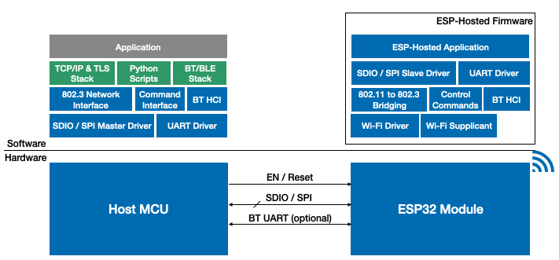

# Getting Started with Linux based host(Raspberry Pi)

Below diagram shows hardware and software block diagram for a typical linux based system built with ESP-Hosted.

[Hardware Setup and Compilation](./Setup.md)

[Getting Started](./Getting_started.md)

[Protocol Design](./Design.md)

[Troubleshooting Guide](./Troubleshoot.md)
