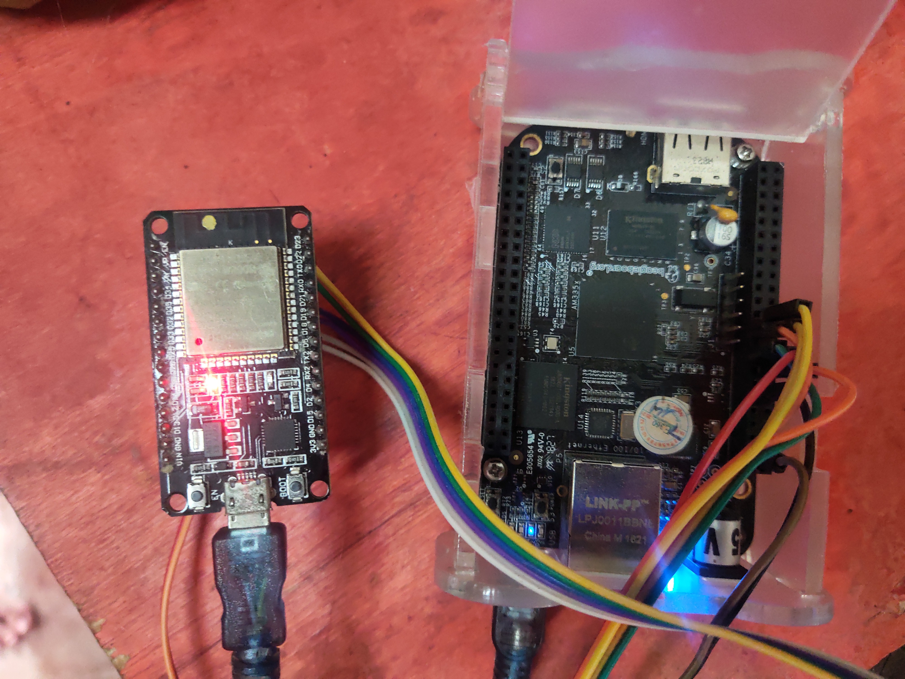

# Wi-Fi and BT/BLE connectivity Setup over SPI
## 1. Setup
### 1.1 Hardware Setup
In this setup, ESP board acts as a SPI peripheral and provides Wi-Fi capabilities to host. Please connect ESP peripheral to Beaglebone Black with jumper cables as mentioned below. It may be good to use small length cables to ensure signal integrity. Power ESP and BBB separately with a power supply that provide sufficient power. ESP can be powered through PC using micro-USB cable.

BBB pinout can be found [here!](https://beagleboard.org/support/bone101)

#### 1.1.1 ESP32 setup
| BBB pin label | BBB pin ID | ESP32 pin ID  | ESP32 pin function |
| --- | --- | --- | --- |
| P9_23 | 49 | 21 | GPIO_HANDSHAKE |
| P9_15 | 48 | 22 | GPIO_DATA_READY |
| SPI0_CS0 | P9_17 | 5 | CS |
| SPI0_SCLK | P9_22 | 18 | SCLK |
| SPI0_MISO D0 | P9_21 | 19 | MISO |
| SPI0_MOSI D1 | P9_18 | 23 | MOSI |
| P9_12 | 60 | RESET | RESET |




### 1.2 Beaglebone Black Software Setup
The SPI master driver is enabled by default on BBB OS. To disable it. 
```
cd host/linux/host_control/
./bbb_init.sh load_dtoverlay
```
the script will be update overlay for device tree to disable spi which used by default linux SPI driver.
The scrip will automatically reboot BBB after 10s to take effect. you could cancel.

## 2. Load ESP-Hosted Solution
### 2.1 Host Software
* Execute following commands in root directory of cloned ESP-Hosted repository on BBB
```sh
$ cd host/linux/host_control/
$ ./bbb_init.sh spi
```
* This script compiles and loads host driver on BBB. It also creates virtual serial interface `/dev/esps0` which is used as a control interface for Wi-Fi on ESP peripheral

### 2.2 ESP Peripheral Firmware
One can load pre-built release binaries on ESP peripheral or compile those from source. Below subsection explains Source Compilation methods due to this is a new commit for support BBB.

#### 2.2.1 Source Compilation
:warning:<code>Note: Please check [ESP-IDF Setup](Linux_based_readme.md#22-esp-idf-setup) and use appropriate ESP-IDF version</code>

* In root directory of ESP-Hosted repository, execute below command

```sh
$ cd esp/esp_driver/network_adapter
```

##### Using cmake

* :warning: `Set target if the ESP32-S2 or ESP32-C3 is being used. Skip if ESP32 is being used.`

```
$ idf.py set-target esp32
```
or
```
$ idf.py set-target esp32s2
```
or
```
$ idf.py set-target esp32c3
```

* Execute following command to configure project
```sh
$ idf.py menuconfig
```
* This will open project configuration window. To select SPI transport interface, navigate to `Example Configuration ->  Transport layer -> SPI interface -> select` and exit from menuconfig.

* For ESP32-C3, select chip revision in addition. Navigate to `Component config → ESP32C3-Specific → Minimum Supported ESP32-C3 Revision` and select chip version of ESP32-C3.

* Use below command to compile and flash the project. Replace <serial_port> with ESP peripheral's serial port.
```sh
$ idf.py -p <serial_port> build flash
```

## 3. Checking the Setup for SPI
Once ESP peripheral has a valid firmware and booted successfully, you should be able to see successful enumeration on BBB side as:
```
$ dmesg
[   96.439911] Bluetooth: Core ver 2.22
[   96.440145] NET: Registered protocol family 31
[   96.440153] Bluetooth: HCI device and connection manager initialized
[   96.440181] Bluetooth: HCI socket layer initialized
[   96.440195] Bluetooth: L2CAP socket layer initialized
[   96.440261] Bluetooth: SCO socket layer initialized
[  196.746813] esp32_spi: loading out-of-tree module taints kernel.
[  196.755748] esp_reset, ESP32: Resetpin of Host is 60
[  196.755892] esp_reset, ESP32: Triggering ESP reset.
[  196.775022] ESP32 peripheral is registered to SPI bus [0],chip select [0], SPI Clock [10]
[  199.310809] 
               Received INIT event from ESP32 peripheral
[  199.310839] EVENT: 2
[  199.310853] EVENT: 1
[  199.310857] EVENT: 0
[  199.310864] ESP peripheral capabilities: 0x78
[  200.155504] Bluetooth: BNEP (Ethernet Emulation) ver 1.3
[  200.155519] Bluetooth: BNEP filters: protocol multicast
[  200.155551] Bluetooth: BNEP socket layer initialized
[  200.699800] Bluetooth: RFCOMM TTY layer initialized
[  200.699842] Bluetooth: RFCOMM socket layer initialized
[  200.699906] Bluetooth: RFCOMM ver 1.11

```
