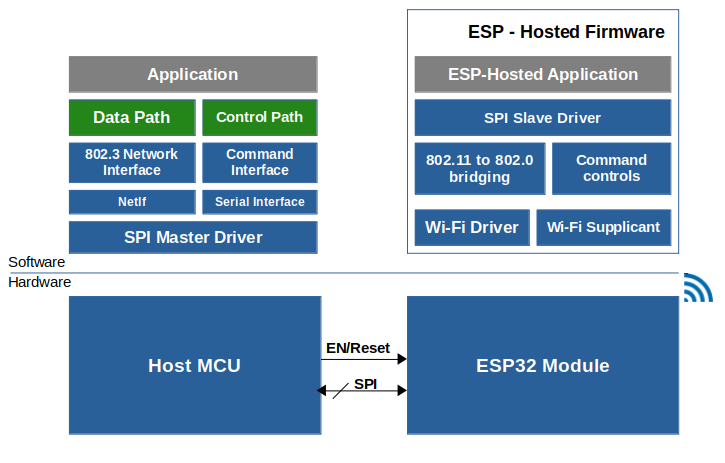

# Getting Started with MCU based host (STM32F469I)
Below diagram shows hardware and software block diagram for a typical MCU based system built with ESP-Hosted.

[Hardware Setup and Compilation](./Setup.md)

[Getting Started](./Getting_started.md)

[Protocol Design](./Design.md)
