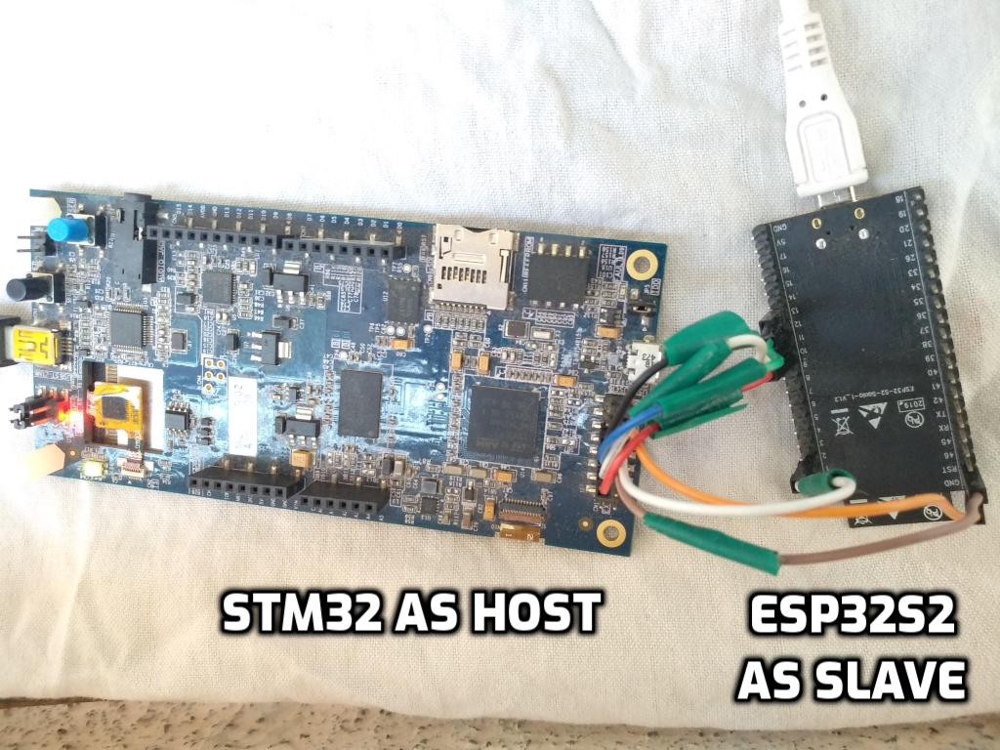

# Setup
We have evaluated ESP peripheral with STM32F469I board(Host). ESP peripheral could be either ESP32 or ESP32-S2. Setup details for same are as below -

## STM32F469I Software Setup

### STM32CubeIDE installation

We recommend STM32CubeIDE version 1.4 IDE from STMicroelectronics on host machine(Laptop, Desktop etc.). User can download IDE from [Here](https://www.st.com/en/development-tools/stm32cubeide.html#get-software).

### Source code repository:
* Clone ESP-Hosted repository on machine, where STM32CubeIDE used to connect/flash to host.
```
$ git clone --recurse-submodules <url_of_esp_hosted_repository>
$ cd esp-hosted
$ git submodule update --init --recursive
```
## Tools for testing
### Arping
Arping software is needed for testing the project.
Arping is a software tool which probes hosts on the network link by sending Link Layer frames using the ARP request to host identified by its MAC address. More details could be found on [this link](https://devconnected.com/arping-command-on-linux-explained/).

To install arping on ubuntu based system, please use
```
$ sudo apt-get install arping
```
For installation on Windows hosts, [check this link](https://elifulkerson.com/projects/arp-ping.php)

arping can easily be installed on other architectures.

### Serial port communication program
For Linux and Mac development hosts, minicom is needed. For Windows based hosts Tera Term is needed.

## Wi-Fi connectivity Setup over SPI
### Hardware Setup/Connections
In this setup, ESP board acts as a SPI peripheral and provides Wi-Fi capabilities to host. Please connect ESP peripheral to STM32F469I board's CN12 Extension connecter with jumper cables as mentioned below. It may be good to use small length cables to ensure signal integrity.
BT/BLE support will be added in upcoming release.
Power ESP peripheral and STM32F469I separately with a power supply that provide sufficient power. ESP peripheral can be powered through PC using micro-USB cable. STM32 can be powered with mini-B cable. It is also used as USART connection for debug logs from host. Serial port communicaton program like tera term or minicom used to print the logs.


#### Hardware connections for ESP32
| STM32 Pin | ESP32 Pin | Function |
|:----------:|:---------:|:--------:|
| PB4 (pin5) | IO19 | MISO |
| PA5 (pin7) | IO18 | CLK  |
| PB5 (pin9) | IO23 | MOSI |
| PA15 (pin11) | IO5 | CS |
| GND (pin2) | GND | GND |
| PC6 (pin6) | IO2 | Handshake |
| PC7 (pin8) | IO4 | Data Ready from ESP |
| PB13 (pin10) | EN | Reset ESP |

Setup image is here.


#### Hardware connections for ESP32-S2
| STM32 Pin | ESP32-S2 Pin | Function |
|:---------:|:-----------:|:--------:|
| PB4  (pin5) | IO13 | MISO |
| PA5  (pin7) | IO12 | CLK |
| PB5  (pin9) | IO11 | MOSI |
| PA15 (pin11)| IO10 | CS |
| GND  (pin2) | GND | GND |
| PC6  (pin6) | IO2 | Handshake |
| PC7  (pin8) | IO4 | Data ready from ESP |
| PB13  (pin10) | RST | Reset ESP |

Setup image is here.




## ESP peripheral setup
### ESP-IDF requirement
ESP-IDF release branch to be used for ESP peripherals are. Please clone appropriate ESP-IDF version.

| ESP peripheral | ESP-IDF release |
|:----:|:----:|
| ESP32 | release v4.0 |
| ESP32-S2 | release v4.2 |

### Setup
The control path between host and ESP peripheral is based on `protobuf`. For that `protocomm` layer from ESP-IDF is used. Run following command on ESP32 to make `protocomm_priv.h` available for control path.
```
$ git mv components/protocomm/src/common/protocomm_priv.h components/protocomm/include/common/
```

#### Using pre-built binary
For pre built hosted mode firmware is present in `release` tab. To flash it on ESP peripheral, edit <serial_port> with ESP peripheral's serial port and run following command.
##### ESP32
```sh
esptool.py -p <serial_port> -b 960000 --before default_reset --after hard_reset write_flash --flash_mode dio --flash_freq 40m --flash_size detect 0x8000 partition-table_spi_v0.3.bin 0x1000 bootloader_spi_v0.3.bin 0x10000 esp_hosted_firmware_spi_v0.3.bin
```
##### ESP32-S2
```sh
esptool.py -p <serial_port> -b 960000 --before default_reset --after hard_reset --chip esp32s2  write_flash --flash_mode dio --flash_size detect --flash_freq 80m 0x1000 bootloader_spi_v0.3.bin 0x8000 build/partition_table/partition-table_spi_v0.3.bin 0x10000 esp_hosted_firmware_spi_v0.3.bin
```
For windows user, you can also program the binaries using ESP Flash Programming Tool.

#### Compilation using source
Please use above mentioned ESP-IDF repository release branch for your ESP peripheral.
The control path between host and ESP peripheral is based on `protobuf`. For that `protocomm` layer from ESP-IDF is used. Run following command to make `protocomm_priv.h` available for control path.
```
$ git mv components/protocomm/src/common/protocomm_priv.h components/protocomm/include/common/
```

Navigate to `esp/esp_driver/network_adapter` directory
##### Using make

:warning: *make* build system is only supported till ESP32. Please refer cmake section below for ESP32-S2.

```
$ make clean
```

Run following command and navigate to `Example Configuration ->  Transport layer -> SPI interface -> select` and exit from menuconfig.
```
$ make menuconfig
```

To build and flash the app on ESP peripheral, run

```sh
$ make
$ make flash
```
##### Using cmake

```
$ idf.py fullclean
```
:warning: Skip this step for ESP32. Run for ESP32-S2 only.
```
$ idf.py set-target esp32s2
```

Run following command and navigate to `Example Configuration -> Transport layer -> SPI interface -> select` and exit from menuconfig. Read more about [idf.py](https://docs.espressif.com/projects/esp-idf/en/latest/esp32s2/api-guides/build-system.html#using-the-build-system) here.
```
$ idf.py menuconfig
```

To build and flash the app on ESP peripheral, run

```sh
$ idf.py -p <serial_port> build flash
```

This concludes the setup. [Getting started](docs/Linux_based_host/Getting_started.md) section would help to establish Wi-Fi connectivity.
