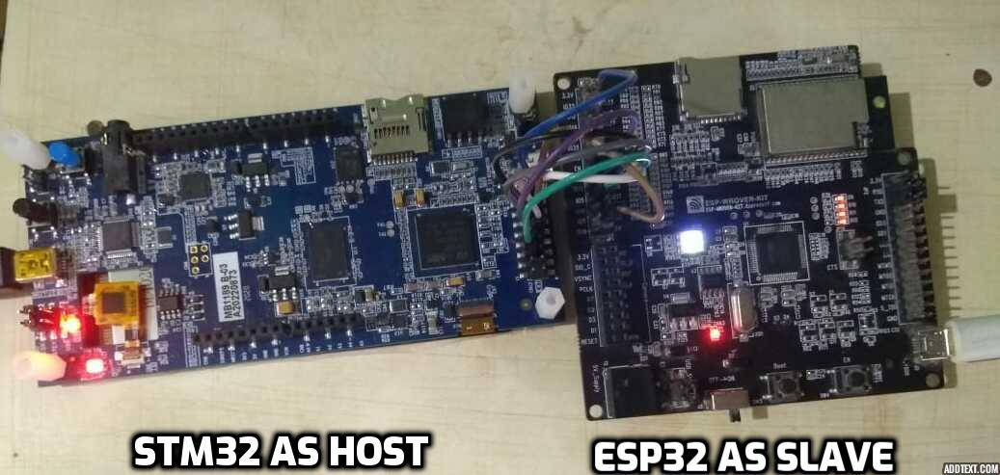

# Setup
We have evaluated ESP32 WROVER-Kit(Slave) with STM32F469I board(Host). Setup details for same are as below -

## STM32F469I Software Setup

### STM32CubeIDE installation

We recommend STM32CubeIDE version 1.4 IDE from STMicroelectronics on host machine(Laptop, Desktop etc.). User can download IDE from [Here](https://www.st.com/en/development-tools/stm32cubeide.html#get-software).

### Source code repository:
* Clone esp-hosted repository on machine, where STM32CubeIDE used to connect/flash to host.
```
$ git clone --recurse-submodules <url_of_esp_hosted_repository>
$ cd esp-hosted
$ git submodule update --init --recursive
```
## Tools for testing
### Arping
Arping software is needed for testing the project. 
Arping is a software tool which probes hosts on the network link by sending Link Layer frames using the ARP request to host identified by its MAC address. More details could be found on [this link](https://devconnected.com/arping-command-on-linux-explained/). 

To install arping on ubuntu based system, please use 
```
$ sudo apt-get install arping
```
For installation on Windows hosts, [check this link](https://elifulkerson.com/projects/arp-ping.php)

arping can easily be installed on other architectures.

### Serial port communication program
For Linux and Mac development hosts, minicom is needed. For Windows based hosts Tera Term is needed.

## Wi-Fi connectivity Setup over SPI
### Hardware Setup/Connections
In this setup, ESP32 board acts as a SPI peripheral and provides Wi-Fi capabilities to host. Please connect ESP32 board to STM32F469I board's CN12 Extension connecter with jumper cables as mentioned below. It may be good to use small length cables to ensure signal integrity.
BT/BLE support will be added in upcoming release.

| STM32 Pin | ESP32 Pin | Function |
|:---------:|:---------:|:--------:|
| PB4  (pin5) | IO19 | MISO |
| PA5  (pin7) | IO18 | CLK |
| PB5  (pin9) | IO23 | MOSI |
| PA15 (pin11)| IO5 | CS |
| GND  (pin2) | GND | GND |
| PC6  (pin6) | IO2 | Handshake |
| PC7  (pin8) | EN | ESP32 Reset |

Setup image is here.



Power ESP32 and STM32F469I separately with a power supply that provide sufficient power. ESP32 can be powered through PC using micro-USB cable. STM32 can be powered with mini-B cable. It is also used as USART connection for debug logs from host. Serial port communicaton program like tera term or minicom used to print the logs.

## ESP32 Setup
The control path between host and ESP32 is based on `protobuf`. For that `protocomm` layer from ESP-IDF is used. Make sure ESP-IDF on branch `release/v4.0`. Run following command on ESP32 to make `protocomm_priv.h` available for control path.
```
$ git mv components/protocomm/src/common/protocomm_priv.h components/protocomm/include/common/
```
For pre built hosted mode firmware is present in `release` tab. To flash it on ESP32 edit <serial_port> with ESP32's serial port and run following command.
```sh
esptool.py -p <serial_port> -b 960000 --before default_reset --after hard_reset write_flash --flash_mode dio --flash_freq 40m --flash_size detect 0x8000 partition-table_spi_v0.2.bin 0x1000 bootloader_spi_v0.2.bin 0x10000 esp_hosted_firmware_spi_v0.2.bin
```
For windows user, you can also program the binaries using ESP Flash Programming Tool.

Or if you have source, follow below procedure.

Currently ESP32 and STM32 communicates over SPI transport. To use `make` build system, run following command in `esp/esp_driver/network_adapter` directory and navigate to `Example Configuration ->  Transport layer -> SPI interface -> select` and exit from menuconfig.
```
$ make menuconfig
```
compile the app against ESP-IDF 4.0 release, by running command as `make` in `esp/esp_driver/network_adapter` directory. Program the WROVER-KIT using standard flash programming procedure with `make`
```sh
$ make flash
```
Or to select SPI transport layer using `cmake`, run following command in `esp/esp_driver/network_adapter` directory navigate to `Example Configuration -> Transport layer -> SPI interface -> select` and exit from menuconfig. Read more about [idf.py](https://docs.espressif.com/projects/esp-idf/en/latest/esp32/api-guides/build-system.html#using-the-build-system) here.
```
$ idf.py menuconfig
```
compile and flash the app on WROVER-KIT against ESP-IDF 4.0 release, by running following command in `esp/esp_driver/network_adapter` directory.

```sh
$ idf.py -p <serial_port> build flash
```
