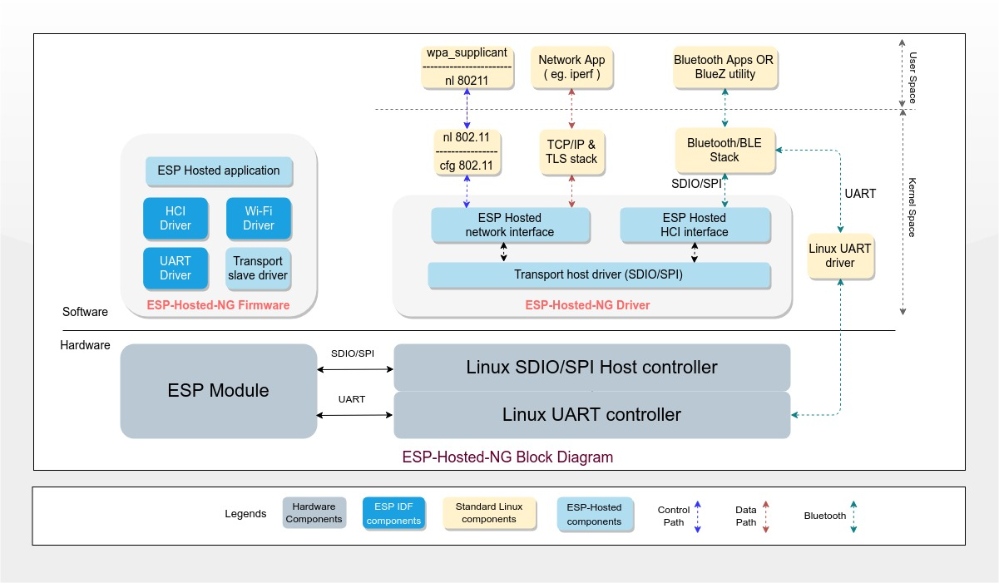

# ESP-Hosted-NG

- [ESP-Hosted-NG](#esp-hosted-ng)
- [**1. Introduction**](#1-introduction)
    + [1.1 Connectivity Features](#11-connectivity-features)
    + [1.2 Supported ESP boards](#12-supported-esp-boards)
    + [1.3 Supported Hosts](#13-supported-hosts)
    + [1.4 Supported Transports](#14-supported-transports)
    + [1.5 Feature Matrix](#15-feature-matrix)
- [**2. Design**](#2-design)
    + [2.1 System Architecture](#21-system-architecture)
    + [2.1.1 ESP-Hosted-NG Driver](#211-esp-hosted-ng-driver)
    + [2.1.2 ESP-Hosted-NG Firmware](#212-esp-hosted-ng-firmware)
    + [2.1.3 Third Party Components](#213-third-party-components)
    + [2.2 Transport Layer Protocol](#22-transport-layer-protocol)
      - [2.2.1 Payload Format](#221-payload-format)
    + [**2.3 Porting Guide**](#23-porting-guide)
- [**3. Get Started**](#3-get-started)
  * [3.1 Setup](#31-setup)
  * [3.2 User Guide](#32-user-guide)
    + [**3.2.1 Wi-Fi**](#321-wi-fi)
      - [**Scanning**](#scanning)
      - [**Connect to AP**](#connect-to-ap)
      - [**Disconnect from AP**](#disconnect-from-ap)
    + [**3.2.2 Bluetooth/BLE**](#322-bluetooth-ble)
- [**4. Coming soon**](#4-coming-soon)
- [**5. Want to support?**](#5-want-to-support-)

---


# 1. Introduction

This is a Next-Generation ESP-Hosted specifically designed for a sophisticated hosts that run Linux operating system. This variant of the solution takes more standard approach while providing a network interface to the host. User space applications such as wpa_supplicant, iw etc, can be used with this interface.

This solution offers following:

* 802.11 network interface which is a standard Wi-Fi interface on Linux host
* Configuration of Wi-Fi is supported through standard cfg80211 interface of Linux
* A standard HCI interface 


### 1.1 Connectivity Features

This solution provides following WLAN and BT/BLE features to the host:
- WLAN Features:
  - 802.11b/g/n
  - WLAN Station
  - Security Modes: Open, WPA/WPA2
- BT/BLE
  - Classic Bluetooth
  - BLE 4.2


### 1.2 Supported ESP boards

ESP-Hosted-NG solution is supported on following ESP boards:
- ESP32

Looking for other chipset? Please do check [Coming Soon](#4-coming-soon) section.


### 1.3 Supported Hosts

- ESP-Hosted-NG solution showcase examples for following Linux based hosts out of the box.
	- Raspberry-Pi 3 Model B
	- Raspberry-Pi 3 Model B+
	- Raspberry-Pi 4 Model B
- This solution is aimed for Linux based hosts only. For microcontroller(MCU) based hosts (like STM32 etc), [ESP-Hosted](https://github.com/espressif/esp-hosted/tree/ESP-Hosted_MCU_Host) should be used.
- Although we try to help in porting, We expect users to get the transport interfaces like SDIO/SPI/UART configured on your Linux platform. Device tree configuration and device drivers could be some times tricky as every Linux platform has it different.
- It is relatively easy to port this solution to other Linux based platforms. Please refer [Porting Guide](./porting_guide.md) for the common steps.


### 1.4 Supported Transports

ESP-Hosted-NG uses SDIO and SPI and optionally UART bus for interfacing ESP boards and host platform. Mostly all Linux based host support this transport. Further section depicts supported host platforms and corresponding transport interface, ESP boards and feature set.


### 1.5 Feature Matrix

The below table explains which feature is supported on which transport interface for Linux based host.

<table style="width:100%" align="center">
<thead>
<tr>
<th align="center">ESP device</th><th align="center">Transport Interface</th><th align="center">Wi-Fi support</th><th align="center">Bluetooth support</th>
</tr>
</thead>
<tbody>
<tr>
<td rowspan=5 align="center">ESP32</td>
<td rowspan=1 align="center">SDIO</td>
<td align="center">&#10003;</td>
<td align="center">&#10003;</td>
</tr>
<tr>
<td align="center">SPI</td>
<td align="center">&#10003;</td>
<td align="center">&#10003;</td>
</tr>
<tr>
<td align="center">UART</td>
<td align="center">&#10005;</td>
<td align="center">&#10003;</td>
</tr>
<tr>
<td align="center">SDIO(WiFi) + UART(BT)</td>
<td align="center">&#10003;</td>
<td align="center">&#10003;</td>
</tr>
<tr>
<td align="center">SPI(WiFi) + UART(BT)</td>
<td align="center">&#10003;</td>
<td align="center">&#10003;</td>
</tr>
</tbody>
</table>


---


# 2. Design

### 2.1 System Architecture

This section explains building blocks of the solution. Following is the detailed system architecture diagram:



Following are the key building blocks of the system:

- ESP-Hosted-NG Driver

- ESP-Hosted-NG Firmware

- Third party components


### 2.1.1 ESP-Hosted-NG Driver

This runs on host platform and it implements following.

- **Transport driver**
  - Implements transport layer over SDIO/SPI interface. \
  Communication protocol is explained in further section.
- **Network Interface**
  - Registers Wi-Fi interface `espsta0` with Linux kernel.
    - This allows exchange of network data packets between Linux kernel and ESP firmware.
  - Implements needed cfg80211_ops to support configuration through wpa_supplicant or iw utility
- **HCI Interface**
  - Applicable only when SDIO/SPI interface is being used for Bluetooth/BLE support
  - Registers HCI interface with the Bluetooth stack running on Linux host
    - This facilitates exchange of HCI packets between Linux kernel and ESP firmware

### 2.1.2 ESP-Hosted-NG Firmware

This implements ESP application that runs on ESP boards. It consists of the following.

- **ESP-Hosted-NG Application** \
  This implements following:
  - SDIO/SPI transport layer
  - Custom command/response implementation for configuration of Wi-Fi interface
  - Data path between Wi-Fi driver of ESP and Host platform
- **ESP-IDF Components** \
  ESP firmware mainly uses following components from ESP-IDF. Please check [ESP-IDF documentation](https://docs.espressif.com/projects/esp-idf/en/latest/esp32/get-started/index.html) for more details.
  - SDIO/SPI/UART slave driver
  - Wi-Fi driver
  - HCI controller driver

### 2.1.3 Third Party Components

Third components such as following are essential for end to end working of this solution. Implementation or porting of these third party component is not in scope of this project.

- TCP/IP stack
- Bluetooth/BLE stack
- nl80211/cfg80211 kernel module
- User space applications
- Linux UART driver

### 2.2 Transport Layer Protocol

This section explains transport layer protocol used for communication over SDIO/SPI bus. Please refer following to know more:

* [SDIO Transport Layer Design](./sdio_protocol.md)
* [SPI Transport Layer Design](./spi_protocol.md)


#### 2.2.1 Payload Format

This section explains the header that encapsulates the data packets exchanged over SDIO and SPI interfaces.

* Host and peripheral makes use of 12 byte payload header which precedes every data packet.
* This payload header provides additional meta data about the packet. Based on this header, host/peripheral consumes the transmitted data packet.
* Payload format is as below

|      Field       | Length  | Description                                                  |
| :--------------: | :-----: | :----------------------------------------------------------- |
|  Interface type  | 4 bits  | Possible values: STA(0), SoftAP(1), HCI (2), Priv interface(3). Rest all values are reserved |
| Interface number | 4 bits  | Unused                                                       |
|      Flags       | 1 byte  | Additional flags like `MORE_FRAGMENT` in fragmentation       |
|   Packet type    | 1 byte  | Type of packet Data(0), Command_req(1), Command_resp(2), Event(3), EAPOL_frame(4) |
|    Reserved1     | 1 byte  | Not in use                                                   |
|  Packet length   | 2 bytes | Actual length of data packet                                 |
| Offset to packet | 2 bytes | Offset to the start of the data payload                      |
|     Checksum     | 2 bytes | Unused as if now                                             |
|    Reserved2     | 1 byte  | Not in use                                                   |


### 2.3 Porting Guide

Refer [Porting Guide](./porting_guide.md) which explains how one can port the solution to other Linux host platforms.


# 3. Get Started

## 3.1 Setup

ESP-Hosted uses SDIO/SPI/UART interfaces to connect ESP chipset to host platform. This section explains the setup needed for each of the interface type and it also covers software configuration part. The host side setup instructions are specific to Raspberry Pi.

Please check [Hardware and Software Setup](./setup.md).


## 3.2 User Guide

This section explains how to setup and use Wi-Fi and BT/BLE.

### 3.2.1 Wi-Fi

User space tool such as wpa_supplicant/iw is used to setup Wi-Fi.

Following operations supported as of now:

* Scanning
* Connect to AP
* Disconnect from AP

Services in running on host operating system, such as <b>NetworkManager</b> can interfere in testing. Execute following commands to prevent this.

```sh
$ sudo systemctl disable NetworkManager
$ sudo killall wpa_supplicant
```

#### Scanning

- To scan nearby APs available, please use

  ```sh
  $ sudo iw dev espsta0 scan
  ```

#### Connect to AP

* Two types of security modes are supported

  * Run following command to connect to AP in open mode

    ```sh
    $ sudo iw dev espsta0 connect <ssid>
    ```

  * Run following command to connect to AP in WPA/WPA2 security mode

    ```sh
    $ wpa_passphrase <ssid> <password>  > ~/my_wpa_config.conf          # This creates config file with security settings
    $ sudo wpa_supplicant -D nl80211 -i espsta0 -c ~/my_wpa_config.conf # connect to specified AP
    ```

* Verify the connection status using following command and verify `ESSID:<ssid>` in output

  ```sh
  $ iwconfig espsta0
  espsta0    IEEE 802.11  ESSID:<ssid>
            Mode:Managed  Frequency:2.412 GHz  Access Point: XX:XX:XX:XX:XX:XX   
            Bit Rate=XXX Mb/s   Tx-Power=XX dBm   
            Retry short limit:X   RTS thr:off   Fragment thr:off
            Power Management:on
            Link Quality=70/70  Signal level=-20 dBm  
            Rx invalid nwid:0  Rx invalid crypt:0  Rx invalid frag:0
            Tx excessive retries:0  Invalid misc:25   Missed beacon:0
  ```

* Use dhclient command to get IP and verify data path using ping command

  ```sh
  $ sudo dhclient -v espsta0
  Internet Systems Consortium DHCP Client 4.4.1
  Copyright 2004-2018 Internet Systems Consortium.
  All rights reserved.
  For info, please visit https://www.isc.org/software/dhcp/
  Listening on LPF/espsta0/24:6f:28:80:2c:34
  Sending on   LPF/espsta0/24:6f:28:80:2c:34
  Sending on   Socket/fallback
  .
  DHCPDISCOVER on espsta0 to 255.255.255.255 port 67 interval 7
  DHCPOFFER of 192.168.43.32 from 192.168.43.1
  DHCPREQUEST for 192.168.43.32 on espsta0 to 255.255.255.255 port 67
  DHCPACK of 192.168.43.32 from 192.168.43.1
  bound to 192.168.43.32 -- renewal in 1482 seconds.
  
  $ ping <ip address of AP>
  ```

#### Disconnect from AP

* Execute following command to disconnect from AP

  ```sh
  $ sudo iw dev espsta0 disconnect
  ```

* Verify status using

  ```sh
  $ iwconfig espsta0
  ```

### 3.2.2 Bluetooth/BLE

Refer [Bluetooth/BLE Guide](./bluetooth.md) which explains how one can setup and use Bluetooth/BLE.


# 4. Coming soon

Tremendous work to be done ahead! Below is glimpse of upcoming release:

- Functionality
	- cfg802.11 support for ESP as SoftAP
	- Bluetooth (BT/BLE) connectivity
- Chipsets
	- ESP32-S3, ESP32-C3 support


# 5. Want to support?
That's right. Being open source, we really appreciate the pull requests. Already raised pull request? Please be patient. We will review and merge your commit into the master.
