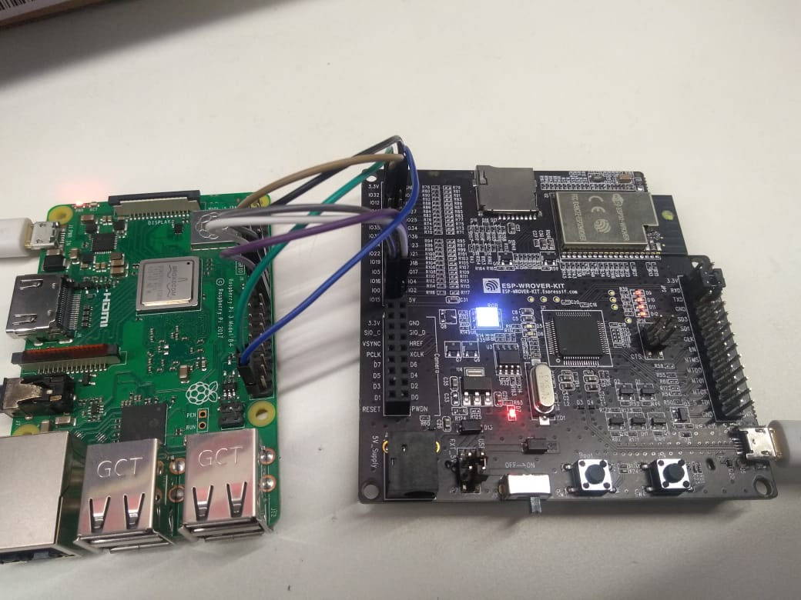

# Setup
Currently we support ESP32 WROVER-Kit with Raspberry-Pi (3 Model B+, 4 Model B) for evaluation with Raspbian operating system.

## Raspberry-Pi Software Setup
We recommend full version Raspbian install on Raspberry-Pi to ensure easy driver compilation. In addition for driver compilation, kernel headers are required. Please install them as:
```sh
$ sudo apt update
$ sudo apt-get install raspberrypi-kernel-headers
```
Verify that kernel headers are installed properly by running following command. Failure of this command indicates that kernel headers are not installed. In such case, upgrade/downgrade kernel and reinstall kernel headers.
```sh
$ ls /lib/modules/$(uname -r)/build
```
Python is required to run utility scripts. Please install it as:
```sh
$ sudo apt-get install python
```
To start with control path on Raspberry-Pi, `protobuf` and `utils` python modules are needed. User can install these modules by running following commands.
```
pip install utils
pip install protobuf
```
Raspi-gpio utility is required to configure GPIO pins. Please install it as:
```sh
$ sudo apt-get install raspi-gpio
```

To test BT/BLE functionality on Raspberry-Pi `bluez`(official Linux Bluetooth protocol stack) is needed. check if Raspberry-Pi has installed `bluez` or not.
[link that can help to install bluez](https://scribles.net/updating-bluez-on-raspberry-pi-from-5-43-to-5-50/)

### Note
```
We have tested BT/BLE solution at bluez 5.43 and 5.45.
```
make sure Raspberry-Pi should have `bluetoothctl`, `bluetoothd`, `hcitool`, `hciconfig` utilities.

## Wi-Fi and BT/BLE connectivity Setup over SDIO
### Hardware Setup/Connections
In this setup, ESP32 board acts as a SDIO peripheral and provides Wi-FI capabilities to host. Please connect ESP32 board to Raspberry-Pi with jumper cables as mentioned below. It may be good to use small length cables to ensure signal integrity.

| RPi Pin | ESP32 Pin | Function |
|:-------:|:---------:|:--------:|
| 13 | IO13 | DAT3 |
| 15 | IO14 | CLK |
| 16 | IO15 | CMD |
| 18 | IO2 | DAT0 |
| 22 | IO4 | DAT1 |
| 37 | IO12 | DAT2 |
| 39 | GND | GND |

RPI pinout can be found [here!](https://pinout.xyz/pinout/sdio)

Setup image is here.



Power ESP32 and Raspberry Pi separately with a power supply that provide sufficient power. ESP32 can be powered through PC using micro-USB cable.

### Software setup
By default, the SDIO pins of Raspberry-pi are not configured and are internally used for built-in Wi-Fi interface. Please enable SDIO pins by appending following line to _/boot/config.txt_ file
```
dtoverlay=sdio,poll_once=off
dtoverlay=disable-bt
```
Please reboot Raspberry-Pi after changing this file.

## Bluetooth/BLE connectivity Setup over UART
### Hardware Setup/Connections
In this setup, ESP32 board provides Bluetooth/BLE capabilities to host over UART interface. Please connect ESP32 board to Raspberry-Pi with jumper cables as below. As mentioned above, use small length cables.

| RPi Pin Function | RPi Pin | ESP32 Pin | ESP32 Pin Function |
|:-------:|:--------:|:---------:|:--------:|
| RX | 10 | IO5 | TX |
| TX | 8 | IO18 | RX |
| CTS | 36 | IO19 | RTS |
| RTS | 11 | IO23 | CTS |
| Ground | 39 | GND | Ground |

### Software setup
By default, the UART pins on Raspberry-Pi are in disabled state. In order to enable UART and setup it for bluetooth connection, follow below steps.
1. Enable UART pins and disable in built bluetooth on Raspberry-Pi by appending following lines to _/boot/config.txt_ file
```
enable_uart=1
dtoverlay=disable-bt
```
2. Remove following from _/boot/cmdline.txt_. Leave everything else untouched.
```
console=serial0,115200
```
e.g. If _/boot/cmdline.txt_ is as below:
```
# cat /boot/cmdline.txt
dwc_otg.lpm_enable=0 console=tty1 console=serial0,115200 root=PARTUUID=5c2c80d1-02 rootfstype=ext4 elevator=deadline fsck.repair=yes rootwait quiet splash plymouth.ignore-serial-consoles spidev.bufsiz=32768
````
Then after removal of above mentioned arguments, it should look as below:
```
# cat /boot/cmdline.txt
dwc_otg.lpm_enable=0 console=tty1 root=PARTUUID=5c2c80d1-02 rootfstype=ext4 elevator=deadline fsck.repair=yes rootwait quiet splash plymouth.ignore-serial-consoles spidev.bufsiz=32768
```
3. Disable hciuart on Raspberry-Pi
```
# systemctl disable hciuart
```
4. Reboot Raspberry-Pi

## ESP32 Setup
The control path between Raspberry-Pi and ESP32 is based on `protobuf`. For that `protocomm` layer from ESP-IDF is used. Make sure ESP-IDF on branch `release/v4.0`. Run following command on esp32 to make `protocomm_priv.h` available for control path.
```
git mv components/protocomm/src/common/protocomm_priv.h components/protocomm/include/common/
```

On ESP32 either use pre-provided hosted mode firmware binary or if you have source, compile the app against ESP-IDF 4.0 release by running command as `make` in `slave_driver/network_adapter` directory. Program the WROVER-KIT using standard flash programming procedure with
```sh
$ make flash
```

## Checking the Setup
Once ESP32 has a valid firmware and booted successfully, you should be able to see successful enumeration on Raspberry Pi side as:
```sh
$ dmesg
[  143.606119] mmc1: queuing unknown CIS tuple 0x01 (3 bytes)
[  143.613524] mmc1: queuing unknown CIS tuple 0x1a (5 bytes)
[  143.617844] mmc1: queuing unknown CIS tuple 0x1b (8 bytes)
[  143.620070] mmc1: queuing unknown CIS tuple 0x80 (1 bytes)
[  143.620167] mmc1: queuing unknown CIS tuple 0x81 (1 bytes)
[  143.620265] mmc1: queuing unknown CIS tuple 0x82 (1 bytes)
[  143.622073] mmc1: queuing unknown CIS tuple 0x80 (1 bytes)
[  143.622169] mmc1: queuing unknown CIS tuple 0x81 (1 bytes)
[  143.622266] mmc1: queuing unknown CIS tuple 0x82 (1 bytes)
[  143.622461] mmc1: new SDIO card at address 0001
[  148.095780] esp32: loading out-of-tree module taints kernel.
[  148.314969] Initialising ESP Serial support
[  148.320686] esp32_probe: ESP network device detected
```
Once the module is inserted, you should see ethap0 and ethsta0 interfaces using _ifconfig_ command.
