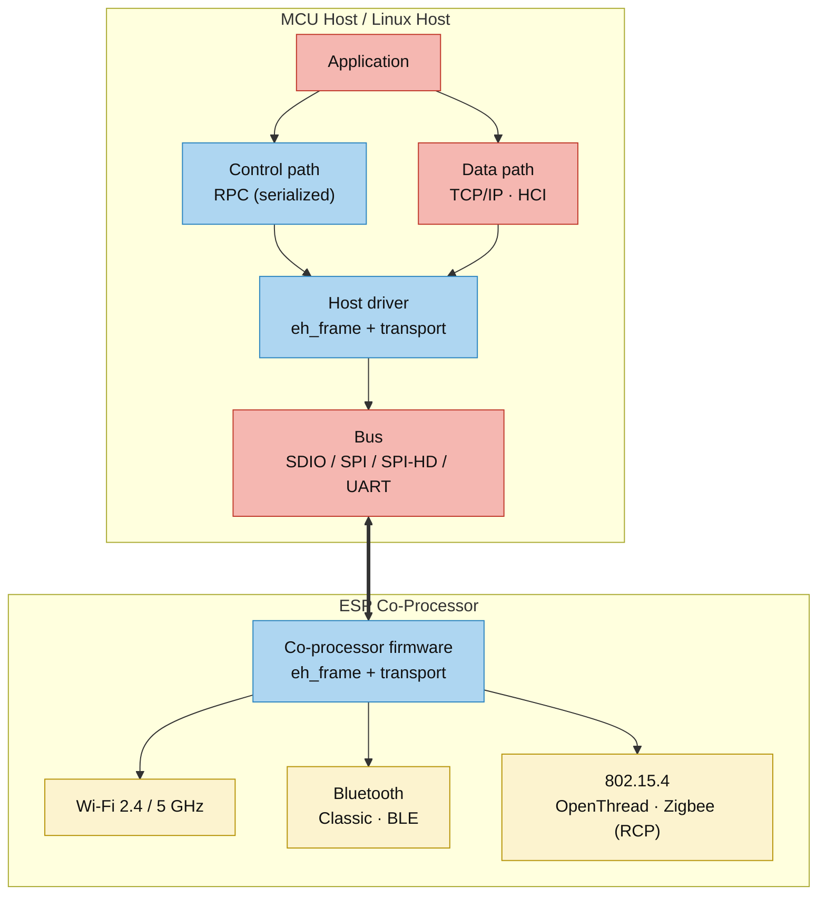
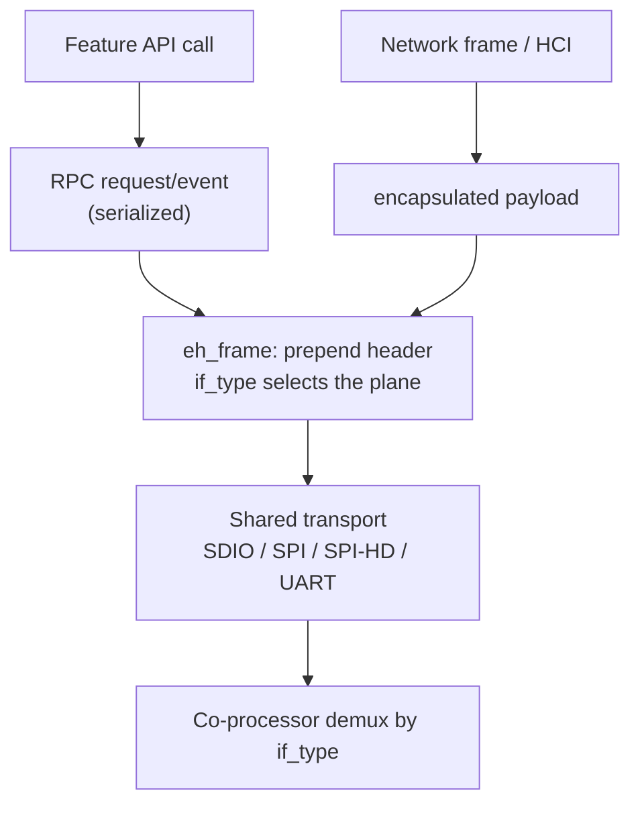
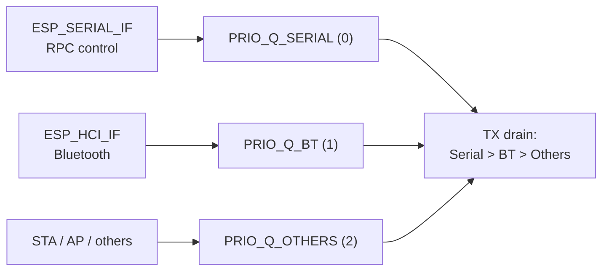
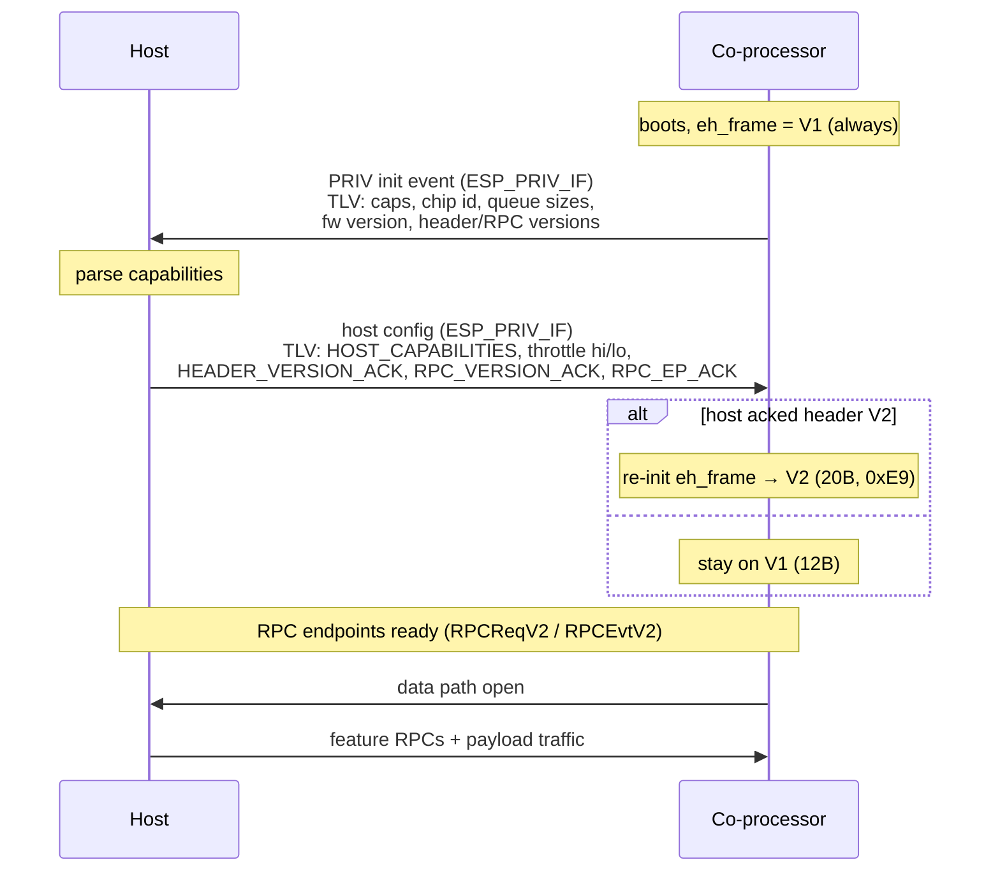

# Architecture & Protocol

[Home](../README.md) · [Getting Started: Linux](getting-started-linux.md) · [Getting Started: MCU](getting-started-mcu.md) · [Troubleshooting](troubleshooting.md)

This page is the design reference for ESP-Hosted: the software split, the on-wire frame format, how control and data share one bus, and the capability handshake that brings a link up. It explains *how the system works* — not how to wire or flash it. For bring-up steps use the Getting Started guides (Linux / MCU).

Every fact below is code-aligned. Struct and constant citations point at the authoritative source so the doc can be checked against the tree.

---

## 1. The core split



_Colours: ESP-IDF components (yellow) · ESP-Hosted (blue) · application / third-party (red)._

The **host owns the application**. It talks down two paths that share one physical bus: a **control path** (feature APIs, serialized as RPC) and a **data path** (network frames and Bluetooth HCI, encapsulated but not serialized). The **co-processor owns the radio work** — Wi-Fi, the Bluetooth controller, and the 802.15.4 radio (OpenThread / Zigbee RCP). One co-processor firmware serves both the Linux and MCU host paths.

### Major software blocks

| Area | Role |
| :--- | :--- |
| `host/` | host stack, feature APIs, host transport, Linux kmod + user-space |
| `coprocessor/` | co-processor core, co-processor transport, feature implementations |
| `common/` | shared framing (`eh_frame`), TLV (`eh_tlv`), interface/caps definitions, serializers, mempool |
| `port/` | OS / IDF port layer used when moving to a new host |
| `examples/` | feature scenarios split by host / co-processor role |

The framing rules that follow are implemented once, in `common/eh_frame`, and reused by every transport on both ends.

---

## 2. Two planes, one bus



Two classes of traffic share the bus, distinguished by the **`if_type`** field in every frame header:

- **Control plane** — feature API calls carried as RPC over `ESP_SERIAL_IF`. Only control/RPC is serialized.
- **Data plane** — network frames (`ESP_STA_IF` / `ESP_AP_IF`), Bluetooth HCI (`ESP_HCI_IF`), and private/handshake events (`ESP_PRIV_IF`). These are encapsulated, not serialized — no needless byte conversion.

Because both planes ride the same bus, **transport bring-up must be correct before feature behaviour can be trusted.** A flaky bus looks exactly like a broken feature. This is the single most important debugging principle in the system.

---

## 3. On-wire frame format

Every packet on the bus is a fixed header followed by its payload. ESP-Hosted supports **two header versions**; the receiver auto-detects which one it is looking at from **byte 0**:

- **byte 0 == `0xE9`** → header **V2** (20 bytes).
- otherwise → header **V1** (12 bytes).

All multi-byte fields are **little-endian on the wire regardless of host CPU** — `eh_frame` byte-swaps as needed (`common/eh_frame/src/eh_frame.c`, `_to_le16` / `_from_le16`).

### 3.1 V1 header — 12 bytes

Defined by `struct esp_payload_header` in `common/eh_common/include/eh_common_header.h`.

| Offset | Size | Field | Notes |
| :----: | :--: | :--- | :--- |
| 0 | 1 | `if_type:4` (low nibble) + `if_num:4` (high nibble) | plane selector; `if_num` is unused, always 0 |
| 1 | 1 | `flags` | e.g. `MORE_FRAGMENT` for serial reassembly |
| 2–3 | 2 | `len` | payload length in bytes (header excluded) |
| 4–5 | 2 | `offset` | header size = start of payload (= 12) |
| 6–7 | 2 | `checksum` | byte-sum over header+payload (see §5) |
| 8–9 | 2 | `seq_num` | sequence / fragment number |
| 10 | 1 | `throttle_cmd:2` + `reserved2:6` | inline flow control (V1 only, see §6) |
| 11 | 1 | `hci_pkt_type` / `priv_pkt_type` (union) | packet subtype for HCI / private events |

### 3.2 V2 header — 20 bytes

Defined by `eh_header_v2_t` in `common/eh_common/include/eh_common_header_v2.h` (`_Static_assert(sizeof == 20)`).

| Offset | Size | Field | Notes |
| :----: | :--: | :--- | :--- |
| 0 | 1 | `magic_byte` = `0xE9` | version discriminator |
| 1 | 1 | `hdr_version` = `0x02` | |
| 2–3 | 2 | `pkt_num` | replaces V1 `seq_num` (same runtime field) |
| 4 | 1 | `if_type:6` (low bits) + `if_num:2` | wider plane selector |
| 5 | 1 | `flags` | |
| 6 | 1 | `packet_type` (union) | private-event / packet subtype |
| 7 | 1 | `frag_seq_num` | fragment index |
| 8–9 | 2 | `offset` | = 20 |
| 10–11 | 2 | `len` | payload length |
| 12–13 | 2 | `checksum` | byte-sum, field zeroed during compute |
| 14 | 1 | `tlv_offset` (union) | 0 = no inline TLV |
| 15–18 | 4 | `reserved_3..6` | |
| 19 | 1 | `hci_pkt_type` / `priv_pkt_type` (union) | |

> [!NOTE]
> The link **always starts in V1** at boot (`common/eh_frame/include/eh_frame.h`). It upgrades to V2 only if the host acknowledges the header-version TLV during the handshake (§7). `throttle_cmd` exists **only in V1**; V2 moves flow control to per-transport signalling (§6). Any code that raw-casts the header must call the version detector first — the two layouts are not interchangeable.

---

## 4. Interface types — the multiplexing key

`if_type` is what lets one bus carry every plane. Canonical values (`common/eh_common/include/eh_common_interface.h`):

| `if_type` | Name | Carries | Host endpoint |
| :-------: | :--- | :--- | :--- |
| 0 | `ESP_INVALID_IF` | — | — |
| 1 | `ESP_STA_IF` | station network frames | netdev `ethsta0` |
| 2 | `ESP_AP_IF` | softAP network frames | netdev `ethap0` |
| 3 | `ESP_SERIAL_IF` | **RPC control** (fragmented) | char dev `/dev/esps0` |
| 4 | `ESP_HCI_IF` | Bluetooth HCI | HCI handler / BlueZ |
| 5 | `ESP_PRIV_IF` | init / capabilities / private events | event handler |
| 6 | `ESP_TEST_IF` | raw-throughput test traffic | test sink |
| 7 | `ESP_ETH_IF` | ethernet-style frames | netdev |

Host-side demux (the Linux kmod, `host/linux/eh_host_linux_kmod/driver/src/main.c`): `SERIAL`→`/dev/esps0` with fragment reassembly by `seq_num` + `MORE_FRAGMENT`; `STA`/`AP`→`netif_rx`; `HCI`→`esp_hci_rx()`; `PRIV`→events workqueue; `TEST`→raw-TP sink.

RPC on `ESP_SERIAL_IF` is addressed by **named endpoints** negotiated in the handshake: `RPCReqV2` / `RPCEvtV2` by default (`coprocessor/eh_cp_core/include/eh_cp_master_config.h`). The exact strings depend on the negotiated RPC version — RPC-V2 uses `RPCRsp` / `RPCEvt`, and legacy ESP-Hosted-FG (RPC-V1) used `ctrlResp` / `ctrlEvnt`.

> [!WARNING]
> **Canonical enum values are not the historical wire values.** With `CONFIG_ESP_HOSTED_LEGACY_WIRE_INTERFACE_TYPES` enabled, `eh_if_type_to_wire()` / `eh_if_type_from_wire()` remap to the legacy numbering (STA=0, AP=1, SERIAL=2, HCI=3, PRIV=4, TEST=5). Both ends must agree. When reading a raw capture, know which mode is active before decoding `if_type`.

---

## 5. Checksum

The checksum is a **plain 16-bit sum of bytes** (wrap-around, no carry fold) — *not* a CRC (`common/eh_frame/src/eh_frame.c`):

```c
uint16_t eh_frame_checksum(const uint8_t *buf, uint16_t len) {
    uint16_t sum = 0, i;
    for (i = 0; i < len; i++) sum += buf[i];
    return sum;
}
```

It covers the **entire frame (header + payload)**, with the checksum field itself treated as zero during the computation (offset 6 for V1, offset 12 for V2). Checksumming is **negotiated**: it defaults on for co-processor/MCU builds, and the Linux kmod enables it only after reading the `ESP_CHECKSUM_ENABLED` capability bit (`1 << 7`, `common/eh_common/include/eh_common_caps.h`). SPI has no hardware error detection, so keeping the checksum enabled is strongly recommended there.

---

## 6. Priority queues & flow control

### 6.1 Three strict-priority queues

Traffic is queued by class, drained in strict priority order (`coprocessor/eh_cp_transport/include/common/eh_transport.h`):



Separate TX and RX queue sets exist, each gated by `CONFIG_ESP_ENABLE_TX_PRIORITY_QUEUES` / `CONFIG_ESP_ENABLE_RX_PRIORITY_QUEUES`. Control traffic therefore never starves behind bulk data — RPC stays responsive under load.

### 6.2 Flow control differs per transport

There are two independent mechanisms: **bus arbitration** (whose turn is it to talk) and **RX backpressure** (receiver is full, slow down).

| Transport | Bus arbitration | RX backpressure |
| :--- | :--- | :--- |
| SPI full-duplex | `HANDSHAKE` GPIO (slave ready) + `DATA_READY` GPIO (slave has data); idle direction sends a **dummy frame** (`if_type=ESP_MAX_IF`, `len=0`) | V1 `throttle_cmd` field (`NC`/`ON`/`OFF`) |
| SPI half-duplex | `DATA_READY` GPIO + slave registers + `CMD9` | credit deltas in `TX_BUF_LEN`/`RX_BUF_LEN`; throttle bits in the register's upper byte |
| SDIO | host-interrupt driven | `START_THROTTLE` (int bit 7) / `STOP_THROTTLE` (int bit 6) driven by RX queue occupancy vs high/low thresholds |
| UART | none (byte stream) | V1 `throttle_cmd` field |

Throttle thresholds are configured by the host during the handshake via the `THROTTLE_HIGH` (`0x47`) and `THROTTLE_LOW` (`0x48`) TLVs. Full per-transport protocol detail lives on each transport page (SDIO, SPI Full-Duplex, SPI Half-Duplex, UART).

---

## 7. Bring-up: the capability handshake

Bringing a link up is a **TLV-based negotiation** carried on `ESP_PRIV_IF`, not a fixed magic exchange. Getting this right is the whole game — if it does not complete, feature debugging is premature.

### 7.1 TLV encoding

Handshake data is a stream of `[type:1][len:1][value…]` triplets (value ≤ 255 bytes), wrapped in a private-event header (`common/eh_tlv/`):

```c
typedef struct { uint8_t type; uint8_t len; uint8_t value[]; } esp_priv_tlv_t;   // eh_tlv_tags.h
struct esp_priv_event { uint8_t event_type; uint8_t event_len; uint8_t event_data[]; };  // eh_transport.h
```

Key tags (`common/eh_tlv/include/eh_tlv_tags.h`):

| Range | Purpose | Notable tags |
| :--- | :--- | :--- |
| `0x11`–`0x1A` | slave → host capabilities | `CAPABILITY 0x11`, `CHIP_ID 0x12`, `RX_Q_SIZE 0x14`, `TX_Q_SIZE 0x15`, `CAP_EXT 0x16`, `FW_VERSION 0x17`, `SDIO_MODE 0x18`, `FEAT_CAPS 0x19`, `RPC_VERSION 0x1A` |
| `0x20`–`0x26` | bootstrap negotiation | `HEADER_VERSION 0x20` / `_ACK 0x21`, `RPC_VERSION 0x22` / `_ACK 0x23`, `RPC_EP_REQ 0x24`, `RPC_EP_EVT 0x25`, `RPC_EP_ACK 0x26` |
| `0x44`–`0x48` | host → slave config | `HOST_CAPABILITIES 0x44`, `RCVD_CHIP_ID 0x45`, `THROTTLE_HIGH 0x47`, `THROTTLE_LOW 0x48` |

### 7.2 Capability bitmasks

Advertised in the `CAPABILITY` / `CAP_EXT` / `FEAT_CAPS` TLVs (`common/eh_common/include/eh_common_caps.h`):

- **Tier 1 `cap` (u8):** `WLAN_SDIO(1<<0)`, `BT_UART(1<<1)`, `BT_SDIO(1<<2)`, `BLE_ONLY(1<<3)`, `BR_EDR_ONLY(1<<4)`, `WLAN_SPI(1<<5)`, `BT_SPI(1<<6)`, `CHECKSUM_ENABLED(1<<7)`.
- **Tier 2 `ext_cap` (u32):** SPI-HD data-line counts, `WIFI_ENT(1<<3)`, `WLAN(1<<4)`, `OT(1<<6)`, `WIFI_DPP(1<<7)`, `WLAN_UART(1<<8)`, `HOST_PS(1<<10)`, `NW_SPLIT(1<<11)`, `CUSTOM_RPC(1<<12)`.
- **Tier 3 `feat_caps[8]`:** WIFI=0, BT=1, OTA=2, PS=3, NW_SPLIT=4, CUSTOM_RPC=5.
- **Chip IDs:** ESP32=`0x00`, S2=`0x02`, C3=`0x05`, S3=`0x09`, C2=`0x0C`, C6=`0x0D`, H2=`0x10`, C61=`0x14`, C5=`0x17`, H4=`0x1C`, unrecognized=`0xFF`.

### 7.3 The sequence



1. Slave boots and starts framing in **V1**.
2. Slave emits a **PRIV init event** whose payload is the capability TLV stream (`generate_startup_event()` in the transport code).
3. Host parses it and replies on `ESP_PRIV_IF` with its config TLVs — host capabilities, throttle thresholds, and the negotiation ACKs.
4. **Header-version negotiation:** if the host acks V2 (`HEADER_VERSION_ACK 0x21`), the slave re-initializes `eh_frame` to the 20-byte V2 format; otherwise the link stays on V1.
5. **RPC-version negotiation:** the RPC version must match. This path is a **strict match — a mismatch aborts the firmware** (`coprocessor/eh_cp_core/...`), so host and co-processor builds must agree.
6. Once endpoints are acknowledged, the slave signals RPC-ready with `{RPCReqV2, RPCEvtV2}` and opens the data path.

> [!NOTE]
> On Linux the successful handshake is what creates `/dev/esps0` and the `ethsta0`/`ethap0` netdevs, and it is what your `dmesg` "slave up / init event processed" line reports. If you do not see it, the problem is wiring or transport — not the feature.

---

## 8. Where features live

Most features are just RPC commands riding the control plane — Wi-Fi control, GPIO expander, OTA, external coexistence, memory monitoring, and more. The RPC surface is large (requests `257`–`396`, events `769`–`789`). A few features add host-side logic on top of RPC:

- **Network Split** — host + co-processor share one IP; a routing filter decides, per packet, which stack handles it.
- **Host Power Save** — a start/wake handshake and a wake-up GPIO let the host sleep while the co-processor stays reachable.
- **OpenThread / Zigbee** — the co-processor runs an 802.15.4 RCP; the host runs the stack over a dedicated UART.
