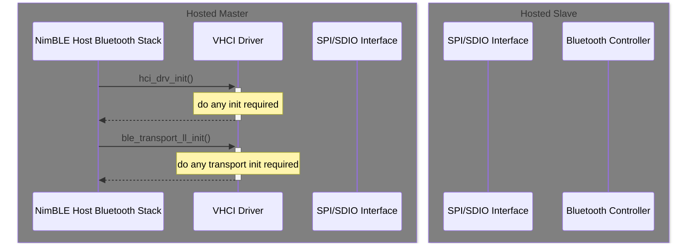
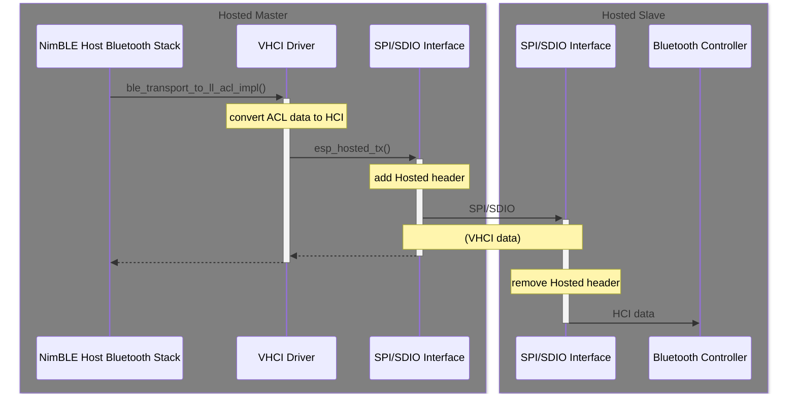
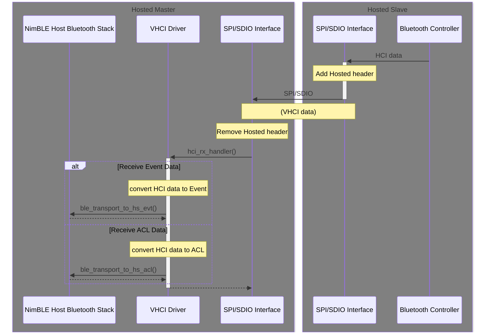
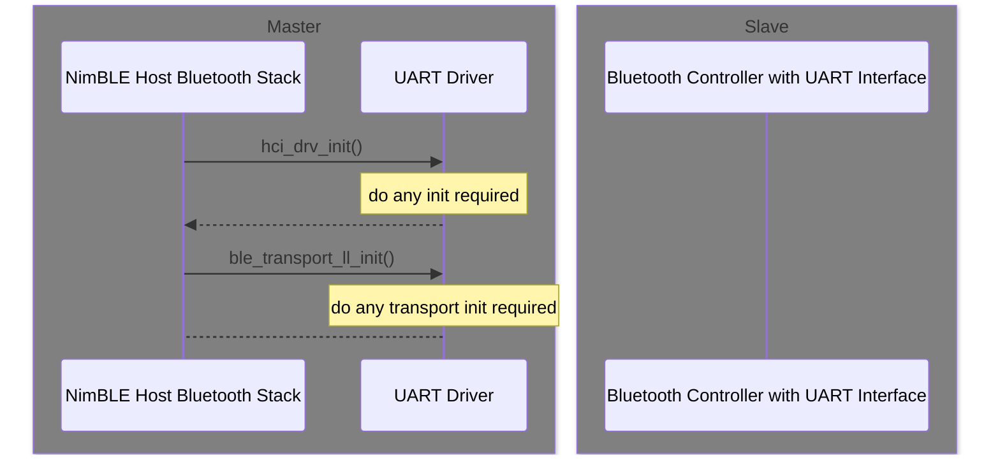
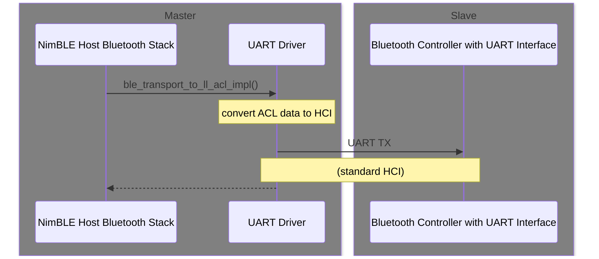
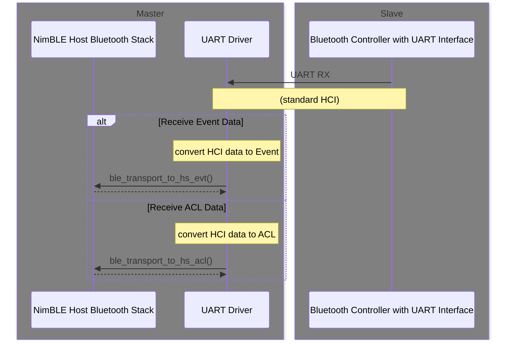

# Bluetooth Implementation in ESP-Hosted

**Table of Contents**

- [1. Introduction](#1-introduction)
- [2. Bluetooth Controller](#2-bluetooth-controller)
- [3. Bluetooth Interface](#3-bluetooth-interface)
- [4. NimBLE Host Stack](#4-nimble-host-stack)
- [5. Transporting HCI data using vHCI](#5-transporting-hci-data-using-vhci)
  - [5.1. Bluetooth Host vHCI Initialization](#51-bluetooth-host-vhci-initialization)
  - [5.2. Bluetooth Host Sending Data through vHCI](#52-bluetooth-host-sending-data-through-vhci)
  - [5.3. Bluetooth Host Receiving Data from vHCI](#53-bluetooth-host-receiving-data-from-vhci)
- [6. Transporting HCI data using UART](#6-transporting-hci-data-using-uart)
  - [6.1. Bluetooth Host HCI Initialization](#61-bluetooth-host-hci-initialization)
  - [6.2. Bluetooth Host Sending Data using HCI](#62-bluetooth-host-sending-data-using-hci)
  - [6.3. Bluetooth Host Receiving Data using HCI](#63-bluetooth-host-receiving-data-using-hci)
- [7. References](#7-references)

## 1. Introduction

ESP-Hosted can transport Bluetooth HCI packets between the Bluetooth
Host on the Hosted Master and the Bluetooth Controller on the Hosted
Slave. The Host MCU implement the Bluetooth app and Bluetooth Host
Stack and the Slave runs the Bluetooth controller and hardware.

> [!NOTE]
> Check that the memory requirement for your preferred Bluetooth host
> stack can be satisfied on the Host.

ESP-Hosted has not preferred Bluetooth stack. To showcase ESP-Hosted's
Bluetooth support, `esp-nimble` is used here. Users can use their own
preferred Bluetooth stack with some porting effort.

`esp-nimble` is a fork of Apache NimBLE and available from
ESP-IDF. The NimBLE Bluetooth slack proves Bluetooth Low Energy (BLE)
only functionality.

See [References](#7-references) for links with more information.

## 2. Bluetooth Controller

ESP-Hosted uses the Bluetooth controller running on the slave. The Slave
is expected to be configured to use BT Controller-only mode.

As ESP-Hosted is just communication medium, it doesn't limit to BLE
only. Classic BT stacks are also supported, given the slave has
Classic-BT controller. The Classic-BT or BLE or both availability
depends upon the Bluetooth stack support and ESP chipset chosen. As of
today, ESP32 supports Classic-BT+BLE, whereas, the other ESP slave
chipsets support BLE only.

## 3. Bluetooth Interface

Hosted provides two ways to let the Bluetooth Host stack running on
the Host to communicate with the Bluetooth controller on the Slave.

**vHCI**

- vHCI is standard HCI with extra headers or metadata added
- vHCI embeds the ESP-Hosted header and re-uses the underlying
  ESP-Hosted transport, such as SPI/SDIO
- this option is easier to set up. Once the existing SPI or SDIO
  transport has been set up, Bluetooth works

Use this option if you want:

- complete control of Bluetooth messages
- extra flexibility of debugging
- no extra GPIOs (required for Standard HCI)

**Standard HCI**

- standard HCI is a transparent way of handling HCI messages
- HCI messages originating from the Bluetooth stack on the Host are
  sent through an interface (like UART) to the Bluetooth controller on
  the Slave
- requires extra GPIO for the HCI interface, independent of the GPIOs
  used for the ESP-Hosted interface

Use this option if you want:

- transparency: no extra data added to the HCI messages
- portability: because it is standard HCI, you can replace the Slave
  with any other co-processor (ESP or otherwise) that has a Bluetooth
  controller

> [!NOTE]
> If Hosted is configured as the Bluetooth transport (vHCI), then your
> Bluetooth over HCI configuration must be disabled, and vice
> versa.

## 4. NimBLE Host Stack

The ESP-Hosted Master implements the set of API calls required by the
NimBLE Bluetooth stack to initialize, send and receive Bluetooth data:

- `hci_drv_init`
- `ble_transport_ll_init`
- `ble_transport_to_ll_acl_impl`
- `ble_transport_to_ll_cmd_impl`
- `ble_transport_to_hs_evt`
- `ble_transport_to_hs_acl`

The following sequence diagrams show how to send and receive Bluetooth
on both the Hosted Master and Slave.

## 5. Transporting HCI data using vHCI

### 5.1. Bluetooth Host vHCI Initialization

**Bluetooth Host Initialization**

### 5.2. Bluetooth Host Sending Data through vHCI

**Bluetooth Host Sending Data**

### 5.3. Bluetooth Host Receiving Data from vHCI

**Bluetooth Host Receiving Data**

## 6. Transporting HCI data using UART

### 6.1. Bluetooth Host HCI Initialization

**Bluetooth Host Initialization**

### 6.2. Bluetooth Host Sending Data using HCI

**Bluetooth Host Sending Data**

### 6.3. Bluetooth Host Receiving Data using HCI

**Bluetooth Host Receiving Data**

## 7. References

- esp-nimble: https://github.com/espressif/esp-nimble
- ESP-IDF NimBLE-based Host APIs: https://docs.espressif.com/projects/esp-idf/en/stable/esp32/api-reference/bluetooth/nimble/index.html
