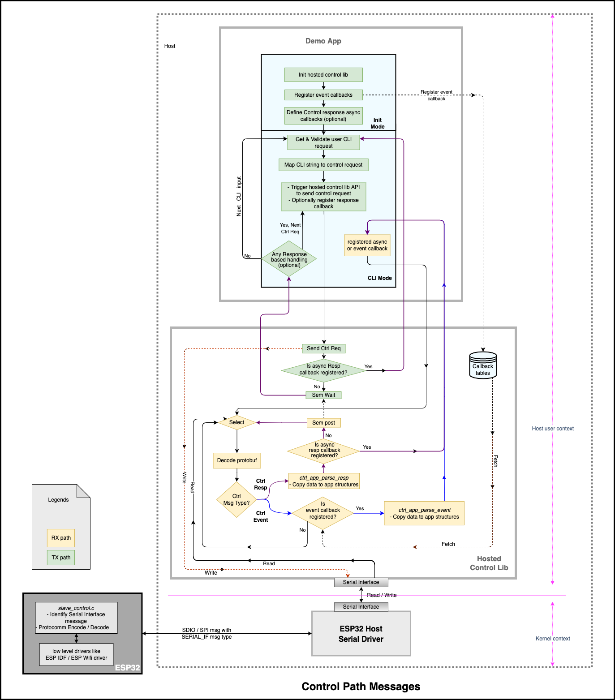

# Index

* [**1. Host Serial Driver**](#host-serial-driver)
	* [1.1 Virtual serial interface](#11-virtual-serial-interface)
	* [1.2 Serial Driver](#12-serial-driver)
* [**2. Types of control messges**](#2-types-of-control-messges)
* [**3. Design**](#3-design)
	* [3.1 Control path components](#31-control-path-components)
		* [3.1.1 Hosted Control Lib](#311-hosted-control-lib)
		* [3.1.2 Demo App](#312-demo-app)
* [**4. API documentation**](#4-api-documentation)
* [**5. Kickstart using Control path**](#5-kickstart-using-control-path)
	* [5.1 Synchronous and Asynchronous communication](#51-synchronous-and-asynchronous-communication)
		* [5.1.1 Synchronous](#511-synchronous)
		* [5.1.2 Asynchronous](#512-asynchronous)
* [**6. Limitations**](#6-limitations)

# Control Path

* Control path is intended to setup all configurations at ESP32 side. These configurations could be related to services like
  - Connect host with external AP (Wi-Fi router)
  - Get configurations of external AP which host is connected
  - Set maximum wifi transmit power of ESP32
  - Find out current wifi power of ESP32
* Control path command could be considered as first step before you can establish data path
* It is way to verify if ESP-Hosted transport like SPI, SDIO is setup correctly
* Control path is sole way to control and manage ESP32
* It is responsive medium in between end user and ESP32, which will facilitate user for any changes to be done at ESP32 and which will notify user for any important events
* Overall [control path design](../common/contrl_path.md#2-design) and easy setup of control path using [demo application](../common/contrl_path.md#4-kickstart-using-control-path) is explained in [Control Path documentation](../common/contrl_path.md)

## 1. Host Serial Driver
- Prerequisite for host serial driver is that the hosted transport like SPI, SDIO is setup
- Host serial driver is comprised of two elements
  - Virtual Serial Interface
  - Serial Driver
* ESP32 host Serial driver is used in following way \
  `Demo App` -> `Control API` -> `Hosted Control Library` -> `Virtual Serial Interface` -> \
  `Serial Driver` -> `ESP-Hosted transport like SPI/SDIO` \

  | Layer | Remarks | Access
  |:---------:|:----------:|:-----:|
  | Demo App | Control path application | |
  | Control path API | Interface in between Demo app and Hosted Control Library | &darr; |
  | Hosted Control Library | Platform and transport agnostic library to configure and manage ESP chipset from host | &darr; |
  | **Virtual Serial Interface** | **Platform independent thin abstraction of serial driver** | &darr; |
  | **Serial Driver** | **Platform specific abstraction to serial character driver** | &darr; |
  | ESP-Hosted transport | Ex. SPI, SDIO etc | &darr; |

### 1.1 Virtual serial interface
- This is platform independent serial interface, which implemented over serial driver.
- Code for virtual serial interface is at [virtual_serial_if](../../host/virtual_serial_if) -> [serial_if.h](../../host/virtual_serial_if/include/serial_if.h) and [serial_if.c](../../host/virtual_serial_if/src/serial_if.c)
- Virtual Serial Interface exposes [Serial APIs](serial_apis.md) -> [Virtual Serial Interface APIs](../common/serial_apis.md#1-virtual-serial-interface-apis.md)

### 1.2 Serial Driver
- Serial driver is implemented specific to platform.
- Reason is that every platform serial interface could be differently available \
  For example MPU represents serial driver using serial character driver file like `/dev/esps0` but in case of MCU, it will be more of virtual entity.
- Code for **MPU based** serial driver is at [platform_wrapper.h](../../host/linux/port/include/platform_wrapper.h)
- Serial Driver exposes [Serial Driver APIs](../common/serial_apis.md#2-serial-driver-apis) for `Virtual Serial Interface`

## 2. Types of control messges
Control messages divided into three type,
- Control Request
- Control Response
- Control Event

Control request is a request to be served and sent from host to ESP32. Demo application with help of hosted control lib, triggers control request. When this request reaches ESP32, it is protobuf decoded and responded as control response. Control events are based on subscriber-notification model. Basically demo application when subscribed to specific event with a function callback, the function would be called when the event is triggered. Heartbeat is one example for control event, which will simply let us know the ESP32 is alive periodically.

## 3. Design

* Above detailed diagram showcases how all the control messages are handled at host side
* Demo application is at the top which uses [control path APIs](ctrl_apis.md) exposed by Hosted control library. Hosted control lib in turn uses virtual serial interface exposed by `ESP32 Host serial driver`
* `ESP32 Host serial driver` implements virtual serial interface which is abstraction to lower level functionalities like open/read/write/close functions
* Although diagram does not showcase how control path messages are used in ESP32, they are pretty similar to that of host
* ESP32 uses `protocom` which is ready usable IDF component which leverages protobuf encoding and decoding functionalities

### 3.1 Control path components
There are two components in control path. Hosted control lib and Demo app. Demo App uses control APIs to communicate to hosted control lib.

###### 3.1.1 Hosted Control Lib
- Hosted control library is available as base library which exposes control APIs so that user application could be easily integrated
- It is responsible for Protobuf encoding and decoding
- Control path APIs are exposed in [ctrl_api.h](../../host/control_lib/include/ctrl_api.h) file
- Control path library is implemented with source files, [ctrl_api.c](../../host/control_lib/src/ctrl_api.c) and [ctrl_core.c](../../host/control_lib/src/ctrl_core.c) which interact with platform
- Hosted control lib works over `ESP32 Host Serial Driver`
- If the need be, user can add a new control path message. Protobuf encoding and decoding of new control message to be added as part of this library

###### 3.1.2 Demo App
- Demo App is sample user application developed on top of hosted control library
- This way end user can create expected application with minimal or no change to hosted control library
- Demo application creates control message using structures exposed in [ctrl_api.h](../../host/control_lib/include/ctrl_api.h). These structures are used along with control path APIs to send a control request and parse control response or a control event
- We will take liberty to refer demo app as application in upcoming chapters

## 4. API documentation
The structures and API functions are documented in [Control APIs](ctrl_apis.md). These APIs are common for MCU and MPU based hosts.

## 5. Kickstart using Control path
To setup control path, [C based demo app](c_demo.md) and [Python based demo app](python_demo.md) are already bundled which use control APIs. In these applications, API implementation is showcased with some APIs implemented as asynchronous and rest APIs implemented as synchronous. Either of these could be used to test control path API.
#### 5.1 Synchronous and Asynchronous communication
* Control path is said to be complete when response is received for a control request. But handling the control response could be done either synchronous or asynchrounous.
* As discussed in API documentation, a structure, `ctrl_cmd_t` is the main structure application will make use of to work on any control message.
* Every control API could be used as synchronous or asynchronous by application
* Any synchronous API could easily be converted into asynchronous and vice versa
###### 5.1.1 Synchronous
- When the control request is created using `ctrl_cmd_t` and when `ctrl_resp_cb` function from structure pointer is set to **NULL** while using control API, it is regarded as synchrounous usage
- In synchronous communication, when request is sent, the application would be blocked till response is received
- The control API used as synchronous, API function would return control response populated as `ctrl_cmd_t *` and application would be responsible to parse the response
###### 5.1.2 Asynchronous
- Asynchronous Response handling
  - When the control request is created using `ctrl_cmd_t` and when `ctrl_resp_cb` function from structure pointer is set to **valid function pointer** while using control API, it is regarded as asynchrounous usage
  - In asynchronous communication, application would define a function, which would be automatically called as a callback when hosted control library receives control response from ESP32
  - As a difference, when API is used as asynchronous, will return immediately after sending the control request without blocking for the response
  - When control API is used as asynchronous, API function call returns NULL
  - **Note**
    - In case of asynchronous, a timer is started of command timeout value. In case response not received within command timeout time, response callback function would be called with failure status
	- Application should wait at least till the command timeout duration after firing control request

- Event handling
  - Control events are always asynchronous in nature as there will not be any control request associated with them
  - Application has choice to which events it wants to subscribe using control API `set_event_callback` with specific event id and a event callback function
  - When hosted control lib receives event from ESP32, it will invoke event callback function registered
## 6. Limitations
* Serial interface can handle single control request at a time
* UART transport is not supported for control path

