# Bluetooth Design

[Home](../../README.md) · [Getting Started: Linux](../getting-started-linux.md) · [Getting Started: MCU](../getting-started-mcu.md) · [Troubleshooting](../troubleshooting.md)

ESP-Hosted carries Bluetooth HCI packets between a **Bluetooth host stack on the host MCU** and a **Bluetooth controller on the co-processor**. The host runs the app and the host stack; the co-processor runs the controller and radio. Hosted is stack-agnostic — the reference examples use both `esp-nimble` and `esp-bluedroid`, and you can port your own stack with modest effort.

> [!IMPORTANT]
> Classic Bluetooth needs an **ESP32** co-processor. As of today ESP32 supports Classic-BT + BLE; the other ESP chipsets are BLE-only. If your co-processor is an ESP32, note it only supports Bluetooth v4.2, so the host stack must also be v4.2.

---

## The pieces

### Bluetooth controller

Hosted uses the Bluetooth controller running on the co-processor and is just the communication medium, so it supports both Classic BT and BLE controllers — whichever the chosen chipset provides.

### Choosing a host stack

- **BlueDroid** — supports Classic Bluetooth *and* BLE. Use it for any Classic BT use case. `esp-bluedroid` is a fork of the Bluedroid-based stack shipped with ESP-IDF.
- **NimBLE** — BLE only, with a smaller code and RAM footprint. Recommended for BLE-only use cases. `esp-nimble` is a fork of Apache NimBLE shipped with ESP-IDF.

Confirm the memory requirement of your chosen host stack can be met on the host.

---

## Bluetooth interface: two transport options

Hosted offers two ways for the host stack to reach the controller: **Standard HCI** and **Hosted HCI**.

| | **Hosted HCI** | **Standard HCI (UART)** |
| :--- | :--- | :--- |
| What it is | Standard HCI encapsulated with an ESP-Hosted header | Transparent standard HCI, no extra metadata |
| Transport | Multiplexed over the existing ESP-Hosted bus (SPI/SDIO) | Dedicated transport (e.g. UART); cannot multiplex other traffic |
| Extra GPIOs | None beyond the ESP-Hosted interface | Extra GPIOs for the HCI interface |
| Setup | Easiest — once ESP-Hosted transport is up, Bluetooth just works | Portable — swap in any co-processor with a BT controller |
| Pick it for | Control, debugging flexibility, fewer GPIOs | Transparency and portability |

**Standard HCI** works in dedicated mode: HCI frames originating from the host stack are sent through an interface such as UART directly to the controller. Because it is plain HCI, you can replace the co-processor with any other (ESP or otherwise) that has a BT controller.

**Hosted HCI** embeds the ESP-Hosted header and reuses the underlying transport, multiplexing Bluetooth alongside other interface types on the same bus.

> [!NOTE]
> If Hosted HCI is configured as the Bluetooth transport, your Standard-HCI configuration must be disabled — and vice versa.

---

## Initializing the Bluetooth controller

> [!NOTE]
> Before ESP-Hosted-MCU v2.5.2 the controller was **enabled** by default. The steps below apply to **v2.5.2 and later**, where the controller is **disabled** by default so the BT MAC address can be set before the controller comes up.

**Get / set the BT MAC address:**

1. `esp_hosted_connect_to_slave()` — initialise the transport.
2. *(optional)* `esp_hosted_iface_mac_addr_len_get` — get the BT MAC address length.
3. *(optional)* `esp_hosted_iface_mac_addr_get` — read the current BT MAC address.
4. `esp_hosted_iface_mac_addr_set` — set the BT MAC address.

> [!NOTE]
> This MAC setting is temporary and reverts on device reset. For a permanent change, set it during hardware provisioning or burn it into eFuse.

**Enable the controller:**

1. `esp_hosted_connect_to_slave()` — initialise the transport (skip if already done above).
2. *(optional)* `esp_hosted_iface_mac_addr_get()` / `esp_hosted_iface_mac_addr_set()`.
3. `esp_hosted_bt_controller_init()`.
4. `esp_hosted_bt_controller_enable()`.
5. Initialise the BT host stack.

**Disable the controller:**

1. Deinitialise the BT host stack.
2. `esp_hosted_bt_controller_disable()`.
3. `esp_hosted_bt_controller_deinit()`.

---

## NimBLE host stack

The Hosted master implements the NimBLE transport API set: `ble_transport_ll_init`, `ble_transport_to_ll_acl_impl`, `ble_transport_to_ll_cmd_impl`, `ble_transport_to_hs_evt`, `ble_transport_to_hs_acl` (see `examples/bluetooth/host_mcu/nimble/components/esp_hosted_hci_nimble/src/esp_hosted_hci_nimble.c`).

### Over Hosted HCI

**Initialization** — the app calls the one-shot `esp_hosted_hci_nimble_setup()` (Bluedroid: `esp_hosted_hci_bluedroid_setup()`): it connects to the co-processor, inits and enables the CP-side BT controller over RPC, and registers the HCI RX callback (binding the TX function). The transport TX overrides (`ble_transport_to_ll_*`) are strong link-time symbols, so NimBLE's own `ble_transport_ll_init()` has nothing left to do and is a no-op.

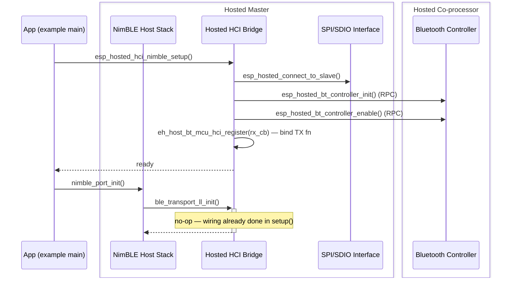

**Sending** — ACL data is converted to HCI, a hosted header is added, and the frame crosses the bus. The co-processor removes the header and hands raw HCI to the controller.

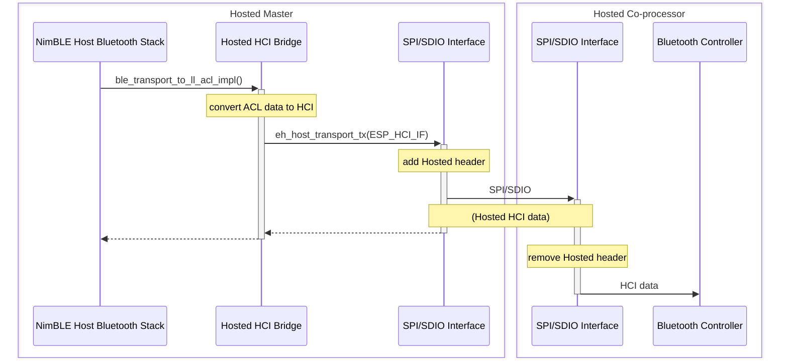

**Receiving** — the controller emits HCI, the co-processor adds a hosted header, and the master removes it and dispatches into the stack as an event or as ACL data.

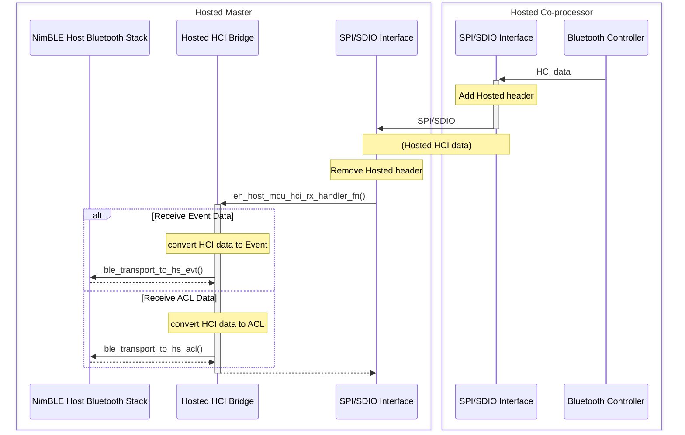

### Over standard UART HCI

With standard HCI the driver is UART, talking directly to a controller that exposes a UART interface — no hosted header, no multiplexing.

**Initialization** — the app opens the UART link with `hci_uart_open()` (configures the port and starts the RX task); NimBLE's `ble_transport_ll_init()` is then a no-op. Teardown closes the port via `ble_transport_ll_deinit()` → `hci_uart_close()`.

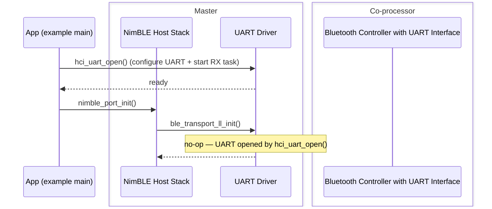

**Sending:**

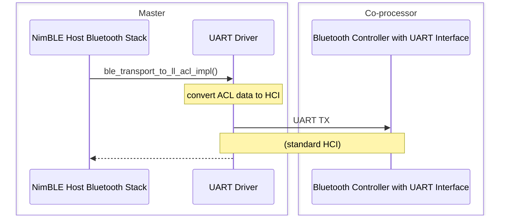

**Receiving:**

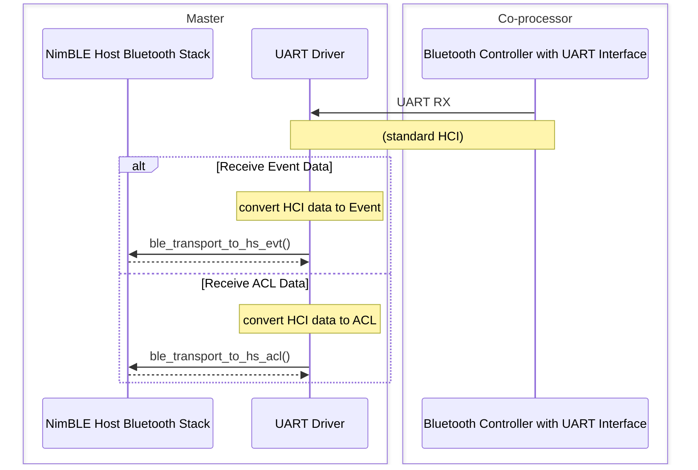

---

## BlueDroid host stack

Hosted implements the BlueDroid transport API set: `hosted_hci_bluedroid_open`, `hosted_hci_bluedroid_close`, `hosted_hci_bluedroid_send`, `hosted_hci_bluedroid_check_send_available`, `hosted_hci_bluedroid_register_host_callback`.

`hosted_hci_bluedroid_open` must be called by the application before attaching the transport APIs to BlueDroid and starting it — this initialises the underlying transport. `hosted_hci_bluedroid_register_host_callback` records BlueDroid's callback (`notify_host_recv`) used to deliver incoming HCI data to the stack.

### Over Hosted HCI

**Initialization:**

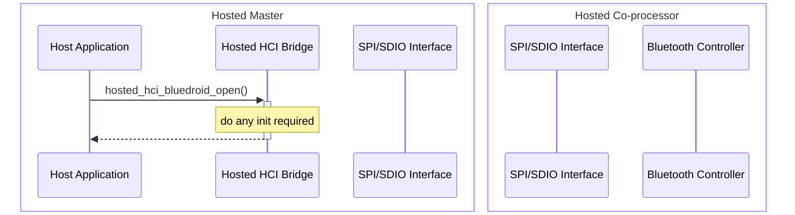

**Sending:**

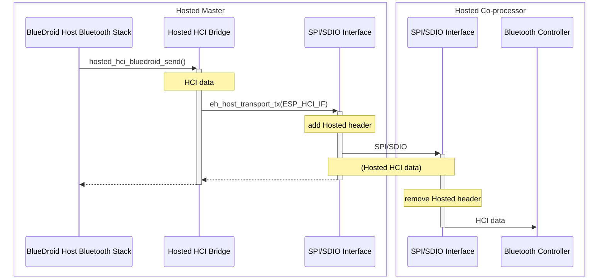

**Receiving:**

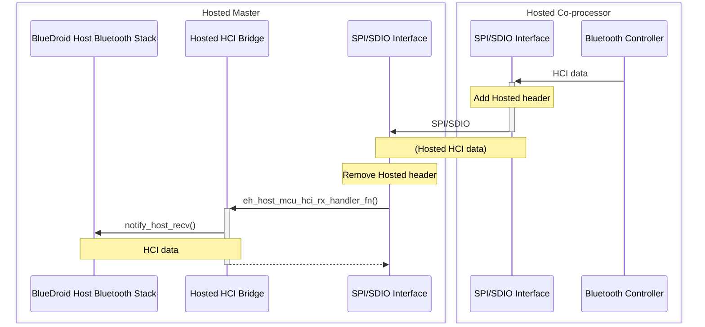

### Over standard UART HCI

Using BlueDroid over UART needs UART functions that:

- `uart_open` — open and initialise the UART driver (GPIOs, baud rate, etc.).
- `uart_tx` — transmit over UART.
- `UART RX` — a thread waiting for incoming UART data.
- `notify_host_recv` — a BlueDroid callback registered with `UART RX` to receive UART data.

`uart_open` is called before starting BlueDroid; `uart_tx` and `notify_host_recv` are registered by BlueDroid with the UART driver.

**Initialization:**

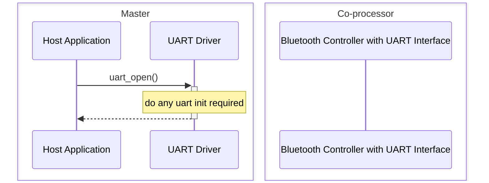

**Sending:**

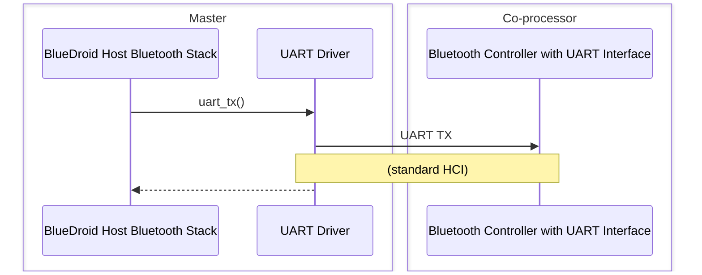

**Receiving:**

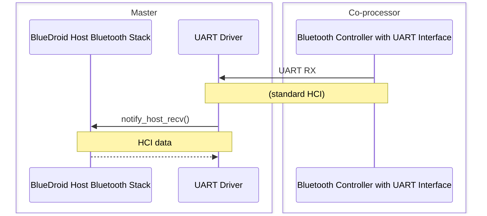

---

## Implementation notes: standard HCI over UART

Standard HCI over UART is configured through the Bluetooth component Kconfig. In `menuconfig`, go to `Component config` → `Bluetooth` → `Controller Options` → `HCI mode` (or `HCI Config`) and set it to `UART(H4)`.

```text
Component config
└── Bluetooth
    └── Controller Options
        └── HCI mode / HCI Config ──> UART(H4)
```

Depending on the co-processor, UART parameters (Tx/Rx pins, hardware flow control, RTS/CTS pins, baud rate) are configured through the Bluetooth component. Any UART parameters the Bluetooth component does not handle are set by ESP-Hosted under `Example Configuration` → `HCI UART Settings`.

> [!NOTE]
> Make sure the Standard-HCI UART GPIO pins do not conflict with the GPIO pins used by the selected ESP-Hosted transport.

---

## References

- [esp-nimble](https://github.com/espressif/esp-nimble)
- [ESP-IDF NimBLE host APIs](https://docs.espressif.com/projects/esp-idf/en/stable/esp32/api-reference/bluetooth/nimble/index.html)
- [ESP-IDF Bluetooth API](https://docs.espressif.com/projects/esp-idf/en/latest/esp32/api-reference/bluetooth/index.html)
- [NimBLE host-only over UART example](https://github.com/espressif/esp-idf/tree/master/examples/bluetooth/nimble/bleprph_host_only)
- [BlueDroid host-only over UART example](https://github.com/espressif/esp-idf/tree/master/examples/bluetooth/bluedroid/bluedroid_host_only/bluedroid_host_only_uart)
