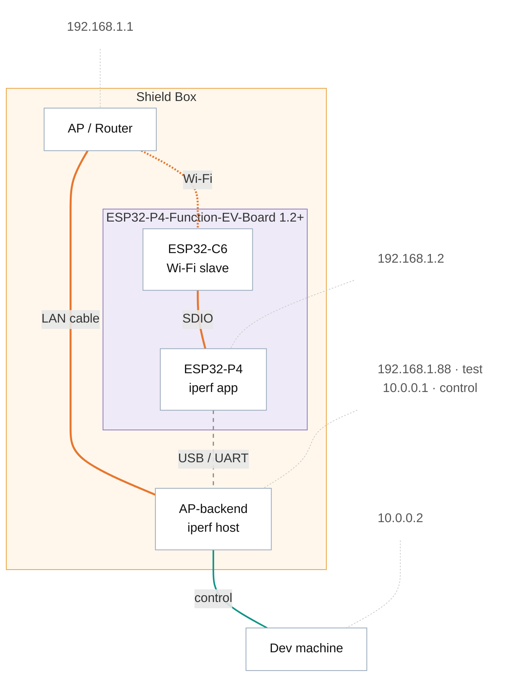

# Performance Tuning

[Home](../../README.md) · [Getting Started: Linux](../getting-started-linux.md) · [Getting Started: MCU](../getting-started-mcu.md) · [Troubleshooting](../troubleshooting.md)

A quick reference for squeezing throughput out of ESP-Hosted across co-processor chips and transports. Throughput scales with the bus you pick: **SDIO > SPI-HD > SPI-FD > UART**. Choose the fastest bus your hardware and chip support, then apply the per-chip Wi-Fi and TCP/IP tuning below.

> [!NOTE]
> Adjust every value to your host and co-processor memory budget. These figures may shift as more testing surfaces better numbers.

---

## 1. Quick start — high-performance config

Add the block for your co-processor to the host's `sdkconfig.defaults.esp32XX` file.

**Throughput test conditions:**

- **raw** — data pushed sender→receiver over the transport.
- **iPerf** — used to measure TCP and UDP throughput.

The reference setup (ESP32-P4 host paired with the co-processor under test, connected to an AP, iperf run against a backend PC):



> [!NOTE]
> The diagram shows the router and ESP board inside a shield box. The numbers below were taken in an *open-air* setup, without a shield box.

### 1.1 ESP32-C6 as co-processor

```ini
### sdkconfig for ESP32-P4 + C6 as co-processor

# Let P4 know, C6 is attached as slave
CONFIG_SLAVE_IDF_TARGET_ESP32C6=y
CONFIG_ESP_HOSTED_CP_TARGET_ESP32C6=y

# Wi-Fi Performance
CONFIG_WIFI_RMT_STATIC_RX_BUFFER_NUM=16
CONFIG_WIFI_RMT_DYNAMIC_RX_BUFFER_NUM=64
CONFIG_WIFI_RMT_DYNAMIC_TX_BUFFER_NUM=64
CONFIG_WIFI_RMT_AMPDU_TX_ENABLED=y
CONFIG_WIFI_RMT_TX_BA_WIN=32
CONFIG_WIFI_RMT_AMPDU_RX_ENABLED=y
CONFIG_WIFI_RMT_RX_BA_WIN=32

# TCP/IP Performance
CONFIG_LWIP_TCP_SND_BUF_DEFAULT=65534
CONFIG_LWIP_TCP_WND_DEFAULT=65534
CONFIG_LWIP_TCP_RECVMBOX_SIZE=64
CONFIG_LWIP_UDP_RECVMBOX_SIZE=64
CONFIG_LWIP_TCPIP_RECVMBOX_SIZE=64
CONFIG_LWIP_TCP_SACK_OUT=y
```

SDIO transport, 4-bit, 40 MHz, 2.4 GHz network, over the air:

| Type | Direction | MBits/s |
|------------|---------------|--------:|
| Raw | P4 to C6 | 72 |
| Raw | C6 to P4 | 80 |
| iPerf, TCP | P4 to Test PC | 32 |
| iPerf, UDP | P4 to Test PC | 50 |
| iPerf, TCP | Test PC to P4 | 30 |
| iPerf, UDP | Test PC to P4 | 49 |

### 1.2 ESP32-C5 as co-processor

```ini
### sdkconfig for ESP32-P4 + C5 as co-processor

# Let P4 know, C5 is attached as slave
CONFIG_SLAVE_IDF_TARGET_ESP32C5=y
CONFIG_ESP_HOSTED_CP_TARGET_ESP32C5=y

# Optional PCB selection: Uncomment if you are using Pre designed PCB P4_C5_CORE_BOARD (to use correct GPIOs on that PCB)
# CONFIG_ESP_HOSTED_P4_C5_CORE_BOARD=y

# Wi-Fi Performance
CONFIG_WIFI_RMT_STATIC_RX_BUFFER_NUM=10
CONFIG_WIFI_RMT_DYNAMIC_RX_BUFFER_NUM=32
CONFIG_WIFI_RMT_DYNAMIC_TX_BUFFER_NUM=32
CONFIG_WIFI_RMT_AMPDU_TX_ENABLED=y
CONFIG_WIFI_RMT_TX_BA_WIN=32
CONFIG_WIFI_RMT_AMPDU_RX_ENABLED=y
CONFIG_WIFI_RMT_RX_BA_WIN=16

# TCP/IP Performance
CONFIG_LWIP_TCP_SND_BUF_DEFAULT=11520
CONFIG_LWIP_TCP_WND_DEFAULT=32768
CONFIG_LWIP_TCP_RECVMBOX_SIZE=48
CONFIG_LWIP_UDP_RECVMBOX_SIZE=48
CONFIG_LWIP_TCPIP_RECVMBOX_SIZE=48

CONFIG_LWIP_TCP_SACK_OUT=y
```

SDIO transport, 4-bit, 40 MHz, 5 GHz network, over the air:

| Type | Direction | MBits/s |
|------------|---------------|--------:|
| Raw | P4 to C5 | 72 |
| Raw | C5 to P4 | 81 |
| iPerf, TCP | P4 to Test PC | 23 |
| iPerf, UDP | P4 to Test PC | 67 |
| iPerf, TCP | Test PC to P4 | 32 |
| iPerf, UDP | Test PC to P4 | 68 |

### 1.3 ESP32-C61 as co-processor

```ini
### sdkconfig for ESP32-P4 + C61 as co-processor

# Let P4 know, C61 is attached as slave
CONFIG_SLAVE_IDF_TARGET_ESP32C61=y
CONFIG_ESP_HOSTED_CP_TARGET_ESP32C61=y

# Optional PCB selection: Uncomment if you are using Pre designed PCB P4_C61_CORE_BOARD (to use correct GPIOs on that PCB)
# CONFIG_ESP_HOSTED_P4_C61_CORE_BOARD=y

# Wi-Fi Performance
CONFIG_WIFI_RMT_STATIC_RX_BUFFER_NUM=10
CONFIG_WIFI_RMT_DYNAMIC_RX_BUFFER_NUM=16
CONFIG_WIFI_RMT_DYNAMIC_TX_BUFFER_NUM=16
CONFIG_WIFI_RMT_AMPDU_TX_ENABLED=y
CONFIG_WIFI_RMT_TX_BA_WIN=16
CONFIG_WIFI_RMT_AMPDU_RX_ENABLED=y
CONFIG_WIFI_RMT_RX_BA_WIN=16

# TCP/IP Performance
CONFIG_LWIP_TCP_SND_BUF_DEFAULT=12930
CONFIG_LWIP_TCP_WND_DEFAULT=22488
CONFIG_LWIP_TCP_RECVMBOX_SIZE=48
CONFIG_LWIP_UDP_RECVMBOX_SIZE=64
CONFIG_LWIP_TCPIP_RECVMBOX_SIZE=48
CONFIG_LWIP_IP_REASS_MAX_PBUFS=15

CONFIG_LWIP_TCP_SACK_OUT=y

CONFIG_LWIP_TCPIP_CORE_LOCKING=y
CONFIG_LWIP_TCPIP_CORE_LOCKING_INPUT=y
```

SPI-FD transport, 40 MHz, 2.4 GHz network, over the air:

| Type | Direction | MBits/s |
|------------|---------------|--------:|
| Raw | P4 to C61 | 25 |
| Raw | C61 to P4 | 26 |
| iPerf, TCP | P4 to Test PC | 12 |
| iPerf, UDP | P4 to Test PC | 18 |
| iPerf, TCP | Test PC to P4 | 15 |
| iPerf, UDP | Test PC to P4 | 23 |

### 1.4 ESP32-C2 as co-processor

```ini
# Let P4 know, C2 is attached as slave
CONFIG_SLAVE_IDF_TARGET_ESP32C2=y
CONFIG_ESP_HOSTED_CP_TARGET_ESP32C2=y

### sdkconfig for ESP32-P4 + C2 as co-processor
# Wi-Fi Performance
CONFIG_WIFI_RMT_STATIC_RX_BUFFER_NUM=10
CONFIG_WIFI_RMT_DYNAMIC_RX_BUFFER_NUM=32
CONFIG_WIFI_RMT_DYNAMIC_TX_BUFFER_NUM=32
CONFIG_WIFI_RMT_AMPDU_TX_ENABLED=y
CONFIG_WIFI_RMT_TX_BA_WIN=6
CONFIG_WIFI_RMT_AMPDU_RX_ENABLED=y
CONFIG_WIFI_RMT_RX_BA_WIN=6

# TCP/IP Performance
CONFIG_LWIP_TCP_SND_BUF_DEFAULT=16384
CONFIG_LWIP_TCP_WND_DEFAULT=32768
CONFIG_LWIP_TCP_RECVMBOX_SIZE=20
CONFIG_LWIP_UDP_RECVMBOX_SIZE=20
CONFIG_LWIP_TCPIP_RECVMBOX_SIZE=20

CONFIG_LWIP_TCP_SACK_OUT=y
```

SPI-FD transport, 40 MHz, 2.4 GHz network, over the air:

| Type | Direction | MBits/s |
|------------|---------------|--------:|
| Raw | P4 to C2 | 25 |
| Raw | C2 to P4 | 26 |
| iPerf, TCP | P4 to Test PC | 12 |
| iPerf, UDP | P4 to Test PC | 18 |
| iPerf, TCP | Test PC to P4 | 13 |
| iPerf, UDP | Test PC to P4 | 15 |

### 1.5 ESP32-S2 as co-processor

```ini
### sdkconfig for ESP32-P4 + S2 as co-processor

# Let P4 know, S2 is attached as slave
CONFIG_SLAVE_IDF_TARGET_ESP32S2=y
CONFIG_ESP_HOSTED_CP_TARGET_ESP32S2=y

# Wi-Fi Performance
CONFIG_WIFI_RMT_STATIC_RX_BUFFER_NUM=8
CONFIG_WIFI_RMT_DYNAMIC_RX_BUFFER_NUM=24
CONFIG_WIFI_RMT_DYNAMIC_TX_BUFFER_NUM=24
CONFIG_WIFI_RMT_AMPDU_TX_ENABLED=y
CONFIG_WIFI_RMT_TX_BA_WIN=16
CONFIG_WIFI_RMT_AMPDU_RX_ENABLED=y
CONFIG_WIFI_RMT_RX_BA_WIN=16

# TCP/IP Performance
CONFIG_LWIP_TCP_SND_BUF_DEFAULT=17280
CONFIG_LWIP_TCP_WND_DEFAULT=28000
CONFIG_LWIP_TCP_RECVMBOX_SIZE=32
CONFIG_LWIP_UDP_RECVMBOX_SIZE=32
CONFIG_LWIP_TCPIP_RECVMBOX_SIZE=32

CONFIG_LWIP_TCP_SACK_OUT=y
```

SPI-FD transport, 40 MHz, 2.4 GHz network, over the air:

| Type | Direction | MBits/s |
|------------|---------------|--------:|
| Raw | P4 to S2 | 25 |
| Raw | S2 to P4 | 26 |
| iPerf, TCP | P4 to Test PC | 8 |
| iPerf, UDP | P4 to Test PC | 11 |
| iPerf, TCP | Test PC to P4 | 12 |
| iPerf, UDP | Test PC to P4 | 15 |

### 1.6 ESP32-C3 as co-processor

```ini
### sdkconfig for ESP32-P4 + C3 as co-processor

# Let P4 know, C3 is attached as slave
CONFIG_SLAVE_IDF_TARGET_ESP32C3=y
CONFIG_ESP_HOSTED_CP_TARGET_ESP32C3=y

# Wi-Fi Performance
CONFIG_WIFI_RMT_STATIC_RX_BUFFER_NUM=20
CONFIG_WIFI_RMT_DYNAMIC_RX_BUFFER_NUM=40
CONFIG_WIFI_RMT_DYNAMIC_TX_BUFFER_NUM=40
CONFIG_WIFI_RMT_AMPDU_TX_ENABLED=y
CONFIG_WIFI_RMT_TX_BA_WIN=32
CONFIG_WIFI_RMT_AMPDU_RX_ENABLED=y
CONFIG_WIFI_RMT_RX_BA_WIN=32

# TCP/IP Performance
CONFIG_LWIP_TCP_SND_BUF_DEFAULT=40960
CONFIG_LWIP_TCP_WND_DEFAULT=40960
CONFIG_LWIP_TCP_RECVMBOX_SIZE=64
CONFIG_LWIP_UDP_RECVMBOX_SIZE=64
CONFIG_LWIP_TCPIP_RECVMBOX_SIZE=64
```

SPI-FD transport, 40 MHz, 2.4 GHz network, over the air:

| Type | Direction | MBits/s |
|------------|---------------|--------:|
| Raw | P4 to C3 | 26 |
| Raw | C3 to P4 | 26 |
| iPerf, TCP | P4 to Test PC | 19 |
| iPerf, UDP | P4 to Test PC | 25 |
| iPerf, TCP | Test PC to P4 | 18 |
| iPerf, UDP | Test PC to P4 | 20 |

---

## 2. Transport optimization

Throughput ranks **SDIO > SPI-HD > SPI-FD > UART**. Tune the transport you chose.

### 2.1 SDIO (highest performance)

- **Clock speed:** start at 20 MHz, optimize up to 50 MHz.
- **Bus width:** use 4-bit mode.
- **Hardware:** PCB with controlled impedance, external pull-ups (51 kΩ).
- **Checksum:** optional (SDIO hardware handles verification).

```ini
CONFIG_ESP_HOSTED_SDIO_CLOCK_FREQ_KHZ=40000
CONFIG_ESP_HOSTED_SDIO_BUS_WIDTH=4
```

> [!NOTE]
> See the SDIO transport guide for the trade-off between SDIO performance and memory use.

### 2.2 SPI Full-Duplex

- **Clock speed:** ESP32 ≤ 10 MHz, others ≤ 40 MHz.
- **Hardware:** use `IO_MUX` pins, short traces (≤ 10 cm for jumpers).
- **Checksum:** mandatory (SPI hardware lacks error detection).

```ini
CONFIG_ESP_HOSTED_SPI_CLK_FREQ=40
```

### 2.3 SPI Half-Duplex

- **Data lines:** use 4-line (Quad SPI) mode.
- Same optimizations as SPI Full-Duplex apply; see the SPI Half-Duplex design page for the protocol detail.

### 2.4 UART (lowest performance)

- **Baud rate:** use 921600 (highest stable rate).
- **Best for:** low-throughput applications and debugging.

---

## 3. Memory optimization

Trim the footprint for constrained hosts:

```ini
# Reduce queue sizes
CONFIG_ESP_HOSTED_SDIO_TX_Q_SIZE=10    # Default: 20
CONFIG_ESP_HOSTED_SDIO_RX_Q_SIZE=10    # Default: 20
```

- Disable features you do not use (e.g. Bluetooth).
- Use external RAM for more headroom (PSRAM is supported).
- Apply the [ESP-IDF internal-RAM optimization tricks](https://docs.espressif.com/projects/esp-idf/en/stable/esp32/api-guides/performance/ram-usage.html).

---

## 4. Hardware guidelines

### 4.1 Critical requirements

1. **Signal integrity:** PCB for production; jumpers only for prototyping.
2. **Power supply:** stable 3.3 V, proper decoupling capacitors.
3. **Trace length:** match lengths, especially clock vs data.
4. **Pull-ups:** required for SDIO (51 kΩ) on CMD, D0–D3.

### 4.2 PCB design checklist

- [] Equal trace lengths for communication signals.
- [] Ground plane for signal stability.
- [] Controlled-impedance traces (50 Ω typical).
- [] Series termination resistors for high-speed signals.
- [] Extra GPIOs reserved for future features (deep sleep, etc.).

### 4.3 Development workflow

1. **Proof of concept:** start with jumper wires, low clock speeds.
2. **Incremental optimization:** raise the transport clock step by step.
3. **Hardware validation:** move to PCB for final validation.
4. **Performance tuning:** optimize buffers and configurations.
5. **Disable features:** switch off any unused ESP-IDF or ESP-Hosted components for more memory.

> [!IMPORTANT]
> Verify raw transport throughput before layering networking on top — a flaky bus looks like a broken feature.
