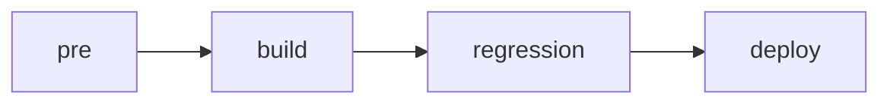
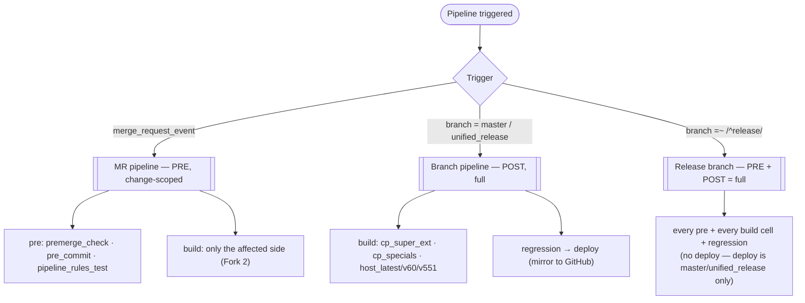
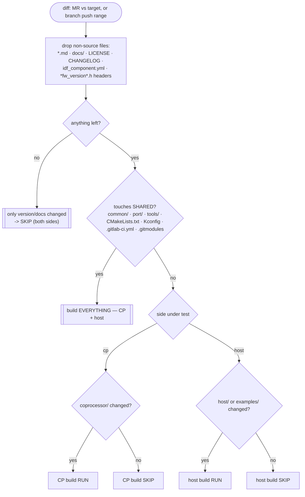

<!--
SPDX-FileCopyrightText: 2026 Espressif Systems (Shanghai) CO LTD
SPDX-License-Identifier: Apache-2.0
-->
# GitLab CI pipeline design

This documents `.gitlab-ci.yml` — the stages, the two "forks" that decide
which jobs run, and *why*. It is meant to stay **code-faithful**: the rule
anchors quoted here are copied verbatim from the pipeline, and the job table
lists exactly what exists.

## Stages



| stage | purpose |
|-------|---------|
| `pre` | cheap gates — fw-version/changelog/structure checks, pre-commit, and the change-scope announcer |
| `build` | compile coverage: `cp_super` (all CP features in one binary) + grouped host examples |
| `regression` | emu runtime tests (currently a stub) |
| `deploy` | mirror GitLab → public GitHub (registry publish stays on GitHub) |

A stage starts only if the previous stage fully succeeded, so a red `build`
never reaches `regression`/`deploy` — nothing dirty is published.

## Two forks

1. **Merge boundary (PRE vs POST).** The build matrix is split so no cell is
   built twice on the MR→merge cycle. **PRE** is the MR gate; **POST** is the
   breadth sweep on the target branch.
2. **Change scope (PRE only).** On an MR, only the side a change can affect is
   built (CP vs host), unless shared code is touched (then both).

`release/*` branches match **both** PRE and POST rules → they always build the
**full** matrix (publish-critical, and not part of the dedup).

### Fork 1 + trigger routing



### Fork 2 — change scope (`tools/ci/decide_build.sh`)

GitLab `rules:changes` can only *include* globs — it cannot ignore a single
generated file. Since a **version bump** rewrites `eh_common_fw_version.h` (and
a doc edit touches READMEs), rules:changes would treat those as "changed" and
rebuild the world. So each build job instead calls `decide_build.sh <cp|host>`
as its first step and **self-skips cheaply (before the IDF install)** when its
side isn't affected, logging why. It runs on MR diffs *and* branch pushes.



**Two safety nets:**
- **Conservative default** — if `decide_build.sh` can't determine a reliable
  diff base, it returns BUILD (never under-builds).
- **POST is unconditional** — anything skipped on an MR is still built on the
  target branch **before** mirror/registry, so a skip can never reach GitHub
  unbuilt.

## The rules (verbatim)

```yaml
# PRE: the MR gate (also on release/* for full coverage)
.rules_pre: &rules_pre
  - if: '$CI_PIPELINE_SOURCE == "merge_request_event"'
  - if: '$CI_COMMIT_BRANCH =~ /^release/'

# POST: target-branch breadth sweep
.rules_post: &rules_post
  - if: '$CI_COMMIT_BRANCH == "master"'
  - if: '$CI_COMMIT_BRANCH == "unified_release"'
  - if: '$CI_COMMIT_BRANCH =~ /^release/'
```

In words:

- **`.rules_pre`** — run on any MR, and on any `release/*` branch push.
- **`.rules_post`** — run on `master`, `unified_release`, and `release/*`.
- **deploy** uses its own inline rule: `master` or `unified_release` only (never
  mirrors a `release/*` branch).

`rules` decide only whether a build job is *created* (Fork 1). *Which side*
actually compiles (Fork 2) is decided at run time by `decide_build.sh`, which
each build job runs first and self-skips on. "Shared" there = `common/`,
`port/`, `tools/`, root `CMakeLists.txt`/`Kconfig*`, `.gitlab-ci.yml`,
`.gitmodules` — touching any of them rebuilds **both** sides. Docs (`*.md`,
`docs/`, `CHANGELOG`, `LICENSE`), `idf_component.yml`, and the generated
`*fw_version*.h` headers are ignored, so a version bump or README edit builds
nothing.

## Job → rule → stage map (code-faithful)

| job | stage | rule | PRE/POST | cells | change-scoped |
|-----|-------|------|----------|-------|---------------|
| `premerge_check` | pre | `.rules_pre` | PRE | 1 | no (always on MR) |
| `pre_commit` | pre | `.rules_pre` | PRE | 1 | no |
| `pipeline_rules_test` | pre | inline: MR + changes to `.gitlab-ci.yml`/test/`decide_build.sh`, or `release/*` | PRE | 1 | — |
| `build_cp_super` | build | `.rules_pre` | PRE | 5 | self-skip: `cp` |
| `build_host_v55_p4` | build | `.rules_pre` | PRE | 1 | self-skip: `host` |
| `build_host_v55_h2` | build | `.rules_pre` | PRE | 1 | self-skip: `host` |
| `build_cp_super_ext` | build | `.rules_post` | POST | 3 | self-skip: `cp` |
| `build_cp_specials` | build | `.rules_post` | POST | 2 | self-skip: `cp` |
| `build_host_latest_p4` | build | `.rules_post` | POST | 1 | self-skip: `host` |
| `build_host_v60_p4` | build | `.rules_post` | POST | 1 | self-skip: `host` |
| `build_host_v551_p4` | build | `.rules_post` | POST | 1 | self-skip: `host` |
| `regression` | regression | `.rules_post` | POST | 1 | — |
| `deploy_master_github` | deploy | `master`/`unified_release` | POST | 1 | — |

("self-skip: X" = the job is created by its rule, then exits early via
`decide_build.sh X` when side X isn't affected — before the IDF install.)

Build cells: **7 PRE + 8 POST = 15**, no cell built twice.

### What PRE (the MR gate) covers

The PRE set is the smallest that still compiles every distinct path a change
can touch:

- **all 4 transports** — SDIO (c6/esp32 default), SPI (c3), SPI-HD (c2), UART (s3)
- **both CPU arches** — xtensa (esp32, s3), riscv (c6, c3, c2)
- **full feature superset** — c6 `cp_super` = wifi (incl. DPP/enterprise/iTWT) + BLE
  + OpenThread + all relays (peer-data, gpio-exp, host-ps, debug+mem-monitor, cli)
- **BLE** — on every BLE-capable cell. (Classic/BTDM BT on esp32 is NOT built yet:
  its Kconfig gates on pre-rename IDF symbols — tracked; see the note below.)
- **host libraries + both BT stacks** — Bluedroid (`host_v55_p4`), NimBLE (`host_v55_h2`), on p4 and h2

### What POST adds (breadth before publish)

Remaining chips (h2 no-wifi+OT, c5, c61), the special-partition CP examples
(`ota`, `ext_coex`), the other IDF versions (latest / 6.0 / 5.5.1 — version
drift), and the rest of the host examples (iperf, nw_split, openthread, ota,
sdmmc, api_exerciser, transport_config, nimble-coex).

## Publishing (deploy stage)

- **GitHub mirror** (`deploy_master_github`): pushes a **pristine full clone**
  of the GitLab commit (`GIT_STRATEGY: none` + fresh `git clone` → push →
  discard), so GitHub receives an exact replica — never build artifacts or
  submodule working trees. No `--force`: a divergent GitHub branch is a
  deliberate decision, not a silent overwrite.
- **Component registry**: stays on GitHub (`.github/workflows/upload_component.yml`),
  triggered by the mirror push. GitHub's ephemeral checkout means its
  publish-time mutations (component bundling, manifest strip, README/changelog
  staging) run on a throwaway and never flow back into the source.

## Testing the pipeline design

`tools/ci/test_pipeline_rules.py` is a **design test** (not a code test): it
parses `.gitlab-ci.yml` and asserts the structural invariants (jobs exist; PRE
vs POST rules; deploy is branch-only; regression is off MRs; PRE covers all four
transports; every build job wires `decide_build.sh <side>` then `eh_setup`), and
it **runs `decide_build.sh`** on representative diffs — CP-only, host-only,
shared, host-example, and **version-header + docs only** — checking it BUILDs or
SKIPs correctly. The `pipeline_rules_test` job runs it whenever `.gitlab-ci.yml`,
the test, or `decide_build.sh` changes, so an edit can't silently break routing.

```bash
python3 tools/ci/test_pipeline_rules.py   # exits non-zero on any broken invariant
```

## Maintenance notes

- The change-scope policy lives entirely in `tools/ci/decide_build.sh` (one
  source of truth). Editing the CP/host/shared trees or the ignore list there is
  covered by `test_pipeline_rules.py`.
- Pedantic (`ESP_HOSTED_CI_PEDANTIC=1`) is warnings-only on `eh_*` targets; the
  `eh_build` gate fails a job only for warnings whose file lives inside the
  checkout (see `.build` and `tools/cmake/eh_ci_pedantic.cmake`).
- ccache caveat: with `cache: eh-build-${IDF_IMAGE}`, a cache-*hit* compile does
  not re-emit diagnostics, so the pedantic gate catches warnings on files that
  actually (re)compiled — i.e. what a change touched — not a full re-audit of
  unchanged sources. That is the right scope for regression-of-new-warnings and
  is strictly stronger than the pre-migration GitHub CI (pedantic was OFF there).
  "esp_hosted sources are warning-clean" in a job log therefore means *for what
  this job compiled*, not a whole-tree guarantee.
- Assumption: standard MR pipelines build the source head, not the merge result.
  The change-scope dedup is safe because POST is full; if we ever want it
  airtight, enable GitLab **merged-results pipelines**.
