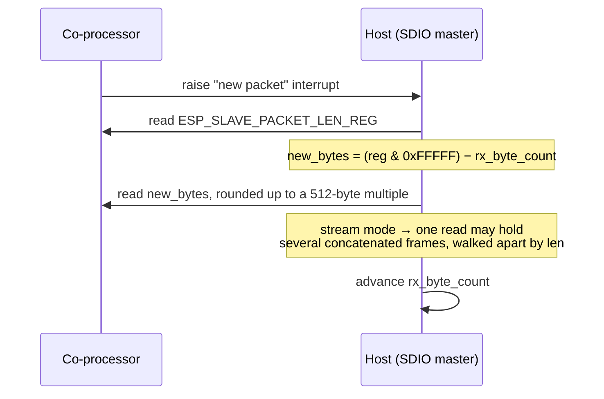
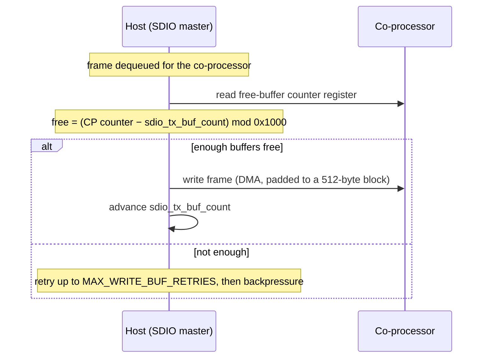

# SDIO Design

[Home](../../README.md) · [Getting Started: Linux](../getting-started-linux.md) · [Getting Started: MCU](../getting-started-mcu.md) · [Troubleshooting](../troubleshooting.md)

SDIO is the highest-throughput ESP-Hosted transport. It runs the standard SDMMC hardware protocol with SDIO commands; this page covers the wire-level protocol Hosted layers on top. For pin maps, OS configuration, and the verify step, see Getting Started: [Linux](../getting-started-linux.md#1-sdio) or [MCU](../getting-started-mcu.md#1-sdio).

---

## How the protocol works

SDIO runs the SDMMC hardware protocol with SDIO commands. The transport moves ESP-Hosted frames using a few load-bearing constants (`host/linux/eh_host_linux_kmod/driver/src/priv_include/esp_sdio_decl.h`, `common/eh_common/include/eh_common_interface.h`):

- **Block size = 512 bytes.** All DMA transfers are rounded **up to the nearest 512-byte block** (`data_left = ((len + 511) / 512) * 512`).
- **RX buffer / max frame = 1536 bytes** (smaller than SPI's 1600, chosen for block alignment).

Both directions are credit/length driven off co-processor registers — reads on `ESP_SLAVE_PACKET_LEN_REG`, writes gated by the co-processor's free-buffer counter.

### Co-processor → host (RX)

The co-processor exposes a **packet-length register** (`ESP_SLAVE_PACKET_LEN_REG`). The host reads it, masks with `0xFFFFF`, and subtracts a running `rx_byte_count` (which rolls over at `0x100000`) to learn how many new bytes are waiting.

**Stream mode** (default) lets a single SDIO read carry **multiple frames concatenated**; the host walks them apart by each frame's header `len`. It is advertised to the host in the init handshake via the `SDIO_MODE` TLV (`0x18`), set from `CONFIG_EH_TRANSPORT_CP_SDIO_STREAMING_MODE`. Packet mode sends one frame per transfer (less host RAM, lower throughput).

### Host → co-processor (TX)

Writes are **credit-based**: the co-processor publishes a rolling free-buffer counter (upper bits of the buffer register, masked with `ESP_TX_BUFFER_MASK = 0xFFF`). The host reads it, subtracts its own running `sdio_tx_buf_count` (mod `ESP_TX_BUFFER_MAX = 0x1000`) to learn how many buffers are free, and writes only if there is room — otherwise it retries and, failing that, exerts backpressure.

### Flow control

**RX backpressure** is signalled by two SDIO host-interrupt bits — start-throttle (bit 7) and stop-throttle (bit 6) — driven by the co-processor's RX queue occupancy against the `THROTTLE_HIGH`/`THROTTLE_LOW` thresholds negotiated at handshake. **TX backpressure** falls out of the credit scheme above (no free buffers → the host holds off). See [Architecture & Protocol](../architecture.md#6-priority-queues--flow-control) for the shared framing, queues, and handshake.

Code: `coprocessor/eh_cp_transport/src/eh_cp_transport_sdio.c` (co-processor), `host/linux/eh_host_linux_kmod/` (Linux), `host/mcu/eh_host_mcu_transport/` (MCU host).

---

## See also

- [Architecture & Protocol](../architecture.md) — shared framing, queues, and the capability handshake.
- [Performance Tuning](performance.md) — SDIO clock, queue sizes, and per-chip configs.
- Wiring & bring-up: [Getting Started: Linux](../getting-started-linux.md#1-sdio) · [Getting Started: MCU](../getting-started-mcu.md#1-sdio).
