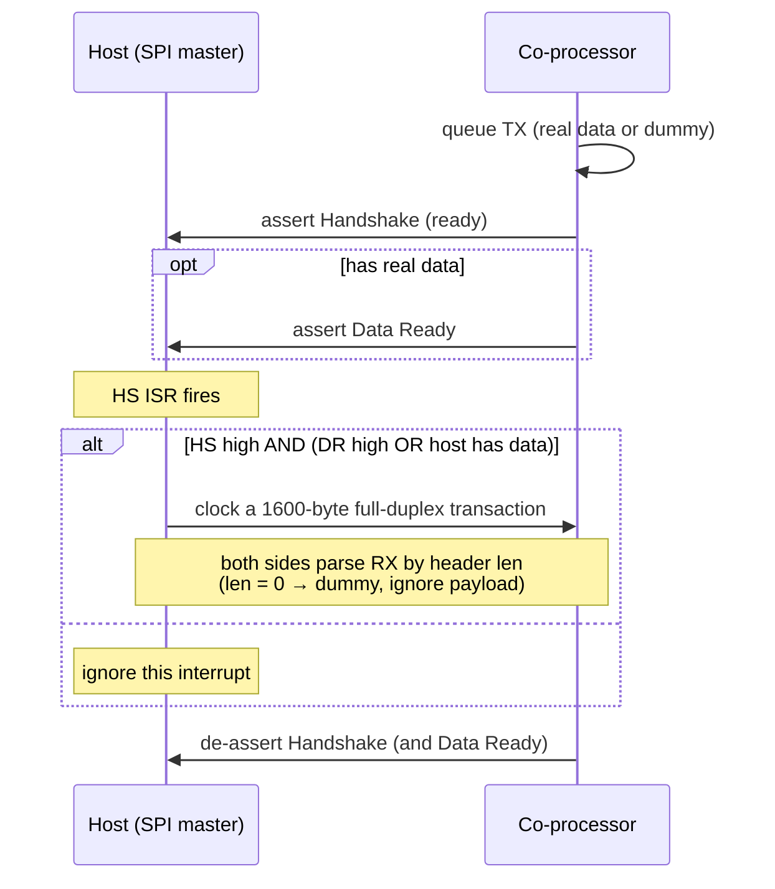

# SPI Full-Duplex Design

[Home](../../README.md) · [Getting Started: Linux](../getting-started-linux.md) · [Getting Started: MCU](../getting-started-mcu.md) · [Troubleshooting](../troubleshooting.md)

SPI Full-Duplex is the simplest, most robust ESP-Hosted transport to bring up and works over jumpers. This page covers the wire-level protocol; for pin maps, OS configuration, and the verify step, see Getting Started: [Linux](../getting-started-linux.md#2-spi-full-duplex) or [MCU](../getting-started-mcu.md#2-spi-full-duplex).

---

## How the protocol works

The host is SPI master but must not clock a transaction before the co-processor's SPI peripheral is armed. Two co-processor→host GPIOs coordinate this:

- **Handshake (HS)** — asserted (high) when the co-processor has queued a transaction and is ready to be clocked.
- **Data Ready (DR)** — asserted (high) when the co-processor additionally has *real* data to send.

Every transaction is a **fixed 1600-byte** full-duplex exchange (the max buffer size), regardless of how many payload bytes are actually valid — the real length lives in the frame's `len` header field (see [Architecture & Protocol](../architecture.md#3-on-wire-frame-format)). When the co-processor has nothing to send it still clocks out a **dummy frame** (`if_type = ESP_MAX_IF`, `if_num = 0xF`, `len = 0`) so the full-duplex exchange can carry host→co-processor data.

The host wires HS and DR as **interrupts**. It performs a transfer only when Handshake is high **and** either Data Ready is high or the host itself has data to send; otherwise it ignores the interrupt. Because SPI has no hardware error detection, keep the frame **checksum enabled** on this transport. Drain order across queued classes is strict priority (Serial > BT > others) — see [Architecture & Protocol](../architecture.md#6-priority-queues--flow-control).

Code: `coprocessor/eh_cp_transport/src/eh_cp_transport_spi.c` (co-processor), `host/mcu/eh_host_mcu_transport/` (MCU host), `common/eh_frame/` (framing + dummy frame).

---

## See also

- [Architecture & Protocol](../architecture.md) — shared framing, queues, and the capability handshake.
- [Performance Tuning](performance.md) — SPI clock, checksum, and per-chip configs.
- Wiring & bring-up: [Getting Started: Linux](../getting-started-linux.md#2-spi-full-duplex) · [Getting Started: MCU](../getting-started-mcu.md#2-spi-full-duplex).
