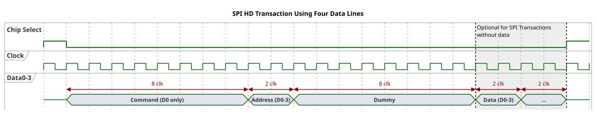
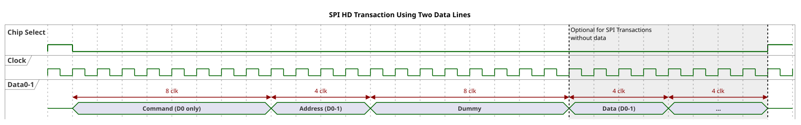
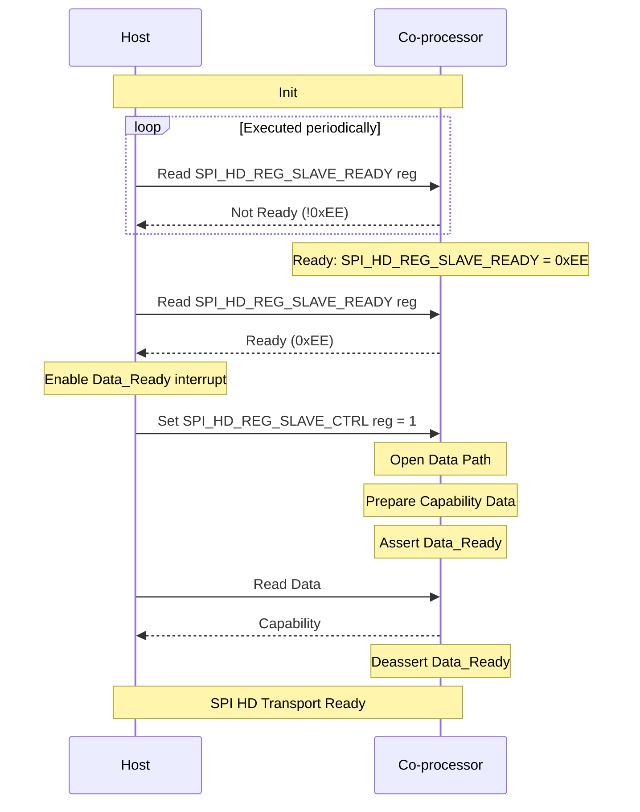
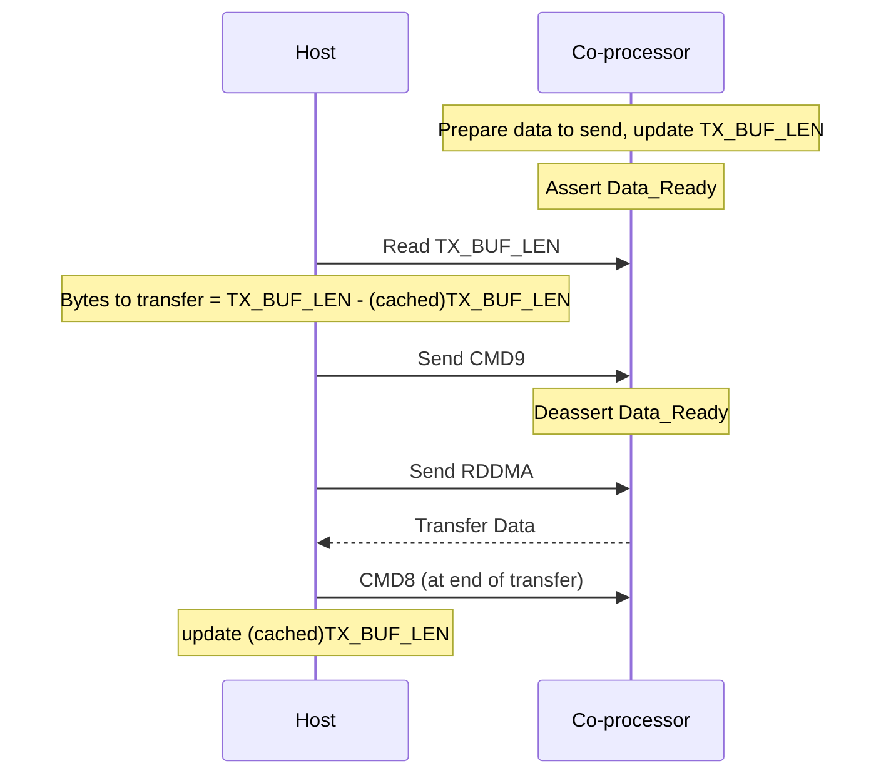
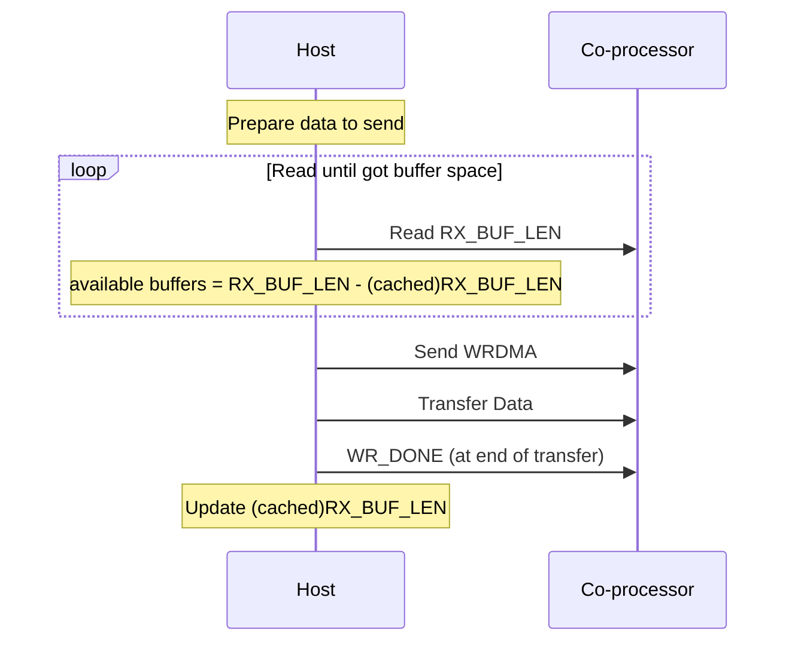

# SPI Half-Duplex Design

[Home](../../README.md) · [Getting Started: Linux](../getting-started-linux.md) · [Getting Started: MCU](../getting-started-mcu.md) · [Troubleshooting](../troubleshooting.md)

Every ESP32-family chip **except the classic ESP32** supports the SPI co-processor Half-Duplex (HD) mode protocol. In this mode SPI uses 2 or 4 data lines that transfer in one direction at a time (half duplex) within a transaction — unlike standard full-duplex SPI, which moves data both ways at once over separate MOSI/MISO lines.

> [!NOTE]
> SPI-HD is **not** supported on the classic ESP32; use SPI full-duplex there. All other chipsets support half duplex.

> [!IMPORTANT]
> SPI-HD is not an industry standard and has multiple implementations. Make sure your host processor supports the exact SPI-HD protocol implemented by the Hosted co-processor (documented below) before committing to it.

---

## Signals and data lines

SPI-HD maps the standard SPI bus signals onto directional data bits, plus two extra control GPIOs:

| SPI bus signal | SPI-HD function | Applicable |
| :---: | :---: | :---: |
| SPI_CS | Chip Select | Dual, Quad SPI |
| SPICLK | Clock | Dual, Quad SPI |
| SPID | Data Bit 0 | Dual, Quad SPI |
| SPIQ | Data Bit 1 | Dual, Quad SPI |
| SPIWP | Data Bit 2 | Quad SPI |
| SPIHD | Data Bit 3 | Quad SPI |
| Data_Ready | Extra GPIO | Dual, Quad SPI |
| Reset | Extra GPIO | Dual, Quad SPI |

- **`Data_Ready`** — co-processor → host. When asserted, the co-processor has data to send and the host should issue a read transaction.
- **`Reset`** — host → co-processor. Asserted when ESP-Hosted starts on the host, to synchronise host and co-processor state.

**Data-line count is negotiated.** Both sides may be configured for one, two, or four lines. Four lines are used only if **both** sides are set to four; if the host is set to two, only two are used even when the co-processor supports four. One-line operation must be configured on both ends to work. The bus idles (no CS, clock, or data) when neither side needs a transaction.

---

## Protocol

Hosted uses the ESP SPI co-processor HD-mode protocol (see [References](#references)) with some modifications.

### Data IO modes

Each transaction uses the **Command, Address, Dummy, and Data** phases:

- **Command**: 8 bits, 1 data line
- **Address**: 8 bits, 2 or 4 data lines
- **Dummy**: 8 bits, 1 data line
- **Data**: variable length, 2 or 4 data lines

> [!NOTE]
> The number of data lines used in the Address and Data phases is set by the *command mask* in the command byte (see below).

### Supported commands

| Command | OpCode | Purpose |
| :---: | :---: | :--- |
| WRBUF | 0x01 | Write to a 32-bit buffer register on the co-processor |
| RDBUF | 0x02 | Read from a 32-bit buffer register on the co-processor |
| WRDMA | 0x03 | Write data to the co-processor using DMA |
| RDDMA | 0x04 | Read data from the co-processor using DMA |
| WR_DONE | 0x07 | End of DMA write |
| CMD8 | 0x08 | End of DMA read |
| CMD9 | 0x09 | End of register read |

#### Command mask

Commands are OR-ed with a mask telling the co-processor how many data lines to use for the Address and Data phases:

| Mode | Mask |
| :---: | :---: |
| 2-bits | 0x50 |
| 4-bits | 0xA0 |

For example, `0x51` (2-bit mask + WRBUF) uses 2 data lines for address and data; `0xA1` (4-bit mask + WRBUF) uses 4. The mask governs line count even when four lines are wired — the host can force two lines with the `0x50` mask.

> [!WARNING]
> Applying the 4-bit mask (0xA0) when only two data lines connect host and co-processor is an error.

### Registers used

The ESP SPI co-processor HD protocol defines registers on the co-processor, used by Hosted as follows:

| Register | Name | Purpose |
| :---: | :---: | :--- |
| 0x00 | SPI_HD_REG_SLAVE_READY | Indicates whether the co-processor is ready |
| 0x04 | SPI_HD_REG_MAX_TX_BUF_LEN | Maximum length of DMA data the co-processor can transmit |
| 0x08 | SPI_HD_REG_MAX_RX_BUF_LEN | Maximum length of DMA data the co-processor can receive |
| 0x0C | SPI_HD_REG_TX_BUF_LEN | Updated whenever the co-processor wants to transmit data |
| 0x10 | SPI_HD_REG_RX_BUF_LEN | Updated whenever the co-processor can receive data |
| 0x14 | SPI_HD_REG_SLAVE_CTRL | Controls co-processor operation |

### Timing

The phase order per transaction is Command → Address → Dummy → Data. In **4-line (Quad)** mode the Address and Data phases use four lines; in **2-line (Dual)** mode they use two.

Using four data lines:

Using two data lines:

---

## Operation

### Initialization

The co-processor starts, initialises the SPI-HD transport, and when ready writes `SPI_HD_STATE_SLAVE_READY` (`0xEE`) to the `SPI_HD_REG_SLAVE_READY` register. The host starts, initialises its transport, then polls `SPI_HD_REG_SLAVE_READY` until it reads `0xEE`.

Once the co-processor is ready, the host prepares for `Data_Ready` interrupts and sets bit 0 of `SPI_HD_REG_SLAVE_CTRL` to 1, opening the data path. The first packet the co-processor sends is a **Capabilities Packet** describing what it supports (WLAN, Bluetooth, etc., and the number of SPI-HD data lines). The host uses it to learn the co-processor's capabilities.

*SPI HD Initialization Sequence*

**Number of data lines used** — after init, the host initially talks to the co-processor over two data lines. If the Capabilities Packet reports four-line support *and* the host is configured for four lines, subsequent transfers use four. Otherwise two lines are used.

### Co-processor → host transfer

The co-processor asserts `Data_Ready`. The host reads `TX_BUF_LEN`.

> [!NOTE]
> Only the low 24 bits of `SPI_HD_REG_TX_BUF_LEN` are the length (`SPI_HD_TX_BUF_LEN_MASK = 0x00FFFFFF`); mask them out to get the read length. The upper 8 bits are **flow-control interrupt bits**, not reserved: `SPI_HD_INT_START_THROTTLE (1 << 24)` and `SPI_HD_INT_STOP_THROTTLE (1 << 25)`.

The host subtracts its cached read length (initially zero) from the register value to learn how much more data the co-processor wants to send, then reads with `RDDMA`, ending with `CMD8`, and updates its cached read length. After reading `TX_BUF_LEN`, the host sends `CMD9` — telling the co-processor it is safe to update the register (if needed) and deassert `Data_Ready`.

*SPI HD Read Sequence*

### Host → co-processor transfer

The host reads `RX_BUF_LEN` to discover how many buffers are available on the co-processor (each of size `MAX_RX_BUF_LEN`). If there is not enough room, it waits and re-reads until there is. Once buffers are available, it sends data with `WRDMA`, ending each buffer transfer with `WR_DONE`.

*SPI HD Write Sequence*

---

## Implementation notes

Design aside, these are the knobs that make it run. Exact per-chip pin maps and wiring live in the SPI Half-Duplex transport guide; this section covers only what the protocol constrains.

### Enable

Select SPI-HD on both sides with `eh.py menuconfig` — host under *Component config → ESP-Hosted config → Transport layer → SPI Half-duplex*, co-processor under *Example Configuration → Bus Config → Transport layer → SPI Half-duplex* — then configure the SPI-HD parameters.

### Clock and phase

The standard SPI `CPOL` (clock polarity) and `CPHA` (clock phase) must be configured identically on host and co-processor for the protocol to work.

### Pins

Prefer the chip's dedicated `IO_MUX` SPI pins to minimise propagation delay; routing SPI signals through other GPIOs uses the GPIO matrix, which can cap the maximum usable clock frequency. `SPI_CS`, `Data_Ready`, and `Reset` can be assigned to any GPIO on both ends. The `Reset` line connects to the co-processor's `EN`/`RST` pin (or a GPIO) and is configured on the co-processor under *Example Configuration → Bus Config → SPI Half-duplex Configuration → GPIOs → Slave GPIO pin to reset itself*.

---

## Code reference

- `coprocessor/eh_cp_transport/src/eh_cp_transport_spi_hd.c` — SPI-HD driver on the co-processor.
- `coprocessor/eh_cp_transport/include/common/eh_transport_spi_hd.h` — register map, opcodes, masks, and the `SPI_HD_STATE_SLAVE_READY` / throttle-bit constants used above.
- `host/mcu/eh_host_mcu_transport/src/eh_host_bus_spi_hd.c` — SPI-HD driver on the host (issues the `RDBUF`/`WRBUF`/`RDDMA`/`WRDMA`/`WR_END`/`INT0`/`INT1` commands).

---

## References

- [ESP SPI Slave Half Duplex (HD) Mode Protocol](https://docs.espressif.com/projects/esp-idf/en/latest/esp32c6/api-reference/peripherals/spi_slave_hd.html) — the base ESP-IDF protocol this design builds on.
