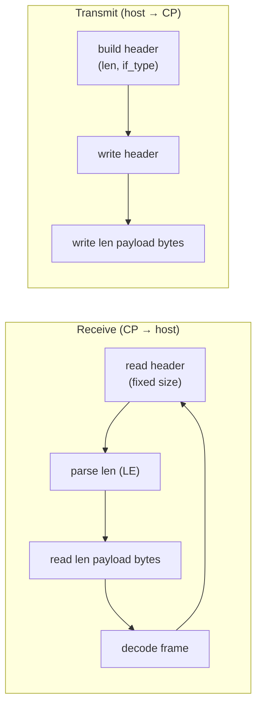

# UART Design

[Home](../../README.md) · [Getting Started: Linux](../getting-started-linux.md) · [Getting Started: MCU](../getting-started-mcu.md) · [Troubleshooting](../troubleshooting.md)

UART is the lowest-wiring-complexity ESP-Hosted transport. This page covers the wire-level protocol; for pin maps, OS configuration, and the verify step, see [Getting Started: MCU](../getting-started-mcu.md#4-uart) (on Linux, UART carries Bluetooth only — see the `+ UART` set-ups in [Getting Started: Linux](../getting-started-linux.md)).

---

## How the protocol works

UART has no handshake or data-ready GPIOs — just a byte stream, and both directions use the **same length-prefixed framing**. On **receive**, the reader takes a fixed-size frame header, reads the little-endian `len` field, then reads exactly that many payload bytes and decodes the frame. On **transmit** it is the mirror image: the sender writes the fixed header (carrying `len` and `if_type`) followed by exactly `len` payload bytes.

Over that one link, UART multiplexes **both Wi-Fi and Bluetooth** by the header `if_type` field (Bluetooth rides as *Hosted HCI*, not standard UART-HCI — so Wi-Fi and BT coexist on the same wire). Capabilities are negotiated in two tiers during the handshake: a base capability byte plus an **extended capability** that advertises "WLAN over UART". Flow control uses the V1 `throttle_cmd` header field (there are no throttle GPIOs). Evaluate at 115200 baud; the practical stable ceiling is ~921600.

> [!WARNING]
> The framing has **no delimiter, escaping, or magic-byte resync** — a single dropped byte desynchronizes the stream with no marker to recover from. Keep flow control correct and wiring clean; this is why UART is not recommended much above ~1 Mbit/s.

Code: `coprocessor/eh_cp_transport/src/eh_cp_transport_uart.c`, `common/eh_frame/`. See [Architecture & Protocol](../architecture.md#3-on-wire-frame-format) for the frame header and handshake.

---

## See also

- [Architecture & Protocol](../architecture.md) — shared framing, queues, and the capability handshake.
- [Bluetooth Design](bluetooth.md) — Hosted-HCI vs standard UART-HCI for Bluetooth.
- Wiring & bring-up: [Getting Started: MCU](../getting-started-mcu.md#4-uart).
