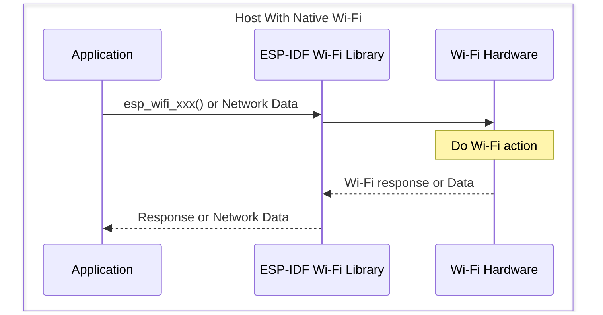
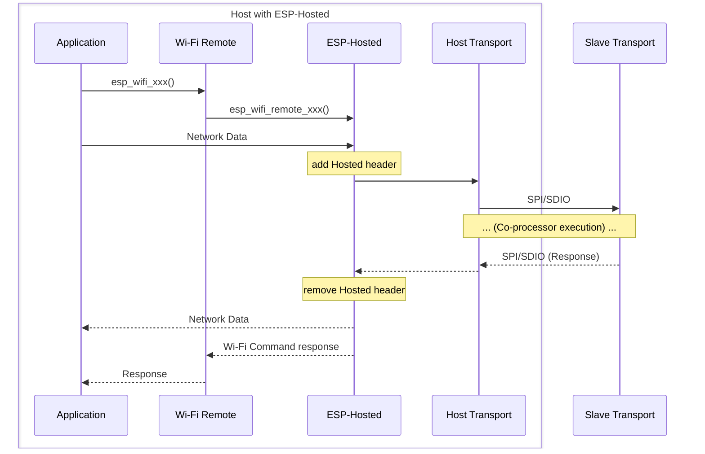
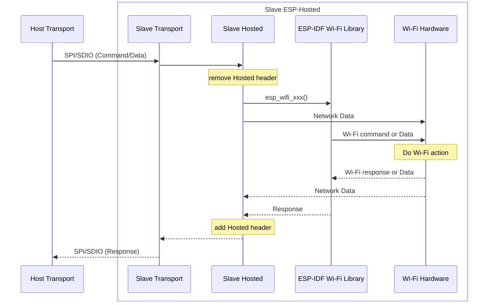

# Wi-Fi Design

[Home](../../README.md) · [Getting Started: Linux](../getting-started-linux.md) · [Getting Started: MCU](../getting-started-mcu.md) · [Troubleshooting](../troubleshooting.md)

The best way to understand hosted Wi-Fi is by contrast: look at how a Wi-Fi call runs on a chip with a *native* radio, then watch the same call travel across the transport to a co-processor and back. The application code barely changes — a thin shim turns each `esp_wifi_xxx()` call into a hosted call and returns the response as if the radio were local.

---

## Native vs hosted, at a glance

On an ESP chip with its own Wi-Fi radio, an API call or a network frame is handled entirely on-chip and the response comes straight back.

With **Wi-Fi Remote + ESP-Hosted**, the API call is converted into a *hosted call* and carried over the transport to the co-processor. The co-processor converts it back into a real Wi-Fi API call, runs it, and the response (optionally with data) is converted into a *hosted response* and sent back. On the host, the hosted response becomes a normal Wi-Fi response for the application.

> [!NOTE]
> Only **control** calls are serialized into hosted calls/responses. For **network data**, Hosted does no conversion — it only adds and removes a hosted header for transport. This keeps byte-order conversion off the data hot path.

---

## Host side: transmission and reception

The host has two lanes into the stack. Control calls enter through **Wi-Fi Remote** (`esp_wifi_remote_xxx()`); network data enters ESP-Hosted directly. Both get a hosted header added before they cross the transport, and both have it removed on the way back.

---

## Co-processor side: execution

On the co-processor, the transport hands the frame to Hosted, which strips the hosted header and routes it. Control calls become real `esp_wifi_xxx()` calls into the ESP-IDF Wi-Fi library; network data goes straight to the Wi-Fi hardware. The response follows the reverse path — a hosted header is re-added before it is transported back.

---

## Takeaways

- **The application calls Wi-Fi the way it always did.** Wi-Fi Remote is the shim that redirects `esp_wifi_xxx()` to the co-processor.
- **Control is serialized; data is only encapsulated.** That split is what keeps throughput high.
- **The co-processor runs the real ESP-IDF Wi-Fi library.** Choose a co-processor whose radio matches your needs, then a bus fast enough to carry it.
