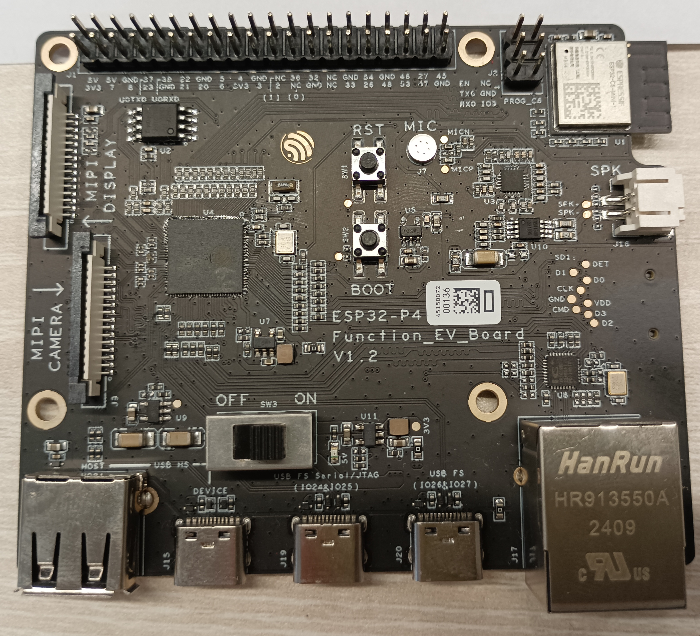
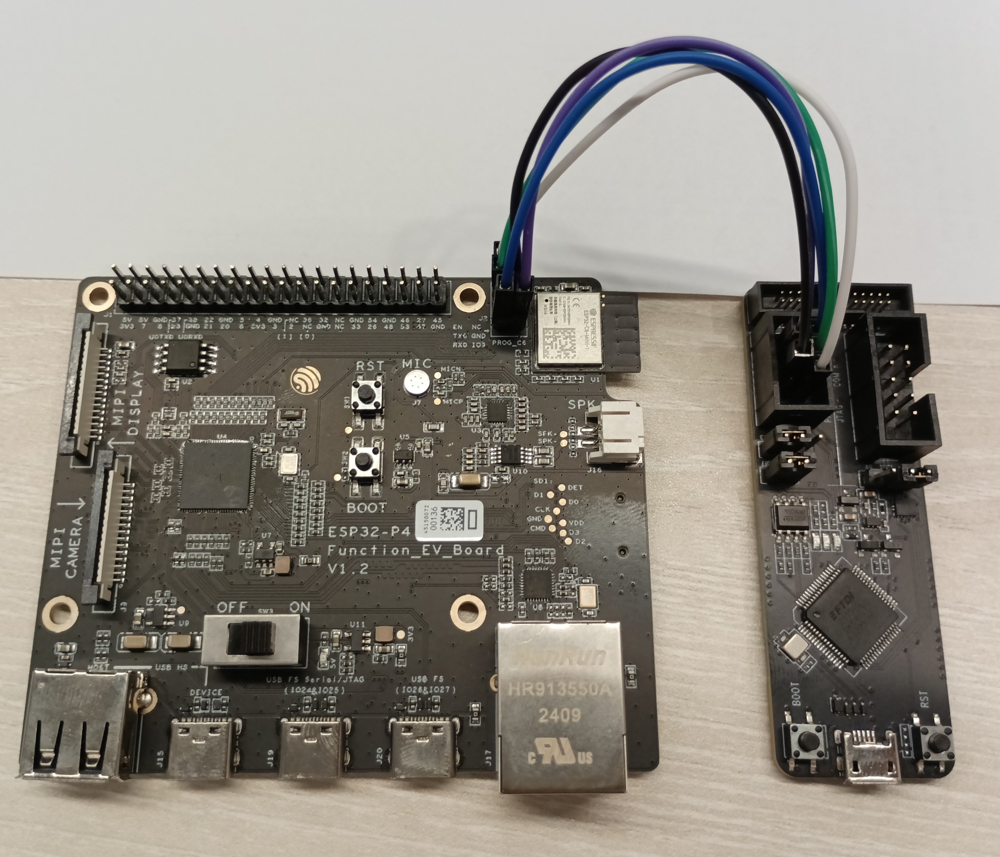

# ESP-Hosted on the ESP32-P4-Function-EV-Board DevKit

<details>
<summary>Table of Contents</summary>

- [Introduction](#1-introduction)
- [Set-Up ESP-IDF](#2-set-up-esp-idf)
- [Building Host for the P4](#3-building-host-for-the-p4)
  - [Adding Components](#31-adding-components)
  - [Configuring Defaults](#32-configuring-defaults)
  - [Building Firmware](#33-building-firmware)
- [Checking ESP-Hosted](#4-checking-esp-hosted)
- [Flashing ESP32-C6](#5-flashing-esp32-c6)
  - [Using ESP-Prog](#51-using-esp-prog)
  - [OTA Updates](#52-ota-updates)
- [Troubleshooting](#6-troubleshooting)
- [Flashing the On-board ESP32-P4 through the ESP-Prog](#7-flashing-esp32-p4)
- [Testing ESP-Hosted with SPI-FD with other MCUs](#8-testing-esp-hosted-with-spi-fd-with-other-mcus)
- [References](#9-references)

</details>

## 1. Introduction

This page documents using ESP-Hosted-MCU on the ESP32-P4-Function-EV-Board. The board comes with an on-board ESP32-C6 module, pre-flashed with ESP-Hosted-MCU slave code (v0.0.6). The board provides a Wi-Fi connection to the on-board ESP32-P4, which acts as the host.

The image below shows the board.



*ESP32-P4-Function-EV-Board*

The ESP32-P4 communicates with the ESP32-C6 module using SDIO.

## 2. Set-Up ESP-IDF

As you have reached here, it is highly likely that you have already setup ESP-IDF.

If not done, Please set up ESP-IDF:

#### Option 1: Installer Way

- **Windows**
  - Install and setup ESP-IDF on Windows as documented in the [Standard Setup of Toolchain for Windows](https://docs.espressif.com/projects/esp-idf/en/latest/esp32/get-started/windows-setup.html).
  - Use the ESP-IDF [Powershell Command Prompt](https://docs.espressif.com/projects/esp-idf/en/latest/esp32/get-started/windows-setup.html#using-the-command-prompt) for subsequent commands.

- **Linux or MacOS**
  - For bash:
    ```bash
    bash docs/setup_esp_idf__latest_stable__linux_macos.sh
    ```
  - For fish:
    ```fish
    fish docs/setup_esp_idf__latest_stable__linux_macos.fish
    ```

#### Option 2: Manual Way

Please follow the [ESP-IDF Get Started Guide](https://docs.espressif.com/projects/esp-idf/en/latest/esp32/get-started/index.html) for manual installation.

## 3. Building Host for the P4

### 3.1. Adding Components

Add `esp_wifi_remote` and `esp_hosted` components to the project:

```
idf.py add-dependency "espressif/esp_wifi_remote"
idf.py add-dependency "espressif/esp_hosted"
```

Remove 'esp-extconn' if present in `main/idf_component.yml`, as esp-extconn and esp-hosted cannot work together.
Open the `main/idf_component.yml` file and remove/comment the following block if present:

```
# ------- Delete or comment this block ---------
espressif/esp-extconn:
  version: "~0.1.0"
  rules:
    - if: "target in [esp32p4]"
# -----------------------------------
```

It is always good to use `esp_wifi_remote` as it provides all the Wi-Fi config and a wrapper abstraction layer.
But you can also evaluate without using it.

### 3.2. Configuring Defaults

Edit the `sdkconfig.defaults.esp32p4` file such that, it would have following content:

```
#### Comment below two lines if present:
# CONFIG_ESP_HOST_WIFI_ENABLED=y
# CONFIG_PARTITION_TABLE_SINGLE_APP_LARGE=y

#### Add Wi-Fi Remote config for better performance:
CONFIG_ESP_WIFI_STATIC_RX_BUFFER_NUM=16
CONFIG_ESP_WIFI_DYNAMIC_RX_BUFFER_NUM=64
CONFIG_ESP_WIFI_DYNAMIC_TX_BUFFER_NUM=64
CONFIG_ESP_WIFI_AMPDU_TX_ENABLED=y
CONFIG_ESP_WIFI_TX_BA_WIN=32
CONFIG_ESP_WIFI_AMPDU_RX_ENABLED=y
CONFIG_ESP_WIFI_RX_BA_WIN=32

CONFIG_LWIP_TCP_SND_BUF_DEFAULT=65534
CONFIG_LWIP_TCP_WND_DEFAULT=65534
CONFIG_LWIP_TCP_RECVMBOX_SIZE=64
CONFIG_LWIP_UDP_RECVMBOX_SIZE=64
CONFIG_LWIP_TCPIP_RECVMBOX_SIZE=64

CONFIG_LWIP_TCP_SACK_OUT=y
```

### 3.3. Building Firmware

Set the ESP32-P4 as the target, build, flash the firmware and
(optionally) monitor ESP32-P4 console output:

```sh
idf.py set-target esp32p4
idf.py build
idf.py -p <Serial Port> flash monitor
```

## 4. Checking ESP-Hosted

When the P4 is running with Hosted, you should see console output similar to this after start-up:

```
I (498) H_API: esp_wifi_remote_init
I (498) transport: Attempt connection with slave: retry[0]
I (498) transport: Reset slave using GPIO[54]
I (498) os_wrapper_esp: GPIO [54] configured
I (508) gpio: GPIO[54]| InputEn: 0| OutputEn: 1| OpenDrain: 0| Pullup: 0| Pulldown: 0| Intr:0
I (1678) sdio_wrapper: SDIO master: Data-Lines: 4-bit Freq(KHz)[40000 KHz]
I (1678) sdio_wrapper: GPIOs: CLK[18] CMD[19] D0[14] D1[15] D2[16] D3[17] Slave_Reset[54]
I (1678) H_SDIO_DRV: Starting SDIO process rx task
I (1678) sdio_wrapper: Queues: Tx[20] Rx[20] SDIO-Rx-Mode[3]
I (1718) gpio: GPIO[15]| InputEn: 0| OutputEn: 0| OpenDrain: 0| Pullup: 1| Pulldown: 0| Intr:0
I (1718) gpio: GPIO[17]| InputEn: 0| OutputEn: 0| OpenDrain: 0| Pullup: 1| Pulldown: 0| Intr:0
Name:
Type: SDIO
Speed: 40.00 MHz (limit: 40.00 MHz)
Size: 0MB
CSD: ver=1, sector_size=0, capacity=0 read_bl_len=0
SCR: sd_spec=0, bus_width=0
TUPLE: DEVICE, size: 3: D9 01 FF
TUPLE: MANFID, size: 4
  MANF: 0092, CARD: 6666
TUPLE: FUNCID, size: 2: 0C 00
TUPLE: FUNCE, size: 4: 00 00 02 32
TUPLE: CONFIG, size: 5: 01 01 00 02 07
TUPLE: CFTABLE_ENTRY, size: 8
  INDX: C1, Intface: 1, Default: 1, Conf-Entry-Num: 1
  IF: 41
  FS: 30, misc: 0, mem_space: 1, irq: 1, io_space: 0, timing: 0, power: 0
  IR: 30, mask: 1,   IRQ: FF FF
  LEN: FFFF
TUPLE: END
I (1768) sdio_wrapper: Function 0 Blocksize: 512
I (1778) sdio_wrapper: Function 1 Blocksize: 512
I (1778) H_SDIO_DRV: SDIO Host operating in PACKET MODE
I (1788) H_SDIO_DRV: generate slave intr
I (1798) transport: Received INIT event from ESP32 peripheral
I (1798) transport: EVENT: 12
I (1798) transport: EVENT: 11
I (1808) transport: capabilities: 0xd
I (1808) transport: Features supported are:
I (1818) transport:      * WLAN
I (1818) transport:        - HCI over SDIO
I (1818) transport:        - BLE only
I (1828) transport: EVENT: 13
I (1828) transport: ESP board type is : 13

I (1838) transport: Base transport is set-up

I (1838) transport: Slave chip Id[12]
I (1848) hci_stub_drv: Host BT Support: Disabled
I (1848) H_SDIO_DRV: Received INIT event
I (1868) rpc_wrap: Received Slave ESP Init
```

## 5. Flashing ESP32-C6
ESP32-C6 flashing is totally **optional**, as C6 is expected to be pre-flashed with ESP-Hosted slave firmware, 0.0.6. If you wish to get updated ESP-Hosted slave firmware, you can flash it using two ways, Either with ESP-Prog on ESP32-C6, or using OTA update configured using web server.

### 5.1 OTA Updates

To update the ESP32-C6 slave module using Over-The-Air (OTA) updates, follow these steps:

1. Build the ESP-Hosted slave firmware for the ESP32-C6 module:

```
idf.py create-project-from-example "espressif/esp_hosted:slave"
```

2. Set the target and start `Menuconfig`:

```sh
idf.py set-target esp32c6
idf.py menuconfig
```

3. Under **Example Configuration**, ensure that the Hosted transport
   selected is `SDIO`.

4. Build the firmware:

```sh
idf.py build
```

5. Upload the firmware (the build/network_adapter.bin file) to a server or a local directory accessible via HTTP.

6. On the ESP32-P4 host, add the following code to your application to initiate the OTA update:

```
#include "esp_hosted.h"

esp_err_t esp_hosted_ota_start(const char *url);
```

7. Call the `esp_hosted_ota_start` function with the URL of the firmware binary:

```
esp_err_t err = esp_hosted_ota_start("http://example.com/path/to/network_adapter.bin");
if (err != ESP_OK) {
    ESP_LOGE(TAG, "Failed to start OTA update: %s", esp_err_to_name(err));
}
```

8. Monitor the console output to see the OTA update progress.

### 5.2 Using ESP-Prog

> [!NOTE]
> ESP-Prog is only required if you want to flash firmware to the
> ESP32-C6 module using the standard ESP Tools.

This step is optional, as C6 is expected to be pre-flashed with ESP-Hosted slave firmware, 0.0.6.

The image below shows the board with an ESP-Prog connected to the
header to communicate with the on-board ESP32-C6..



*ESP32-P4-Function-EV-Board with ESP-Prog Connected to ESP32-C6*

If you need to update the ESP-Hosted slave firmware on the on-board
ESP32-C6 module using ESP-Prog, follow these steps:

1. Check out the ESP-Hosted slave example project:

```
idf.py create-project-from-example "espressif/esp_hosted:slave"
```

2. Set the target and start `Menuconfig`:

```sh
idf.py set-target esp32c6
idf.py menuconfig
```

3. Under **Example Configuration**, ensure that the Hosted transport
   selected is `SDIO`.

4. Build the firmware:

```sh
idf.py build
```

5. Connect the Program Header on the ESP-Prog to the `PROG_C6` header
   on the board. The connections are as follows:

| ESP-Prog | PROG_C6 | Notes          |
| ---      | ---     | ---            |
| ESP\_EN  | EN      |                |
| ESP\_TXD | TXD     |                |
| ESP\_RXD | RXD     |                |
| VDD      | -       | Do not connect |
| GND      | GND     |                |
| ESP\_IO0 | IO0     |                |


6. Flashing the firmware

The on-board ESP32-P4 controls the reset signal for the ESP32-C6. To
prevent the P4 interfering with the C6 while flashing (by asserting
the C6 Reset signal during the firmware download), set the P4 into
Bootloader mode before flashing the firmware to the C6:

###### Manual Way
    1. hold down the `BOOT` button on the board
    2. press and release the `RST` button on the board
    3. release the `BOOT` button

###### Script Way

```sh
esptool.py -p <host_serial_port> --before default_reset --after no_reset run
```

You can now flash the firmware to the C6 (and monitor the console
output):

```sh
idf.py -p <Serial Port> flash monitor
```

## 6. Troubleshooting

If you encounter issues with using ESP-Hosted, see the following guide:

- [Troubleshooting Guide](troubleshooting.md)

<details>
<summary>Flashing the On-board ESP32-P4 through the Serial Interface</summary>

## 7. Flashing the On-board ESP32-P4 through the ESP-Prog

The USB connector on the board is the standard method for flashing the
firmware to the P4. An alternative method is to flash the P4 through
its serial interface using a ESP-Prog.

The image below shows the connection between the ESP-Prog and the
serial port pins on the P4 header for programming.


*ESP32-P4 Serial Connection with ESP-Prog*

The connection between the ESP-Prog and the P4 header is as follows:

| ESP-Prog | P4 Header       |
| ---      | ---             |
| ESP\_TXD | U0TXD (GPIO 37) |
| ESP\_RXD | U0RXD (GPIO 38) |
| GND      | GND             |

Leave the other ESP-Prog connected unconnected.

To flash the P4:

1. hold down the `BOOT` button on the board
2. press and release the `RST` button on the board
3. release the `BOOT` button

You can now flash the firmware (and monitor the console output):

```sh
idf.py -p <Serial Port> flash monitor
```

To restart the P4 after flashing, press and release the `RST` button
on the board.

</details>

## 8. Testing ESP-Hosted with SPI-FD with other MCUs

You can use SPI-FD (Full Duplex) on the ESP32-P4 to test ESP-Hosted with other ESP32s. Do this by connecting the ESP32 to the P4 through the J1 GPIO header on the ESP32-P4 DevKit.

Use GPIOs 36 or lower on the P4 DevKit to avoid LDO power issues with high numbered GPIOs. Here is one combination on GPIOs that can be used on the P4:

| Function   | GPIO |
|------------|------|
| MOSI       | 4    |
| MISO       | 5    |
| CLK        | 26   |
| CS         | 6    |
| Handshake  | 20   |
| Data Ready | 36   |
| Reset      | 2    |

## 9. References

- ESP32-P4-Function-EV-Board: https://docs.espressif.com/projects/esp-dev-kits/en/latest/esp32p4/esp32-p4-function-ev-board/
- ESP-Prog: https://docs.espressif.com/projects/esp-iot-solution/en/latest/hw-reference/ESP-Prog_guide.html
- `esp_wifi_remote` component: https://components.espressif.com/components/espressif/esp_wifi_remote/
- `esp_hosted` component: https://components.espressif.com/components/espressif/esp_hosted/
