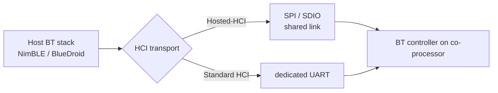

# Bluetooth

[Home](../../README.md) · [Getting Started: Linux](../getting-started-linux.md) · [Getting Started: MCU](../getting-started-mcu.md) · [Troubleshooting](../troubleshooting.md)

The host runs the Bluetooth application and host stack; the co-processor runs the Bluetooth controller and radio. ESP-Hosted carries HCI packets between them, so it is stack-agnostic — bring your own stack if you prefer.

---

## Host support

| Linux host | MCU host |
| :---: | :---: |
| Yes | Yes |

Bluetooth/BLE works on **both** hosts — the integration differs:

- **Linux host** — the ESP-Hosted kernel module presents a standard HCI interface to the Linux Bluetooth subsystem, so you run your normal host stack (e.g. **BlueZ**) directly on it. HCI rides the same SDIO/SPI transport as Wi-Fi. **You do not need the ESP-Hosted Bluetooth examples on Linux** — those target MCU/ESP-IDF hosts.
- **MCU host** — the host firmware runs a BT host stack (NimBLE or BlueDroid) and ESP-Hosted carries HCI to the controller. That path is covered in the rest of this page.

> [!NOTE]
> Classic Bluetooth requires an **ESP32** as the co-processor. All other ESP chips provide **BLE only**. On an MCU host with an ESP32 co-processor, the host stack must also be Bluetooth v4.2.

---

## Linux host: use BlueZ directly

Once the transport is up on Linux (see [Getting Started: Linux](../getting-started-linux.md) and your bus page), the kernel module exposes a standard HCI device to the Linux Bluetooth stack. From there, Bluetooth is managed with the ordinary BlueZ tooling — nothing ESP-Hosted-specific:

```sh
hciconfig hci0 up      # bring the HCI interface up
bluetoothctl           # scan, pair, connect as usual
```

Because the kernel presents a normal HCI interface, existing BlueZ applications work unchanged. The ESP-Hosted Bluetooth examples are **not** used on Linux — they exist for MCU/ESP-IDF hosts that must supply their own host stack.

---

## MCU host: choose stack and HCI transport

**Host stack — NimBLE vs BlueDroid:**

- **NimBLE** (`esp-nimble`) — BLE only. Smaller code and RAM footprint; recommended for BLE-only use cases.
- **BlueDroid** (`esp-bluedroid`) — Classic BT **and** BLE. Use this when you need Classic Bluetooth.

**HCI transport — Hosted-HCI vs standard UART-HCI:**

| | Hosted-HCI | Standard HCI (UART) |
| :--- | :--- | :--- |
| Wiring | Reuses the existing SPI/SDIO transport | Needs a **dedicated UART** + extra GPIOs |
| Multiplexing | Shares the link with Wi-Fi and other traffic | Dedicated link, BT only |
| Overhead | Adds an ESP-Hosted header to each HCI frame | Transparent — raw HCI, no extra bytes |
| Best for | Easiest setup once a transport exists | Portability; swap in any HCI controller |

> [!NOTE]
> Hosted-HCI and standard HCI are mutually exclusive — enabling one requires disabling the other.



---

## Enable / disable

Pick the HCI transport in `menuconfig`. **Hosted-HCI** (the default, over the existing SPI/SDIO link) needs no BT-specific menuconfig; for **standard HCI over UART**, set the controller HCI mode to `UART(H4)` on the co-processor:

```text
Co-processor (standard HCI over UART):
Component config
└── Bluetooth
     └── Controller Options
          └── HCI mode
               └── (X) UART(H4)                              <------- Enable this
Example Configuration
└── HCI UART Settings                                             (set UART Tx/Rx/flow pins)
```

Hosted-HCI and standard UART-HCI are mutually exclusive — enabling one disables the other. Make sure any UART GPIOs do not clash with the ESP-Hosted transport pins.

The BT controller on the co-processor is **disabled by default** (since ESP-Hosted-MCU v2.5.2) so you can set the BT MAC first. Typical bring-up:

1. `esp_hosted_connect_to_slave()` — initialise the transport.
2. (Optional) `esp_hosted_iface_mac_addr_get()` / `esp_hosted_iface_mac_addr_set()` — read/set the BT MAC (temporary until reset).
3. `esp_hosted_bt_controller_init()` then `esp_hosted_bt_controller_enable()`.
4. Initialise your BT host stack (NimBLE or BlueDroid).

**To disable / tear down:** deinit the host stack, then call `esp_hosted_bt_controller_disable()` and `esp_hosted_bt_controller_deinit()` (simply not initialising the controller leaves BT off).

---

## Start here

- **Linux host** — no ESP-Hosted BT example needed. Bring up the transport via [Getting Started: Linux](../getting-started-linux.md), then use BlueZ (`bluetoothctl`) directly.
- **MCU host** — [Bluetooth Examples](../../examples/bluetooth/README.md): NimBLE and BlueDroid samples over Hosted-HCI and UART.

---

## See also

- [Bluetooth Design](../design/bluetooth.md) — HCI init / send / receive flows for both stacks.
- [Supported co-processors](../getting-started-mcu.md#supported-esp-co-processors) — which chip gives Classic BT vs BLE.
- [Getting Started: MCU](../getting-started-mcu.md)
