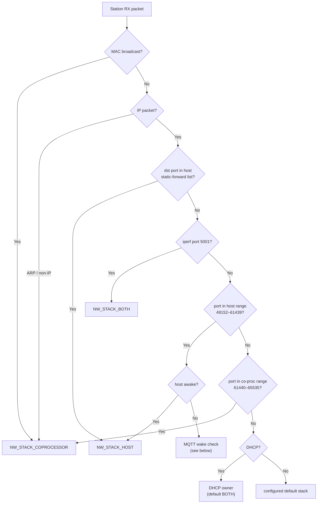
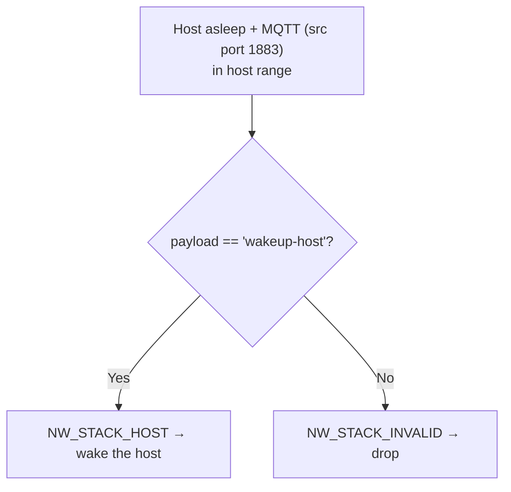

# Network Split

[Home](../../README.md) · [Getting Started: Linux](../getting-started-linux.md) · [Getting Started: MCU](../getting-started-mcu.md) · [Troubleshooting](../troubleshooting.md)

Network Split lets the host and the co-processor **share one IP address** and divide incoming traffic between their two LWIP stacks by port. It shines when the host sleeps: the co-processor keeps selected network activity (MQTT, DNS, …) alive and wakes the host only when a packet actually needs it. It pairs directly with [Host Power Save](power-save.md).

---

## Host support

| Linux host | MCU host | Capability bit |
| :---: | :---: | :--- |
| Yes | Yes | `ESP_EXT_CAP_NW_SPLIT` (`1 << 11`) in `ext_cap` |

The feature depends on Wi-Fi + LWIP being present on the co-processor (`ESP_HOSTED_CP_FEAT_NW_SPLIT_READY` requires `ESP_HOSTED_CP_FEAT_WIFI_READY`, `LWIP_ENABLE`, and `ESP_NETIF_TCPIP_LWIP`).

---

## How it works

Every station-RX packet is inspected on the co-processor before it is handed up. The Wi-Fi RX callback `eh_cp_feat_nw_split_wlan_sta_rx_callback()` calls the classifier `eh_cp_feat_nw_split_filter_packet()`, which returns which stack should receive it:

```c
// coprocessor/features/eh_cp_feat_nw_split/include/eh_cp_feat_nw_split.h
typedef enum {
    NW_STACK_COPROCESSOR,   // 0  → co-processor (ESP) LWIP stack
    NW_STACK_HOST,          // 1  → host LWIP stack
    NW_STACK_BOTH,          // 2  → both stacks
    NW_STACK_INVALID        // 3  → drop
} eh_cp_feat_nw_split_nw_stack_e;
```

### Routing decision



The port-range test macros (`IS_LOCAL_TCP_PORT` / `IS_REMOTE_TCP_PORT`, and the UDP equivalents) live in `coprocessor/features/eh_cp_feat_nw_split/eh_cp_feat_nw_split_lwip_hook.h`.

### Wake-on-MQTT

When the host is power-saving and an MQTT packet (source port `1883`) arrives destined for the host range, the co-processor peeks the payload:



The trigger string is `WAKEUP_HOST_STRING "wakeup-host"` and the detector is `host_mqtt_wakeup_triggered()` — both in `coprocessor/features/eh_cp_feat_nw_split/src/eh_cp_feat_nw_split.c`. Any other host-bound packet arriving while the host sleeps is dropped rather than buffered.

---

## Defaults (this repo)

| Setting | Kconfig symbol | Default |
| :--- | :--- | :--- |
| Host (remote) port range | `LWIP_TCP/UDP_REMOTE_PORT_RANGE_*` | `49152`–`61439` |
| Co-processor (local) port range | `LWIP_TCP/UDP_LOCAL_PORT_RANGE_*` | `61440`–`65535` |
| Host static-forward TCP dst ports | `ESP_HOSTED_HOST_TCP_DST_PORTS` | `"22,8554"` (SSH + RTSP) |
| Host static-forward UDP dst ports | `ESP_HOSTED_HOST_UDP_DST_PORTS` | `""` (empty) |
| Default stack for unmatched traffic | `ESP_HOSTED_DEFAULT_NETWORK_STACK_{COPROCESSOR,HOST,BOTH}` | project choice |
| DHCP owner | `ESP_HOSTED_DEFAULT_NETWORK_STACK_DHCP_{…}` | `BOTH` |

> [!TIP]
> The host and co-processor port ranges must match exactly and must not overlap. Static-forward entries override the ranges. (Note: this repo's static-forward default is a minimal `22,8554` — set the ports your application actually needs.)

---

## Enable / disable

Enable **Network Split** on both sides in `eh.py menuconfig`, then bring the link up. With auto-init (`…_AUTO_INIT`) the router starts as part of `esp_hosted_init()`.

```text
Host:
Component config
└── ESP-Hosted config
     └── [*] Enable Network Split            (ESP_HOSTED_HOST_FEAT_NW_SPLIT)
          └── LWIP port config                    (Host / co-processor ranges)

Co-processor:
Example Configuration
└── [*] Enable Network Split            (ESP_HOSTED_CP_FEAT_NW_SPLIT)
     └── Network Split Configuration                        ⎫
          ├── Host Static Port Forwarding (TCP / UDP lists) │
          ├── Port Ranges (Host 49152–61439 / CP 61440–65535)⎬ (Optionally change)
          └── Default / DHCP stack: coprocessor / host / both⎭
```

Debug logging: `esp_log_level_set` on the network-split tag raises verbosity of the routing decisions.

---

## Start here

- [Network Split Station](../../examples/network_split/station/README.md) — shared-IP split with a running station.

---

## Code reference

- `coprocessor/features/eh_cp_feat_nw_split/src/eh_cp_feat_nw_split.c` — classifier, RX callback, MQTT wake detector.
- `coprocessor/features/eh_cp_feat_nw_split/include/eh_cp_feat_nw_split.h` — the `eh_cp_feat_nw_split_nw_stack_e` enum + API.
- `coprocessor/features/eh_cp_feat_nw_split/eh_cp_feat_nw_split_lwip_hook.h` — port-range test macros.
- `host/features/eh_host_feat_nw_split/` — host-side counterpart.

---

## See also

- [Host Power Save](power-save.md) — Network Split is what keeps the link alive while the host sleeps.
- [Architecture & Protocol](../architecture.md) · [Wi-Fi](wifi.md) · [Getting Started: MCU](../getting-started-mcu.md)
