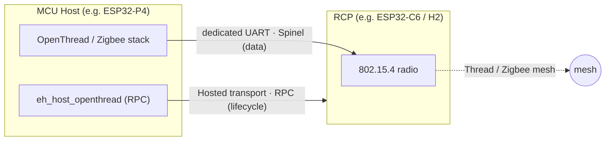
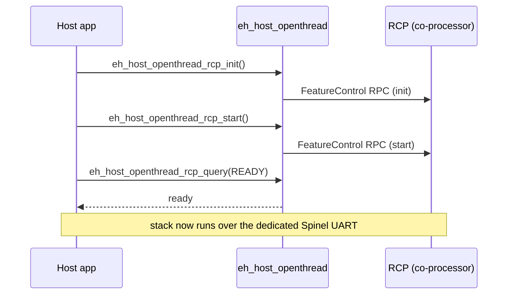

# OpenThread / Zigbee

[Home](../../README.md) · [Getting Started: Linux](../getting-started-linux.md) · [Getting Started: MCU](../getting-started-mcu.md) · [Troubleshooting](../troubleshooting.md)

The MCU host runs the full 802.15.4 stack (OpenThread, or Zigbee), while a separate ESP chip acts as the **Radio Co-Processor (RCP)**. Your host application drives the mesh; the RCP just provides the radio. Both stacks share the same RCP mechanism.

---

## Host support

| Linux host | MCU host | Capability bit |
| :---: | :---: | :--- |
| No | Yes | `ESP_EXT_CAP_OT` (`1 << 6`) in `ext_cap` |

---

## How it works — two links

Unlike Wi-Fi and Bluetooth (which ride the main SPI/SDIO ESP-Hosted transport), 802.15.4 uses **two separate links**:

- **RCP lifecycle / control** rides the shared ESP-Hosted transport as **RPC** (requires RPC ext-v2 on the host).
- **802.15.4 spinel data** rides a **dedicated UART** between host and RCP. The "over Hosted transport" option exists in Kconfig but is **not implemented yet** — UART is the supported path today (and the only path for Zigbee).



### RCP lifecycle



Radio parameters (UART port, baud, pins) come from `eh_host_port_openthread_get_radio_config()`, which fills an `eh_host_port_openthread_radio_config_t` (`type = UART`, plus the UART settings).

> [!NOTE]
> The RCP must be a chip with an 802.15.4 radio (ESP32-C6, ESP32-H2, or ESP32-C5). It is a distinct device/firmware from the SPI/SDIO co-processor that carries Wi-Fi. A Thread Border Router / Zigbee Gateway needs both radios (Wi-Fi + 802.15.4) — commonly a two-co-processor setup (e.g. C6 for Wi-Fi + H2 as RCP). See [supported co-processors](../getting-started-mcu.md#supported-esp-co-processors).

---

## Enable / disable

Enable the feature on both sides, then set the dedicated-UART parameters.

```text
Host:
Component config
└── ESP-Hosted config
     └── [*] OpenThread                         (ESP_HOSTED_HOST_FEAT_OPENTHREAD, needs RPC ext-v2)
          ├── Transport → (X) UART              (ESP_HOSTED_OT_HOST_TRANSPORT_UART)
          ├── (1)  Host UART port               (ESP_HOSTED_OT_HOST_UART_PORT)
          ├── (11) Host→RCP TX pin              (ESP_HOSTED_OT_HOST_PIN_TO_RCP_TX)
          ├── (10) Host→RCP RX pin              (ESP_HOSTED_OT_HOST_PIN_TO_RCP_RX)
          └── (460800) Baud                     (ESP_HOSTED_OT_HOST_UART_BAUDRATE)

Co-processor (RCP):
Example Configuration
└── [*] OpenThread RCP                          (ESP_HOSTED_CP_FEAT_OPENTHREAD)
     ├── Transport → (X) UART                   (ESP_HOSTED_OT_TRANSPORT_UART)
     ├── (1) OT UART port                       (ESP_HOSTED_OT_UART_PORT)
     ├── per-target TX / RX pins                (ESP_HOSTED_OT_UART_PIN_TX / _RX)
     └── (460800) Baud                          (ESP_HOSTED_OT_UART_BAUDRATE)
```

The RCP firmware itself needs the ESP-IDF OpenThread radio config (`CONFIG_OPENTHREAD_ENABLED=y`, `CONFIG_OPENTHREAD_RADIO=y`, device type = Radio-only). The co-processor warns at build time if the OT UART port collides with the main Hosted UART transport port.

---

## Start here

- [OpenThread CLI](../../examples/openthread/cli/README.md) — bring up a Thread node from the interactive CLI.
- [Thread Border Router](../../examples/openthread/border_router/README.md) — Wi-Fi + 802.15.4 gateway.

---

## Code reference

- `host/features/eh_host_feat_openthread/include/eh_host_openthread.h` — `eh_host_openthread_rcp_init/start/stop/deinit/query`.
- `port/os/include/eh_host_port_openthread.h` — `eh_host_port_openthread_radio_config_t` + `…_get_radio_config()`.
- `coprocessor/features/eh_cp_feat_openthread/` — RCP feature on the co-processor.

---

## See also

- [Supported co-processors](../getting-started-mcu.md#supported-esp-co-processors) — 802.15.4-capable chips.
- [Architecture & Protocol](../architecture.md) · [Getting Started: MCU](../getting-started-mcu.md)
