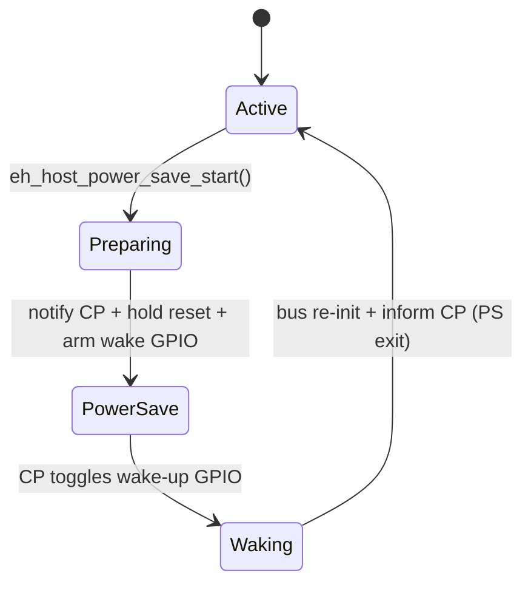
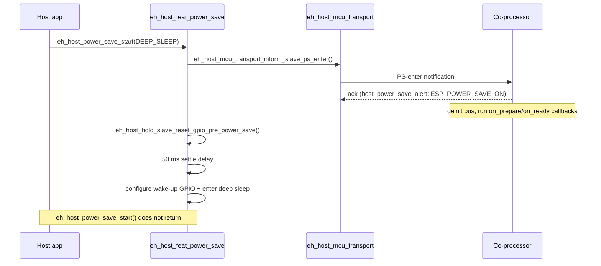
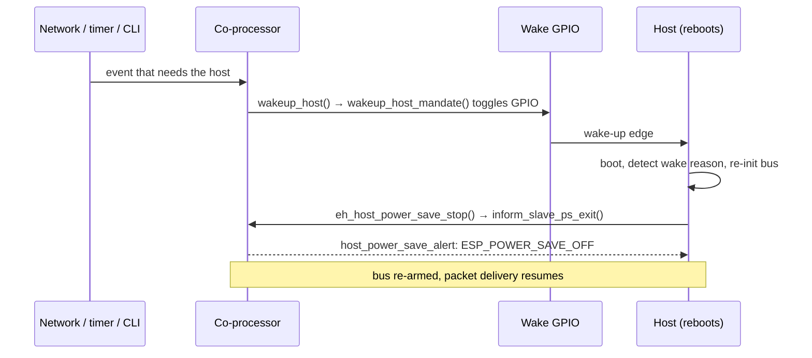

# Host Power Save

[Home](../../README.md) · [Getting Started: Linux](../getting-started-linux.md) · [Getting Started: MCU](../getting-started-mcu.md) · [Troubleshooting](../troubleshooting.md)

Host Power Save lets the host MCU drop into a low-power state while the co-processor keeps the network online. The co-processor wakes the host over a dedicated GPIO when something actually needs it — ideal for battery-powered designs. It pairs naturally with [Network Split](network-split.md), which decides *which* packets are worth a wake-up.

---

## Host support

| Linux host | MCU host | Capability bit |
| :---: | :---: | :--- |
| — | Yes | `ESP_EXT_CAP_HOST_PS` (`1 << 10`) in `ext_cap` |

**Modes** (`eh_host_power_save_type_t`): `EH_HOST_POWER_SAVE_TYPE_DEEP_SLEEP` is available today; `…_LIGHT_SLEEP` is defined but `eh_host_power_save_start()` currently accepts deep sleep only.

---

## State model



In **deep sleep** the host actually reboots on wake, so "Waking → Active" runs through `app_main()` again — the code checks the wake reason to know it resumed from power save rather than a cold boot.

---

## Entry handshake (host → sleep)



## Wake sequence (co-processor → host)



`wakeup_host_mandate()` keeps toggling the wake line until the host re-establishes the bus, so a single missed edge does not strand the host asleep.

---

## Enable / disable

Enable **Allow host to power save** (and deep sleep) on both sides in `eh.py menuconfig`.

```text
Host:
Component config
└── ESP-Hosted config
     └── [*] Allow host to power save          (ESP_HOSTED_HOST_FEAT_POWER_SAVE)
          └── [*] Allow host to enter deep sleep (…_DEEP_SLEEP_ALLOWED)
               ├── (<gpio>) Host in: Host Wakeup GPIO   (…_WAKEUP_GPIO)
               └── Host Wakeup GPIO Level → (X) High    (…_WAKEUP_GPIO_LEVEL, default High)

Co-processor:
Example Configuration
└── [*] Allow host to power save          (ESP_HOSTED_CP_FEAT_HOST_PS)
     └── [*] Allow host to enter deep sleep (…_DEEP_SLEEP)
          ├── (<gpio>) Slave out: Host wakeup GPIO  (…_HOST_WAKEUP_GPIO)
          └── Host Wakeup GPIO Level → (X) High     (…_HOST_WAKEUP_GPIO_LEVEL)
```

> [!NOTE]
> There are **two** wake-GPIO symbols — the co-processor output pin (`ESP_HOSTED_CP_FEAT_HOST_PS_HOST_WAKEUP_GPIO`, "Slave out") drives the host input pin (`ESP_HOSTED_HOST_FEAT_POWER_SAVE_WAKEUP_GPIO`, "Host in"). Wire them together, keep the **level** setting equal on both sides, and pick a pin that is **RTC-capable**, otherwise unused, and different from the transport bus GPIOs. The match is a wiring/config contract — there is no build-time assertion that the two pin numbers agree. Default level is High.

### Key APIs

Host (`host/features/eh_host_feat_power_save/include/eh_host_power_save.h`; `esp_hosted_power_save_*` compat aliases exist in `host/compat/`):

- `eh_host_woke_from_power_save()` — check the boot/wake reason early in `app_main()`.
- `eh_host_power_save_init()` / `eh_host_power_save_start(EH_HOST_POWER_SAVE_TYPE_DEEP_SLEEP)` (does not return) / `eh_host_power_save_stop()`.
- `eh_host_power_save_timer_start(ms)` / `eh_host_power_save_timer_stop()`.
- `eh_host_hold_slave_reset_gpio_pre_power_save()` / `eh_host_release_slave_reset_gpio_post_wakeup()`.

Co-processor (`coprocessor/features/eh_cp_feat_host_ps/include/eh_cp_feat_host_ps_apis.h`; native internals `is_host_power_saving()`, `wakeup_host()`, `wakeup_host_mandate()`, `host_power_save_alert()`):

- `eh_cp_feat_host_ps_is_host_power_saving()`, `eh_cp_feat_host_ps_wakeup_host()`, `eh_cp_feat_host_ps_handle_alert()`, `eh_cp_feat_host_ps_set_callbacks({on_prepare, on_ready, off_prepare, off_ready})`.

> [!TIP]
> With the CLI enabled, use `host-power-save` on the host prompt and `wake-up-host` on the co-processor prompt to demo the flow.

---

## Start here

- [Host Deep Sleep](../../examples/power_save/host/network_split__host_deep_sleep/README.md) — deep sleep integrated with Network Split.

---

## Code reference

- `host/features/eh_host_feat_power_save/src/eh_host_feat_power_save.c` — host entry/exit, timers, reset-GPIO hold.
- `coprocessor/features/eh_cp_feat_host_ps/src/eh_cp_feat_host_ps_internal.c` — `wakeup_host`, `wakeup_host_mandate`, `host_power_save_alert`.
- `host/mcu/eh_host_mcu_transport/` — `inform_slave_ps_enter` / `inform_slave_ps_exit` notifications.

---

## See also

- [Network Split](network-split.md) — keeps the connection alive while the host sleeps.
- [Architecture & Protocol](../architecture.md) · [GPIO Expander](gpio-expander.md) · [Getting Started: MCU](../getting-started-mcu.md)
