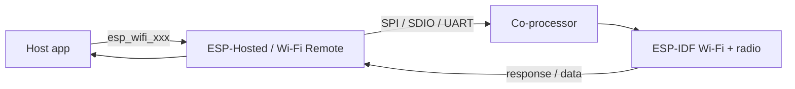

# Wi-Fi

[Home](../../README.md) · [Getting Started: Linux](../getting-started-linux.md) · [Getting Started: MCU](../getting-started-mcu.md) · [Troubleshooting](../troubleshooting.md)

Wi-Fi is the core of ESP-Hosted: the co-processor owns the radio, and your host application uses it as if the radio were local. API calls and network data travel across the transport link, so a host with no Wi-Fi hardware gains a full station and SoftAP.

---

## Host support

| Linux host | MCU host |
| :---: | :---: |
| Yes | Yes |

**Supported modes:** Station, SoftAP, AP+STA, and Scan (with connect / disconnect).

---

## How it works

A Wi-Fi API call from your application is turned into a *Hosted Call*, transported to the co-processor, and replayed there against the real ESP-IDF Wi-Fi library. The response — and any network data — is packaged as a *Hosted Response* and sent back. For plain network data, ESP-Hosted does no conversion; it just adds its transport header and forwards the frame.

> [!NOTE]
> On an MCU host the split is transparent — `esp_wifi_*()` behaves as if the radio were on-chip. On a **Linux host**, Wi-Fi control flows through the ESP-Hosted **RPC control path** from your example app; ESP-Hosted does **not** present a native `wlan0` to the kernel by default, so `wpa_supplicant` / NetworkManager are not the primary interface.

For the full call-flow and header details, see the [Wi-Fi Design](../design/wifi.md) page.

---

## Enable / disable

Wi-Fi is the primary function of ESP-Hosted and is **enabled by default** — no extra config. On an MCU host the Wi-Fi Remote layer provides the control path, so you just call the standard `esp_wifi_*()` APIs after `esp_hosted_init()`; on Linux, scan / connect / SoftAP run through the RPC calls in the `c_app` or `py_app`. There is no meaningful "off" switch — it is the core capability on most setups. The only hard requirement is a Wi-Fi-capable co-processor (C6/C5/C3/C2/S2/S3/ESP32…); chips with no Wi-Fi (H2/H4) cannot serve it — see [supported co-processors](../getting-started-mcu.md#supported-esp-co-processors).

---

## Start here

- [Wi-Fi Station](../../examples/wifi/sta/README.md) — connect to an access point; the best first example on either host.

---

## See also

- [Wi-Fi Design](../design/wifi.md) — call flow and internals.
- [Network Split](network-split.md) — keep the connection alive on the co-processor while the host sleeps.
- [Getting Started: MCU](../getting-started-mcu.md)
