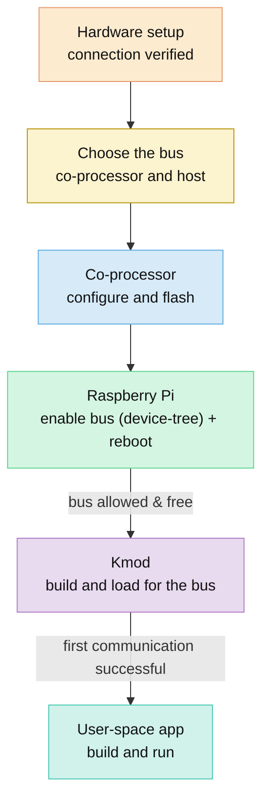

# Getting Started: Linux Host

[Home](../README.md) · **Getting Started: Linux** · [Getting Started: MCU](getting-started-mcu.md) · [Troubleshooting](troubleshooting.md)

Use this guide when your host is a Linux board (demonstrated on a Raspberry Pi) and an Espressif chip is the Wi-Fi + Bluetooth co-processor. Understand the two goals, pick a bus, then follow that bus's section top to bottom.

> [!TIP]
> **No Raspberry Pi?** It is just the demonstrated board — **most Linux platforms can host ESP-Hosted**, with some board bring-up (kernel headers, device-tree/overlay, GPIO mapping, building the module). To use another board:
> - Map the connection tables below to your board's GPIOs
> - Handle the board-specific bits via [Porting: Linux host](porting.md#linux-host-porting): the reset GPIO, enabling the bus (device-tree / overlay), and building the kernel module.
>
> The concepts, buses, and software flow are the same; only the host pins and the device-tree/overlay mechanism differ.

## Example hardware used

| Role | Chip |
| :--- | :--- |
| Host | Raspberry Pi (or any Linux platform) |
| Co-processor | ESP32-C5 or ESP32-C6 (also ESP32, C2, C3, C61, S2, S3) |
| Wi-Fi bus | SDIO (fastest) or SPI Full-Duplex (easiest) |
| Bluetooth | over the same bus, or over a dedicated UART |
| Demo example | [Wi-Fi Station](../examples/wifi/sta/README.md) |

## Supported bus combinations

| | SDIO 👍 | SDIO + UART | SPI 👍 | SPI + UART |
| :--- | :---: | :---: | :---: | :---: |
| **Wi-Fi bus** | SDIO | SDIO | SPI Full-Duplex | SPI Full-Duplex |
| **Bluetooth** | Multiplexed on SDIO | dedicated UART | Multiplexed on SPI | dedicated UART |
| **Extra BT pins** | No | +2 / +4 | No | +2 / +4 |
| **Wi-Fi throughput** | Highest | High | Good | Good |
| **Wiring** | PCB + pull-ups | PCB + pull-ups | jumpers OK | jumpers OK |
| **Best for** | Max Wi-Fi speed | Max Wi-Fi + BT | Easiest bring-up | Easy bring-up + BT |

> [!NOTE]
> 1. Dedicated UART doesn't necessarily mean better Bluetooth.
> 2. ESP has one radio, so be it multiplexed or dedicated, the radio would be serialised.
> 3. Dedicated UART is only preferred, when you need standard HCI packets on the bus directly.
> 4. In case of SDIO and SPI buses (without UART), we multiplex all traffic types including Bluetooth, on the same bus.
> 5. SDIO and SPI (without dedicated UART) give reliable and better performance than UART combined.

## Supported ESP co-processors

| Co-processor | SDIO | SDIO + UART | SPI | SPI + UART |
| :--- | :---: | :---: | :---: | :---: |
| ESP32 | `✓` | `✓` | `✓` | `✓` |
| ESP32-C2 |  |  | `✓` | `✓` |
| ESP32-C3 |  |  | `✓` | `✓` |
| ESP32-C5 | `✓` | `✓` | `✓` | `✓` |
| ESP32-C6 | `✓` | `✓` | `✓` | `✓` |
| ESP32-C61 | `✓` | `✓` | `✓` | `✓` |
| ESP32-S2 |  |  | `✓` |  |
| ESP32-S3 |  |  | `✓` | `✓` |

> [!NOTE]
> - **SDIO** is available on ESP32, ESP32-C5, ESP32-C6, and ESP32-C61 (fixed SDIO pins). A classic ESP32 may need an eFuse burn — see [Specific considerations](#11-hardware-considerations-and-connections).
> - The **+ UART** set-ups add Bluetooth over a dedicated UART. ESP32-S2 has no Bluetooth radio, so its `+ UART` set-ups are unavailable. Bluetooth can also ride the Wi-Fi bus (SDIO/SPI) instead of UART.

---

## Goals

Two things run over the bus once set-up is done — a **control path** and a **data path**. Here is what each does.

### Goal 1 — Control path

Carries commands that configure the radio: scan, connect, start a SoftAP, and every other feature call. Your app makes a normal call; ESP-Hosted turns it into an **RPC message**, sends it over the bus (via `/dev/esps0`) to the co-processor, which runs the real `esp_wifi` call and returns the result.


### Goal 2 — Data path

Carries actual network traffic. After the host associates to an access point, the co-processor bridges Wi-Fi frames to a standard Linux network interface, `ethsta0`. Your **standard TCP/IP stack** (DHCP, sockets, `ping`) runs over it — no ESP-Hosted API needed for data.


---

## Mental model

Bring the stack up in this order, and stop at the first arrow whose signal does not appear:



---

## Choosing the bus (co-processor and host)

On Linux, Wi-Fi rides **SDIO** or **SPI Full-Duplex**; Bluetooth rides the same bus or a dedicated **UART**.

| Bus | Pins (signals + Reset + GND) | Throughput | Pros | Cons |
| :--- | :--- | :--- | :--- | :--- |
| SDIO | CLK, CMD, DAT0–DAT3, Reset, GND<br>**= 8** (+ external pull-ups) | Highest | Best Wi-Fi data-plane speed | Needs a PCB + pull-ups; fixed pins |
| SPI Full-Duplex | SCLK, MOSI, MISO, CS, Handshake, Data Ready, Reset, GND<br>**= 8** | Good | Easiest, most robust; jumpers OK | Lower throughput than SDIO |
| + UART (Bluetooth) | Tx, Rx (+ CTS, RTS)<br>**= +2** (2-wire) / **+4** (4-wire) | Low | Dedicated BT/BLE link | BT only; extra pins |

Pick a set-up and jump straight to its steps:

| [1. SDIO](#1-sdio) | [2. SPI Full-Duplex](#2-spi-full-duplex) | [3. SDIO + UART](#3-base-sdio--dedicated-uart-for-bluetooth) | [4. SPI + UART](#4-base-spi--dedicated-uart-for-bluetooth) |
| :--- | :--- | :--- | :--- |
| 1. [Hardware](#11-hardware-considerations-and-connections)<br>2. [Flash CP](#12-flash-the-co-processor)<br>3. [Enable bus](#13-enable-the-sdio-bus-on-raspberry-pi)<br>4. [Load kmod](#14-build-and-load-the-kmod)<br>5. [Run & verify](#15-run-and-verify) | 1. [Hardware](#21-hardware-considerations-and-connections)<br>2. [Flash CP](#22-flash-the-co-processor)<br>3. [Enable bus](#23-enable-the-spi-bus-on-raspberry-pi)<br>4. [Load kmod](#24-build-and-load-the-kmod)<br>5. [Run & verify](#25-run-and-verify) | 1. [Hardware](#31-hardware-considerations-and-connections)<br>2. [Flash CP](#32-flash-the-co-processor)<br>3. [Enable bus](#33-enable-the-bus-and-uart-on-raspberry-pi)<br>4. [Load kmod](#34-build-and-load-the-kmod)<br>5. [Run & verify](#35-run-and-verify) | 1. [Hardware](#41-hardware-considerations-and-connections)<br>2. [Flash CP](#42-flash-the-co-processor)<br>3. [Enable bus](#43-enable-the-bus-and-uart-on-raspberry-pi)<br>4. [Load kmod](#44-build-and-load-the-kmod)<br>5. [Run & verify](#45-run-and-verify) |

---

## Set up the tools

`eh.py` is the one command that builds, configures, flashes, and runs ESP-Hosted. Install it once per checkout, and source the environment once per shell:

```sh
cd /path/to/esp_hosted
./install.sh     # or ./install.fish   (fish shell)
. ./export.sh    # or . ./export.fish  (fish shell)
```

`install.sh` sets up the toolchain and dependencies; `export.sh` puts `eh.py` on your `PATH`. See [Tools: eh.py](tools.md) for the full command reference. Work from the [Wi-Fi Station](../examples/wifi/sta/README.md) example, then follow **one** of the four set-ups below.

---

## 1. SDIO

**Raspberry Pi — SDIO — ESP co-processor.** Highest throughput; strictest hardware requirements.

### 1.1 Hardware considerations and connections

Hardware considerations — SDIO:

- **Fixed pins.** SDIO uses **fixed** pins on both ends — the Raspberry Pi SDIO controller and the co-processor (ESP32 / ESP32-C5 / ESP32-C6 / ESP32-C61 have fixed SDIO GPIOs). Wire exactly as shown; the pins are not reassignable.
- **Reset signal.** Host output to the co-processor `EN`/`RST` pin (configurable GPIO), asserted at start-up to sync host and co-processor state. Co-processor menuconfig: *Example configuration → SDIO Configuration → Host SDIO GPIOs → Slave GPIO pin to reset itself*.
- **Pull-up resistors (mandatory).** External **51 kΩ** [pull-ups][pullup] on **`CMD`, `DAT0`–`DAT3`** — on all of them (also marked in the table). Select your co-processor in the linked page's chip selector.
- **Clock.** SDIO max is **50 MHz**. **Raspberry Pi 3/4** cap the actual SDIO clock at **~41.467 MHz** even when 50 MHz is requested; **Raspberry Pi 5** reaches 50 MHz. Check the achieved clock with `sudo cat /sys/kernel/debug/mmc0/ios`.
- **Voltage levels.** All signals are **3.3 V**; if using a level shifter, set its output to 3.3 V.
- **Power.** Insufficient power is a leading, frequently-overlooked cause of **non-deterministic crashes and suboptimal performance**. Get all three right:
  1. **Power adapter** — use only the **official Raspberry Pi adapter**, matched to the board's exact input rating.
  2. **Power cable** — rated to carry the expected current, for both the Raspberry Pi and the ESP; thin or long cables cause brown-outs.
  3. **ESP supply** — power the ESP from a **reliable supply** of adequate rating.
- **PCB design (production).** Length-match all SDIO signals (CLK, CMD, DAT0–3); if not perfect, prioritise matching **CLK to the data lines**. Use controlled-impedance traces, bypass capacitors near the power pins, optional series termination, and a 4-layer board with power/ground planes for high speed.

Specific considerations — SDIO:

- **SDIO 1-bit mode.** Full **4-bit** SDIO needs a **proper PCB** carrying the mandatory pull-ups — jumpers are not suitable. Only **SDIO 1-bit** mode may be prototyped on 'wire wrap' wires: all leads **equal length**, each **≤ 5 cm**; the [pull-ups][pullup] remain **mandatory**.
- **Classic ESP32 eFuse.** A **classic ESP32** co-processor will likely need a **one-time, irreversible eFuse burn** (bootstrapping-pin / `DAT2` conflict) — follow the [pull-up requirements][pullup] procedure; an incorrect burn can brick the chip. Applies to the **classic ESP32 only**, not ESP32-C2/C3/C5/C6/C61/S2/S3.

#### Connections — SDIO (Raspberry Pi ↔ co-processor)

| RPi pin (BCM) | ESP32 | ESP32-C6 | ESP32-C61 | ESP32-C5 | Function |
| :--- | :---: | :---: | :---: | :---: | :--- |
| 15 (GPIO22) | IO14 | IO19 | IO26 | IO9 | CLK |
| 16 (GPIO23) ([pull-up][pullup]) | IO15 | IO18 | IO25 | IO10 | CMD |
| 18 (GPIO24) ([pull-up][pullup]) | IO2 | IO20 | IO27 | IO8 | DAT0 |
| 22 (GPIO25) ([pull-up][pullup]) | IO4 | IO21 | IO28 | IO7 | DAT1 |
| 37 (GPIO26) ([pull-up][pullup]) | IO12 | IO22 | IO22 | IO14 | DAT2 |
| 13 (GPIO27) ([pull-up][pullup]) | IO13 | IO23 | IO23 | IO13 | DAT3 |
| 31 (GPIO6) | EN | RST | RST | RST | Reset |
| 39 (GND) | GND | GND | GND | GND | Ground |

### 1.2 Flash the co-processor

```sh
cd examples/wifi/sta/cp
eh.py set-target esp32c6
eh.py menuconfig          # Transport -> SDIO
eh.py -p <PORT> flash monitor
```

### 1.3 Enable the SDIO bus on Raspberry Pi

Enable SDIO in `/boot/firmware/config.txt`:

```ini
dtoverlay=sdio,poll_once=off
```

> [!WARNING]
> **Reboot the Raspberry Pi** after editing `config.txt` — the change only takes effect after a reboot. *(Bus allowed & free.)*

### 1.4 Build and load the kmod

Build and load in one command:

```sh
cd ../linux_802_3_host/kmod
./build.sh --bus sdio --reload --reset-gpio 518 --clock-mhz 50
```

- `--reload` — build, then unload and load the module.
- `--reset-gpio 518` — host GPIO wired to the co-processor reset (sets the `resetpin` module parameter; RPi GPIO6 = 518, pin 31).
- `--clock-mhz 50` — SDIO bus clock (sets `clockspeed`); 50 MHz max. See **Clock** in the hardware considerations for the Raspberry Pi 3/4 cap and how to check the achieved clock.
- Non-Raspberry-Pi board: prefix with `PORT=<board>`. Unload with `./unload.sh`.

**Check the bus — first communication successful.** `dmesg` should show the co-processor announce itself:

```text
$ dmesg | tail
esp_hosted: process_capabilities: ESP peripheral capabilities: 0x3d
esp_hosted: print_capabilities: Features supported are:
esp_hosted: print_capabilities:  * WLAN
esp_hosted: slave fw version: 0x00020200
esp_hosted: Slave up event processed
```

If the capabilities / **Slave up event** lines never appear, stop and fix the transport/bus before continuing.

### 1.5 Run and verify

```sh
cd ../py_app        # or ../c_app
eh.py set-target linux
eh.py build
eh.py run
```

The driver creates `ethsta0` (network interface) and `/dev/esps0` (control device). The app **only associates** to the AP over the control path — it does **not** assign an IP. To use the data path, bring the interface up, obtain an IP via DHCP, and ping:

```sh
sudo ip link set ethsta0 up
sudo dhclient ethsta0        # or: sudo udhcpc -i ethsta0
ping -I ethsta0 1.1.1.1
```

The MAC on `ethsta0` is populated only if the example has the **Wi-Fi feature enabled**.

---

## 2. SPI Full-Duplex

**Raspberry Pi — SPI Full-Duplex — ESP co-processor.** Easiest, most robust bring-up.

### 2.1 Hardware considerations and connections

Hardware considerations — SPI Full-Duplex:

- **Pins.** The Raspberry Pi uses its fixed SPI0 pins (SCLK/MOSI/MISO/CS0); `Handshake` and `Data Ready` are on the GPIOs shown (set via the load flags). On the co-processor, SPI pins are configurable — prefer `IO_MUX` pins for best performance.
- **Extra signals.** `Handshake` and `Data Ready` (co-processor → host), plus `Reset` (host → co-processor `EN`/`RST`, configurable GPIO).
- **Jumper wires.** Suitable for prototyping: high-quality, low-capacitance, **≤ 10 cm**, equal length; minimise crosstalk (especially clock/data); consider twisted pairs for clock/data; run a ground between every signal; connect as many grounds as possible.
- **Clock.** Start at a **low clock (~5 MHz)**, then raise toward the co-processor's practical max SPI-slave frequency. Intermittent errors? Lower `CLK` first — if they vanish, it is signal integrity. The Raspberry Pi rounds the SPI clock down to the nearest achievable divider, so the effective clock may be lower than requested.
- **Voltage levels.** Verify voltage compatibility between host and co-processor; use level shifters if they differ, and keep a common ground.
- **Power.** Insufficient power is a leading, frequently-overlooked cause of **non-deterministic crashes and suboptimal performance**. Get all three right:
  1. **Power adapter** — use only the **official Raspberry Pi adapter**, matched to the board's exact input rating.
  2. **Power cable** — rated to carry the expected current, for both the Raspberry Pi and the ESP; thin or long cables cause brown-outs.
  3. **ESP supply** — power the ESP from a **reliable supply** of adequate rating.
- **PCB design (production).** Length-match all SPI signals (CLK, MOSI, MISO, CS); if not perfect, prioritise matching **CLK to the data lines**. Use controlled-impedance traces, bypass capacitors near the power pins, optional series termination, and a 4-layer board for high speed.
- **Debugging tips.** Use an oscilloscope/logic analyzer to verify signal integrity and timing; start at a lower clock and raise gradually; ensure solid grounding.

#### Connections — SPI (Raspberry Pi ↔ co-processor)

| RPi pin (BCM) | ESP32 | ESP32-S2/S3 | ESP32-C2/C3/C5/C6 | Function |
| :--- | :---: | :---: | :---: | :--- |
| 23 (GPIO11) | IO14 | IO12 | IO6 | SCLK |
| 21 (GPIO9) | IO12 | IO13 | IO2 | MISO |
| 19 (GPIO10) | IO13 | IO11 | IO7 | MOSI |
| 24 (GPIO8) | IO15 | IO10 | IO10 | CS0 |
| 15 (GPIO22) | IO2 | IO17 | IO3 | Handshake |
| 13 (GPIO27) | IO4 | IO4 | IO4 | Data Ready |
| 31 (GPIO6) | EN | RST | RST | Reset |
| 25 (GND) | GND | GND | GND | Ground |

> [!TIP]
> An optional 10 kΩ pull-up on `CS` prevents the line floating.

### 2.2 Flash the co-processor

```sh
cd examples/wifi/sta/cp
eh.py set-target esp32c6
eh.py menuconfig          # Transport -> SPI Full-Duplex
eh.py -p <PORT> flash monitor
```

### 2.3 Enable the SPI bus on Raspberry Pi

Enable SPI in `/boot/firmware/config.txt`:

```ini
dtparam=spi=on
```

For best throughput, pin the CPU governor: add `CPU_DEFAULT_GOVERNOR="performance"` to `/etc/default/cpu_governor`.

> [!WARNING]
> **Reboot the Raspberry Pi** after editing `config.txt` — the change only takes effect after a reboot. *(Bus allowed & free.)*

### 2.4 Build and load the kmod

Build and load in one command:

```sh
cd ../linux_802_3_host/kmod
./build.sh --bus spi --reload --reset-gpio 518 --clock-mhz 10 \
           --spi-bus 0 --spi-cs 0 --spi-mode 3 --spi-handshake 534 --spi-dataready 539
```

- `--reload` — build, then unload and load the module.
- `--reset-gpio 518` — host GPIO wired to the co-processor reset (sets `resetpin`; RPi GPIO6 = 518, pin 31).
- `--clock-mhz 10` — SPI clock (sets `clockspeed`). Start at **10 MHz**; once the link is stable, raise it in steps up to the co-processor's max SPI clock — see [Performance Optimization](design/performance.md). (The Pi rounds down to the nearest divider.)
- `--spi-bus 0 --spi-cs 0` — the Raspberry Pi SPI bus and chip-select to use.
- `--spi-mode 3` — SPI mode: **3** for most chips, **2** for a classic ESP32.
- `--spi-handshake 534 --spi-dataready 539` — the Handshake and Data Ready GPIOs (RPi GPIO22 = 534 on pin 15; GPIO27 = 539 on pin 13).
- Non-Raspberry-Pi board: prefix with `PORT=<board>`. Unload with `./unload.sh`.

**Check the bus — first communication successful.** `dmesg` should show the co-processor announce itself:

```text
$ dmesg | tail
esp_hosted: process_capabilities: ESP peripheral capabilities: 0x3d
esp_hosted: print_capabilities: Features supported are:
esp_hosted: print_capabilities:  * WLAN
esp_hosted: slave fw version: 0x00020200
esp_hosted: Slave up event processed
```

If the capabilities / **Slave up event** lines never appear, stop and fix the transport before continuing.

### 2.5 Run and verify

```sh
cd ../py_app        # or ../c_app
eh.py set-target linux
eh.py run # would build and run the app
```

The driver creates `ethsta0` and `/dev/esps0`. The app **only associates** to the AP over the control path — it does **not** assign an IP. To use the data path, bring the interface up, obtain an IP via DHCP, and ping:

```sh
sudo ip link set ethsta0 up
sudo dhclient ethsta0        # or: sudo udhcpc -i ethsta0
ping -I ethsta0 1.1.1.1
```

The MAC on `ethsta0` is populated only if the example has the **Wi-Fi feature enabled**.

---

## 3. Base SDIO + dedicated UART for Bluetooth

**Raspberry Pi — SDIO (Wi-Fi) + UART (Bluetooth) — ESP co-processor.**

### 3.1 Hardware considerations and connections

Hardware considerations — SDIO:

- **Fixed pins.** SDIO uses **fixed** pins on both ends — the Raspberry Pi SDIO controller and the co-processor (ESP32 / ESP32-C5 / ESP32-C6 / ESP32-C61 have fixed SDIO GPIOs). Wire exactly as shown; the pins are not reassignable.
- **Reset signal.** Host output to the co-processor `EN`/`RST` pin (configurable GPIO), asserted at start-up to sync host and co-processor state. Co-processor menuconfig: *Example configuration → SDIO Configuration → Host SDIO GPIOs → Slave GPIO pin to reset itself*.
- **Pull-up resistors (mandatory).** External **51 kΩ** [pull-ups][pullup] on **`CMD`, `DAT0`–`DAT3`** — on all of them (also marked in the table). Select your co-processor in the linked page's chip selector.
- **Clock.** SDIO max is **50 MHz**. **Raspberry Pi 3/4** cap the actual SDIO clock at **~41.467 MHz** even when 50 MHz is requested; **Raspberry Pi 5** reaches 50 MHz. Check the achieved clock with `sudo cat /sys/kernel/debug/mmc0/ios`.
- **Voltage levels.** All signals are **3.3 V**; if using a level shifter, set its output to 3.3 V.
- **Power.** Insufficient power is a leading, frequently-overlooked cause of **non-deterministic crashes and suboptimal performance**. Get all three right:
  1. **Power adapter** — use only the **official Raspberry Pi adapter**, matched to the board's exact input rating.
  2. **Power cable** — rated to carry the expected current, for both the Raspberry Pi and the ESP; thin or long cables cause brown-outs.
  3. **ESP supply** — power the ESP from a **reliable supply** of adequate rating.
- **PCB design (production).** Length-match all SDIO signals (CLK, CMD, DAT0–3); if not perfect, prioritise matching **CLK to the data lines**. Use controlled-impedance traces, bypass capacitors near the power pins, optional series termination, and a 4-layer board with power/ground planes for high speed.

Specific considerations — SDIO:

- **SDIO 1-bit mode.** Full **4-bit** SDIO needs a **proper PCB** carrying the mandatory pull-ups — jumpers are not suitable. Only **SDIO 1-bit** mode may be prototyped on jumper wires: all leads **equal length**, each **≤ 5 cm**; the pull-ups remain mandatory.
- **Classic ESP32 eFuse.** A **classic ESP32** co-processor will likely need a **one-time, irreversible eFuse burn** (bootstrapping-pin / `DAT2` conflict) — follow the [pull-up requirements][pullup] procedure; an incorrect burn can brick the chip. Applies to the **classic ESP32 only**, not ESP32-C5/C6/C61.

Hardware considerations — UART (Bluetooth):

- **GPIOs.** UART can use almost any GPIO; prefer `IO_MUX` pins. Any free GPIOs work for Rx/Tx, but **avoid the ESP debug UART0 (Tx0/Rx0)** — ESP-Hosted uses a separate UART controller.
- **Reset.** The same host→co-processor reset covers both buses.
- **General.** UART is low-speed, so signal integrity is less critical, but keep wires **short (< 10 cm)** and equal length, with a ground between signals. Start at **115200 baud** and raise once verified.
- **Flow control.** Four-line UART (with CTS/RTS) for ESP32/S3/C3; two-line UART (no flow control) for ESP32-C2/C5/C6.

#### Connections — SDIO (Raspberry Pi ↔ co-processor)

| RPi pin (BCM) | ESP32 | ESP32-C6 | ESP32-C61 | ESP32-C5 | Function |
| :--- | :---: | :---: | :---: | :---: | :--- |
| 15 (GPIO22) | IO14 | IO19 | IO26 | IO9 | CLK |
| 16 (GPIO23) ([pull-up][pullup]) | IO15 | IO18 | IO25 | IO10 | CMD |
| 18 (GPIO24) ([pull-up][pullup]) | IO2 | IO20 | IO27 | IO8 | DAT0 |
| 22 (GPIO25) ([pull-up][pullup]) | IO4 | IO21 | IO28 | IO7 | DAT1 |
| 37 (GPIO26) ([pull-up][pullup]) | IO12 | IO22 | IO22 | IO14 | DAT2 |
| 13 (GPIO27) ([pull-up][pullup]) | IO13 | IO23 | IO23 | IO13 | DAT3 |
| 31 (GPIO6) | EN | RST | RST | RST | Reset |
| 39 (GND) | GND | GND | GND | GND | Ground |

#### Connections — UART, four-line (with flow control: ESP32 / S3 / C3)

| RPi pin (BCM) | Function | ESP32 | ESP32-S3 | ESP32-C3 |
| :--- | :--- | :---: | :---: | :---: |
| 10 (GPIO15) | RX | IO5 | IO16 | IO5 |
| 8 (GPIO14) | TX | IO18 | IO18 | IO18 |
| 36 (GPIO16) | CTS | IO19 | IO19 | IO19 |
| 11 (GPIO17) | RTS | IO23 | IO20 | IO1 |

#### Connections — UART, two-line (no flow control: ESP32-C2 / C5 / C6)

| RPi pin (BCM) | Function | ESP32-C2 | ESP32-C5 | ESP32-C6 |
| :--- | :--- | :---: | :---: | :---: |
| 10 (GPIO15) | RX | IO5 | IO5 | IO5 |
| 8 (GPIO14) | TX | IO1 | IO23 | IO12 |

### 3.2 Flash the co-processor

```sh
cd examples/wifi/sta/cp
eh.py set-target esp32c6
eh.py menuconfig          # Transport -> SDIO ; Bluetooth -> on
eh.py -p <PORT> flash monitor
```

### 3.3 Enable the bus and UART on Raspberry Pi

Enable SDIO, disable native Bluetooth (to free the Pi's UART), and enable the UART in `/boot/firmware/config.txt`:

```ini
dtoverlay=sdio,poll_once=off
dtoverlay=disable-bt
enable_uart=1
```

Also remove `console=serial0,115200` from `/boot/cmdline.txt` and free the port with `sudo systemctl disable hciuart`.

> [!WARNING]
> **Reboot the Raspberry Pi** after editing `config.txt` / `cmdline.txt`. *(Bus allowed & free.)*

### 3.4 Build and load the kmod

Wi-Fi on SDIO, Bluetooth on UART (`uart4` for ESP32/S3/C3; `uart2` for ESP32-C2/C5/C6):

```sh
cd ../linux_802_3_host/kmod
./build.sh --bus sdio --bt-bus uart4 --reload --reset-gpio 518 --clock-mhz 50
```

- `--bt-bus uart4` — route Bluetooth over the four-line UART (use `uart2` for two-line chips).
- `--reload` — build, then unload and load.
- `--reset-gpio 518` — co-processor reset GPIO (sets `resetpin`; RPi GPIO6 = 518, pin 31).
- `--clock-mhz 50` — SDIO bus clock (sets `clockspeed`); 50 MHz max. See **Clock** in the hardware considerations for the Raspberry Pi 3/4 cap and how to check the achieved clock.
- Non-Raspberry-Pi board: prefix with `PORT=<board>`. Unload with `./unload.sh`.

**Check the bus — first communication successful.** `dmesg` should show the co-processor announce itself:

```text
$ dmesg | tail
esp_hosted: process_capabilities: ESP peripheral capabilities: 0x3d
esp_hosted: print_capabilities: Features supported are:
esp_hosted: print_capabilities:  * WLAN
esp_hosted: print_capabilities:  * BT/BLE
esp_hosted: Slave up event processed
```

If the lines never appear, stop and fix the transport before continuing.

### 3.5 Run and verify

Wi-Fi:

```sh
cd ../py_app        # or ../c_app
eh.py set-target linux
eh.py build
eh.py run
```

The driver creates `ethsta0` and `/dev/esps0`. The app **only associates** — it does **not** assign an IP. Bring the interface up, obtain an IP via DHCP, and ping:

```sh
sudo ip link set ethsta0 up
sudo dhclient ethsta0        # or: sudo udhcpc -i ethsta0
ping -I ethsta0 1.1.1.1
```

Bluetooth: the controller is now visible to the Linux BT stack — manage it with BlueZ:

```sh
hciconfig hci0 up
bluetoothctl                 # scan, pair, connect
```

See [Bluetooth](features/bluetooth.md) for details.

---

## 4. Base SPI + dedicated UART for Bluetooth

**Raspberry Pi — SPI (Wi-Fi) + UART (Bluetooth) — ESP co-processor.**

### 4.1 Hardware considerations and connections

Hardware considerations — SPI Full-Duplex:

- **Pins.** The Raspberry Pi uses its fixed SPI0 pins (SCLK/MOSI/MISO/CS0); `Handshake` and `Data Ready` are on the GPIOs shown (set via the load flags). On the co-processor, SPI pins are configurable — prefer `IO_MUX` pins for best performance.
- **Extra signals.** `Handshake` and `Data Ready` (co-processor → host), plus `Reset` (host → co-processor `EN`/`RST`, configurable GPIO).
- **Jumper wires.** Suitable for prototyping: high-quality, low-capacitance, **≤ 10 cm**, equal length; minimise crosstalk (especially clock/data); consider twisted pairs for clock/data; run a ground between every signal; connect as many grounds as possible.
- **Clock.** Start at a **low clock (~5 MHz)**, then raise toward the co-processor's practical max SPI-slave frequency. Intermittent errors? Lower `CLK` first — if they vanish, it is signal integrity. The Raspberry Pi rounds the SPI clock down to the nearest achievable divider, so the effective clock may be lower than requested.
- **Voltage levels.** Verify voltage compatibility between host and co-processor; use level shifters if they differ, and keep a common ground.
- **Power.** Insufficient power is a leading, frequently-overlooked cause of **non-deterministic crashes and suboptimal performance**. Get all three right:
  1. **Power adapter** — use only the **official Raspberry Pi adapter**, matched to the board's exact input rating.
  2. **Power cable** — rated to carry the expected current, for both the Raspberry Pi and the ESP; thin or long cables cause brown-outs.
  3. **ESP supply** — power the ESP from a **reliable supply** of adequate rating.
- **PCB design (production).** Length-match all SPI signals (CLK, MOSI, MISO, CS); if not perfect, prioritise matching **CLK to the data lines**. Use controlled-impedance traces, bypass capacitors near the power pins, optional series termination, and a 4-layer board for high speed.
- **Debugging tips.** Use an oscilloscope/logic analyzer to verify signal integrity and timing; start at a lower clock and raise gradually; ensure solid grounding.

Hardware considerations — UART (Bluetooth):

- **GPIOs.** UART can use almost any GPIO; prefer `IO_MUX` pins. Any free GPIOs work for Rx/Tx, but **avoid the ESP debug UART0 (Tx0/Rx0)** — ESP-Hosted uses a separate UART controller.
- **Reset.** The same host→co-processor reset covers both buses.
- **General.** UART is low-speed, so signal integrity is less critical, but keep wires **short (< 10 cm)** and equal length, with a ground between signals. Start at **115200 baud** and raise once verified.
- **Flow control.** Four-line UART (with CTS/RTS) for ESP32/S3/C3; two-line UART (no flow control) for ESP32-C2/C5/C6.

#### Connections — SPI (Raspberry Pi ↔ co-processor)

| RPi pin (BCM) | ESP32 | ESP32-S2/S3 | ESP32-C2/C3/C5/C6 | Function |
| :--- | :---: | :---: | :---: | :--- |
| 23 (GPIO11) | IO14 | IO12 | IO6 | SCLK |
| 21 (GPIO9) | IO12 | IO13 | IO2 | MISO |
| 19 (GPIO10) | IO13 | IO11 | IO7 | MOSI |
| 24 (GPIO8) | IO15 | IO10 | IO10 | CS0 |
| 15 (GPIO22) | IO2 | IO17 | IO3 | Handshake |
| 13 (GPIO27) | IO4 | IO4 | IO4 | Data Ready |
| 31 (GPIO6) | EN | RST | RST | Reset |
| 25 (GND) | GND | GND | GND | Ground |

> [!NOTE]
> An optional 10 kΩ pull-up on `CS` prevents the line floating.

#### Connections — UART, four-line (with flow control: ESP32 / S3 / C3)

| RPi pin (BCM) | Function | ESP32 | ESP32-S3 | ESP32-C3 |
| :--- | :--- | :---: | :---: | :---: |
| 10 (GPIO15) | RX | IO5 | IO16 | IO5 |
| 8 (GPIO14) | TX | IO18 | IO18 | IO18 |
| 36 (GPIO16) | CTS | IO19 | IO19 | IO19 |
| 11 (GPIO17) | RTS | IO23 | IO20 | IO1 |

#### Connections — UART, two-line (no flow control: ESP32-C2 / C5 / C6)

| RPi pin (BCM) | Function | ESP32-C2 | ESP32-C5 | ESP32-C6 |
| :--- | :--- | :---: | :---: | :---: |
| 10 (GPIO15) | RX | IO5 | IO5 | IO5 |
| 8 (GPIO14) | TX | IO1 | IO23 | IO12 |

### 4.2 Flash the co-processor

```sh
cd examples/wifi/sta/cp
eh.py set-target esp32c6
eh.py menuconfig          # Transport -> SPI Full-Duplex ; Bluetooth -> on
eh.py -p <PORT> flash monitor
```

### 4.3 Enable the bus and UART on Raspberry Pi

Enable SPI, disable native Bluetooth (to free the Pi's UART), and enable the UART in `/boot/firmware/config.txt`:

```ini
dtparam=spi=on
dtoverlay=disable-bt
enable_uart=1
```

For best throughput, add `CPU_DEFAULT_GOVERNOR="performance"` to `/etc/default/cpu_governor`. Remove `console=serial0,115200` from `/boot/cmdline.txt` and run `sudo systemctl disable hciuart`.

> [!WARNING]
> **Reboot the Raspberry Pi** after editing `config.txt` / `cmdline.txt`. *(Bus allowed & free.)*

### 4.4 Build and load the kmod

Wi-Fi on SPI, Bluetooth on UART (`uart4` for ESP32/S3/C3; `uart2` for ESP32-C2/C5/C6):

```sh
cd ../linux_802_3_host/kmod
./build.sh --bus spi --bt-bus uart4 --reload --reset-gpio 518 --clock-mhz 10 \
           --spi-bus 0 --spi-cs 0 --spi-mode 3 --spi-handshake 534 --spi-dataready 539
```

- `--bt-bus uart4` — route Bluetooth over the four-line UART (use `uart2` for two-line chips).
- `--reload` — build, then unload and load.
- `--reset-gpio 518` — co-processor reset GPIO (sets `resetpin`; RPi GPIO6 = 518, pin 31).
- `--clock-mhz 10` — SPI clock (sets `clockspeed`). Start at **10 MHz**; once stable, raise it in steps up to the co-processor's max SPI clock — see [Performance Optimization](design/performance.md). (The Pi rounds down to the nearest divider.)
- `--spi-bus 0 --spi-cs 0` — Raspberry Pi SPI bus and chip-select.
- `--spi-mode 3` — SPI mode: **3** for most chips, **2** for a classic ESP32.
- `--spi-handshake 534 --spi-dataready 539` — Handshake / Data Ready GPIOs (RPi GPIO22 = 534 on pin 15; GPIO27 = 539 on pin 13).
- Non-Raspberry-Pi board: prefix with `PORT=<board>`. Unload with `./unload.sh`.

**Check the bus — first communication successful.** `dmesg` should show the co-processor announce itself:

```text
$ dmesg | tail
esp_hosted: process_capabilities: ESP peripheral capabilities: 0x3d
esp_hosted: print_capabilities: Features supported are:
esp_hosted: print_capabilities:  * WLAN
esp_hosted: print_capabilities:  * BT/BLE
esp_hosted: Slave up event processed
```

If the lines never appear, stop and fix the transport before continuing.

### 4.5 Run and verify

Wi-Fi:

```sh
cd ../py_app        # or ../c_app
eh.py set-target linux
eh.py build
eh.py run
```

The driver creates `ethsta0` and `/dev/esps0`. The app **only associates** — it does **not** assign an IP. Bring the interface up, obtain an IP via DHCP, and ping:

```sh
sudo ip link set ethsta0 up
sudo dhclient ethsta0        # or: sudo udhcpc -i ethsta0
ping -I ethsta0 1.1.1.1
```

Bluetooth: the controller is now visible to the Linux BT stack — manage it with BlueZ:

```sh
hciconfig hci0 up
bluetoothctl
```

See [Bluetooth](features/bluetooth.md) for details.

---

## Next steps

Once Wi-Fi Station works: [Hosted Events](../examples/system/hosted_events/README.md) · [GPIO Expander](features/gpio-expander.md) · [Network Split](features/network-split.md) · [Feature Overview](features/README.md).

## Report an issue

Hit a problem? See [Troubleshooting](troubleshooting.md), or open an issue at [github.com/espressif/esp-hosted/issues](https://github.com/espressif/esp-hosted/issues).

[pullup]: https://docs.espressif.com/projects/esp-idf/en/latest/esp32/api-reference/peripherals/sd_pullup_requirements.html
