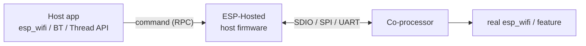
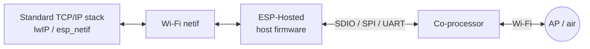
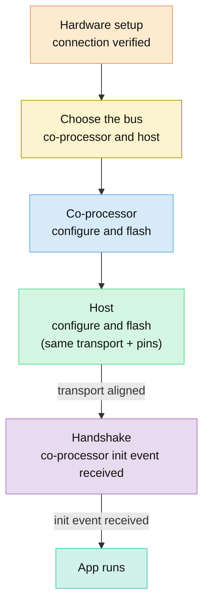

# Getting Started: MCU Host

[Home](../README.md) · [Getting Started: Linux](getting-started-linux.md) · **Getting Started: MCU** · [Troubleshooting](troubleshooting.md)

Use this guide when your host is an **MCU running firmware** (ESP-IDF, Zephyr, or another RTOS) and an Espressif chip is the Wi-Fi + Bluetooth co-processor. You build and flash **two firmware images** with `eh.py`: the co-processor (`cp/`) and the host (`mcu_host/` or `esp_host/`). Understand the two goals, pick a bus, then follow that bus's section top to bottom.

> [!TIP]
> **Not an ESP32-P4 host?** It is just the demonstrated board — **any ESP SoC works as host, and any MCU works once ported.** To use another host:
> - Map the connection tables below to your host's GPIOs (host SPI/SDIO/UART pins are configurable in `eh.py menuconfig`).
> - Handle the board-specific bits via [Porting: MCU host](porting.md#mcu-host-porting): the reset GPIO, the transport wrapper, and enabling the bus peripheral.
>
> The concepts, buses, and software flow are the same; only the host pins and the porting layer differ.

## Example hardware used

| Role | Usable | Demo uses HW |
| :---: | :---: | :---: |
| ESP-Host | ESP32-P4 | ESP32-P4-Function-EV-Board (can use any P4 from your PCB) | 
| Non-ESP Host | Any MCU (STM32 etc - usable on after [porting](porting.md#mcu-host-porting)) | - |
| Co-processor | ESP32-C6/C5/C2/C3/C61/S2/S3/H2/H4/ESP32) | ESP32-C6 (Any ESP if you wish to use) |
| Demo example | [Wi-Fi Station](../examples/wifi/sta/README.md) | connects to an AP and prints the IP |

---

## Goals

Two things run over the bus once set-up is done — a **control path** and a **data path**. Your host firmware calls the normal `esp_wifi` (or Bluetooth / OpenThread) API as if the radio were local; ESP-Hosted transparently routes it to the co-processor.

### Goal 1 — Control path

Carries commands that configure the radio: scan, connect, start a SoftAP, and every other feature call. Your app makes a normal `esp_wifi` call; ESP-Hosted turns it into an **RPC message**, sends it over the bus to the co-processor, which runs the real `esp_wifi` call and returns the result.



### Goal 2 — Data path

Carries actual network traffic. After the host associates to an access point, the co-processor bridges Wi-Fi frames to a Wi-Fi network interface on the host. Your host's **standard TCP/IP stack** (lwIP / `esp_netif`: DHCP, sockets, `ping`, iperf) runs over it — no ESP-Hosted API needed for data.



---

## Mental model

Bring the stack up in this order, and stop at the first arrow whose signal does not appear:



> [!TIP]
> **Debugging order.** Check in this sequence: (1) both sides use the **same** transport; (2) both sides are wired to the **same GPIOs**; (3) the host receives the co-processor **init event**; (4) the host sends its capabilities back; (5) feature traffic begins. If step 3 never happens, **do not debug the feature** — it is a wiring or transport-config problem.

---

## Choosing the bus (co-processor and host)

Both firmware images must select the **exact same transport** and matching pins. On an MCU host, Wi-Fi (and Bluetooth) can ride **SDIO**, **SPI Full-Duplex**, **SPI Half-Duplex**, or **UART**.

| Bus | Pins (signals + Reset + GND) | Throughput | Bluetooth | Wiring | Best for |
| :--- | :--- | :--- | :--- | :--- | :--- |
| **SDIO** 👍 | CLK, CMD, DAT0–DAT3, Reset, GND<br>**= 8** (4-bit) / **5** (1-bit) | Highest | Hosted-HCI on the bus | PCB + pull-ups (1-bit OK on jumpers) | Max Wi-Fi speed (SDIO co-processor chips only) |
| **SPI Full-Duplex** 👍 | SCLK, MOSI, MISO, CS, Handshake, Data Ready, Reset, GND<br>**= 8** | Good | Hosted-HCI on the bus | Jumpers OK | Easiest, most robust bring-up |
| **SPI Half-Duplex** | CLK, CS, D0–D3, Data Ready, Reset, GND<br>**= 6** (1-bit) / **7** (Dual) / **9** (Quad) | Higher than Full-Duplex (Quad) | Hosted-HCI on the bus | 1-line / Dual: jumpers OK · Quad: PCB only | More SPI throughput; not on classic ESP32 |
| **UART** | TX, RX, Reset, GND<br>**= 4** | Lowest (not for > 1 Mbit/s) | Wi-Fi **and** BT both as Hosted-HCI on UART | Jumpers OK | Lowest wiring complexity |

> [!NOTE]
> 1. ESP has one radio, so whether Bluetooth is multiplexed on the bus or carried on a dedicated link, the radio is serialised.
> 2. SDIO and SPI (with Bluetooth multiplexed) give reliable, better performance than UART.
> 3. On **UART**, both Wi-Fi and Bluetooth ride the bus as **Hosted HCI** — do not confuse this with standard HCI over UART, which does not carry Wi-Fi.
> 4. **SPI Half-Duplex** is not an industry standard and has multiple implementations; confirm your host supports the SPI-HD protocol used by the co-processor. See [SPI Half-Duplex design](design/spi-half-duplex.md).

### Supported ESP co-processors

| Co-processor | SDIO | SPI Full-Duplex | SPI Half-Duplex | UART |
| :--- | :---: | :---: | :---: | :---: |
| ESP32 | `✓` | `✓` |  | `✓` |
| ESP32-C2 |  | `✓` | `✓` | `✓` |
| ESP32-C3 |  | `✓` | `✓` | `✓` |
| ESP32-C5 | `✓` | `✓` | `✓` | `✓` |
| ESP32-C6 | `✓` | `✓` | `✓` | `✓` |
| ESP32-C61 | `✓` | `✓` | `✓` | `✓` |
| ESP32-S2 |  | `✓` | `✓` | `✓` |
| ESP32-S3 |  | `✓` | `✓` | `✓` |

> [!NOTE]
> - **SDIO** co-processors are limited to **ESP32, ESP32-C5, ESP32-C6, and ESP32-C61** (all use fixed SDIO GPIOs). A classic **ESP32** co-processor may need a one-time, irreversible **eFuse burn** for the `DAT2`/bootstrapping-pin voltage — see [Specific considerations](#11-hardware-considerations-and-connections). An incorrect burn can brick the chip.
> - **SPI Half-Duplex** is **not supported on the classic ESP32** — use SPI Full-Duplex there instead. The co-processor doc lists SPI-HD support on ESP32-C2/C3/C5/C6/C61/S2/S3.
> - **SPI Full-Duplex** and **UART** are supported on every listed chip (UART requires a spare UART controller besides the debug UART0).

Pick a set-up and jump straight to its steps:

| [1. SDIO](#1-sdio) | [2. SPI Full-Duplex](#2-spi-full-duplex) | [3. SPI Half-Duplex](#3-spi-half-duplex) | [4. UART](#4-uart) |
| :--- | :--- | :--- | :--- |
| 1. [Hardware](#11-hardware-considerations-and-connections)<br>2. [Flash CP](#12-configure-and-flash-the-co-processor)<br>3. [Flash host](#13-configure-and-flash-the-host)<br>4. [Verify](#14-verify) | 1. [Hardware](#21-hardware-considerations-and-connections)<br>2. [Flash CP](#22-configure-and-flash-the-co-processor)<br>3. [Flash host](#23-configure-and-flash-the-host)<br>4. [Verify](#24-verify) | 1. [Hardware](#31-hardware-considerations-and-connections)<br>2. [Flash CP](#32-configure-and-flash-the-co-processor)<br>3. [Flash host](#33-configure-and-flash-the-host)<br>4. [Verify](#34-verify) | 1. [Hardware](#41-hardware-considerations-and-connections)<br>2. [Flash CP](#42-configure-and-flash-the-co-processor)<br>3. [Flash host](#43-configure-and-flash-the-host)<br>4. [Verify](#44-verify) |

---

## Set up the tools

`eh.py` is the one command that configures, builds, flashes, and runs both firmware images. Install it once per checkout, and source the environment once per shell:

```sh
cd /path/to/esp_hosted
./install.sh     # or ./install.fish   (fish shell)
. ./export.sh    # or . ./export.fish  (fish shell)
```

`install.sh` sets up the toolchain and dependencies; `export.sh` puts `eh.py` on your `PATH`. See [Tools: eh.py](tools.md) for the full command reference.

> [!NOTE]
> Both firmware images are ESP-IDF projects, so they need ESP-IDF. `./install.sh` installs it and `. ./export.sh` sets it up automatically — there is no separate ESP-IDF export step. `eh.py` wraps the ESP-IDF tooling, so `set-target`, `menuconfig`, `build`, and `flash monitor` mirror `idf.py`.

This guide uses the [Wi-Fi Station](../examples/wifi/sta/README.md) example — it connects to your AP and prints the assigned IP. Its layout:

```text
examples/wifi/sta/
├── cp/          co-processor firmware
└── mcu_host/    generic MCU host application
```

Flash `cp/` to the co-processor and `mcu_host/` to the host, then follow **one** of the four sections below. (Some examples also ship an `esp_host/` role for ESP-IDF-only host services such as deep sleep or OpenThread.)

---

## 1. SDIO

**MCU host — SDIO — ESP co-processor.** Highest throughput; strictest hardware requirements. SDIO co-processors are limited to ESP32, ESP32-C5, ESP32-C6, and ESP32-C61.

### 1.1 Hardware considerations and connections

Hardware considerations — SDIO:

- **GPIOs.** SDIO uses **fixed** GPIOs on the co-processor (ESP32 / ESP32-C5 / ESP32-C6 / ESP32-C61). On the host, the ESP32 uses fixed SDIO GPIOs, the ESP32-S3 supports flexible GPIOs, and the ESP32-P4 has fixed GPIOs on Slot 0 and flexible GPIOs on Slot 1 (Slot 1 is used by default; both slots, and parallel access to both, are supported). Prefer `IO_MUX` pins for best timing.
- **Reset signal.** Host output to the co-processor `EN`/`RST` pin (configurable GPIO), asserted at start-up to sync host and co-processor state. Co-processor menuconfig: *Example configuration → SDIO Configuration → Host SDIO GPIOs → Slave GPIO pin to reset itself*.
- **Pull-up resistors (mandatory).** External **51 kΩ** [pull-ups][pullup] on **`CMD`, `DAT0`–`DAT3`** — on all of them (also marked in the tables), irrespective of jumpers or PCB. Pull-ups on `DAT2` and `DAT3` also prevent the SDIO slave from dropping into SPI mode at start-up. Select your co-processor in the linked page's chip selector.
- **Clock.** Start low (**~5 MHz**, host range 400 kHz–20 MHz) to verify wiring, then raise in steps. SDIO max is **50 MHz**, which all SDIO co-processors can reach. The actual clock is set by hardware — check it with an oscilloscope or logic analyzer.
- **Voltage levels.** All signals are **3.3 V**; if using a level shifter, set its output to 3.3 V.
- **Power.** Insufficient power is a leading, frequently-overlooked cause of **non-deterministic crashes and suboptimal performance**. Get all three right:
  1. **Power adapter** — matched to each board's exact input rating (host and co-processor).
  2. **Power cable** — rated to carry the expected current; thin or long cables cause brown-outs.
  3. **ESP supply** — power the co-processor from a **reliable supply** of adequate rating.
- **PCB design (production).** Length-match all SDIO signals (CLK, CMD, DAT0–3); if not perfect, prioritise matching **CLK to the data lines**. Use controlled-impedance traces, bypass capacitors near the power pins, optional series termination, and a 4-layer board with power/ground planes for high speed.
- **Advanced.** Calculate the maximum trace length for your clock and PCB material, account for bus capacitance on long traces, and apply proper EMI/EMC design.

Specific considerations — SDIO:

- **SDIO 1-bit mode.** Full **4-bit** SDIO needs a **proper PCB** carrying the mandatory pull-ups — jumpers are not suitable. Only **SDIO 1-bit** mode may be prototyped on jumper wires: all leads **equal length**, each **≤ 5 cm**; the [pull-ups][pullup] remain **mandatory** on `CMD`, `DAT0`–`DAT3`. Verify at 1-bit first, then revert to 4-bit on a PCB for higher throughput.
- **Classic ESP32 eFuse.** A **classic ESP32** co-processor (or an ESP32 host) will likely need a **one-time, irreversible eFuse burn** (bootstrapping-pin / `DAT2` conflict) — follow the [pull-up requirements][pullup] procedure; an incorrect burn can brick the chip. ESP32-S3 and ESP32-P4 hosts do **not** need this.

#### Host connections

| Signal | ESP32 | ESP32-S3 |
| :--- | :---: | :---: |
| CLK | 14 | 19 |
| CMD ([pull-up][pullup]) | 15 | 47 |
| D0 ([pull-up][pullup]) | 2 | 13 |
| D1 ([pull-up][pullup]) | 4 | 35 |
| D2 ([pull-up][pullup]) | 12 | 20 |
| D3 ([pull-up][pullup]) | 13 | 9 |
| Reset Out | 5 | 42 |

#### ESP32-P4-Function-EV-Board host pin mapping

| Signal | ESP32-P4 with ESP32-C6 | ESP32-P4 with ESP32-C5 |
| :--- | :---: | :---: |
| CLK | 18 | 33 |
| CMD ([pull-up][pullup]) | 19 | 4 |
| D0 ([pull-up][pullup]) | 14 | 20 |
| D1 ([pull-up][pullup]) | 15 | 23 |
| D2 ([pull-up][pullup]) | 16 | 21 |
| D3 ([pull-up][pullup]) | 17 | 22 |
| Reset Out | 54 | 53 |

#### Co-processor connections

| Signal | ESP32 | ESP32-C6 | ESP32-C61 | ESP32-C5 |
| :--- | :---: | :---: | :---: | :---: |
| CLK | 14 | 19 | 26 | 9 |
| CMD | 15 | 18 | 25 | 10 |
| D0 | 2 | 20 | 27 | 8 |
| D1 | 4 | 21 | 28 | 7 |
| D2 | 12 | 22 | 22 | 14 |
| D3 | 13 | 23 | 23 | 13 |
| Reset In | EN | EN/RST | EN/RST | RST |

> [!NOTE]
> External pull-ups are mandatory on `CMD`, `DAT0`–`DAT3` regardless of 1-bit or 4-bit mode.

### 1.2 Configure and flash the co-processor

```sh
cd examples/wifi/sta/cp
eh.py set-target esp32c6          # or esp32, esp32c5
eh.py menuconfig
eh.py -p <CP_PORT> flash monitor
```

In `menuconfig`, select SDIO and set its options:

```text
Example Configuration
└── Bus Config in between Host and Co-processor
    └── Transport layer ──> SDIO
    └── SDIO Configuration        (co-processor GPIOs, SDIO Mode, timing, Tx/Rx queue size)
```

> [!NOTE]
> If flashing the co-processor fails because the host holds the bus, put the host in bootloader mode first, then retry:
> `esptool.py -p <HOST_PORT> --before default_reset --after no_reset run`

### 1.3 Configure and flash the host

```sh
cd ../mcu_host                    # or ../esp_host
eh.py set-target esp32p4
eh.py menuconfig
eh.py -p <HOST_PORT> flash monitor
```

Select the **same** transport (SDIO) and matching pins:

```text
Component config
└── ESP-Hosted config
    ├── Transport layer ──> SDIO
    └── Hosted SDIO Configuration
        ├── Slave chipset to be used   (match the co-processor)
        ├── SDIO Bus Width ──> 1 Bit / 4 Bit   (match the co-processor)
        ├── SDIO Clock Freq (in kHz)   (start 400 kHz–20 MHz to verify)
        └── SDIO Host GPIO Pins
```

> [!TIP]
> If 4-bit SDIO is unstable on a prototype, switch **both** sides to **1-bit** mode to verify the protocol logically (only `DAT0`/`DAT1` carry data, less noise-sensitive), then move to a 4-bit PCB. Packet vs Streaming mode must also match on both sides.

### 1.4 Verify

A healthy handshake prints the co-processor init/capability exchange on the **host** monitor, and the co-processor prints its transport banner. Look for:

```text
# Host
I (1712) transport: Received INIT event from ESP32 peripheral
I (1715) transport: capabilities: 0xe8
I (1719) transport: Features supported are:
I (1724) transport:        - HCI over SDIO
I (1732) transport: ESP board type is : 13
I (1741) transport: Base transport is set-up

# Co-processor
I (511) fg_mcu_slave:                 Transport used :: SDIO
I (529) fg_mcu_slave: Supported features are:
I (534) fg_mcu_slave: - WLAN over SDIO
```

If the **INIT event** / **Base transport is set-up** lines never appear, stop and fix the transport/wiring before continuing. Once the transport is up, the station example connects to your AP automatically (set the AP SSID/password in the host `menuconfig` first) and prints the assigned IP on the host console:

```text
I (5234) wifi station: got ip:192.168.1.42
```

Seeing the IP confirms both the control path (association) and the data path (DHCP over the hosted link).


For deeper protocol and tuning detail, see [SDIO Design](design/sdio.md).

---

## 2. SPI Full-Duplex

**MCU host — SPI Full-Duplex — ESP co-processor.** Easiest, most robust bring-up; supported on every ESP chip. SPI transfers to and from the co-processor happen simultaneously on MOSI and MISO in the same transaction.

### 2.1 Hardware considerations and connections

Hardware considerations — SPI Full-Duplex:

- **Pins.** SCLK, MOSI, MISO, and CS are configurable on both ends — prefer `IO_MUX` pins for best performance (non-`IO_MUX` pins route through the GPIO matrix and cap the max clock).
- **Extra signals (all mandatory).** `Handshake` (co-processor → host, "I am ready for a transaction") and `Data Ready` (co-processor → host, "I have data to send"), plus `Reset` (host → co-processor `EN`/`RST`, configurable GPIO, asserted automatically when the host starts).
- **Jumper wires.** Suitable for prototyping: high-quality, low-capacitance, **≤ 10 cm**, equal length; minimise crosstalk (especially clock/data); consider twisted pairs for clock/data; run a ground between every signal; connect as many grounds as possible.
- **Clock.** Start at a **low clock (~5–10 MHz)**, then raise in steps toward the co-processor's practical max SPI-slave frequency (see `IDF_PERFORMANCE_MAX_SPI_CLK_FREQ` in the ESP-IDF SPI slave benchmark, and [Performance Optimization](design/performance.md)). Intermittent errors? Lower `CLK` first — if they vanish, it is signal integrity.
- **Voltage levels.** Verify voltage compatibility between host and co-processor; use level shifters if they differ, and keep a common ground.
- **Power.** Insufficient power is a leading, frequently-overlooked cause of **non-deterministic crashes and suboptimal performance**. Get all three right:
  1. **Power adapter** — matched to each board's exact input rating (host and co-processor).
  2. **Power cable** — rated to carry the expected current; thin or long cables cause brown-outs.
  3. **ESP supply** — power the co-processor from a **reliable supply** of adequate rating.
- **PCB design (production).** Length-match all SPI signals (CLK, MOSI, MISO, CS); if not perfect, prioritise matching **CLK to the data lines**. Use controlled-impedance traces, bypass capacitors near the power pins, optional series termination, and a 4-layer board for high speed.
- **Debugging tips.** Use an oscilloscope/logic analyzer to verify signal integrity and timing; start at a lower clock and raise gradually; ensure solid grounding.

#### Host connections

| Signal | ESP32 | ESP32-S2/S3 | ESP32-C2/C3/C5/C6 | ESP32-P4 |
| :--- | :---: | :---: | :---: | :---: |
| CLK | 14 | 12 | 6 | 9 |
| MOSI | 13 | 11 | 7 | 8 |
| MISO | 12 | 13 | 2 | 10 |
| CS | 15 | 10 | 10 | 7 |
| Handshake | 26 | 17 | 3 | 6 |
| Data Ready | 4 | 4 | 4 | 11 |
| Reset Out | 5 | 5 | 5 | 12 |

> [!NOTE]
> The ESP32-P4 GPIOs above are SPI `IO_MUX` pins powered by `VDD_LP`. If you pick a different GPIO set, verify it is powered to 3.3 V per the ESP32-P4 datasheet; if the power pin is fed by an internal LDO, program the LDO to 3.3 V.

> [!NOTE]
> Per-chip exceptions to the grouped columns above (plain-MCU defaults): **ESP32-S3** host Reset Out defaults to **42** (ESP32-S2: 5), and **ESP32-C5** host Handshake defaults to **26** (C2/C3/C6: 3).

#### Co-processor connections

| Signal | ESP32 | ESP32-C2/C3/C5/C6 | ESP32-S2/S3 | ESP32-C6 on ESP32-P4-Function-EV-Board |
| :--- | :---: | :---: | :---: | :---: |
| CLK | 14 | 6 | 12 | 19 |
| MOSI | 13 | 7 | 11 | 20 |
| MISO | 12 | 2 | 13 | 21 |
| CS | 15 | 10 | 10 | 18 |
| Handshake | 26 | 3 | 17 | 22 |
| Data Ready | 4 | 4 | 4 | 23 |
| Reset In | EN | EN/RST | EN/RST | EN/RST |

> [!NOTE]
> These GPIO assignments are the default Kconfig values and are configurable. Prefer `IO_MUX` pins on both sides. Ensure a common ground and short, high-quality cables.

> [!NOTE]
> Per-chip exceptions to the grouped column above (plain-MCU defaults): on **ESP32-C5** the co-processor CLK defaults to **3** and Handshake to **1** (not the 6 / 3 shown for C2/C3/C6). Func-board / module-board variants differ — confirm in `menuconfig`.

### 2.2 Configure and flash the co-processor

```sh
cd examples/wifi/sta/cp
eh.py set-target esp32c6          # or any supported co-processor
eh.py menuconfig
eh.py -p <CP_PORT> flash monitor
```

In `menuconfig`, select SPI Full-Duplex and set its options:

```text
Example Configuration
└── Bus Config in between Host and Co-processor
    └── Transport layer ──> SPI Full-duplex
    └── SPI Full-duplex           (MOSI/MISO/CLK/CS/Handshake/Data Ready/Reset GPIOs,
                                   SPI mode 1/2/3, clock freq, Checksum [recommend enable])
```

> [!NOTE]
> If flashing the co-processor fails because the host holds the bus, put the host in bootloader mode first, then retry:
> `esptool.py -p <HOST_PORT> --before default_reset --after no_reset run`

### 2.3 Configure and flash the host

```sh
cd ../mcu_host                    # or ../esp_host
eh.py set-target esp32p4
eh.py menuconfig
eh.py -p <HOST_PORT> flash monitor
```

Select the **same** transport (SPI Full-Duplex) and matching pins:

```text
Component config
└── ESP-Hosted config
    ├── Transport layer ──> SPI Full-duplex
    ├── Slave chipset to be used   (match the co-processor)
    └── SPI Configuration
        ├── SPI Clock Freq (MHz)
        ├── SPI Mode                (match the co-processor: 3 for most, 2 for classic ESP32)
        ├── SPI Pins                (CLK/MOSI/MISO/CS/Handshake/Data Ready/Reset)
        └── SPI Checksum            (recommend enable — SPI hardware has no error detection)
```

### 2.4 Verify

A healthy handshake prints the co-processor init/capability exchange on the **host** monitor, and the co-processor prints its transport banner. Look for:

```text
# Host
I (1712) transport: Received INIT event from ESP32 peripheral
I (1715) transport: capabilities: 0xe8
I (1719) transport: Features supported are:
I (1724) transport:        - HCI over SPI
I (1732) transport: ESP board type is : 13
I (1741) transport: Base transport is set-up

# Co-processor
I (511) fg_mcu_slave:                 Transport used :: SPI
I (529) fg_mcu_slave: Supported features are:
I (534) fg_mcu_slave: - WLAN over SPI
```

If the **INIT event** / **Base transport is set-up** lines never appear, stop and fix the transport/wiring before continuing. Once the transport is up, the station example connects to your AP automatically (set the AP SSID/password in the host `menuconfig` first) and prints the assigned IP on the host console:

```text
I (5234) wifi station: got ip:192.168.1.42
```

Seeing the IP confirms both the control path (association) and the data path (DHCP over the hosted link).


For deeper protocol and tuning detail, see [SPI Full-Duplex Design](design/spi-full-duplex.md).

---

## 3. SPI Half-Duplex

**MCU host — SPI Half-Duplex — ESP co-processor.** Data moves in one direction at a time over **1**, **2 (Dual)**, or **4 (Quad)** data lines, giving more throughput than Full-Duplex with fewer signals. The data-line count is a menuconfig choice that must match on both sides. Supported on all ESP chips **except the classic ESP32**.

> [!WARNING]
> SPI Half-Duplex is not an industry standard and has multiple implementations. Confirm your host supports the SPI-HD protocol used by the co-processor before wiring anything. Protocol details (commands, registers, timing) are in [SPI Half-Duplex design](design/spi-half-duplex.md).

### 3.1 Hardware considerations and connections

Hardware considerations — SPI Half-Duplex:

- **Pins.** Use the dedicated `IO_MUX` SPI pins where possible to minimise propagation delay; routing through the GPIO matrix limits the maximum clock. `CS`, `Data_Ready`, and `Reset` can go to any free GPIO.
- **Data lines.** Both ends can support one, two, or four data lines. Four are used only if **both** sides are configured for four; if the host is set to two, only two are used even if the co-processor supports four. One-line support must be configured on **both** sides for the transport to work.
- **Clock and phase.** The standard SPI `CPOL`/`CPHA` must be configured identically on host and co-processor.
- **Extra signals.** `Data_Ready` (co-processor → host, "I have data — do a read transaction") and `Reset` (host → co-processor `EN`/`RST` or a GPIO, asserted at host start-up). By default the SPI bus idles (no CS, clock, or data) when neither side needs a transaction.
- **Clock.** Start low (**~5–10 MHz**) to verify wiring, then raise in steps toward the co-processor's practical max (see `IDF_PERFORMANCE_MAX_SPI_CLK_FREQ` in the ESP-IDF SPI benchmark, and [Performance Optimization](design/performance.md)). Actual clock is set by hardware — verify with an oscilloscope/logic analyzer.
- **Voltage levels.** Verify voltage compatibility; use level shifters if they differ, and keep a common ground.
- **Power.** Insufficient power is a leading, frequently-overlooked cause of **non-deterministic crashes and suboptimal performance**. Get all three right:
  1. **Power adapter** — matched to each board's exact input rating (host and co-processor).
  2. **Power cable** — rated to carry the expected current; thin or long cables cause brown-outs.
  3. **ESP supply** — power the co-processor from a **reliable supply** of adequate rating.
- **PCB design (production).** Length-match all SPI signals; if not perfect, prioritise matching **CLK to the data lines**. Use controlled-impedance traces, bypass capacitors near the power pins, optional series termination, and a 4-layer board for high speed. Quad SPI must be on a proper PCB.
- **Advanced.** Calculate max trace length for your clock and PCB material, account for bus capacitance, and apply proper EMI/EMC design.

Specific considerations — SPI Half-Duplex:

- **Quad needs a PCB.** **Quad SPI (D2/D3)** must **not** be used with jumper wires due to signal integrity — use a properly designed PCB. **Dual SPI** may be evaluated on jumpers (**≤ 10 cm**, equal length, ground between signals).
- **Not on classic ESP32.** SPI-HD is unsupported on the classic ESP32 as host or co-processor — use SPI Full-Duplex there instead.

#### Host connections

| Signal | ESP32-S3 | ESP32-P4-Function-EV-Board | Applicable |
| :--- | :---: | :---: | :--- |
| CLK | 12 | 18 | 1 / Dual / Quad |
| D0 | 11 | 14 | 1 / Dual / Quad |
| D1 | 13 | 15 | Dual / Quad |
| CS | 10 | 19 | 1 / Dual / Quad |
| Data Ready | 4 | 6 | 1 / Dual / Quad |
| Reset Out | 5 | 54 | 1 / Dual / Quad |
| GND | GND | GND | 1 / Dual / Quad |
| D2 | 14 | 16 | Quad only |
| D3 | 9 | 17 | Quad only |

- Host GPIOs are re-configurable — just keep the config and wiring in step.
- The classic **ESP32** is **not supported** as host or co-processor for SPI-HD; all other chipsets are supported as host.
- For **ESP32-S2/C2/C3/C5/C6/C61**, host SPI-HD pins are not yet documented.
- On the **ESP32-P4-Function-EV-Board**, the on-board SDIO pins are reused for SPI-HD host; for other ESP32-P4 boards the host pins are not yet documented.

#### Co-processor connections

| Signal | ESP32-C6 on ESP32-P4-Function-EV-Board | ESP32-C2 | ESP32-C3/C6 | ESP32-C5 | Applicable |
| :--- | :---: | :---: | :---: | :---: | :--- |
| CLK | 19 | 0 | 6 | 3 | 1 / Dual / Quad |
| D0 | 20 | 7 | 7 | 7 | 1 / Dual / Quad |
| D1 | 21 | 2 | 2 | 2 | Dual / Quad |
| CS | 18 | 10 | 10 | 10 | 1 / Dual / Quad |
| Data Ready | 2 | 1 | 11 | 0 | 1 / Dual / Quad |
| Reset In | EN/RST | EN/RST | EN/RST | EN/RST | 1 / Dual / Quad |
| GND | GND | GND | GND | GND | 1 / Dual / Quad |
| D2 | 22 | 5 | 5 | 5 | Quad only |
| D3 | 23 | 4 | 4 | 4 | Quad only |

- Co-processor GPIOs are re-configurable — keep the config and wiring in step.
- ESP32-C2/C3/C5/C6/C61/S2/S3 are all supported as SPI-HD co-processor; pins for other boards are not yet documented.
- QSPI has been tested on the ESP32-P4-Function-EV-Board (ESP32-P4 host with ESP32-C6/C3 QSPI co-processor, reusing the SDIO connections); Dual SPI has been tested with jumpers (ESP32-S3 host with ESP32-C5 co-processor).

### 3.2 Configure and flash the co-processor

```sh
cd examples/wifi/sta/cp
eh.py set-target esp32c6          # any supported co-processor except classic esp32
eh.py menuconfig
eh.py -p <CP_PORT> flash monitor
```

In `menuconfig`, select SPI Half-Duplex and set its options (including the reset GPIO):

```text
Example Configuration
└── Bus Config in between Host and Co-processor
    ├── Transport layer ──> SPI Half-duplex
    └── SPI Half-duplex Configuration    (co-processor GPIOs, SPI mode, num data lines)
        └── GPIOs
            └── Slave GPIO pin to reset itself
```

> [!NOTE]
> If flashing the co-processor fails because the host holds the bus, put the host in bootloader mode first, then retry:
> `esptool.py -p <HOST_PORT> --before default_reset --after no_reset run`

### 3.3 Configure and flash the host

```sh
cd ../mcu_host                    # or ../esp_host
eh.py set-target esp32p4
eh.py menuconfig
eh.py -p <HOST_PORT> flash monitor
```

Select the **same** transport (SPI Half-Duplex), the **same number of data lines**, and matching pins:

```text
Component config
└── ESP-Hosted config
    ├── Transport layer ──> SPI Half-duplex
    ├── Slave chipset to be used   (match the co-processor)
    └── SPI Half-duplex Configuration
        ├── Num Data Lines to use ──> 2 / 4   (match the co-processor)
        ├── SPI Clock Freq (MHz)
        ├── SPI Mode                (match CPOL/CPHA on both sides)
        ├── SPI Host GPIO Pins
        └── SPI Checksum            (recommend enable — SPI hardware has no error detection)
```

### 3.4 Verify

A healthy handshake prints the co-processor init/capability exchange on the **host** monitor, and the co-processor prints its transport banner (`Dual SPI` or `Quad SPI`). Look for:

```text
# Host
I (1712) transport: Received INIT event from ESP32 peripheral
I (1715) transport: capabilities: 0xe8
I (1719) transport: Features supported are:
I (1724) transport:        - HCI over SPI
I (1732) transport: ESP board type is : 13
I (1741) transport: Base transport is set-up

# Co-processor
I (511) fg_mcu_slave:                 Transport used :: <Dual/Quad SPI>
I (529) fg_mcu_slave: Supported features are:
I (534) fg_mcu_slave: - WLAN over SPI
```

If the **INIT event** / **Base transport is set-up** lines never appear, stop and fix the transport/wiring before continuing (a common cause is a data-line count that differs between the two sides). Once the transport is up, the station example connects to your AP automatically (set the AP SSID/password in the host `menuconfig` first) and prints the assigned IP on the host console:

```text
I (5234) wifi station: got ip:192.168.1.42
```

Seeing the IP confirms both the control path (association) and the data path (DHCP over the hosted link).


For the protocol, framing, and tuning detail, see [SPI Half-Duplex design](design/spi-half-duplex.md).

---

## 4. UART

**MCU host — UART — ESP co-processor.** The lowest-pin-count bus: two signal lines carry **both Wi-Fi and Bluetooth** as Hosted HCI. Quick to bring up on almost any MCU, but low-speed — not recommended where more than **1 Mbit/s** of network throughput is required.

> [!NOTE]
> UART transports Wi-Fi and Bluetooth as **Hosted HCI**. Do not confuse this with standard HCI over UART, which does not carry Wi-Fi.

### 4.1 Hardware considerations and connections

Hardware considerations — UART:

- **GPIOs.** UART can use almost any free GPIO for `Tx`/`Rx`; prefer `IO_MUX` pins. **Avoid the ESP debug UART0 (`Tx0`/`Rx0`)** — ESP-Hosted uses a separate UART controller.
- **Extra signal.** `Reset` (host → co-processor `EN`/`RST`, configurable GPIO, asserted when the host starts). Co-processor menuconfig: *Example configuration → UART Configuration → Slave GPIO pin to reset itself*.
- **Baud.** Start at **115200 baud** to verify, then raise in steps. The actual baud is set by hardware — verify with an oscilloscope/logic analyzer; if the transmit baud drifts more than a few percent from the expected rate, the receiver may fail to decode.
- **Voltage / grounding.** Keep a common ground; run a ground wire between signals and connect as many grounds as possible.
- **Power.** Insufficient power is a leading, frequently-overlooked cause of **non-deterministic crashes and suboptimal performance**. Get all three right:
  1. **Power adapter** — matched to each board's exact input rating (host and co-processor).
  2. **Power cable** — rated to carry the expected current; thin or long cables cause brown-outs.
  3. **ESP supply** — power the co-processor from a **reliable supply** of adequate rating.
- **General wiring.** UART is low-speed, so signal integrity is less critical, but keep wires **short (< 10 cm)** and equal length, with a ground between signals.
- **PCB design (production).** Length-match `Rx`/`Tx`; use controlled-impedance traces, bypass capacitors near the power pins, and a 4-layer board for high speed.

**Connections.** UART uses a selectable UART port (default **port 1** — never the debug `UART0`) with two signals, `Tx` and `Rx`, plus `Reset` and a common `GND`. Wire host `Tx` → co-processor `Rx`, host `Rx` → co-processor `Tx`, and host `Reset` → co-processor `EN`/`RST`. The default GPIOs (Kconfig; dynamic pin changes are supported but not used by default):

Co-processor UART defaults:

| Signal | ESP32 | C2/C3 | C5 | C6 | S2/S3 |
| :--- | :---: | :---: | :---: | :---: | :---: |
| Tx | 13 | 5 | 14 | 21 | 5 |
| Rx | 12 | 4 | 13 | 20 | 4 |
| Reset In | EN/RST | EN/RST | EN/RST | EN/RST | EN/RST |

Host UART defaults:

| Signal | ESP32 | C2/C3 | C5 | C6 | S2 | S3 | ESP32-P4 | P4-Function-EV-Board (with C6) |
| :--- | :---: | :---: | :---: | :---: | :---: | :---: | :---: | :---: |
| Tx | 13 | 5 | 14 | 21 | 5 | 5 | 14 | 14 |
| Rx | 12 | 4 | 13 | 20 | 4 | 4 | 15 | 15 |
| Reset Out | 5 | 5 | 5 | 5 | 5 | 42 | 54 | 54 |

> [!NOTE]
> On the **ESP32-P4-Function-EV-Board**, the UART `Tx`/`Rx` default GPIOs **reuse the SDIO `D0`/`D1` lines** (host 14/15; co-processor C6 20/21). You can run SDIO **or** UART on those pins, not both at once — if you keep SDIO wired and want UART for another purpose, pick other free GPIOs in `menuconfig`. Always avoid the debug `UART0` (`Tx0`/`Rx0`).

### 4.2 Configure and flash the co-processor

```sh
cd examples/wifi/sta/cp
eh.py set-target esp32c6          # any chip with a spare UART
eh.py menuconfig
eh.py -p <CP_PORT> flash monitor
```

In `menuconfig`, select UART and set its options:

```text
Example Configuration
└── Bus Config in between Host and Co-processor
    └── Transport layer ──> UART
    └── UART Configuration        (Tx/Rx GPIOs, baud rate, reset GPIO)
```

> [!NOTE]
> On ESP-IDF v5.5 a UART build can fail with *"Building for UART transport can fail due to lack of IRAM space."* Reduce IRAM by enabling *Component config → ESP Ringbuf → Place non-ISR ringbuf functions into flash* (or set `CONFIG_RINGBUF_PLACE_FUNCTIONS_INTO_FLASH=y` in the target `sdkconfig.defaults`).

> [!NOTE]
> If flashing the co-processor fails because the host holds the bus, put the host in bootloader mode first, then retry:
> `esptool.py -p <HOST_PORT> --before default_reset --after no_reset run`

### 4.3 Configure and flash the host

```sh
cd ../mcu_host                    # or ../esp_host
eh.py set-target esp32p4
eh.py menuconfig
eh.py -p <HOST_PORT> flash monitor
```

Select the **same** transport (UART) and matching pins/baud:

```text
Component config
└── ESP-Hosted config
    ├── Transport layer ──> UART
    ├── Slave chipset to be used   (match the co-processor)
    └── UART Configuration
        ├── UART Tx and Rx GPIOs   (cross-wired to the co-processor)
        ├── UART baud rate         (match the co-processor)
        └── UART Checksum          (recommend enable)
```

### 4.4 Verify

On UART, Wi-Fi is reported as an **extended** capability while Bluetooth appears in the base capabilities. A healthy handshake on the **host** monitor looks like:

```text
# Host
I (1650) transport: Received INIT event from ESP32 peripheral
I (1652) transport: capabilities: 0x88
I (1657) transport: Features supported are:
I (1662) transport:        - BLE only
I (1669) transport: extended capabilities: 0x120
I (1675) transport: Extended Features supported:
I (1680) transport:      * WLAN over UART
I (1693) transport: Base transport is set-up

# Co-processor
I (503) fg_mcu_slave:                 Transport used :: UART only
I (543) fg_mcu_slave: - WLAN over UART
I (551) h_bt:    - HCI Over UART (VHCI)
```

If the **INIT event** / **Base transport is set-up** lines never appear, stop and fix the transport/wiring (a baud-rate mismatch is a common cause) before continuing. Once the transport is up, the station example connects to your AP automatically (set the AP SSID/password in the host `menuconfig` first) and prints the assigned IP on the host console:

```text
I (5234) wifi station: got ip:192.168.1.42
```

Seeing the IP confirms both the control path (association) and the data path (DHCP over the hosted link). For deeper detail, see [UART Design](design/uart.md).

---

## Next steps

Once Wi-Fi Station works:

1. [Hosted Events](../examples/system/hosted_events/README.md) and [API Exerciser](../examples/system/api_exerciser/README.md) — exercise the control path.
2. [Bluetooth](features/bluetooth.md) / [OpenThread](features/openthread.md) — additional connectivity stacks (OpenThread is MCU-only).
3. [Power Save](features/power-save.md) — coordinate host sleep with the co-processor.
4. [Feature Overview](features/README.md) — the full MCU feature set.

## Report an issue

Hit a problem? See [Troubleshooting](troubleshooting.md), or open an issue at [github.com/espressif/esp-hosted/issues](https://github.com/espressif/esp-hosted/issues).

[pullup]: https://docs.espressif.com/projects/esp-idf/en/latest/esp32/api-reference/peripherals/sd_pullup_requirements.html
