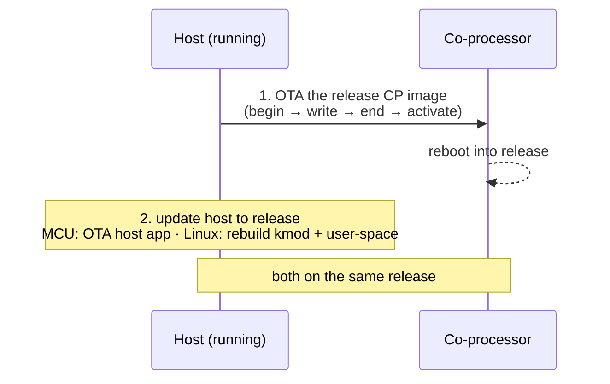

This migration guide documents key changes in ESP-Hosted that users must be aware of when migrating from older versions.

#### Index
1. [2.5.2 - Bluetooth Controller on Co-Processor Disabled by Default](#coloryellow-text252---bluetooth-controller-on-co-processor-disabled-by-default)
2. [2.6.0 - ESP-Hosted Slave OTA](#coloryellow-text260---esp-hosted-slave-ota)
3. [2.11.0 - ESP-Hosted Host Driver](#coloryellow-text2110---esp-hosted-host-driver)
4. [2.12.4 - Custom Msg Callback - User Ptr](#coloryellow-text2124---custom-msg-callback---user-ptr)
5. [3.0.0 - Migration to the Unified Release](#coloryellow-text300---migration-to-the-unified-release)

# $${\color{yellow} \text{3.0.0 - Migration to the Unified Release}}$$

This release runs RPC-V2 on both MCU and Linux hosts. Migrate the
**co-processor first, then the host**: the running host OTAs the co-processor
over the existing link, so update the co-processor to the release image first,
then bring the host to the same release. Finish with both on the same release.

The OTA transfer itself — `esp_hosted_slave_ota_begin()` → repeated
`esp_hosted_slave_ota_write()` → `esp_hosted_slave_ota_end()` →
`esp_hosted_slave_ota_activate()` — is shown end to end in
[ota/coprocessor_ota](../examples/ota/coprocessor_ota/README.md). This section
covers only the migration steps and the supported pairs.

## Upgrade steps



## MCU host

### Supported pairs

| Running host | Running co-processor | Result | Required action |
| --- | --- | --- | --- |
| 3.0.0 | 3.0.0 | Supported - Perfect. | None. |
| 3.0.0 **MCU host** | 2.x.x, 1.x.x, 0.0.6+ (streaming) | Supported (back-compat), strongly recommended upgrade | OTA the co-processor to the release image. |
| <3.0.0 | 3.0.0 | Not supported | OTA the host image to 3.0.0, then validate the feature pair. |

## Linux host

### Supported pairs

(RPC-V2) is default for MCU. Linux now migrated to (RPC-V2) from (RPC-V1). RPC messaging framing is changed from older Linux FG releases.

**Difference:**
(RPC-V1) - Older Linux used protobuf serialised custom 'CtrlMsg' structures. 
(RPC-V2) - New unified RPC for MCU hosts and Linux hosts. now all three, co-processor, Linux and MCU host use same custom `RPC` structures.

| Running host | Running co-processor | Result | Required action |
| --- | --- | --- | --- |
| 3.0.0 (RPC-V2) | 3.0.0 (RPC-V2) | Supported — Perfect. | None. |
| Legacy FG Linux 1.x (RPC-V1) | 3.0.0 **(RPC-V1, build-time per generation)** | Supported for OTA purpose; phased deprecation planned | Build the co-processor for the FG generation (`CONFIG_ESP_HOSTED_CP_LINUX_PEER_FG_V1`); Plan OTA to 3.0.0 co-processor soon. |
| Legacy FG Linux 2.x (RPC-V1) | 3.0.0 **(RPC-V1, build-time per generation)** | Supported for OTA purpose; phased deprecation planned | Build the co-processor for the FG generation (`CONFIG_ESP_HOSTED_CP_LINUX_PEER_FG_V2`); Plan OTA to 3.0.0 co-processor soon. |
| FG Linux 1.x / 2.x (RPC-V1) | 3.0.0 co-processor (RPC-V2) | Not supported — wire RPC versions differ. | Build the co-processor for the FG generation (RPC-V1) as above, or move the host to 3.0.0. |

> The Current **3.0.0 Linux host is RPC-V2 / SW-AGGR only** — it pairs with a current 3.0.0 co-processor and does **not** back-compat with FG (1.x / 2.x) slaves. FG interop is the other way round: an upstream **FG Linux host** with a 3.0.0 co-processor built for that generation.

### Staged rollout keeping a legacy FG host

To keep a legacy FG Linux host running for a while, build a co-processor image
matching its generation. One image per generation — a co-processor binary does
not switch RPC version at runtime:

```text
Configure coprocessor → Which host this coprocessor connects to?
  → Linux userspace host (802.3)
     Linux host generation:
       Upstream fg 1.x host (RPC V1)   CONFIG_ESP_HOSTED_CP_LINUX_PEER_FG_V1=y
       Upstream fg 2.x host (RPC V1)   CONFIG_ESP_HOSTED_CP_LINUX_PEER_FG_V2=y
```

## Limitations

1. ESP-Hosted-NG has not yet been migrated.
2. Existing ESP-Hosted-FG Linux applications are **not** source-compatible and require migration (explained below).

## Maintainability

### Issues

- Linux FG used a context-aware shortcut layer instead of the MCU RPC interface, despite sharing the same RPC structures and headers.
- Maintaining separate Linux and MCU implementations across multiple co-processors was difficult, and one implementation often lagged behind the other.

### Resolution

Linux user space now uses the **exact same RPC interface** as MCU hosts ([esp-hosted-mcu](https://github.com/espressif/esp-hosted-mcu)).

## Flexibility

1. Linux and MCU applications now follow the same programming model.

- The same ESP-IDF Wi-Fi APIs are used on both platforms.
- Standard ESP-IDF Wi-Fi examples can now be reused on Linux with little or no changes.

For example, Linux and MCU applications can follow the familiar ESP-IDF flow:

```c
esp_wifi_init();
esp_wifi_start();
/* Wait for STA_STARTED */
esp_wifi_connect();
/* Wait for other Wi-Fi or IP esp_event and integration */

2. Same co-processor usable be it Linux or MCU host

----

# $${\color{yellow} \text{2.12.4 - Custom Msg Callback - User Ptr}}$$

## Migration needed from versions


| Firmware | Version    | Migration required |
| -------- | ---------- | ------------------ |
| Host     | < 2.12.4  | ✅                  |
| Slave    | < 2.12.4  | ✅                  |

## Reason for change

1. `esp_hosted_register_custom_callback()` now supports a user-provided pointer to be passed back on every callback invocation.
2. This allows external code to maintain per-callback context without global variables.

### Old API

```c
esp_err_t esp_hosted_register_custom_callback(
    uint32_t msg_id,
    void (*callback)(uint32_t msg_id, const uint8_t *data, size_t data_len));

esp_err_t esp_hosted_send_custom_data(uint32_t msg_id, const uint8_t *data, size_t data_len);
```

### New API

```c
esp_err_t esp_hosted_register_custom_callback(uint32_t msg_id_exp,
    void (*callback)(uint32_t msg_id_recvd, const uint8_t *data_recvd, size_t data_len_recvd, void *local_context), // <-- Changed
    void *local_context); // <-- Extra argument

esp_err_t esp_hosted_send_custom_data(uint32_t msg_id_to_send, const uint8_t *data_to_send, size_t data_len_to_send); // no logical change
```

*Arguments:*

* `msg_id` – message ID to register
* :zap: `callback` – function pointer to handle the message (adds void* as last arg)
* :zap: `user` – user-provided pointer returned on every callback invocation

*Returns:* `ESP_OK` on success, or an error code on failure.


#  $${\color{yellow} \text{2.11.0 - ESP-Hosted Host Driver}}$$

## Migration needed from versions

| Host version | wifi-remote version |
| ------------ | ------------------- |
| < 2.11.0     | < 1.3.1             |

1. A double-free memory error can occur in some situations when ESP-Hosted Host receives network data and passes it to the netif `rx()` function (registered by netif via the wifi-remote component) for processing.

2. This error is resolved in ESP-Hosted v2.11.1. It must be used with wifi-remote v1.3.1 or greater to prevent a memory leak condition during netif initialization.

#  $${\color{yellow} \text{2.6.0 - ESP-Hosted Slave OTA}}$$


## Migration needed from versions

| Slave version | Host version |
| ------------- | ------------ |
| > 2.5.X      | > 2.5.X     |

## Reason for change

1. The existing `esp_hosted_slave_ota()` API was restrictive, supporting only HTTP-based OTA updates.
   The OTA APIs are now exposed so developers can implement their own OTA mechanisms.
2. The port layer previously contained OTA logic, which forced inclusion of the HTTP client in the host codebase even when not required.

## Changes required on host

If you are migrating from the old `esp_hosted_slave_ota()` function, update your code as follows.

### Old API (deprecated)

```c
#include "esp_hosted.h"

const char *image_url = "http://example.com/network_adapter.bin";
esp_err_t ret = esp_hosted_slave_ota(image_url);
if (ret != ESP_OK) {
    printf("OTA update failed[%d]\n", ret);
}
```

## New APIs

The co-processor OTA process is now performed using the following APIs.

### `esp_hosted_slave_ota_begin()`

```c
esp_err_t esp_hosted_slave_ota_begin(void);
```

Initializes the OTA process on the co-processor.

* Arguments: None
* Returns: `ESP_OK` on success, or an error code on failure
* What it does:

  * Prepares the co-processor for firmware reception
  * Allocates OTA buffers
  * Sets up the OTA partition on the co-processor

### `esp_hosted_slave_ota_write()`

```c
esp_err_t esp_hosted_slave_ota_write(const void *data, size_t size);
```

Sends firmware data chunks to the co-processor.

* Arguments:

  * `data`: Pointer to firmware data chunk
  * `size`: Size of the data chunk (typically 1400–1500 bytes)
* Returns: `ESP_OK` on success, or an error code on failure
* What it does:

  * Transmits firmware data over ESP-Hosted transport (SDIO/SPI/UART)
  * The co-processor writes data to its OTA partition
  * Can be called multiple times for large firmware images

### `esp_hosted_slave_ota_end()`

```c
esp_err_t esp_hosted_slave_ota_end(void);
```

Finalizes the OTA process.

* Arguments: None
* Returns: `ESP_OK` on success, or an error code on failure
* What it does:

  * Validates the complete firmware image on the co-processor
  * Calculates and verifies checksums
  * Marks the new firmware as valid but not yet active

### `esp_hosted_slave_ota_activate()`

```c
esp_err_t esp_hosted_slave_ota_activate(void);
```

Activates the newly flashed firmware.

* Arguments: None
* Returns: `ESP_OK` on success, or an error code on failure
* What it does:

  * Switches the co-processor’s boot partition to the new firmware
  * Triggers co-processor reboot with the new firmware
  * Note: After this call, the co-processor restarts with the new firmware

## How to use the new APIs

A dedicated example demonstrates the usage of the new OTA APIs:
[Slave OTA using ESP-Hosted transport](../examples/ota/coprocessor_ota/README.md)

> [!TIP]
> The example uses the new dedicated co-processor OTA APIs.
> You can reuse or customize it for your own OTA workflow.

Example methods supported:

| Method           | Description                                                                                                                                 |
| ---------------- | ------------------------------------------------------------------------------------------------------------------------------------------- |
| Partition method | Slave firmware binary stored in Host’s partition table (`slave_fw` partition). Requires an extra host partition, but no Wi-Fi connectivity. |
| LittleFS method  | Host partition formatted as LittleFS and stores the co-processor firmware. Requires an extra host partition, but no Wi-Fi connectivity.            |
| HTTPS method     | Slave firmware binary hosted on an HTTPS server. No extra host partition needed, but requires Wi-Fi connectivity.                           |

# $${\color{yellow} \text{2.5.2 - Bluetooth Controller on Co-Processor Disabled by Default}}$$

## Migration needed from versions

| Slave version | Host version |
| ------------- | ------------ |
| > 2.5.1       | > 2.5.1      |

Before v2.5.2, the Bluetooth controller on the co-processor was initialized and enabled by default.
From v2.5.2 onwards, it starts in a disabled state.

## Reason for change

This allows users to modify the Bluetooth MAC address before the controller is initialized, as it can only be changed prior to enabling the controller.

## New APIs

### `esp_hosted_bt_controller_init()`

```c
esp_err_t esp_hosted_bt_controller_init(void);
```

Initializes the Bluetooth controller on the co-processor.

* Arguments: None
* Returns: `ESP_OK` on success, or an error code on failure
* What it does:

  * Allocates and initializes controller resources
  * Prepares the controller for activation

### `esp_hosted_bt_controller_deinit()`

```c
esp_err_t esp_hosted_bt_controller_deinit(bool mem_release);
```

Deinitializes the Bluetooth controller on the co-processor.

* Arguments:

  * `mem_release`: If true, releases controller memory (cannot be reused)
* Returns: `ESP_OK` on success, or an error code on failure
* What it does:

  * Stops the Bluetooth controller
  * Optionally releases memory used by the controller
  * Once released, the controller cannot be reinitialized without reboot

### `esp_hosted_bt_controller_enable()`

```c
esp_err_t esp_hosted_bt_controller_enable(void);
```

Enables the Bluetooth controller on the co-processor.

* Arguments: None
* Returns: `ESP_OK` on success, or an error code on failure
* What it does:

  * Starts the Bluetooth controller task
  * Enables radio and HCI interfaces for Bluetooth operation

### `esp_hosted_bt_controller_disable()`

```c
esp_err_t esp_hosted_bt_controller_disable(void);
```

Disables the Bluetooth controller on the co-processor.

* Arguments: None
* Returns: `ESP_OK` on success, or an error code on failure
* What it does:

  * Gracefully stops the controller
  * Disables the Bluetooth radio
  * Must be called before deinitializing the controller

## Changes required on host

Before starting the Bluetooth stack on the host:

1. Call `esp_hosted_connect_to_slave()` to establish a connection with the co-processor.
2. (Optional) Set the Bluetooth MAC address using `esp_hosted_iface_mac_addr_set()`.
3. Initialize the Bluetooth controller using `esp_hosted_bt_controller_init()`.
4. Enable the Bluetooth controller using `esp_hosted_bt_controller_enable()`.

See [Initializing the Bluetooth Controller](features/bluetooth.md) for more details.

## How to use the new APIs

You can now start the host Bluetooth stack and use Bluetooth as usual.
All ESP-Hosted Bluetooth host examples (NimBLE and BlueDroid) have been updated accordingly.

For an example showing how to change the BT MAC address before starting the controller, refer to:
[BT Controller Example](../examples/bluetooth/README.md)
