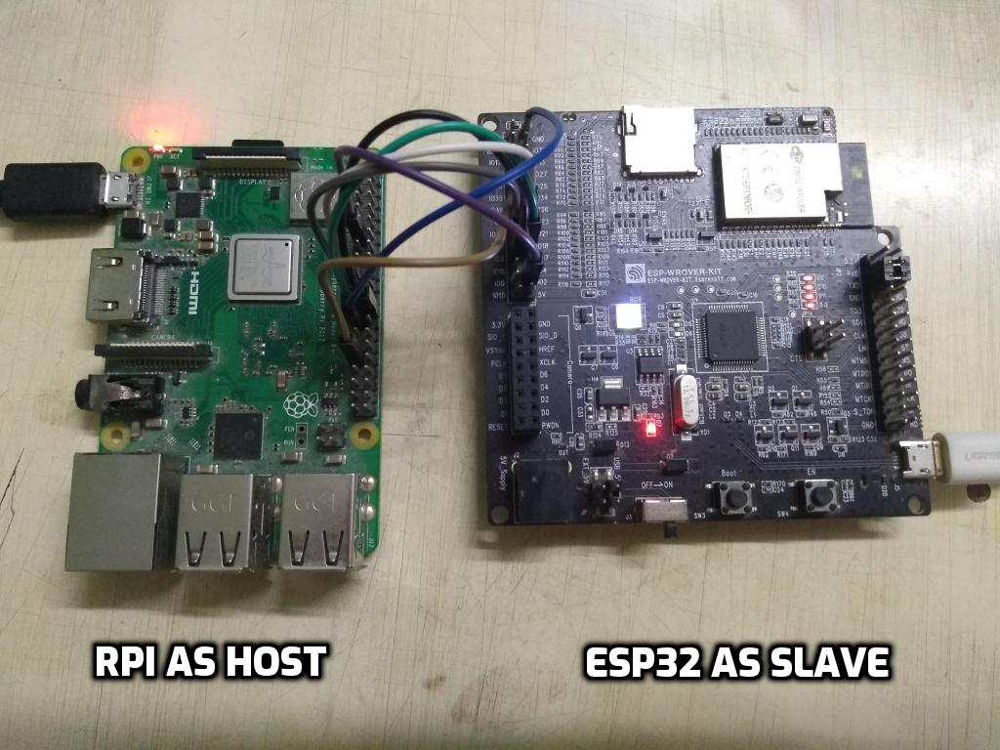
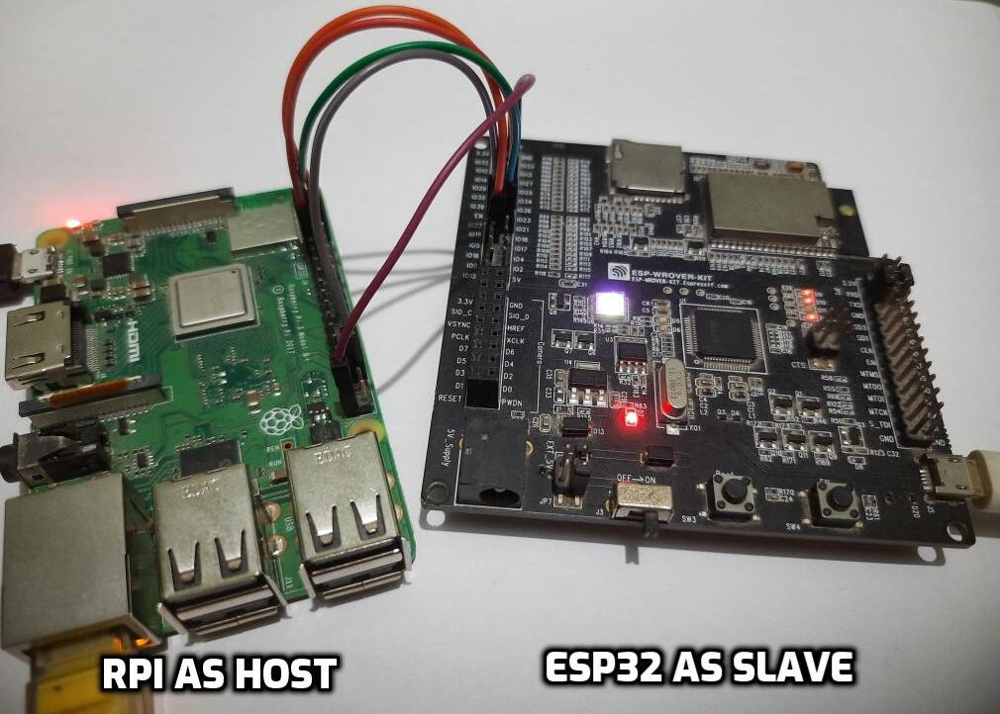

# ESP-Hosted-cfg80211 Setup

[TOC]

## 1 Setup Introduction

- In this setup, ESP board acts as a SDIO/SPI/UART peripheral and provides Wi-Fi and/or Bluetooth capabilities to host. Please connect ESP peripheral to Raspberry-Pi with jumper cables as mentioned below. It is always good to use small length cables to ensure signal integrity
- Power Raspberry Pi separately with a correct adapter, which confirms the expected power rating for your board. Incorrect power adapters may lead in non working or poor performace of peripherals
- ESP can be powered through PC using micro-USB cable.
- Raspberry-Pi pinout can be found [here!](https://pinout.xyz/pinout/sdio)
- ESP-Hosted can be used in one of below possible configurations
	- SDIO (Wi-Fi and/or Bluetooth over SDIO)
	- SPI  (Wi-Fi and/or Bluetooth over SPI)
	- UART  (Bluetooth over UART)
	- SDIO+UART  (Wi-Fi over SDIO and Bluetooth over UART)
	- SPI+UART  (Wi-Fi over SPI and Bluetooth over UART)


## 2 SDIO

### 2.1 SDIO hardware setup

- Raspberry-Pi pinout for SDIO can be found [here!](https://pinout.xyz/pinout/sdio)
- Sample setup image is shown below.


##### 2.1.1 Pin connections

| Raspberry-Pi Pin | ESP Pin | Function |
|:-------:|:---------:|:--------:|
| 13 | IO13 | DAT3 |
| 15 | IO14 | CLK |
| 16 | IO15 | CMD |
| 18 | IO2 | DAT0 |
| 22 | IO4 | DAT1 |
| 31 | EN  | ESP Reset |
| 37 | IO12 | DAT2 |
| 39 | GND | GND |


##### 2.1.2 Additional Pull-ups
- In general, For Most of ESP32 boards, additional pull-up of 10 kOhm resistor will be required for pins CMD and DATA(DAT0-DAT3) lines.
- Additional Pull-ups may be required depending on exact ESP chipset you use. Please find details [here](https://docs.espressif.com/projects/esp-idf/en/latest/esp32/api-reference/peripherals/sd_pullup_requirements.html)

##### 2.1.3 Length of jumper cables

- SDIO is very sensitive protocol. We suggest breadboard or PCB like connections for SDIO signal integrity. If you are going to use jumper wires for testing purpose, please make sure length of wires be minimal(< 6cm) and all to be equal length.

### 2.2 SDIO software setup

- By default, the SDIO pins of Raspberry-pi are not configured and are internally used for built-in Wi-Fi interface. Please enable SDIO pins by appending following line to _/boot/config.txt_ file
```
dtoverlay=sdio,poll_once=off
dtoverlay=disable-bt
```
- Please reboot Raspberry-Pi after changing this file.
```sh
$ sudo sync; sudo reboot
```

#### 2.3 Build and load kernel module

```sh
$ bash rpi_init.sh sdio
```
This script should:
- Unload existing ESP SDIO kernel module
- Build and load ESP SDIO kernel module
- sleep for 4 seconds to allow smooth loading of kernel module
- Bringup `espsta0` network interface
- Note: This script uses `ifconfig` tool. In case you do not have, please use alternative software to bring up the `espsta0` network interface.
- This should facilitate to run Wi-Fi over SDIO + Bluetooth(HCI) over SDIO interface.

#### 2.4 Load ESP binaries
- One can load pre-built release binaries on ESP peripheral. Below subsection explains this.
- Source code is not available at the moment due to some technical issues. But should soon be available in upcoming releases.
- Download pre-built firmware binaries from [releases](https://github.com/espressif/esp-hosted-cfg80211-drv/releases)
- Linux users can run below command to flash these binaries. Edit <serial_port> with ESP peripheral's serial port.
```sh
$ python esptool.py --chip <esp_chipset> --port <serial_port> --baud <flash_baud_rate> \
		--before default_reset --after hard_reset write_flash --flash_mode dio \
		--flash_size detect --flash_freq 40m \
		0x1000 esp_hosted_cfg80211_bootloader_esp32_<solution_type>_v<release_version>.bin \
		0x8000 esp_hosted_cfg80211_partition-table_esp32_<solution_type>_v<release_version>.bin \
		0xd000 esp_hosted_cfg80211_ota_data_initial_esp32_<solution_type>_v<release_version>.bin \
		0x10000 esp_hosted_cfg80211_firmware_esp32_<solution_type>_v<release_version>.bin
```
Where, \
	\<esp_chipset\>      : esp32 \
	\<solution_type\>    : sdio/sdio+uart \
	\<serial_port\>      : serial port of ESP peripheral \
	\<flash_baud_rate\>  : flash baud rate of ESP peripheral, ex.115200, 921600, 2Mbps \
	\<release_version\>  : 1.0.x,1.1.x etc. Latest from [release page](https://github.com/espressif/esp-hosted-cfg80211-drv/releases)

- This command will flash `SDIO` interface binaries on `esp32` chip.
- Windows user can use ESP Flash Programming Tool to flash the pre-built binary.

#### 2.5 Sample log
Host side dmesg log for
- Wi-Fi over SDIO + Bluetooth i.e. HCI over SDIO
```
[ 1705.486673] mmc1: queuing unknown CIS tuple 0x01 (3 bytes)
[ 1705.494623] mmc1: queuing unknown CIS tuple 0x1a (5 bytes)
[ 1705.498107] mmc1: queuing unknown CIS tuple 0x1b (8 bytes)
[ 1705.500971] mmc1: queuing unknown CIS tuple 0x80 (1 bytes)
[ 1705.501123] mmc1: queuing unknown CIS tuple 0x81 (1 bytes)
[ 1705.501273] mmc1: queuing unknown CIS tuple 0x82 (1 bytes)
[ 1705.503694] mmc1: queuing unknown CIS tuple 0x80 (1 bytes)
[ 1705.503845] mmc1: queuing unknown CIS tuple 0x81 (1 bytes)
[ 1705.503994] mmc1: queuing unknown CIS tuple 0x82 (1 bytes)
[ 1705.504274] mmc1: new SDIO card at address 0001
[ 1705.504873] esp_probe: ESP network device detected
[ 1706.329475]
[ 1706.329475] Received ESP bootup event
[ 1706.329529] EVENT: 3
[ 1706.329556] ESP chipset detected [esp32]
[ 1706.329584] EVENT: 0
[ 1706.329610] ESP peripheral capabilities: 0x1d
[ 1706.544526] ESP Bluetooth init
[ 1706.544923] Capabilities: 0x1d. Features supported are:
[ 1706.544956]   * WLAN on SDIO
[ 1706.544996]   * BT/BLE
[ 1706.545022]     - HCI over SDIO
[ 1706.545048]     - BT/BLE dual mode
[ 1706.545075] EVENT: 1
[ 1706.545101] esp32: process_fw_data ESP chipset's last reset cause:
[ 1706.545115] POWERON_RESET
[ 1706.545158] esp32: ESP Firmware version: 0.1.0
[ 1706.566837] esp_sdio: probe of mmc1:0001:2 failed with error -22
[ 1706.653322] esp_set_mac_address:298 24:6f:28:80:2c:34
[ 7713.746559] esp_reset, ESP32: Triggering ESP reset.
[ 7713.964679] esp_sdio: probe of mmc1:0001:1 failed with error -110
[ 7713.964759] esp_sdio: probe of mmc1:0001:2 failed with error -110	
```


## 3 SPI

### 3.1 SPI hardware setup

- Raspberry-Pi pinout for SPI can be found [here!](https://pinout.xyz/pinout/spi)
- Sample setup image is shown below.



##### 3.1.1 Pin connections
| Raspberry-Pi Pin | ESP32 Pin | Function |
|:-------:|:---------:|:--------:|
| 24 | IO15 | CS0 |
| 23 | IO14 | SCLK |
| 21 | IO12 | MISO |
| 19 | IO13 | MOSI |
| 25 | GND | Ground |
| 15 | IO2 | Handshake |
| 13 | IO4 | Data Ready |
| 31 | EN  | ESP32 Reset |

##### 3.1.2 Length of jumper cables

- We suggest breadboard or PCB like connections for better signal integrity. If you are going to use jumper wires for testing purpose, please make sure length of wires be minimal(<= 10cm) and all to be equal length.

### 3.2 SPI software setup

- The SPI master driver is disabled by default on Raspberry-Pi OS. To enable it add following commands in  _/boot/config.txt_ file
```
dtparam=spi=on
dtoverlay=disable-bt
```
- In addition, below options are set as the SPI clock frequency in analyzer is observed to be smaller than expected clock. This is RaspberryPi specific [issue](https://github.com/raspberrypi/linux/issues/2286). Below are recommended settings to get close to expected clock
```
core_freq=250
core_freq_min=250
```
- Please reboot Raspberry-Pi after changing this file.

#### 3.3 Build and load kernel module
```sh
$ bash rpi_init.sh spi
```
This script should:
- Disable spidev user space driver for SPI
- Unload existing ESP SPI kernel module
- Build and load ESP SPI kernel module
- sleep for 4 seconds to allow smooth loading of kernel module
- Bringup `espsta0` network interface
- Note: This script uses `ifconfig` tool. In case you do not have, please use alternative software to bring up the `espsta0` network interface.
- This should facilitate to run Wi-Fi over SPI + Bluetooth(HCI) over SPI interface.

#### 3.4 Load ESP binaries

- One can load pre-built release binaries on ESP peripheral. Below subsection explains this.
- Source code is not available at the moment due to some technical issues. But should soon be available in upcoming releases.
- Download pre-built firmware binaries from [releases](https://github.com/espressif/esp-hosted-cfg80211-drv/releases)
- Linux users can run below command to flash these binaries. Edit <serial_port> with ESP peripheral's serial port.
```sh
$ python esptool.py --chip <esp_chipset> --port <serial_port> --baud <flash_baud_rate> \
		--before default_reset --after hard_reset write_flash --flash_mode dio \
		--flash_size detect --flash_freq 40m \
		0x1000 esp_hosted_cfg80211_bootloader_esp32_<solution_type>_v<release_version>.bin \
		0x8000 esp_hosted_cfg80211_partition-table_esp32_<solution_type>_v<release_version>.bin \
		0xd000 esp_hosted_cfg80211_ota_data_initial_esp32_<solution_type>_v<release_version>.bin \
		0x10000 esp_hosted_cfg80211_firmware_esp32_<solution_type>_v<release_version>.bin
```
Where, \
	\<esp_chipset\>      : esp32 \
	\<solution_type\>    : spi/spi+uart \
	\<serial_port\>      : serial port of ESP peripheral \
	\<flash_baud_rate\>  : flash baud rate of ESP peripheral, ex.115200, 921600, 2Mbps \
	\<release_version\>  : 1.0.x,1.1.x etc. Latest from [release page](https://github.com/espressif/esp-hosted-cfg80211-drv/releases)

- This command will flash `SDIO` interface binaries on `esp32` chip.
- Windows user can use ESP Flash Programming Tool to flash the pre-built binary.

#### 3.5 Sample log
Host side dmesg log for
- Wi-Fi over SPI + Bluetooth i.e. HCI over SPI
```
[  759.992895] esp_reset, ESP32: Triggering ESP reset.
[  760.205113] ESP32 peripheral is registered to SPI bus [0],chip select [0], SPI Clock [10]
[  762.319775]
[  762.319775] Received ESP bootup event
[  762.319828] EVENT: 3
[  762.319856] EVENT: 2
[  762.319882] EVENT: 0
[  762.319907] EVENT: 1
[  762.319934] esp32: process_fw_data ESP chipset's last reset cause:
[  762.319948] POWERON_RESET
[  762.319990] esp32: ESP Firmware version: 0.1.0
[  762.320019] ESP peripheral capabilities: 0x78
[  762.534406] ESP Bluetooth init
[  762.534801] Capabilities: 0x78. Features supported are:
[  762.534833]   * WLAN on SPI
[  762.534859]   * BT/BLE
[  762.534884]     - HCI over SPI
[  762.534910]     - BT/BLE dual mode
[  762.640789] esp_set_mac_address:298 24:6f:28:80:2c:34
[  764.539425] Connection request: Ym2 ec:d0:9f:53:16:c3 11
[  764.601285] Connection status: 0
[  764.624788] mac: c4ad2054: ec d0 9f 53 16 c3                                ...S..
[  764.634096] mac: 4c9260b8: ff ff ff ff ff ff                                ......
[  764.641506] IPv6: ADDRCONF(NETDEV_CHANGE): espsta0: link becomes ready
```


## 4 UART

### 4.1 UART hardware setup

- Raspberry-Pi pinout for UART can be found [here!](https://pinout.xyz/pinout/uart)
- Sample setup image is shown below.

- UART only provides Bluetooth capabilities. UART should always be paired with either [SDIO](#2-sdio) or [SPI](#3-spi)
- (SDIO+UART)
	- Follow [SDIO](#2-sdio) and below UART documentation.
- (SPI+UART)
	- Follow [SPI](#3-spi) and below UART documentation.

##### 4.1.1 Pin connections

| Raspberry-Pi Pin Function | Raspberry-Pi Pin | ESP32 Pin | ESP32 Pin Function |
|:-------:|:--------:|:---------:|:--------:|
| RX | 10 | IO5 | TX |
| TX | 8 | IO18 | RX |
| CTS | 36 | IO19 | RTS |
| RTS | 11 | IO23 | CTS |
| Ground | 39 | GND | Ground |

##### 4.1.2 Length of jumper cables
- We suggest breadboard or PCB like connections for better signal integrity. If you are going to use jumper wires for testing purpose, please make sure length of wires be minimal(<= 10cm) and all to be equal length.

### 4.2 UART software setup

- The UART master driver is disabled by default on Raspberry-Pi OS. To enable it add following commands in  _/boot/config.txt_ file
	- Enable UART pins and disable in built bluetooth on Raspberry-Pi by appending following lines to _/boot/config.txt_ file
	```
	enable_uart=1
	dtoverlay=disable-bt
	```
- Remove following from _/boot/cmdline.txt_. Leave everything else untouched.
```
console=serial0,115200
```

	- e.g. If _/boot/cmdline.txt_ is as below:
	```
	$ cat /boot/cmdline.txt
	dwc_otg.lpm_enable=0 console=tty1 console=serial0,115200 root=PARTUUID=5c2c80d1-02 rootfstype=ext4 elevator=deadline fsck.repair=yes rootwait quiet splash plymouth.ignore-serial-consoles spidev.bufsiz=32768
	````
	Then after removal of above mentioned arguments, it should look as below:
	```
	$ cat /boot/cmdline.txt
	dwc_otg.lpm_enable=0 console=tty1 root=PARTUUID=5c2c80d1-02 rootfstype=ext4 elevator=deadline fsck.repair=yes rootwait quiet splash plymouth.ignore-serial-consoles spidev.bufsiz=32768
	```
- Disable hciuart on Raspberry-Pi
```
$ sudo systemctl disable hciuart
```
- Reboot Raspberry-Pi


#### 4.3 Build and load kernel module
- Wi-Fi over SDIO + Bluetooth over UART (SDIO+UART)
```sh
$ bash rpi_init.sh sdio btuart
```
- Wi-Fi over SPI + Bluetooth over UART (SPI+UART)
```sh
$ bash rpi_init.sh spi btuart
```
- These scripts should:
	- In (SPI+UART) case, Disable spidev user space driver for SPI
	- Unload existing ESP SPI kernel module
	- Build and load ESP SPI kernel module
	- sleep for 4 seconds to allow smooth loading of kernel module
	- Bringup `espsta0` network interface
	- Note: This script uses `ifconfig` tool. In case you do not have, please use alternative software to bring up the `espsta0` network interface.

#### 4.4 Load ESP binaries
- One can load pre-built release binaries on ESP peripheral. Below subsection explains this.
- Source code is not available at the moment due to some technical issues. But should soon be available in upcoming releases.
- Download pre-built firmware binaries from [releases](https://github.com/espressif/esp-hosted-cfg80211-drv/releases)
- Linux users can run below command to flash these binaries. Edit <serial_port> with ESP peripheral's serial port.
```sh
$ python esptool.py --chip <esp_chipset> --port <serial_port> --baud <flash_baud_rate> \
		--before default_reset --after hard_reset write_flash --flash_mode dio \
		--flash_size detect --flash_freq 40m \
		0x1000 esp_hosted_cfg80211_bootloader_esp32_<solution_type>_v<release_version>.bin \
		0x8000 esp_hosted_cfg80211_partition-table_esp32_<solution_type>_v<release_version>.bin \
		0xd000 esp_hosted_cfg80211_ota_data_initial_esp32_<solution_type>_v<release_version>.bin \
		0x10000 esp_hosted_cfg80211_firmware_esp32_<solution_type>_v<release_version>.bin
```
Where, \
	\<esp_chipset\>      : esp32 \
	\<solution_type\>    : sdio+uart/spi+uart \
	\<serial_port\>      : serial port of ESP peripheral \
	\<flash_baud_rate\>  : flash baud rate of ESP peripheral, ex.115200, 921600, 2Mbps \
	\<release_version\>  : 1.0.x,1.1.x etc. Latest from [release page](https://github.com/espressif/esp-hosted-cfg80211-drv/releases)

- This command will flash `SDIO+UART` or `SPI+UART` interface binaries on esp chipset.
- Windows user can use ESP Flash Programming Tool to flash the pre-built binary.

#### 4.5 Attach HCI at Host
- **After setting up host and loading ESP firmware**, execute below command to create `hci0` interface
    ```sh
    $ sudo hciattach -s <baud_rate> /dev/serial0 any <baud_rate> flow
    ```
- <baud_rate> should match UART baud rate while flashing ESP peripheral

#### 4.6 Sample log
- (SDIO+UART)
	- dmesg log should be exactly same as [SDIO log](#25-sample-log) with `HCI over UART` instead of `HCI over SDIO`
- (SPI+UART)
	- dmesg log should be exactly same as [SPI log](#35-sample-log) with `HCI over UART` instead of `HCI over SPI`


## 5. Troubleshoot Setup Problems

After following above steps, the host software should be loaded fine. Bootup event from ESP should already would have sent and Host should have received it.

If Bootup event is not recieved in host `dmesg` as sample log above, please try following:

- Please check your connections to be firm
- Try with smaller wires
- Check correct Pull-Ups are in place
- If using different host than Raspberry-Pi, please check [porting guide](porting_guide.md)
- Check [Troubleshoot Guide](./Troubleshoot.md) for further details


