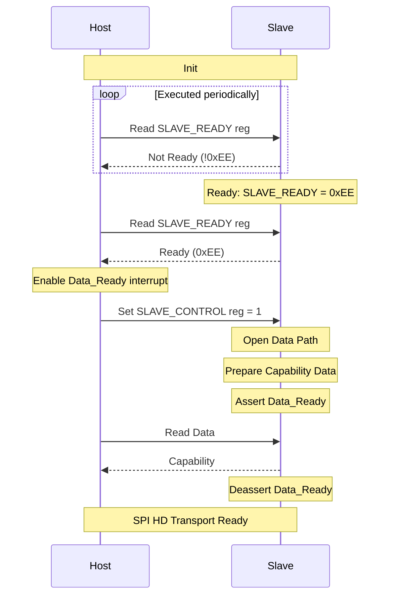
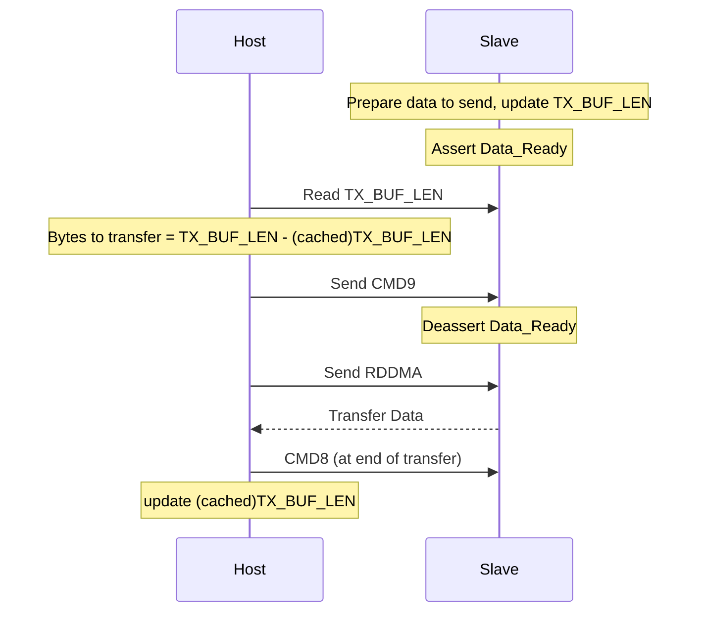
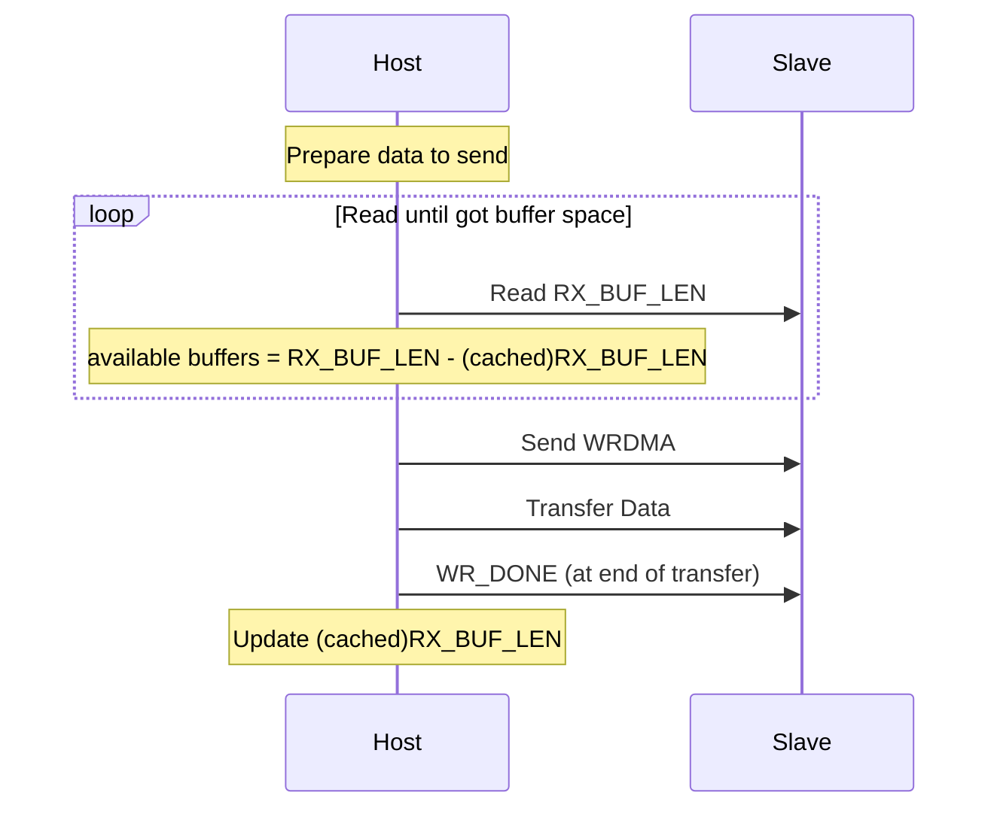

# ESP-Hosted SPI HD (Half Duplex) Operation

**Table of Contents**

- [1. Introduction](#1-introduction)
- [2. SPI HD Configuration](#2-spi-hd-configuration)
  - [2.1. Clock and Phase](#21-clock-and-phase)
  - [2.2. Number of Data Lines](#22-number-of-data-lines)
  - [2.3. Extra GPIO Signal Required](#23-extra-gpio-signal-required)
  - [2.4. Recommended Pin Assignments](#24-recommended-pin-assignments)
- [3. SPI HD protocol used by Hosted](#3-spi-hd-protocol-used-by-hosted)
  - [3.1. Data IO Modes](#31-data-io-modes)
  - [3.2. Supported Commands](#32-supported-commands)
    - [3.2.1 Command Mask](#321-command-mask)
  - [3.3. Registers Used](#33-registers-used)
  - [3.4. Timing Diagrams](#34-timing-diagrams)
- [4. SPI HD Operation in Hosted](#4-spi-hd-operation-in-hosted)
  - [4.1 Transport Initialization](#41-transport-initialization)
    - [4.1.1. Slave and Host Initialization](#411-slave-and-host-initialization)
    - [4.1.2. Number of Data Lines Used](#412-number-of-data-lines-used)
  - [4.2. Slave Transfers Data to Host](#42-slave-transfers-data-to-host)
  - [4.3. Host Transfers Data to the Slave](#43-host-transfers-data-to-the-slave)
  - [4.4. Code Reference](#44-code-reference)
- [5. Hardware Considerations](#5-hardware-considerations)
  - [5.1. Jumper Wires](#51-jumper-wires)
  - [5.2 PCB Design](#52-pcb-design)
  - [5.3 Testing the SPI Connection](#53-testing-the-spi-connection)
- [6. References](#6-references)

## 1. Introduction

The ESP32 family of chips (except the ESP32) support the SPI Slave HD
(Half Duplex) Mode Protocol.

In this mode of operation, SPI supports 2 to 4 data lines to transfer
data to the slave or from the slave (half duplex) during an SPI
transaction. This is different from 'standard' SPI mode which
transfers data bidirectionally (full duplex) over two data lines (one
for host to slave data [MOSI], one for slave to host data [MISO]) during an SPI
transaction.

> [!NOTE]
> SPI Half Duplex mode is not supported on the ESP32

> [!IMPORTANT]
> SPI Half Duplex is not an industry standard and has multiple
> implementations. Make sure your host processor supports the SPI HD
> protocol implemented by the Hosted slave before proceeding. See [SPI
> HD protocol used by Hosted](#3-spi-hd-protocol-used-by-hosted).

## 2. SPI HD Configuration

To enable SPI HD on the Host and Slave using `Menuconfig`:

1. On Host: **Component config** ---> **ESP-Hosted config** --->
   **Transport layer** and choose **SPI Half-duplex**.
2. On Slave: **Example configuration** ---> **Transport layer** and
   choose **SPI Half-duplex**.

### 2.1. Clock and Phase

The standard SPI CPOL clock and CPHA phase must be configured
correctly on both the host and slave for the protocol to work.

### 2.2. Number of Data Lines

Both the host and slave can support two or four data lines. Four data
lines will be used to transfer data if configured on both the host and
slave. If the host is configured to use two data lines, only two lines
will be used to transfer data even if the slave is configured to use
four data lines.

### 2.3. Extra GPIO Signal Required

Extra GPIO signal are required for SPI HD on Hosted and can be
assigned to any free GPIO pins:

- `Data_Ready` signal: an output signal from the slave to the
  host. When asserted, the slave is telling the host that it has data
  to send. The host should perform a data read SPI transaction to
  fetch data from the slave.
- `Reset` signal: an output signal from the host to the slave. When
  asserted, the host resets the slave. This is done when ESP-Hosted is
  started on the host, to synchronise the state of the host and slave.

> [!NOTE]
> The `Reset` signal can be configured to connect to the `EN` or `RST`
> pin on the slave, or assigned to a GPIO pin on the slave.
>
> To configure this, use `Menuconfig` on the Slave: **Example
> configuration** ---> **SPI Half-duplex Configuration** --->
> **GPIOs** and set **Slave GPIO pin to reset itself**.

### 2.4. Recommended Pin Assignments

Using the pins already assigned to SPI signals (dedicated `IO_MUX`
pins) is recommended to minimise propagation delays. Using other GPIO
pins for SPI signals will route the signals through the GPIO matrix
which may limit the maximum clock frequency that can be used.

The following table shows the mapping between the SPI bus signals and
their SPI HD Function:

| SPI Bus Signal | SPI HD Function |
| :------------- | :-------------- |
| SPID           | Data Bit 0      |
| SPIQ           | Data Bit 1      |
| SPIWP          | Data Bit 2      |
| SPIHD          | Data Bit 3      |
| SPICLK         | Clk             |

The SPI HD CS signal and `Data_Ready` can be assigned to any GPIO pin on the host and
slave.

## 3. SPI HD protocol used by Hosted

Hosted uses the ESP SPI Slave HD (Half Duplex) Mode Protocol (see
[References](#6-references)) with some modifications.

### 3.1. Data IO Modes

When communicating with the slave, the master uses the Command,
Address, Dummy and Data phases during an SPI transaction. The number
of bits and number of data lines used in each phase are:

- **Command**: 8 bits, 1 data line
- **Address**: 8 bits, 2 or 4 data lines
- **Dummy**: 8 bits, 1 data line
- **Data**: variable length, 2 or 4 data lines

> [!NOTE]
> The number of data lines used in the Address and Data phase depends
> on the Command Mask in the Command sent by the host. See [Command
> Mask](#321-command-mask).

### 3.2. Supported Commands

Hosted uses the following SPI HD commands when communicating with the
slave:

| Command | OpCode | Purpose                                         |
| :---    | :---   | :---                                            |
| WRBUF   | 0x01   | Write to a 32-bit buffer register on the slave  |
| RDBUF   | 0x02   | Read from a 32-bit buffer register on the slave |
| WRDMA   | 0x03   | Write data to the slave using DMA               |
| RDDMA   | 0x04   | Read data from the slave during DMA             |
| WR_DONE | 0x07   | End of DMA write                                |
| CMD8    | 0x08   | End of DMA read                                 |
| CMD9    | 0x09   | End of register read                            |

#### 3.2.1 Command Mask

The Commands are masked with a command mask to tell the slave the
correct number of data lines to use during the transaction (2 or 4
data lines). Hosted uses the following masks, which are bit ORed with
the command during a SPI transactions:

| Mode   | Mask |
| :---   | :--- |
| 2-bits | 0x50 |
| 4-bits | 0xA0 |

For example, if the host sends command `0x51` (2-bit mask + WRBUF),
the host and slave will use 2 data lines to send the address and
data. If the host sends command `0xA1` (4-bit mask + WRBUF), the host
and slave will use 4 data lines to send the address and data.

The Command Mask determines the number of data lines used for the
transaction. Even if there are four data lines between the host and
slave, the host can tell the slave to use only two data lines by
applying the 0x50 command mask.

> [!WARNING]
> It is an error to apply the 4-bit data mask (0xA0) when there are
> only two data lines connecting the host and slave.

### 3.3. Registers Used

The ESP SPI Slave HD Mode Protocol defines a number of registers on
the slave. These registers are used in Hosted as follows:

| Register | Name              | Purpose                                       |
| :---     | :---              | :---                                          |
| 0x00     | SLAVE\_READY      | Indicates if slave is ready                   |
| 0x04     | MAX\_TX\_BUF\_LEN | Maximum length of DMA data slave can transmit |
| 0x08     | MAX\_RX\_BUF\_LEN | Maximum length of DMA data slave can receive  |
| 0x0C     | TX\_BUF\_LEN      | Updated whenever slave wants to transmit data |
| 0x10     | RX\_BUF\_LEN      | Updated whenever slave can receive data       |
| 0x14     | SLAVE\_CONTROL    | Controls slave operation                      |

### 3.4. Timing Diagrams

The following diagrams summarize the SPI transactions as used by Hosted:

*SPI Transaction using 4 data lines*

*SPI Transaction using 2 data lines*

## 4. SPI HD Operation in Hosted

### 4.1 Transport Initialization

#### 4.1.1. Slave and Host Initialization

The slave starts up and initialises the SPI HD transport. When the
slave is ready it writes the value `SLAVE_IS_READY` (0xEE) to the
SLAVE\_READY register.

The Host starts up and initialises the SPI HD transport. When ready, it
polls the SLAVE\_READY register on the slave until it reads the value
`SLAVE_IS_READY`.

Once slave is ready, host prepare for interrupts triggered by
`Data_Ready`, and sets bit 0 on the SLAVE\_CONTROL register to 1. This
opens the data path to the slave.

Both host and slave are now ready to communicate.

The first packet the slave transfers to the host is a Capabilities
Packet, stating what the slave is capable of supporting:

- WLAN, Bluetooth, etc.
- the number of data lines supported for SPI HD

The host uses this packet to determine what the slave is capable of
supporting.

*SPI HD Initialization Sequence*

#### 4.1.2. Number of Data Lines Used

After initialization, the host initially communicates with the slave
using two data lines. If the slave is capable of supporting four data
lines (from the Capabilities Packet sent by the slave), and the host
is configured to also use four data lines, then four data lines will
be used for subsequent data transfers.

If neither the host or slave is capable of transferring data using
four data lines, then only two data lines will be used.

### 4.2. Slave Transfers Data to Host

Slave asserts `Data_Ready` to tell the host it has data to send.

Host reads the TX\_BUF\_LEN register.

> [!NOTE]
> The upper 8-bits of the TX\_BUF\_LEN register are reserved, and
> should be masked out to get the correct read length from the
> TX\_BUF\_LEN register.

The host subtracts the read length from its cached read length
(initial value is zero) to discover how much more data the slave wants
to transfer to the host. The host can now read the data using the
RDDMA command, ending the transfer with CMD8. The host now updates its
cached read length with the slave's read length.

After reading TX\_BUF\_LEN register, host sends CMD9. This tells the
slave that the host has read the register and it is safe for the slave
to update the register (if required) and deassert the `Data_Ready`
signal.

*SPI HD Read Sequence*

### 4.3. Host Transfers Data to the Slave

Host reads the RX\_BUF\_LEN register to discover how many buffers are
available on the slave (each buffer is of size MAX\_RX\_BUF\_LEN). If
there are not enough buffers to store the data to be sent, the host
should wait and re-read the register until there are enough buffers.

Once there are enough buffers, the host can use WRDMA to send data,
ending each buffer transfer with WR_DONE.

*SPI HD Write Sequence*

### 4.4. Code Reference

- `slave/main/spi_hd_slave_api.c` implements the code to run the SPI
  HD driver on the slave
- `host/drivers/transport/spi_hd/spi_hd_drv.c` implements the generic
  code to run the SPI HD driver on the host
- `host/port/spi_hd_wrapper.c` implements the ESP-IDF specific code
  used by the generic SPI HD driver on the host

## 5. Hardware Considerations

### 5.1. Jumper Wires

While jumper wires can be used to test SPI, it is recommended to use
short wires (5 to 10 cm in length, shorter is better) to
minimise propagation delay and noise on the signals.

### 5.2 PCB Design

The PCB traces for SPI should be equal length and kept as short as
possible. The signals, especially the `CLK` signal, should be isolated
from other signals using a ground plane to minimise crosstalk.

### 5.3 Testing the SPI Connection

**Using a Lower Clock Speed**

You can use a lower clock speed to verify the connections. For SPI,
you can start with 10 MHz or lower.

To configure this, use `Menuconfig` on the Host: **Component
config** ---> **ESP-Hosted config** ---> **SPI Half-duplex Configuration**
and set **SPI HD Clock Freq (MHz)**.

> [!NOTE]
> The actual clock frequency used is determined by the hardware. Use
> an oscilloscope or logic analyzer to check the clock frequency.

**3.4.2. Using Two Data Lines**

You can configure SPI HD to use two data line only instead of
four. This will reduce noise on the signal lines and help you verify
that the SPI HD protocol is working at the logical level.

To configure this, use `Menuconfig` on the Host: **Component
config** ---> **ESP-Hosted config** ---> **SPI Half-duplex Configuration**
and set **Num Data Lines to use** to **2 data lines**.

You can leave the SPI HD configuration on the Hosted Slave as four
data lines, as the host determines the number of data lines to use. If
you want to change this, then on the slave use `Menuconfig`: **Example
Configuration** ---> **SPI Half-duplex Configuration** and set **Num
Data Lines to use** to **2 data lines**.

## 6. References

- ESP SPI Slave HD (Half Duplex) Mode Protocol: https://docs.espressif.com/projects/esp-idf/en/latest/esp32/api-reference/protocols/esp_spi_slave_protocol.html
