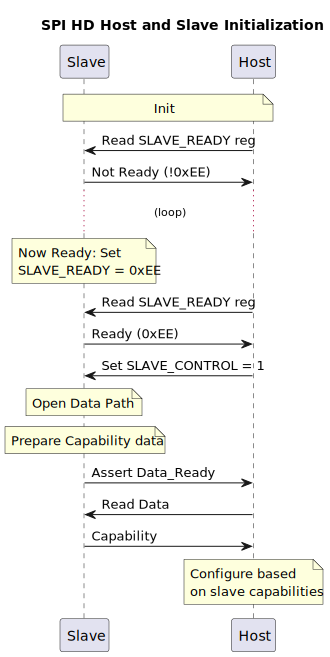
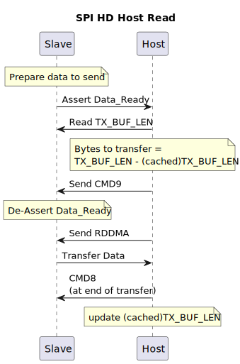
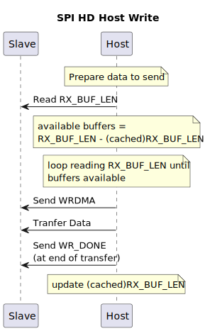

# ESP Hosted SPI HD (Half Duplex) Operation

## 1. Introduction

The ESP32 family of chips (except the ESP32) support the SPI Slave HD
(Half Duplex) Mode Protocol.

In this mode of operation, SPI supports 2 to 4 data lines to transfer
data to the slave or from the slave (half duplex) during an SPI
transaction. This is different from 'standard' SPI mode which
transfers data bidirectionally (full duplex) over two data lines (one
for host to slave data, one for slave to host data) during an SPI
transaction.

## 2. SPI HD Configuration

### 2.1. Clock and Phase

The standard SPI CPOL clock and CPHA phase must be configured
correctly on both the host and slave for the protocol to work.

### 2.2. Number of Data Lines

Both the host and slave can support two or four data lines. Four data
lines will be used to transfer data if configured on both the host and
slave. If the host is configured to use two data lines, only two lines
will be used to transfer data even if the slave is configured to use
four data lines.

### 2.3. Extra GPIO Signal Required

An extra GPIO signal (`Data_Ready`) is required from slave (output) to
host (input). This is used by the slave to signal to the host that it
has data to transfer to the host.

### 2.4. Recommended Pin Assignments

Using the pins already assigned to SPI signals (dedicated IO_MUX pins)
is recommended to minimise propagation delays. Using other GPIO pins
for SPI signals will route the signals through the GPIO matrix which
may limit the maximum clock frequency that can be used.

The following table shows the mapping between the SPI bus signals and
their SPI HD Function:

| SPI Bus Signal | SPI HD Function |
| :------------- | :-------------- |
| SPID           | Data Bit 0      |
| SPIQ           | Data Bit 1      |
| SPIWP          | Data Bit 2      |
| SPIHD          | Data Bit 3      |
| SPICLK         | Clk             |

The SPI HD CS signal and `Data_Ready` can be assigned to any GPIO pin on the host and
slave.

## 3. SPI HD protocol used by Hosted

Hosted uses the ESP SPI Slave HD (Half Duplex) Mode Protocol (see
References) with some modifications.

### 3.1. Data IO Modes

When communicating with the slave, the master uses the Command,
Address, Dummy and Data phases during an SPI transaction. The number
of bits and number of data lines used in each phase are:

- Command: 8 bits, 1 data line
- Address: 8 bits, 2 or 4 data lines
- Dummy: 8 bits, 1 data line
- Data: variable length, 2 or 4 data lines

### 3.2. Supported Commands

Hosted uses the following commands when communicating with the slave:

| Command | OpCode | Purpose                                         |
| :---    | :---   | :---                                            |
| WRBUF   | 0x01   | Write to a 32-bit buffer register on the slave  |
| RDBUF   | 0x02   | Read from a 32-bit buffer register on the slave |
| WRDMA   | 0x03   | Write data to the slave using DMA               |
| RDDMA   | 0x04   | Read data from the slave during DMA             |
| WR_DONE | 0x07   | End of DMA write                                |
| CMD8    | 0x08   | End of DMA read                                 |
| CMD9    | 0x09   | End of register read                            |

#### 3.2.1 Command Mask

The Commands are masked with a command mask to tell the slave the
correct number of data lines to use during the transaction (2 or 4
data lines). Hosted uses the following masks, which are ORed with the
command during a SPI transactions:

| Mode   | Mask |
| :---   | :--- |
| 2-bits | 0x50 |
| 4-bits | 0xA0 |

### 3.3. Registers Used

The ESP SPI Slave HD Mode Protocol defines a number of registers on
the slave. These registers are used in Hosted as follows:

| Register | Name              | Purpose                                       |
| :---     | :---              | :---                                          |
| 0x00     | SLAVE\_READY      | Indicates if slave is ready                   |
| 0x04     | MAX\_TX\_BUF\_LEN | Maximum length of DMA data slave can transmit |
| 0x08     | MAX\_RX\_BUF\_LEN | Maximum length of DMA data slave can receive  |
| 0x0C     | TX\_BUF\_LEN      | Updated whenever slave wants to transmit data |
| 0x10     | RX\_BUF\_LEN      | Updated whenever slave can receive data       |
| 0x14     | SLAVE\_CONTROL    | Controls slave operation                      |

### 3.4. Timing Diagrams

The following diagrams summarize the SPI transactions as used by Hosted:

*SPI Transaction using 4 data lines*

*SPI Transaction using 2 data lines*

## 4. SPI HD Operation in Hosted

### 4.1 Transport Initialization

#### 4.1.1. Slave and Host Initialization

The slave starts up and initialises the SPI HD transport. When the
slave is ready it writes the value `SLAVE_IS_READY` (0xEE) to the
SLAVE\_READY register.

The Host starts up and initialises the SPI HD transport. When ready, it
polls the SLAVE\_READY register on the slave until it reads the value
`SLAVE_IS_READY`.

Once slave is ready, host prepare for interrupts triggered by
`Data_Ready`, and sets bit 0 on the SLAVE\_CONTROL register to 1. This
opens the data path to the slave.

Both host and slave are now ready to communicate.

The first packet the slave transfers to the host is a capabilities
packet, stating what the slave is capable of supporting:
- WLAN, Bluetooth, etc.
- the number of data lines supported for SPI HD

The host uses this packet to determine what the slave is capable of
supporting.

*SPI HD Initialization Sequence*

#### 4.1.2. Number of Data Lines Used

After initialization, the host communicates with the slave using two
data lines. If the slave is capable of supporting four data lines, and
the host is configured to also use four data lines, then four data
lines will be used for subsequent data transfers.

If neither the host or slave is capable of transferring data using
four data lines, then only two data lines will be used.

### 4.2. Slave Transfers Data to Host

Slave asserts `Data_Ready` to tell the host it has data to send.

Host reads the TX\_BUF\_LEN register.

**Note**: The upper 8-bits of the TX\_BUF\_LEN register are reserved,
and should be masked out to get the correct read length from the
TX\_BUF\_LEN register.

The host subtracts the read length from its cached read length
(initial value is zero) to discover how much more data the slave wants
to transfer to the host. The host can now read the data using the
RDDMA command, ending the transfer with CMD8. The host now updates its
cached read length with the slave's read length.

After reading TX\_BUF\_LEN register, host should send CMD9. This tells
the slave that the host has read the register and it is safe for the
slave to update the register as required and deassert the `Data_Ready`
signal.

*SPI HD Read Sequence*

### 4.3. Host Transfers Data to the Slave

Host reads the RX\_BUF\_LEN register to discover how many buffers are
available on the slave (each buffer is of size MAX\_RX\_BUF\_LEN). If
there are not enough buffers to store the data to be sent, the host
should wait and re-read the register until there are enough buffers.

Once there are enough buffers, the host can use WRDMA to send data,
ending each buffer transfer with WR_DONE.

*SPI HD Write Sequence*

### 4.4. Code Reference

- `slave/main/spi_hd_slave_api.c` implements the code to run the SPI
  HD driver on the slave
- `host/drivers/transport/spi_hd/spi_hd_drv.c` implements the generic
  code to run the SPI HD driver on the host
- `host/port/spi_hd_wrapper.c` implements the ESP-IDF specific code
  used by the generic SPI HD driver on the host

## 5. References

- ESP SPI Slave HD (Half Duplex) Mode Protocol:
  [https://docs.espressif.com/projects/esp-idf/en/latest/esp32/api-reference/protocols/esp_spi_slave_protocol.html](https://docs.espressif.com/projects/esp-idf/en/latest/esp32/api-reference/protocols/esp_spi_slave_protocol.html)
