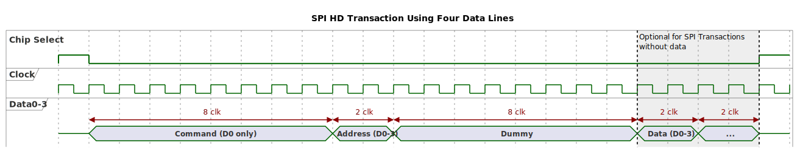
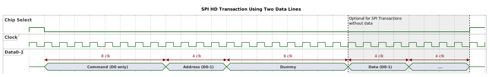
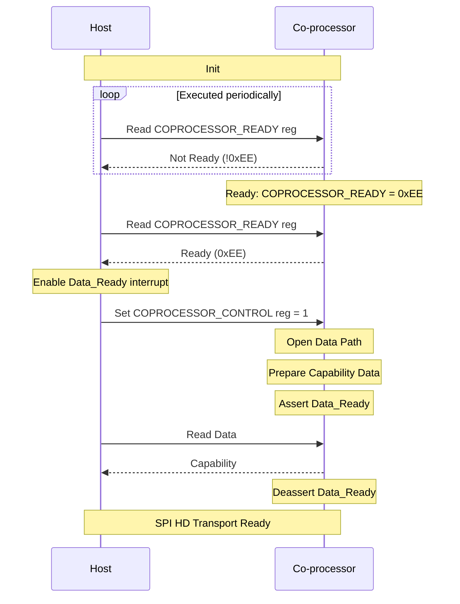
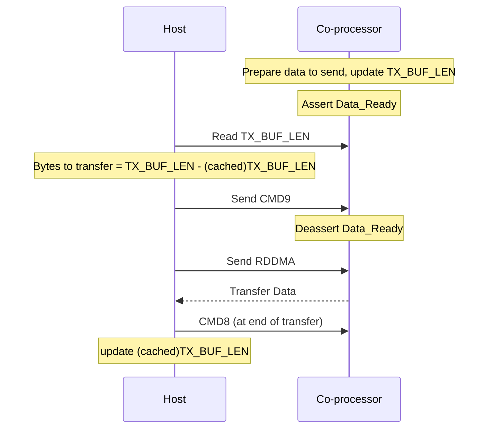
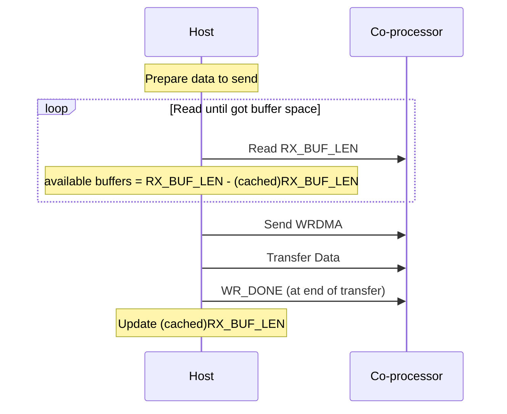

# ESP-Hosted SPI HD (Half Duplex) Operation

Sections 2 to 6 below covers the theoretical part where the SPI Half duplex protocol and expected framing structure is explained. This frame structure is flexible. Host and Co-processor follow the same frame structure.

Section 7 to 11 covers the complete step-wise setup co-processor and host with SPI Half Duplex, using 2 or 4 data lines.

If you wish to skip the theory, you can refer the [Quick Start Guide](#1-quick-start-guide) below. For quick navigation, please unfold the Table of Contents below.

<details>
<summary>Table of Contents</summary>


- [1. Quick Start Guide](#1-quick-start-guide)

- [2. Introduction](#2-introduction)

- [3. SPI HD Configuration](#3-spi-hd-configuration) => [1 Clock and Phase](#31-clock-and-phase)  ||  [2 Data Lines](#32-data-lines) || [3 Extra GPIO Signals](#33-extra-gpio-signals) || [4 Pin Assignments](#34-pin-assignments)

- [4. SPI HD Protocol](#4-spi-hd-protocol) => [1 Data IO Modes](#41-data-io-modes) || [2 Supported Commands](#42-supported-commands) || [3 Registers Used](#43-registers-used) || [4 Timing Diagrams](#44-timing-diagrams)

- [5. SPI HD Operation](#5-spi-hd-operation) => [1 Initialization](#51-initialization) || [2 Co-processor to Host Transfer](#52-co-processor-to-host-transfer) || [3 Host to Co-processor Transfer](#53-host-to-co-processor-transfer) || [4 Code Reference](#54-code-reference)

- [6. Hardware Considerations](#6-hardware-considerations) => [1 General Considerations](#61-general-considerations) || [2 Jumper Wires](#62-jumper-wires) || [3 PCB Design](#63-pcb-design) || [4 Advanced Considerations](#64-advanced-considerations)

- [7. Hardware Setup](#7-hardware-setup)

- [8. Set-Up ESP-IDF](#8-set-up-esp-idf) => [Option 1: Installer Way](#option-1-installer-way) || [Option 2: Manual Way](#option-2-manual-way)

- [9. Flashing the Co-processor](#9-flashing-the-co-processor) => [1 Create Co-processor Project](#91-create-co-processor-project) || [2 Co-processor Config](#92-co-processor-config) || [3 Co-processor Build](#93-co-processor-build) || [4 Co-processor Flashing](#94-co-processor-flashing)

- [10. Flashing the Host](#10-flashing-the-host) => [1 Select Example to Run in Hosted Mode](#101-select-example-to-run-in-hosted-mode) || [2 Host Project Component Configuration](#102-host-project-component-configuration) || [3 Menuconfig, Build and Flash Host](#103-menuconfig-build-and-flash-host)

- [11. Testing and Troubleshooting](#11-testing-and-troubleshooting)

- [12. References](#12-references)

</details>

## 1 Quick Start Guide

This section provides a brief overview of how to get started with ESP-Hosted using SPI HD mode, bypassing the theory and explanation. Please refer to the following sections to quickly set-up demo.

- [7. Hardware Setup](#7-hardware-setup)
- [8. Set-Up ESP-IDF](#8-set-up-esp-idf)
- [9. Flashing the Co-processor](#9-flashing-the-co-processor)
- [10. Flashing the Host](#10-flashing-the-host)
- [11. Testing and Troubleshooting](#11-testing-and-troubleshooting)

These sections will guide you through the process of configuring and flashing both the co-processor and host devices, setting up the hardware connections, and verifying successful communication.

## 2 Introduction

The ESP32 family of chips (except the ESP32) support the SPI co-processor HD (Half Duplex) Mode Protocol.

In this mode of operation, SPI supports 2 or 4 data lines to transfer data to the co-processor or from the co-processor (half duplex) during an SPI transaction. This is different from 'standard' SPI mode which transfers data bidirectionally (full duplex) over two data lines (one for host to co-processor data [MOSI], one for co-processor to host data [MISO]) during an SPI transaction.

> [!NOTE]
> 
> SPI Half Duplex mode is not supported on the classic ESP32. Other all chipsets support half duplex.
> Please use SPI full duplex for classic ESP32

> [!IMPORTANT]
> 
> SPI Half Duplex is not an industry standard and has multiple
> implementations. Make sure your host processor supports the SPI HD
> protocol implemented by the Hosted co-processor before proceeding. See [SPI HD protocol used by Hosted](#4-spi-hd-protocol).

## 3 SPI HD Configuration

To enable SPI HD on the Host and co-processor using `idf.py menuconfig`:

1. On Host: **Component config** ---> **ESP-Hosted config** --->
   **Transport layer** and choose **SPI Half-duplex**.
2. On Co-processor: **Example configuration** ---> **Transport layer** and
   choose **SPI Half-duplex**.

### 3.1 Clock and Phase

The standard SPI CPOL clock and CPHA phase must be configured
correctly on both the host and co-processor for the protocol to work.

### 3.2 Data Lines

Both the host and co-processor can support two or four data lines. Four data lines will be used to transfer data if configured on both the host and co-processor. If the host is configured to use two data lines, only two lines will be used to transfer data even if the co-processor is configured to use four data lines.

### 3.3 Extra GPIO Signals

Extra GPIO signals are required for SPI HD on Hosted and can be
assigned to any free GPIO pins:

- `Data_Ready` signal: an output signal from the co-processor to the host. When asserted, the co-processor is telling the host that it has data to send. The host should perform a data read SPI transaction to fetch data from the co-processor.
- `Reset` signal: an output signal from the host to the co-processor. When asserted, the host resets the co-processor. This is done when ESP-Hosted is started on the host, to synchronise the state of the host and co-processor.

> [!NOTE]
> The `Reset` signal can be configured to connect to the `EN` or `RST`
> pin on the co-processor, or assigned to a GPIO pin on the co-processor.
>
> To configure this, use `idf.py menuconfig` on the co-processor: **Example
> configuration** ---> **SPI Half-duplex Configuration** --->
> **GPIOs** and set **Slave GPIO pin to reset itself**.

### 3.4 Pin Assignments

Using the pins already assigned to SPI signals (dedicated `IO_MUX` pins) is recommended to minimise propagation delays. Using other GPIO pins for SPI signals will route the signals through the GPIO matrix which may limit the maximum clock frequency that can be used.

The following table shows the mapping between the SPI bus signals and
their SPI HD Function:

| SPI Bus Signal | SPI HD Function | Applicable      |
| :-------------: | :--------------: | :--------------: |
| SPI_CS         | Chip Select     | Dual, Quad SPI |
| SPICLK         | Clock           | Dual, Quad SPI |
| SPID           | Data Bit 0      | Dual, Quad SPI |
| SPIQ           | Data Bit 1      | Dual, Quad SPI |
| SPIWP          | Data Bit 2      | Quad SPI        |
| SPIHD          | Data Bit 3      | Quad SPI        |
| Data_Ready     | Extra GPIO\*    | Dual, Quad SPI |
| Reset          | Extra GPIO\*    | Dual, Quad SPI |

- Extra GPIOs `Data_Ready`, `Reset` are explained above in [3.3 Extra GPIO Signals](#33-extra-gpio-signals)
- The `SPI HD CS signal`, `Data_Ready` and `Reset` can be assigned to any GPIO pin on the host and co-processor.
- By default, the SPI bus would idle (no CS, no clock, no data) when no transaction needed from either side, co-processor or host.
- `Data_Ready` could be made optional with some code changes, but it would mean that the SPI bus would not be idled out when no transaction needed. This would be lower number of GPIOs used, but the power consumption would be higher. We are adding this feature soon.

## 4 SPI HD Protocol

Hosted uses the ESP SPI co-processor HD (Half Duplex) Mode Protocol (see [References](#11-references)) with some modifications.

### 4.1 Data IO Modes

When communicating with the co-processor, the master uses the Command, Address, Dummy and Data phases during an SPI transaction. The number of bits and number of data lines used in each phase are:

- **Command**: 8 bits, 1 data line
- **Address**: 8 bits, 2 or 4 data lines
- **Dummy**: 8 bits, 1 data line
- **Data**: variable length, 2 or 4 data lines

> [!NOTE]
> 
> The number of data lines used in the Address and Data phase depends
> on the Command Mask in the Command sent by the host. See [Supported Commands](#44-supported-commands).

### 4.2 Supported Commands

Hosted uses the following SPI HD commands when communicating with the co-processor:

| Command | OpCode | Purpose                                         |
| :---:    | :---:   | :---                                            |
| WRBUF   | 0x01   | Write to a 32-bit buffer register on the co-processor  |
| RDBUF   | 0x02   | Read from a 32-bit buffer register on the co-processor |
| WRDMA   | 0x03   | Write data to the co-processor using DMA               |
| RDDMA   | 0x04   | Read data from the co-processor during DMA             |
| WR_DONE | 0x07   | End of DMA write                                |
| CMD8    | 0x08   | End of DMA read                                 |
| CMD9    | 0x09   | End of register read                            |

#### 4.2.1 Command Mask

The Commands are masked with a command mask to tell the co-processor the correct number of data lines to use during the transaction (2 or 4 data lines). Hosted uses the following masks, which are bit ORed with the command during a SPI transactions:

| Mode   | Mask |
| :---:   | :---: |
| 2-bits | 0x50 |
| 4-bits | 0xA0 |

For example, if the host sends command `0x51` (2-bit mask + WRBUF), the host and co-processor will use 2 data lines to send the address and data. If the host sends command `0xA1` (4-bit mask + WRBUF), the host and co-processor will use 4 data lines to send the address and data.

The Command Mask determines the number of data lines used for the transaction. Even if there are four data lines between the host and co-processor, the host can tell the co-processor to use only two data lines by applying the 0x50 command mask.

> [!WARNING]
> 
> It is an error to apply the 4-bit data mask (0xA0) when there are
> only two data lines connecting the host and co-processor.

### 4.3 Registers Used

The ESP SPI Co-processor HD Mode Protocol defines a number of registers on the co-processor. These registers are used in Hosted as follows:

| Register | Name              | Purpose                                       |
| :---:     | :---:              | :---                                          |
| 0x00     | COPROCESSOR\_READY      | Indicates if co-processor is ready                   |
| 0x04     | MAX\_TX\_BUF\_LEN | Maximum length of DMA data co-processor can transmit |
| 0x08     | MAX\_RX\_BUF\_LEN | Maximum length of DMA data co-processor can receive  |
| 0x0C     | TX\_BUF\_LEN      | Updated whenever co-processor wants to transmit data |
| 0x10     | RX\_BUF\_LEN      | Updated whenever co-processor can receive data       |
| 0x14     | COPROCESSOR\_CONTROL    | Controls co-processor operation                      |

### 4.4 Timing Diagrams

The following diagrams summarize the SPI transactions as used by Hosted:



*SPI Transaction using 4 data lines*



*SPI Transaction using 2 data lines*


## 5 SPI HD Operation

### 5.1 Initialization

#### 5.1.1 Co-processor and Host Initialization

The co-processor starts up and initialises the SPI HD transport. When the co-processor is ready it writes the value `COPROCESSOR_IS_READY` (0xEE) to the COPROCESSOR\_READY register.

The Host starts up and initialises the SPI HD transport. When ready, it polls the COPROCESSOR\_READY register on the co-processor until it reads the value
`COPROCESSOR_IS_READY`.

Once co-processor is ready, host prepare for interrupts triggered by `Data_Ready`, and sets bit 0 on the COPROCESSOR\_CONTROL register to 1. This opens the data path to the co-processor.

Both host and co-processor are now ready to communicate.

The first packet the co-processor transfers to the host is a Capabilities Packet, stating what the co-processor is capable of supporting:

- WLAN, Bluetooth, etc.
- the number of data lines supported for SPI HD

The host uses this packet to determine what the co-processor is capable of supporting.



*SPI HD Initialization Sequence*

#### 5.1.2 Number of Data Lines Used

After initialization, the host initially communicates with the co-processor using two data lines. If the co-processor is capable of supporting four data
lines (from the Capabilities Packet sent by the co-processor), and the host is configured to also use four data lines, then four data lines will be used for subsequent data transfers.

If neither the host or co-processor is capable of transferring data using four data lines, then only two data lines will be used.

### 5.2 Co-processor to Host Transfer

Co-processor asserts `Data_Ready` to tell the host it has data to send.

Host reads the TX\_BUF\_LEN register.

> [!NOTE]
> The upper 8-bits of the TX\_BUF\_LEN register are reserved, and
> should be masked out to get the correct read length from the
> TX\_BUF\_LEN register.

The host subtracts the read length from its cached read length
(initial value is zero) to discover how much more data the co-processor wants to transfer to the host. The host can now read the data using the RDDMA command, ending the transfer with CMD8. The host now updates its cached read length with the co-processor's read length.

After reading TX\_BUF\_LEN register, host sends CMD9. This tells the co-processor that the host has read the register and it is safe for the co-processor to update the register (if required) and deassert the `Data_Ready` signal.



*SPI HD Read Sequence*

### 5.3 Host to Co-processor Transfer

Host reads the RX\_BUF\_LEN register to discover how many buffers are
available on the co-processor (each buffer is of size MAX\_RX\_BUF\_LEN). If
there are not enough buffers to store the data to be sent, the host
should wait and re-read the register until there are enough buffers.

Once there are enough buffers, the host can use WRDMA to send data,
ending each buffer transfer with WR_DONE.



*SPI HD Write Sequence*

### 5.4 Code Reference

- [`slave/main/spi_hd_slave_api.c`](https://github.com/espressif/esp-hosted/blob/feature/esp_as_mcu_host/slave/main/spi_hd_slave_api.c) implements the code to run the SPI HD driver on the co-processor
- [`host/drivers/transport/spi_hd/spi_hd_drv.c`](https://github.com/espressif/esp-hosted/blob/feature/esp_as_mcu_host/host/drivers/transport/spi_hd/spi_hd_drv.c) implements the generic code to run the SPI HD driver on the host
- [`host/port/spi_hd_wrapper.c`](https://github.com/espressif/esp-hosted/blob/feature/esp_as_mcu_host/host/port/spi_hd_wrapper.c) implements the ESP-IDF specific code used by the generic SPI HD driver on the host

## 6 Hardware Considerations

### 6.1 General Considerations

- Ensure equal trace lengths for all SPI connections, whether using jumper wires or PCB traces.
- Use the lower clock frequency like 5 MHz for evaluation. Once solution verified, optimise the clock frequency in increasing steps to max possible value. To find out practical maximum SPI co-processor frequency for your co-processor, check `IDF_PERFORMANCE_MAX_SPI_CLK_FREQ` in [ESP-IDF co-processor SPI clock benchmark](https://github.com/espressif/esp-idf/blob/master/components/esp_driver_spi/test_apps/components/spi_bench_mark/include/spi_performance.h) 
- Verify voltage compatibility between host and co-processor devices.
- Provide proper power supply decoupling for both host and co-processor devices.

### 6.2 Jumper Wires

- Jumper wires are suitable for initial testing and prototyping.
- Use high-quality, low-capacitance jumper wires.
- Keep wires as short as possible, ideally under 10 cm.
- Arrange wires to minimize crosstalk, especially for clock and data lines.
- Possibly, use twisted pairs for clock and data lines to reduce electromagnetic interference.
- If possible, use a ground wire between every signal wire to improve signal integrity.
- Connect as many grounds as possible to improve common ground reference and reduce ground noise.

> [!IMPORTANT]
> 
> Quad SPI (QSPI) should not be used with jumper cables due to signal integrity issues. Use Dual SPI for evaluation with jumper cables.

### 6.3 PCB Design

For optimal performance and reliability in production designs:

- Ensure equal trace lengths for all SPI signals (CLK, MOSI, MISO, CS) as much as possible. This practice, known as length matching, is crucial for maintaining signal integrity and reducing timing skew, especially at higher frequencies.
- If perfect length matching is not possible, prioritize matching the clock (CLK) trace length with the data lines.
- Use controlled impedance traces for high-speed signals.
- Place bypass capacitors close to the power pins of both the host and co-processor devices.
- Consider using series termination resistors on the clock and data lines to reduce reflections.
- For high-speed designs, use a 4-layer PCB with dedicated power and ground planes.
- Quad SPI (QSPI) should only be implemented on a properly designed PCB.


### 6.4 Advanced Considerations

- Calculate the maximum allowed trace length based on your clock frequency and PCB material.
- Consider the capacitive load on the SPI bus, especially for longer traces or when using multiple co-processor devices.
- For very high-speed designs, consider using differential signaling techniques.
- Implement proper EMI/EMC design techniques to minimize electromagnetic interference.
- Use an oscilloscope or logic analyzer to verify signal integrity and timing.
- Start with a lower clock frequency and gradually increase it while monitoring performance.
- Ensure proper grounding between the host and co-processor devices.
- If using multiple power supplies, ensure they share a common ground.
- Consider using level shifters if the host and co-processor operate at different voltage levels.

## 7 Hardware Setup

> [!IMPORTANT]
> 
> Remember that Quad SPI (using D2 and D3) should only be used with a properly designed PCB, not with jumper wires.

Before flashing the co-processor and host, ensure that you have made the correct hardware connections. The following tables show the recommended connections for SPI Half Duplex mode:


### Host connections
| Signal     | ESP32-S3 | ESP32-P4-Function-EV-Board | Applicable     |
| :--------: | :------: | :------------------------: | :------------: |
| CLK        | 19       | 18                         | Dual, Quad SPI |
| D0         | 13       | 14                         | Dual, Quad SPI |
| D1         | 35       | 15                         | Dual, Quad SPI |
| CS         | 47       | 19                         | Dual, Quad SPI |
| Data Ready | 12       | 6                          | Dual, Quad SPI |
| Reset Out  | 42       | 54                         | Dual, Quad SPI |
| GND        | GND      | GND                        | Dual, Quad SPI |
| D2         | 20       | 16                         | Quad SPI only  |
| D3         | 9        | 17                         | Quad SPI only  |

- Host GPIOs can be re-configured to any other GPIOs, while co-processor configuration is done.
  - Make sure the configuration and hardware connections match.
- Classic ESP32
  - Not supported as host or co-processor
  - Rest all chipsets are supported as host
- ESP32-S2/C2/C3/C5/C6/C61
  - Pins for SPI Half Duplex Host need to be figured out yet.
- ESP32-P4
  - For ESP32-P4-Function-EV-Board, the SDIO onboard pins are re-used for SPI Half Duplex Host.
  - For Non ESP32-P4-Function-EV-Board, pins for SPI Half Duplex Host need to be figured out yet.

### Co-processor connections

| Signal     | ESP32-C6 on ESP32-P4-Function-EV-Board | ESP32-C2/C3/C6 | ESP32-C5 | Applicable     |
| :---------: | :-----------------------------------: | :------------: | :------: | :------------: |
| CLK         | 19                                    | 6              | 6        | Dual, Quad SPI |
| D0          | 20                                    | 7              | 7        | Dual, Quad SPI |
| D1          | 21                                    | 2              | 2        | Dual, Quad SPI |
| CS          | 18                                    | 10             | 10       | Dual, Quad SPI |
| Data Ready  | 2                                     | 0              | 13       | Dual, Quad SPI |
| Reset In    | EN/RST                                | EN/RST         | EN/RST   | Dual, Quad SPI |
| GND         | GND                                   | GND      | GND      | Dual, Quad SPI |
| D2          | 22                                    | 5        | 5        | Quad SPI only |
| D3          | 23                                    | 4        | 4        | Quad SPI only |

- Co-processor GPIOs can be re-configured to any other GPIOs, while co-processor configuration is done.
  - Make sure the configuration and hardware connections match.
- ESP32-C2/C3/C5/C6/C61/S2/S3
  - All supported as SPI Half Duplex co-processor
  - Pins for SPI Half Duplex co-processor need to be figured out yet for other boards

> [!NOTE]
> 
> A. QSPI Testing
> - Tested on ESP32-P4-Function-EV-Board
> - ESP32-P4 as host, ESP32-C6/C3 as QSPI co-processor
> - Reused existing SDIO connections for QSPI on C6 and P4
>
> B. Dual SPI Testing
> - ESP32-S3 host with ESP32-C5 co-processor
> - Tested using jumper cables
>
> C. Performance Optimization
> - Always prefer to use IO_MUX pins from datasheet for optimal performance on both sides
>
> D. Portability
> - Once ported, any other non ESP host with Dual SPI or QSPI can be used

## 8 Set-Up ESP-IDF

Before setting up the ESP-Hosted co-processor & host for SPI Half Duplex mode, ensure that ESP-IDF is properly installed and set up on your system.

#### Option 1: Installer Way

- **Windows**
  - Install and setup ESP-IDF on Windows as documented in the [Standard Setup of Toolchain for Windows](https://docs.espressif.com/projects/esp-idf/en/latest/esp32/get-started/windows-setup.html).
  - Use the ESP-IDF [Powershell Command Prompt](https://docs.espressif.com/projects/esp-idf/en/latest/esp32/get-started/windows-setup.html#using-the-command-prompt) for subsequent commands.

- **Linux or MacOS**
  - For bash:
    ```bash
    bash docs/setup_esp_idf__latest_stable__linux_macos.sh
    ```
  - For fish:
    ```fish
    fish docs/setup_esp_idf__latest_stable__linux_macos.fish
    ```

#### Option 2: Manual Way

Please follow the [ESP-IDF Get Started Guide](https://docs.espressif.com/projects/esp-idf/en/latest/esp32/get-started/index.html) for manual installation.

## 9 Flashing the Co-processor

| Supported Co-processor Targets | ESP32 | ESP32-C2 | ESP32-C3 | ESP32-C5 | ESP32-C6 | ESP32-C61 | ESP32-S2 | ESP32-S3 |
| ------------------------------ | ----- | -------- | -------- | -------- | -------- | --------- | -------- | -------- |

### 9.1 Create Co-processor Project
1. Create co-processor project possibly outside of ESP-IDF project directory using

   ```bash
   idf.py create-project-from-example "espressif/esp_hosted:slave"
   ```

2. Navigate to the created project directory.

3. Configure the project for your target ESP chip:

   ```bash
   idf.py set-target <target>
   ```
   Replace `<target>` with your specific co-processor ESP chip (e.g., esp32c3, esp32s3).

### 9.2 Co-processor Config
Configure the co-processor project using
```
idf.py menuconfig
```

#### 9.2.1 Transport config
  - Navigate to "Example configuration" -> "Transport layer"
  - Select "SPI Half-duplex"

#### 9.2.2 Any other config
  - Optionally, Configure any additional SPI-specific settings like co-processor GPIOs, SPI mode, etc.

###### Generated files
- Generated config files are (1) `sdkconfig` file and (2) internal `sdkconfig.h` file.
- Please note, any manually changes done to these generated files, would not take effect.

###### Defaulting specific config (Optional)
- This is advanced option, so please be careful.
- To mark some config options as default, you can add specific config line in file, `sdkconfig.defaults.<target>`. So whenever next time building, you do not need to re-configure.

### 9.3 Co-processor Build
Build the co-processor project

```
idf.py build
```

### 9.4 Co-processor Flashing

There are two methods to flash the ESP-Hosted co-processor firmware:

##### 9.4.1 Serial Flashing (Initial Setup)

For the initial setup or when OTA is not available, use serial flashing.

Flash the co-processor firmware using
```
idf.py -p <co-processor_serial_port> flash
```

> [!NOTE]
>
> If you are not able to flash the co-processor, there might be a chance that host is not allowing to to do so.
> 
> Put host in bootloader mode using following command and then retry flashing the co-processor
> 
> ```bash
> esptool.py -p **<host_serial_port>** --before default_reset --after no_reset run
> ```

Monitor the output (optional):
```
idf.py -p <coprocessor_serial_port> monitor
```

##### 9.4.2 Co-processor OTA Flashing (Subsequent Updates)

For subsequent updates, you can re-use ESP-Hosted-MCU transport, as it should be already working. While doing OTA, Complete co-processor firmware image is not needed and only co-processor application partition, 'network_adapter.bin' need to be re-flashed remotely from host.

1. Ensure your co-processor device is connected and communicating with the host with existing ESP-Hosted-MCU.

2. Create a web server
You can re-use your existing web server or create a new locally for testing. Below is example to do it.
  - Make a new directory so that web server can be run into it and navigate into it
  - Create simple local web server using python3

     ```bash
     python3 -m http.server 8080
     ```
3. Copy the co-processor app partition `network_adapter.bin` in the directory where you created the web server.
  - The `network_adapter.bin` can be found in your co-processor project build at `<co-processor_project>/build/network_adapter.bin`

4. Verify if web server is set-up correctly
  - Open link `http://127.0.0.1:8080` in the browser and check if network_adapter.bin is available.
  - Right click and copy the complete URL of this network_adapter.bin and note somewhere.
 
5. On the **host side**, use the `esp_hosted_ota` function to initiate the OTA update:

   ```c
   #include "esp_hosted_api.h"

   const char* image_url = "http://example.com/path/to/network_adapter.bin"; //web server full url
   esp_err_t ret = esp_hosted_ota(image_url);
   if (ret == ESP_OK) {
       printf("co-processor OTA update failed[%d]\n", ret);
   }
   ```

   This function will download the firmware in chunk by chunk as http client from the specified URL and flash it to the co-processor device through the established transport.
   In above web server example, You can paste the copied url earlier.
   

6. Monitor the OTA progress through the console output on both the host and co-processor devices.

> [!NOTE]
>
> - The `esp_hosted_ota` function is part of the ESP-Hosted-MCU API and handles the OTA process through the transport layer.
> - Ensure that your host application has web server connectivity to download the firmware file.
> - The co-processor device doesn't need to be connected to the web server for this OTA method.

## 10 Flashing the Host

Host are required to support 2 data line SPI (dual SPI) or 4 line SPI (quad SPI or QSPI) in their hardware. All ESP chipsets hardware support dual, quad SPI.

| Supported Host Targets  | Any ESP chipset | Any Non-ESP chipset |
| ----------------------- | --------------- | ------------------- |

Non ESP chipset may need to port the porting layer. It is strongly recommanded to evaluate the solution using ESP chipset as host before porting to any non-esp chipset.
For Quad SPI, PCB is only supported. Dual SPI could be evaluted using jumper cables.

Non-ESP Hosts, while porting, need to ensure that the Half duplex protocol and framing is exactly same as that of co-processor.

### 10.1 Select Example to Run in Hosted Mode

Select an example from the [ESP-IDF examples directory](https://github.com/espressif/esp-idf/tree/master/examples) that you wish to run in ESP-Hosted mode. All Wi-Fi and Bluetooth examples are supported. For simplicity and demonstration purposes, we will use the [ESP-IDF iperf example](https://github.com/espressif/esp-idf/tree/master/examples/wifi/iperf).

### 10.2 Host Project Component Configuration

Now that ESP-IDF is set up, follow these steps to prepare the host:

###### 1. Navigate to the iperf example in your ESP-IDF directory:
   ```
   cd $IDF_PATH/examples/wifi/iperf
   ```

###### 2. Dependency components
   Add the required components to the project's `idf_component.yml` file:
   ```
   idf.py add-dependency "espressif/esp_wifi_remote"
   idf.py add-dependency "espressif/esp_hosted"
   ```

###### 3. Remove conflicting configuration
   Open the `main/idf_component.yml` file and remove/comment the following block if present:
   ```
   # ------- Delete or comment this block ---------
   espressif/esp-extconn:
     version: "~0.1.0"
     rules:
       - if: "target in [esp32p4]"
   # -----------------------------------
   ```
   This step is necessary because esp-extconn and esp-hosted cannot work together.

###### 4. Disable native Wi-Fi if available
   If your host ESP chip already has native Wi-Fi support, disable it by editing the `components/soc/<soc>/include/soc/Kconfig.soc_caps.in` file and changing all `WIFI` related configs to `n`.
     
    If you happen to have both, host and co-processor as same ESP chipset type (for example two ESP32-C2), note an [additional step](docs/troubleshooting/#1-esp-host-to-evaluate-already-has-native-wi-fi)
    

### 10.3 Menuconfig, Build and Flash Host

###### 1. High performance configurations
   This is optional step, suggested for high performance applications.

   If using ESP32-P4 as host:
     - Remove the default `sdkconfig.defaults.esp32p4` file.
     - Create a new `sdkconfig.defaults.esp32p4` file with the following content:
     ```
     CONFIG_ESP_WIFI_STATIC_RX_BUFFER_NUM=16
     CONFIG_ESP_WIFI_DYNAMIC_RX_BUFFER_NUM=64
     CONFIG_ESP_WIFI_DYNAMIC_TX_BUFFER_NUM=64
     CONFIG_ESP_WIFI_AMPDU_TX_ENABLED=y
     CONFIG_ESP_WIFI_TX_BA_WIN=32
     CONFIG_ESP_WIFI_AMPDU_RX_ENABLED=y
     CONFIG_ESP_WIFI_RX_BA_WIN=32

     CONFIG_LWIP_TCP_SND_BUF_DEFAULT=65534
     CONFIG_LWIP_TCP_WND_DEFAULT=65534
     CONFIG_LWIP_TCP_RECVMBOX_SIZE=64
     CONFIG_LWIP_UDP_RECVMBOX_SIZE=64
     CONFIG_LWIP_TCPIP_RECVMBOX_SIZE=64

     CONFIG_LWIP_TCP_SACK_OUT=y
     ```

    For other hosts also, you can merge above configs in corresponding `sdkconfig.defaults.esp32XX` file.

###### 2. Set environment for your host ESP chip:

   ```
   idf.py set-target <host_target>
   ```
   Replace `<host_target>` with your specific ESP chip (one of esp32, esp32c2, esp32c3, esp32c5, esp32c6, esp32s2, esp32s3, esp32p4).

###### 3. Flexible Menuconfig configurations

   ```
   idf.py menuconfig
   ```
   ESP-Hosted-MCU host configurations are available under "Component config" -> "ESP-Hosted config"
   1. Select "SPI Half-duplex" as the transport layer
   2. Change co-processor chipset to connect to under "Slave chipset to be used" 
   3. Change Number of data lines to 2 or 4 based on the co-processor using "SPI Half-duplex Configuration" -> "Num Data Lines to use"
   4. Optionally, Configure SPI-specific settings like
     - SPI Clock Freq (MHz)
     - SPI Mode
     - SPI Host GPIO Pins
     - SPI Checksum Enable/Disable (Checksum is recommended to be enabled as spi hardware doesn't have any error detection)

  > [!NOTE]
  >
  > The actual clock frequency used is determined by the hardware. Use an oscilloscope or logic analyzer to check the clock frequency.

###### 4. Build the project:
   ```
   idf.py build
   ```

###### 5. Flash the firmware:
   ```
   idf.py -p <host_serial_port> flash
   ```

###### 6. Monitor the output:
    ```
    idf.py -p <host_serial_port> monitor
    ```
    - If host was put into bootloader mode earlier, it may need manual reset

## 11 Testing and Troubleshooting

After flashing both the co-processor and host devices, follow these steps to connect and test your ESP-Hosted SPI Half Duplex setup:

1. Connect the hardware:
   - Follow the pin assignments for SPI Half Duplex as specified in [Hardware Setup](#7-hardware-setup).
   - Ensure all necessary connections are made, including power, ground, and the extra GPIO signals (Data_Ready and Reset).

2. Power on both devices.

3. Verify the connection:
   - Check the serial output of both devices for successful initialization messages.
   - Look for messages indicating that the SPI Half Duplex transport layer has been established.

4. Logs at both sides:
   - Host:

     ```
     I (522) transport: Attempt connection with slave: retry[0]
     I (525) transport: Reset slave using GPIO[54]
     I (530) os_wrapper_esp: GPIO [54] configured
     I (535) gpio: GPIO[54]| InputEn: 0| OutputEn: 1| OpenDrain: 0| Pullup: 0| Pulldown: 0| Intr:0
     I (1712) transport: Received INIT event from ESP32 peripheral
     I (1712) transport: EVENT: 12
     I (1712) transport: EVENT: 11
     I (1715) transport: capabilities: 0xe8
     I (1719) transport: Features supported are:
     I (1724) transport:        - HCI over SPI
     I (1728) transport:        - BLE only
     I (1732) transport: EVENT: 13
     I (1736) transport: ESP board type is : 13

     I (1741) transport: Base transport is set-up
     ```

   - Co-processor:

     ```
     I (492) fg_mcu_slave: *********************************************************************
     I (501) fg_mcu_slave:                 ESP-Hosted-MCU Slave FW version :: X.Y.Z

     I (511) fg_mcu_slave:                 Transport used :: <Dual/Quad SPI>
     I (520) fg_mcu_slave: *********************************************************************
     I (529) fg_mcu_slave: Supported features are:
     I (534) fg_mcu_slave: - WLAN over SPI
     I (538) h_bt: - BT/BLE
     I (541) h_bt:    - HCI Over SPI
     I (545) h_bt:    - BLE only
     ```

5. Test basic functionality:
   - The iperf example automatically attempts to connect to the configured Wi-Fi network. Watch the serial output for connection status.
   - If the automatic connection fails, you can manually initiate a Wi-Fi scan and connection:
     ```
     sta_scan
     sta_connect <SSID> <password>
     ```
6. Additional commands to test:
   - Get IP address: `sta_ip`
   - Disconnect from Wi-Fi: `sta_disconnect`
   - Set Wi-Fi mode: `wifi_mode <mode>` (where mode can be 'sta', 'ap', or 'apsta')

7. Advanced iperf testing:
   Once connected, you can run iperf tests:

   | Test Case | Host Command | External STA Command |
   | :-------: | :----------: | :------------------: |
   | UDP Host TX | `iperf -u -c <STA_IP> -t 60 -i 3` | `iperf -u -s -i 3` |
   | UDP Host RX | `iperf -u -s -i 3` | `iperf -u -c <HOST_IP> -t 60 -i 3` |
   | TCP Host TX | `iperf -c <STA_IP> -t 60 -i 3` | `iperf -s -i 3` |
   | TCP Host RX | `iperf -s -i 3` | `iperf -c <HOST_IP> -t 60 -i 3` |

   Note: Replace `<STA_IP>` with the IP address of the external STA, and `<HOST_IP>` with the IP address of the ESP-Hosted device.

8. Troubleshooting:
   - If you encounter issues, refer to section 6.3 for testing the SPI connection.
   - Consider using a lower clock speed or checking your [hardware setup](#7-hardware-setup) if you experience communication problems.
   - ESP-Hosted-MCU troubleshooting guide: [docs/troubleshooting.md](docs/troubleshooting.md)

9. Monitoring and debugging:
   - Use the serial monitor on both devices to observe the communication between the host and co-processor.
   - For more detailed debugging, consider using a logic analyzer to examine the SPI signals.

## 12 References

- ESP SPI co-processor HD (Half Duplex) Mode Protocol: https://docs.espressif.com/projects/esp-idf/en/latest/esp32/api-reference/protocols/esp_spi_slave_protocol.html

