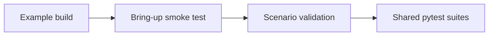

# Testing

[Home](../README.md) · [Getting Started: Linux](getting-started-linux.md) · [Getting Started: MCU](getting-started-mcu.md) · [Troubleshooting](troubleshooting.md)

Testing climbs three layers — each proves the one before it and maps to a different developer intent, so climb them in order.

1. **Build one example** — fast local sanity that your tree, toolchain, and config compile for your target.
2. **Run one scenario end-to-end** — real bring-up on your hardware: transport handshake, control path, and one working feature.
3. **Run the shared automated suites** — regression coverage across transports and features, on emulators (no hardware) and on real boards.



> [!WARNING]
> Do not jump to the full suite before one simple example already works on your target path.

---

## First manual smoke tests

Whatever your host, start with one of these. They prove transport, capability exchange, and a minimal feature path in that order:

- [Get CP FW Version](../examples/system/get_cp_fw_version/README.md) — the transport-health gate.
- [Wi-Fi Station](../examples/wifi/sta/README.md) — the control path plus a real feature.

---

## Testing on a Linux host

The normal path to validate a Linux-host example build and run:

1. Source `export.sh`.
2. Build the example with `eh.py`.
3. Build and load the kernel module from `host/linux/eh_host_linux_kmod/scripts/`.
4. Run the matching `c_app/` or `py_app/`.

> [!NOTE]
> If step 3 is not healthy (e.g. the kmod fails to load), a failing example app is **not** yet a useful test result. Resolve the kernel transport first.

---

## Testing on an MCU host

MCU-host validation relies on flashing **both** ends:

1. Build and flash the co-processor firmware (`cp/`).
2. Build and flash the host firmware (`mcu_host/` or `esp_host/`).
3. Monitor the host serial output and confirm the co-processor init event is received.

> [!NOTE]
> For API-oriented validation on MCU, the [API Exerciser](../examples/system/api_exerciser/README.md) makes control-plane coverage cheap to add and test.

---

## Automated test suites

The repo-level runner is `eh.py test`. It exercises the shared suites against three substrates, each serving a different intent:

| Substrate | What it runs | Developer intent |
| :--- | :--- | :--- |
| `emu-mcu` | MCU-host path on an emulator | Catch transport/feature **regressions** fast in CI — no hardware needed |
| `emu-linux` | Linux-host path on an emulator | Same, for the Linux kmod + user-space path |
| `hw` | Shared suites on real boards | **Bring-up ownership** — prove correctness on real silicon, timing, and wiring |

> [!NOTE]
> The `emu-*` substrates need the **esp-emu** emulator, which is optional and
> **not** installed by default. Set it up once with `./install.sh --with-emu`
> (or point at an existing checkout: `eh.py set-esp-emu <dir>`). Without it the
> emulator suites skip. `hw` needs no emulator.

Run a full substrate:

```sh
python3 tools/eh.py test emu-mcu
python3 tools/eh.py test emu-linux
python3 tools/eh.py test hw
```

Narrow to a slice with `-k`:

```sh
python3 tools/eh.py test emu-mcu -k api_exerciser
```

**Which layer, when:**

- Writing a feature or fixing a protocol/transport bug — add or extend a case and run `emu-mcu` / `emu-linux`; it is the cheapest signal and gates CI.
- Bringing up a new board or chip — own the `hw` run; emulators cannot catch signal-integrity, clock, pull-up, or pin problems.
- Validating one example or feature quickly — narrow any substrate with `-k <name>`.

> [!TIP]
> Additional coverage tooling lives under `tools/coverage/README.md`. That is a developer-oriented coverage flow, not the normal first test path.

---

**Next:** if a test fails, debug **bottom-up** — wiring → transport → handshake → feature — with the [Troubleshooting](troubleshooting.md) guide. Bringing up a new board? See [Porting](porting.md).
