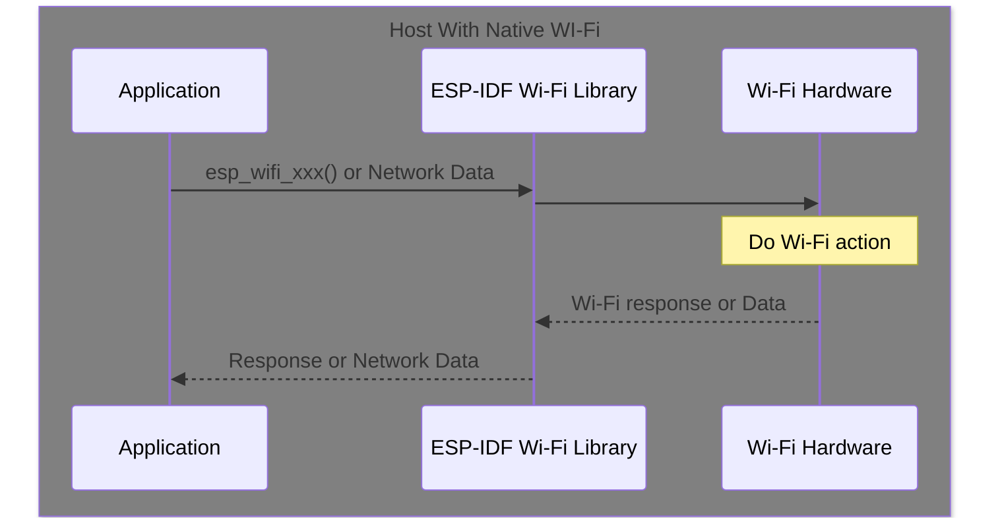
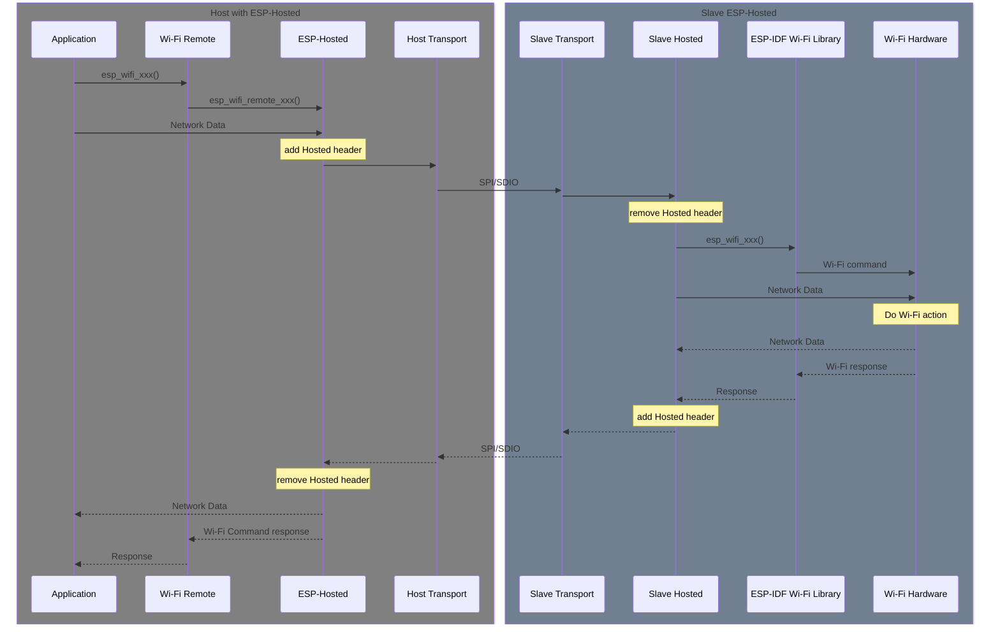

# ESP-Hosted-MCU Wi-Fi Design & Implementation details

## Sequence Diagram for Wi-Fi communication

On a ESP chipset with native Wi-Fi, a Wi-Fi api call or network data
from the application is processed internally on the chip and a Wi-Fi
response is returned to the application.

Using Wi-Remote and ESP-Hosted, the Wi-Fi api call from the
application is converted into a Hosted Call and transported to the
slave. The slave converts the Hosted Call back into an Wi-Fi api
call. The response (optionally with data) is converted into a Hosted
Response and transported back to the host. On the host, the Hosted
Response is converted back into a Wi-Fi response (optionally with
data) is returned to the application.

For Network Data, Hosted does not do data conversion and only
encapsulates the data for transport.

