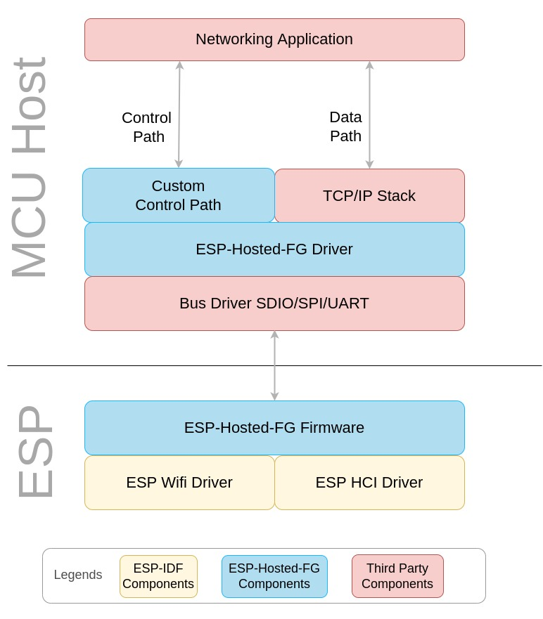
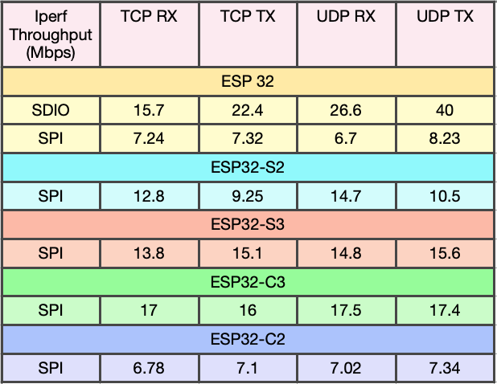

# ESP-Hosted-FG

# Index
* [**1. Introduction**](#1-introduction)  
	* [Connectivity Feature](#11-connectivity-features)  
	* [Supported ESP boards](#12-supported-esp-boards)  
	* [Supported Hosts](#13-supported-hosts)  
	* [Supported Transports](#14-supported-transports)  
	* [Feature Matrix](#15-feature-matrix)  
* [**2. Hardware and Software setup**](#2-hardware-and-software-setup)  
	* [Setup With Linux Host](#21-setup-with-linux-host)  
	* [Setup With MCU host](#22-setup-with-mcu-host)  
* [**3. Control Path**](#3-control-path)
	* [Control Path APIs](#31-control-path-apis)
	* [Demo Apps](#32-demo-apps)
* [**4. Design**](#4-design)  
	* [System Architecture](#41-system-architecture)  
	* [Transport layer communication protocol](#42-transport-layer-communication-protocol)  
	* [Integration Guide](#43-integration-guide)  
* [**5. Throughput performance**](#5-throughput-performance)

---

# 1. Introduction

This version of ESP-Hosted provides:
* A standard 802.3 network interface for transmitting and receiving 802.3 frames
* A standard HCI interface over which Bluetooth/BLE is supported
* A control interface to configure and control Wi-Fi on ESP board

ESP-Hosted-FG solution makes use of host's existing `TCP/IP and/or Bluetooth/BLE software stack` and `hardware peripheral like SPI/SDIO/UART` to connect to ESP firmware with very thin layer of software.

Although the project doesn't provide a standard 802.11 interface to the host, it provides a easy way, *i.e.* [control path](docs/common/contrl_path.md), to configure Wi-Fi. For the control path between the host and ESP board, ESP-Hosted-FG makes use of [Protobuf](https://developers.google.com/protocol-buffers), which is a language independent data serialization mechanism.

### 1.1 Connectivity Features

ESP-Hosted-FG solution provides following WLAN and BT/BLE features to the host:
- WLAN Features:
	- 802.11b/g/n
	- WLAN Station
	- WLAN Soft AP
- BT/BLE Features:
	- ESP32 supports BR/EDR and BLE with v4.2
	- ESP32-C2/C3/S3 supports BLE v4.2 and v5.0
	- ESP32-C6 supports BLE 5.3

### 1.2 Supported ESP boards

ESP-Hosted-FG solution is supported on following ESP boards:

| Supported Targets | ESP32 | ESP32-S2 | ESP32-S3 | ESP32-C2 | ESP32-C3 | ESP32-C6 |
| ----------------- | ----- | -------- | -------- | -------- | -------- | -------- |

### 1.3 Supported Hosts

* As mentioned earlier, this version of the solution is primarily targeted to work with MCU based hosts.
* Though this solution works with Linux hosts, we recommend other [ESP_Hosted-NG](../esp_hosted_ng) flavour for Linux hosts.
* ESP-Hosted-FG solution showcase examples for following Linux based and MCU based hosts out of the box.
	* MCU Based Hosts
	  * STM32 Discovery Board (STM32F469I-DISCO)
	  * STM32F412ZGT6-Nucleo 144
	* Linux Based Hosts
		* Raspberry-Pi 3 Model B
		* Raspberry-Pi 3 Model B+
		* Raspberry-Pi 4 Model B
* You can port this solution to other Linux and MCU platforms using [porting guide](docs/Linux_based_host/porting_guide.md)

### 1.4 Supported Transports

* SDIO Only
    * Wi-Fi and Bluetooth, traffic for both runs over SDIO
* SDIO+UART
    * Wi-Fi runs over SDIO and Bluetooth runs over UART
* SPI Only
    * Wi-Fi and Bluetooth, traffic for both runs over SPI
* SPI+UART
    * Wi-Fi runs over SPI and Bluetooth runs over UART

Different ESP chipset support different set of peripherals. Below is features supported matrix for Linux & MCU.
In this matrix, Each feature is by default enabled & supported with every trasport in left.
Any Unwanted feature can be turned off with config change.

### 1.5 Feature Matrix
##### 1.5.1 Linux Host
The below table explains which feature is supported on which transport interface for Linux based host.

| ESP Chipset | Transport options | Linux Features supported |
| -------: | :-------: | :-------: |
|  |     |    |
|  |     |   |
|  |  |  |
|    |   |   |

Note:
- ESP-Hosted-FG related BR/EDR 4.2 and BLE 4.2 functionalities are tested with bluez 5.43+. Whereas, BLE 5.0 functionalities are tested with bluez 5.45+.
- We suggest the latest stable bluez version to be used. Any other Bluetooth stack instead of bluez also could be used.
- bluez 5.45 on-wards BLE 5.0 HCI commands are supported.
- BLE 5.0 has backward compatibility of BLE 4.2.

##### 1.5.2 MCU Host
The below table explains which feature is supported on which transport interface for MCU based host.

| ESP Chipset | Transport options | MCU Features supported |
| -------: | :-------: | :-------: |
|  |     |    |
|  |   |   |
|  |  |  |
|    |   |   |

Note:
-  Bluetooth at MCU
  - UART is supported from ESP slave side. But not verified from MCU as Host (Works fine with Linux as host)
  - If you have ported Bluetooth host stack on MCU, you can use ESP32 bluetooth controller in slave mode.
  - BT/BLE over SPI/SDIO
    - BT/BLE support over SPI/SDIO is not readily available. In order to implement it, one needs to:
    - Port BT/BLE stack to MCU
    - Add a new virtual serial interface using the serial interface API's provided in host driver of ESP-Hosted-FG solution.
    - HCI implementation in Linux Driver `host/linux/host_driver/esp32` could be used as reference. Search keyword: `ESP_HCI_IF`
    - Register this serial interface with BT/BLE stack as a HCI interface.
  - BT/BLE over UART
    - BT/BLE support over UART is not readily available. In order to implement this, one needs to:
    - Port BT/BLE stack to MCU
    - Register the UART serial interface as a HCI interface with BT/BLE stack
    - With the help of this UART interface, BT/BLE stack can directly interact with BT controller present on ESP bypassing host driver and firmware
    - ESP Hosted host driver and a firmware plays no role in this communication
- OTA
  - Linux hosts support OTA update (Over The Air ESP firmware update) in C and python
  - MCU hosts can refer to the same for their development
  - For detailed documentation, please read [ota_update.md](docs/Linux_based_host/ota_update.md).
- Features awaiting:
  - ESP32-C6 support for MCU
  - SDIO support with MCU host
  - LWIP integration at MCU host
  - Bluetooth stack at MCU host
  - ESP chipsets acting as MCU host (ESP as slave <----> ESP as host)

---

# 2. Hardware and Software setup
This section describes how to set up and use ESP-Hosted-FG solution. Since ESP-Hosted-FG solution supports two distinct platforms, the procedure to use it vastly differs.

### 2.1 Setup With Linux Host
Please refer to the [Setup Guide](docs/Linux_based_host/Linux_based_readme.md) for Linux host.

### 2.2 Setup With MCU Host
Please refer to the [Setup Guide](docs/MCU_based_host/MCU_based_readme.md) for MCU host.
In addition to [Control path APIs](#31-control-path-apis) listed below, APIs for MCU specific solution are explained [here](docs/MCU_based_host/mcu_api.md)

---

# 3. Control Path
- Once ESP-Hosted-FG transport is set up, getting control path working is the first step to verify if the transport is set up correctly
- Control path works over ESP-Hosted-FG transport *i.e.* SPI or SDIO and leverages a way to control and manage ESP from host
- The detailed design and procedure to get control path working is explained [here](docs/common/contrl_path.md)
- Impatient to evaluate? Please follow our beautiful and intuitive [Python based CLI](docs/common/python_demo.md#modes-supported) to easily set up the control path

### 3.1 Control Path APIs
- As [control path design](docs/common/contrl_path.md#3-design) details, demo application works over control path library using control path APIs.
- These APIs are exhaustive list. User can use specific APIs which are of interest.
- Each API is explained in a detailed way to kickstart its use.
- These Control APIs are common for **MPU** and **MCU** based solution.
- User can easily integrate ESP-Hosted-FG solution with own project using these APIs and demo application, which implements these APIs.
- Control APIs are detailed below.
  - [Control path APIs](docs/common/ctrl_apis.md)

### 3.2 Demo apps
Demo applications are provided in python and C. Python app makes use of [ctypes](https://docs.python.org/3/library/ctypes.html) to implement control APIs.

* [C demo app](docs/common/c_demo.md)
* [Python demo app](docs/common/python_demo.md)

---

# 4. Design
This section describes the overall design of ESP-Hosted-FG solution. There are 3 aspects to it:
* System Architecture
* Transport layer communication protocol
* Integration Guide

### 4.1 System Architecture

This section discusses building blocks of the ESP-Hosted-FG solution for the supported host platforms.

Following are the key building blocks of the system:

- ESP-Hosted-FG Driver and Custom Control Path

- ESP-Hosted-FG Firmware

- Third party components

##### 4.1.1 ESP-Hosted-FG Driver

The components of ESP-Hosted-FG driver are dependent on host platform that is being used. Please refer to the following documents:

1. [System Architecture: Linux based host](docs/Linux_based_host/Linux_based_architecture.md)
2. [System Architecture: MCU based host](docs/MCU_based_host/MCU_based_architecture.md)

##### 4.1.2 ESP-Hosted-FG Firmware
This implements ESP-Hosted-FG solution part that runs on ESP boards. ESP-Hosted-FG firmware is agnostic of the host platform. It consists of the following.

* ESP Application  
	This implements:
	* SDIO transport layer
	* SPI transport layer
	* Virtual serial interface driver
	* Control interface command implementation
	* Bridges data path between Wi-Fi, HCI controller driver of ESP and Host platform
* ESP-IDF Components  
	ESP firmware mainly uses following components from ESP-IDF. Please check [ESP-IDF documentation](https://docs.espressif.com/projects/esp-idf/en/latest/esp32/get-started/index.html) for more details.
	* SDIO Slave driver
	* SPI Slave driver
	* Wi-Fi driver
	* HCI controller driver
	* Protocomm Layer

##### 4.1.3 Third Party Components
Third components such as following are essential for end to end working of ESP-Hosted-FG Solution. Implementation or porting of these third party component is not in scope of this project.
* TCP/IP and TLS stack
* BT/BLE stack
* UART driver
* Protobuf

### 4.2 Transport layer communication protocol
This section describes the data communication protocol used at the transport layer. This protocol is agnostic of host platforms that is being used. Please refer to the following links to get more information on communication protocol per transport interface type.
* [SDIO Communication Protocol](docs/sdio_protocol.md)
* [SPI Communication Protocol](docs/spi_protocol.md)

##### 4.2.1 Payload Format
This section explains the payload format used for data transfer on SDIO and SPI interfaces.

* Host and peripheral makes use of 12 byte payload header which precedes every data packet.
* This payload header provides additional information about the data packet. Based on this header, host/peripheral consumes the transmitted data packet.
* Payload format is as below

| Field | Length | Description |
|:-------:|:---------:|:--------|
| Interface type | 4 bits | Possible values: STA(0), SoftAP(1), Serial interface(2), HCI (3), Priv interface(4). Rest all values are reserved |
| Interface number | 4 bits | Unused |
| Flags | 1 byte | Additional flags like `MORE_FRAGMENT` in fragmentation |
| Packet length | 2 bytes | Actual length of data packet |
| Offset to packet | 2 bytes | Offset of actual data packet |
| Checksum | 2 bytes | checksum for complete packet (Includes header and payload) |
| Reserved2 | 1 byte | Not in use |
| seq_num | 2 bytes | Sequence number for serial interface |
| Packet type | 1 byte | reserved when interface type is 0, 1 and 2. Applicable only for interface type 3 and 4 |

### 4.3 Integration Guide

##### 4.3.1 Porting
Porting for MPU *i.e.* Linux based hosts is explained [here](docs/Linux_based_host/porting_guide.md)

##### 4.3.3 APIs for MCU Based ESP-Hosted-FG Solution
Below document explains the APIs provided for MCU based ESP-Hosted-FG solution
* [API's for MCU based host](docs/MCU_based_host/mcu_api.md)

# 5. Throughput performance
* Station & Soft-AP both the Wi-Fi modes support both, 20 MHz & 40 MHz bandwidth
* Throughput performace is measured with iperf inside the RF shielded box
* Following are ESP-Hosted-FG iperf throughput numbers for Wi-Fi (station mode - 20MHz), considering common use-case

