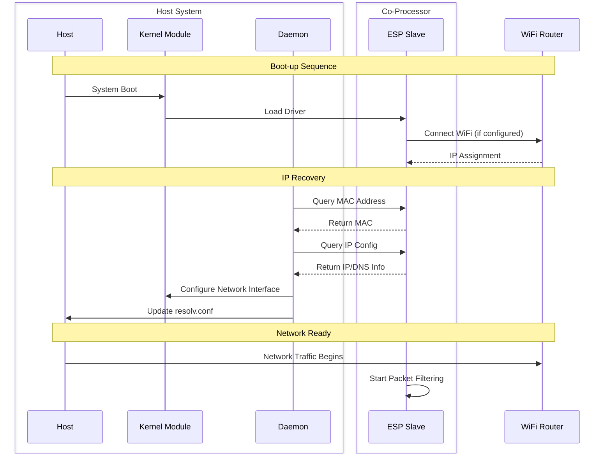
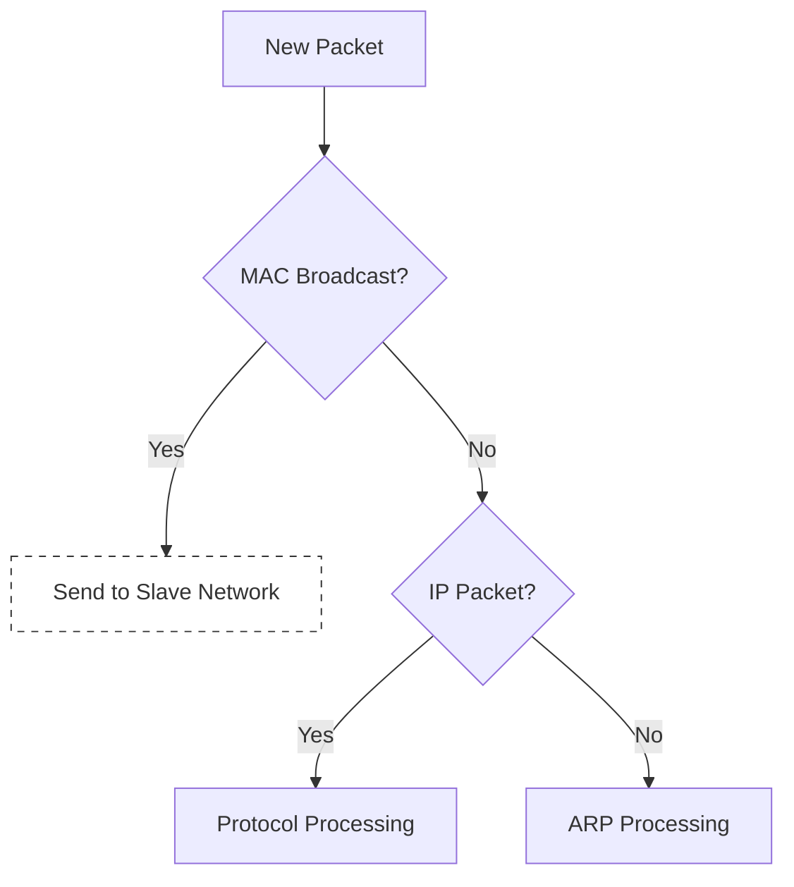
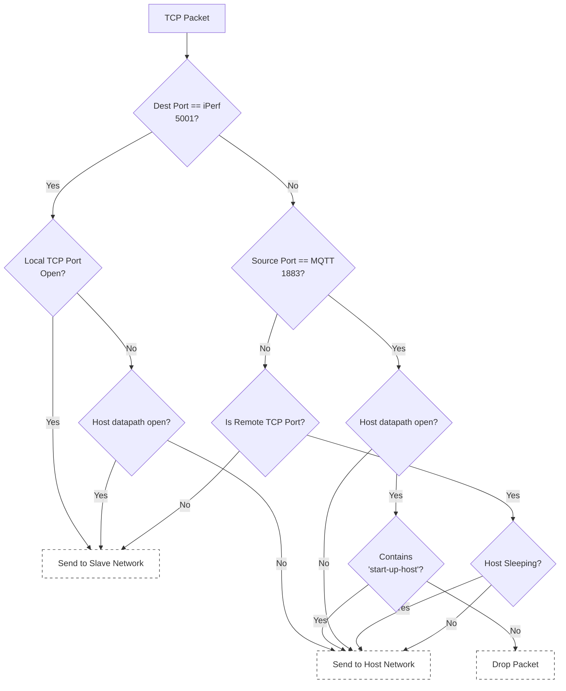
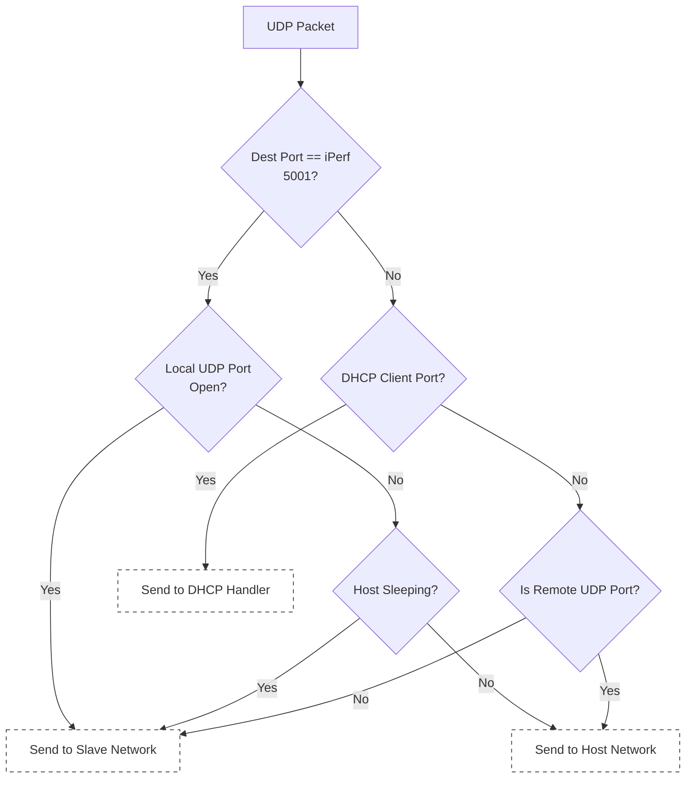
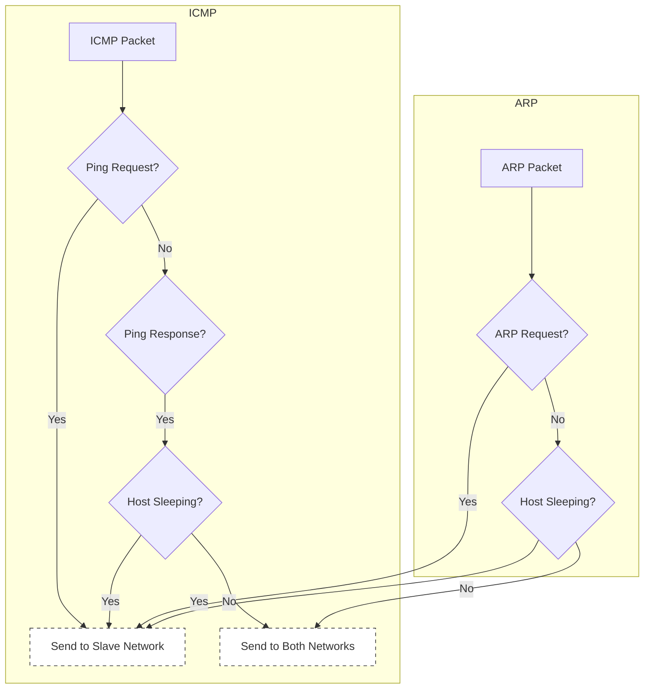

# Auto IP Restore Feature

## Index
1. [Overview](#1-overview) \
   1.1. [Feature Description](#11-feature-description) | 1.2. [Auto IP Recovery Process](#12-auto-ip-recovery-process)

2. [Network Architecture](#2-network-architecture) \
   2.1. [Network Split](#21-network-split) | 2.2. [Traffic Routing](#22-traffic-routing) ([Port Configuration](#221-port-configuration) | [Packet Filtering Logic](#222-packet-filtering-logic))

3. [Implementation](#3-implementation) \
   3.1. [Network Split Implementation](#31-network-split-implementation) 3.2. [IP Recovery Process](#32-ip-recovery-process)

4. [Components](#4-components) \
   4.1. [Host - Kernel Module](#41-host---kernel-module-esp_hosted_fghostlinuxhost_driver) | 4.2. [Host - Hosted Daemon](#42-host---hosted-daemon-esp_hosted_fghostlinuxhost_control) | 4.3. [Slave - Network Configuration](#43-slave---network-configuration) | 4.4. [Host system wide configuration](#44-host-system-wide-configuration)

5. [System Integration](#5-system-integration) \
   5.1. [Kernel Module Auto-loading](#51-kernel-module-auto-loading) | 5.2. [Daemon Service Setup](#52-daemon-service-setup)

6. [Brief Overview](#6-brief-overview-of-auto-ip-restore) \
   6.1. [Host System Behavior](#61-host-system-behavior) | 6.2. [Slave System Behavior](#62-slave-system-behavior)

7. [Troubleshooting](#7-troubleshooting) \
   7.1. [Common Issues](#71-common-issues) | 7.2. [Debug Support](#72-debug-support)

8. [Future Enhancements](#8-future-enhancements)

---

## 1. Overview

### 1.1. Feature Description
The Auto IP Restore feature enables seamless network connectivity management between a host system and ESP device (slave) in a co-processor setup. It allows network state persistence across host reboots and provides intelligent network traffic handling between host and slave.

Key features include:
- Automatic IP configuration restoration after host wakeup
- Split network handling between host and slave
- Intelligent network traffic distribution using port-based routing
- Seamless DHCP/DNS state management

### 1.2. Auto IP Recovery Process

The Auto IP Recovery process involves coordination between host and slave components:




Key Recovery Steps:
1. **Initial Connection**:
   - ESP slave connects to WiFi and obtains IP configuration
   - Configuration is stored in slave's flash memory
   - Host retrieves and applies this configuration

2. **State Persistence**:
   - Network parameters cached in slave
   - IP address, subnet mask, gateway
   - DNS server information
   - MAC address configuration

3. **Recovery Process**:
   - Automatic on host boot/resume
   - No WiFi reconnection needed
   - Seamless IP restoration
   - Minimal network downtime

## 2. Network Architecture

### 2.1. Network Split
- Both host and slave share the same IP address
- Network traffic is split based on destination port ranges:
  - Host handles ports 49152-61439
  - Slave handles ports 61440-65535
- This allows slave to handle lightweight network tasks while host is off or unavailable
- Port-based routing is transparent to remote endpoints

### 2.2. Traffic Routing

#### 2.2.1. Port Configuration

In slave side, the port range is configured in the Kconfig.projbuild file.
   ```c
   // In Kconfig.projbuild
   /* TCP */
   CONFIG_LWIP_TCP_LOCAL_PORT_RANGE_START=61440  // Slave
   CONFIG_LWIP_TCP_LOCAL_PORT_RANGE_END=65535    // Slave
   CONFIG_LWIP_TCP_REMOTE_PORT_RANGE_START=49152 // Host
   CONFIG_LWIP_TCP_REMOTE_PORT_RANGE_END=61439   // Host
   /* UDP */
   CONFIG_LWIP_UDP_LOCAL_PORT_RANGE_START=61440  // Slave
   CONFIG_LWIP_UDP_LOCAL_PORT_RANGE_END=65535    // Slave
   CONFIG_LWIP_UDP_REMOTE_PORT_RANGE_START=49152 // Host
   CONFIG_LWIP_UDP_REMOTE_PORT_RANGE_END=61439   // Host
   ```
This configuration is used to set the port range for the slave and host. `LOCAL_PORT_RANGE` is the port range for the slave, and `REMOTE_PORT_RANGE` is the port range for the host.

#### 2.2.2. Packet Filtering Logic

The traffic routing logic is implemented in the `lwip_filter.c` file at slave.
Once packet is received from the wifi router, slave passes the packet to the `filter_and_route_packet()` function.

This is the main logic for the traffic routing. It checks the destination port and routes the traffic to the appropriate network, one of the slave, the host or both.

User can also configure the port range in this function and re-flash the slave to apply the changes.
Currently, the port range is hardcoded. At later point, we will make it configurable from host.

This function filters based on the packet type and the destination port.
Please unfold the below flow charts to understand the packet classification and routing logic.











This routing involves:
- Main packet classification (MAC broadcast, protocol)
- TCP processing (iPerf, MQTT, remote ports)
- UDP processing (iPerf, DHCP, routing)
- ICMP/ARP handling (ping, ARP requests/responses)

## 3. Implementation

### 3.1. Network Split Implementation

To enable both slave and host to handle network traffic (re-using same IP address) we need to configure the port range and traffic routing logic.

The feature is controlled by
```
	config NETWORK_SPLIT_ENABLED
		bool "Enable the LWIP at slave, in addition to host network stack"
		default y
```
option at slave main/Kconfig.projbuild file.

### 3.2. IP Recovery Process

1. **Slave Handling**
The slave handles the wifi connection and ip address handling. The wifi SSID and password are handled in slave only and never travel to the host, if `CONFIG_NETWORK_SPLIT_ENABLED` is enabled.

Slave on boot up, could be configured to connect to wifi using a command,

```
coprocessor> sta <ssid> <password>
```
This would connect to the wifi and get the ip address.
This also would store the ip address in the slave's flash (by default).

Next time slave boots up, it would fetch the wifi credentials from the flash and connect to the wifi.

2. **Auto IP Recovery at host**
Host side user space application/daemon , once started, would check if the ip address is available in the slave.
If the ip address is available, it would configure the host's network interface `espsta0` created in esp-hosted kernel module with the ip address.

   ```c
   // In hosted_daemon.c
   static int fetch_ip_addr_from_slave(void) {
       ctrl_cmd_t *resp = get_dhcp_dns_status(req);
       if (resp->resp_event_status == SUCCESS) {
           strncpy(sta_ip_str, resp->u.dhcp_dns_status.dhcp_ip, MAC_ADDR_LENGTH);
           //... Set IP address to espsta0 network interface
           //... Set DNS server
           //... Set Routes
       }
       return resp_cb(resp);
   }
   ```

## 4. Components

### 4.1. Host - Kernel Module (`esp_hosted_fg/host/linux/host_driver/`)

- Handles device detection and initialization
- Manages network interface creation
- Implements power management callbacks
- Key files:
  ```
  esp32/
  ├── main.c           // Module entry point
  ├── esp_sdio.c       // SDIO transport
  └── esp_spi.c        // SPI transport
  ```

### 4.2. Host - Hosted Daemon (`esp_hosted_fg/host/linux/host_control/`)

- User-space service for IP management
- Handles network state restoration
- Manages system integration
- Key files:
  ```
  c_support/
  ├── hosted_daemon.c  // Main daemon
  └── ctrl_api.c       // Control interface
  ```

### 4.3. Slave - Network configuration

The slave control components handle network management on the ESP side:


1. **Network Filter** (`lwip_filter.c`, `lwip_filter.h`):
   ```c
   /* Filter configuration */
   #define MQTT_PORT 1883
   #define DEFAULT_IPERF_PORT 5001

   /* Main filtering function */
   hosted_l2_bridge filter_and_route_packet(void *frame_data, uint16_t frame_length);
   ```

2. **Configuration** (`Kconfig.projbuild`):


2.1 Network Split
   - `CONFIG_NETWORK_SPLIT_ENABLED`: Enable the LWIP at slave, basically, host and slave both have network interfaces, with same IP address, but different port ranges.

2.2 Network Filtering:
   - `CONFIG_LWIP_TCP_LOCAL_PORT_RANGE_START`: Configure TCP port ranges
   - `CONFIG_LWIP_TCP_LOCAL_PORT_RANGE_END`: Configure TCP port ranges
   - `CONFIG_LWIP_UDP_LOCAL_PORT_RANGE_START`: Configure UDP port ranges
   - `CONFIG_LWIP_UDP_LOCAL_PORT_RANGE_END`: Configure UDP port ranges
   - Special ports (MQTT, iPerf) handling


### 4.4 - Host system wide configuration
- /etc/sysctl.conf
   The hosted daemon updates the sysctl.conf file to set the port range for the host.
   ```
   net.ipv4.ip_local_port_range = 61440 65535
   ```
   This would mandate any TCP or UDP socket to use the 'source port' from the port range.

- /etc/resolv.conf
   Due to network configuration by the hosted daemon, the resolv.conf file might be updated with the DNS server by host base system.
   ```
   nameserver <dns_server_ip_received_from_slave>
   ```

## 5. System Integration

### 5.1. Kernel Module Auto-loading

1. Create `/etc/modules-load.d/esp-hosted.conf`:
```
esp32_sdio    # For SDIO version
# or
esp32_spi     # For SPI version
```

2. Create `/etc/modprobe.d/esp-hosted.conf`:
```
options esp32_sdio resetpin=19 clockspeed=20
```

3. Create `/lib/udev/rules.d/99-esp-hosted.rules`:
```
ACTION=="add", SUBSYSTEM=="sdio", ATTR{vendor}=="0x6666", RUN+="/sbin/modprobe esp32_sdio"
```

### 5.2. Daemon Service Setup

1. Create `/etc/systemd/system/hosted-daemon.service`:
```
[Unit]
Description=ESP Hosted Auto IP Restore Daemon
After=network.target

[Service]
Type=forking
ExecStart=/usr/local/bin/hosted_daemon
Restart=always
StandardOutput=syslog
StandardError=syslog
SyslogIdentifier=hosted-daemon

[Install]
WantedBy=multi-user.target
```

2. Enable and start:
```
sudo systemctl enable hosted-daemon
sudo systemctl start hosted-daemon
```

#### 5.2.1. hosted-daemon Operation Modes

###### Background Mode
- Runs as system daemon
- Logs to syslog/journalctl
- Start: `systemctl start hosted-daemon`
- Logs: `journalctl -u hosted-daemon`
- Configuration in `/etc/esp-hosted/config.conf`

###### Foreground Mode
- Debug-friendly console output
- Start: `hosted_daemon -f`
- Direct console logging
- Useful for troubleshooting

## 6. Brief Overview of Auto IP Restore

### 6.1. Host System Behavior
###### **System Boot**
   ```
   Kernel Boot → Module Load → Daemon Start → ESP Detection →
   MAC Fetch → IP Config Restore → Network Up
   ```

###### **Sleep Recovery**
Deep Sleep and Wake-up would be supported in upcoming release
   ```
   Host Wakeup → GPIO Event → Daemon Notification →
   IP State Query → Network Restore
   ```

### 6.2. Slave System Behavior

###### **Network Split Initialization**
   ```
   Module Load → Port Range Config → Traffic Filter Setup →
   Bridge Creation → Network Ready
   ```

## 7. Troubleshooting

### 7.1. Common Issues

1. **Network Split Issues**
   - Check port range configuration
   - Verify traffic routing
   - Monitor packet flow
   - Test with different protocols

2. **IP Restoration Failures**
   - Check daemon logs
   - Verify network configuration
   - Test recovery process
   - Monitor state transitions

### 7.2. Debug Support

1. **Module Loading**
```
# Check if ESP module is loaded
lsmod | grep esp32

# Check if daemon is running
ps -eaf | grep hosted_daemon

# View kernel messages
dmesg | grep esp32

# Verify parameters
modinfo esp32_sdio
```

2. **Network Interface**
```
# Check interface
ip link show ethsta0

# View IP configuration
ip addr show ethsta0
ifconfig ethsta0

# Check routing table
ip route show
ip route get 8.8.8.8  # Test routing

# Verify DNS configuration
cat /etc/resolv.conf
resolvectl status ethsta0  # For systemd-resolved systems

# Monitor interface
ethtool ethsta0
```

3. **Daemon Operation**
```
# Check status
systemctl status hosted-daemon

# View daemon logs
journalctl -u hosted-daemon -f

# Check syslog for daemon messages
tail -f /var/log/syslog | grep hosted-daemon

# Run in debug mode
hosted_daemon -f
```

4. **IP Recovery Debug**
```
# On Host:
# Check daemon logs for IP restoration
journalctl -u hosted-daemon -f | grep "IP"
tail -f /var/log/syslog | grep "Network identified"

# Check network interface status
ip addr show ethsta0
nmcli device show ethsta0

# On ESP (through serial console):
# Monitor ESP logs for network events
ESP_LOGI(TAG, "Network identified as up/down")
ESP_LOGI(TAG, "DHCP/DNS info")
```

## 8. Future Enhancements

- Dynamic port range configuration from host
- Enhanced logging and debugging capabilities
