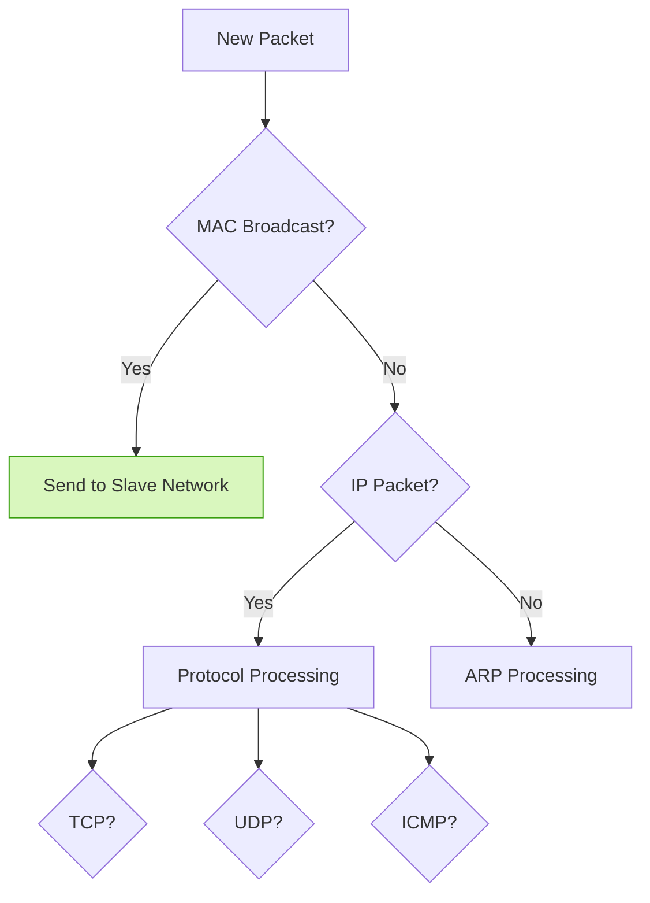
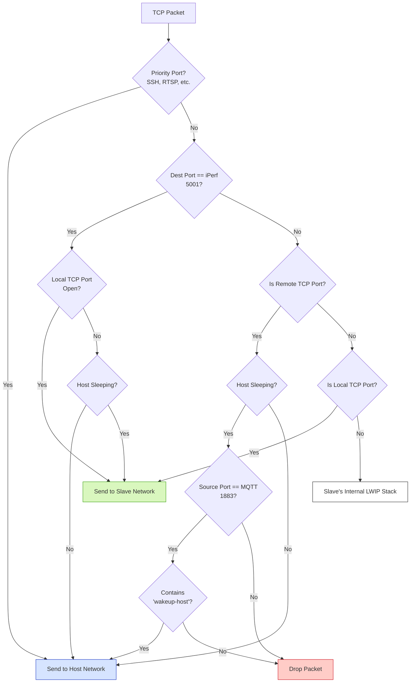
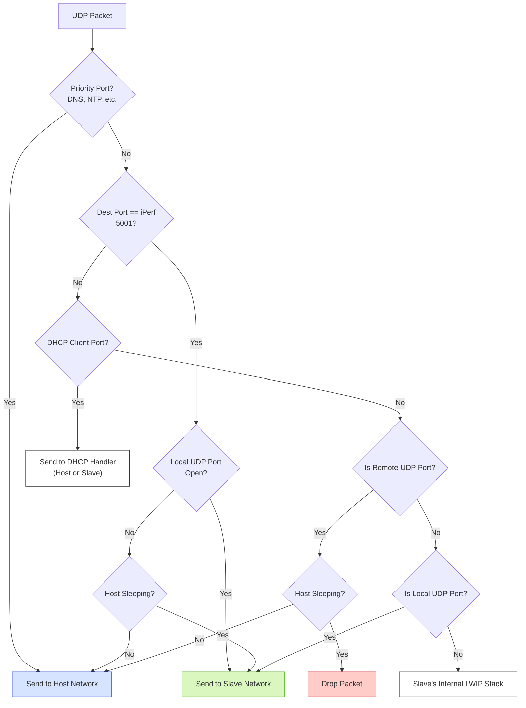
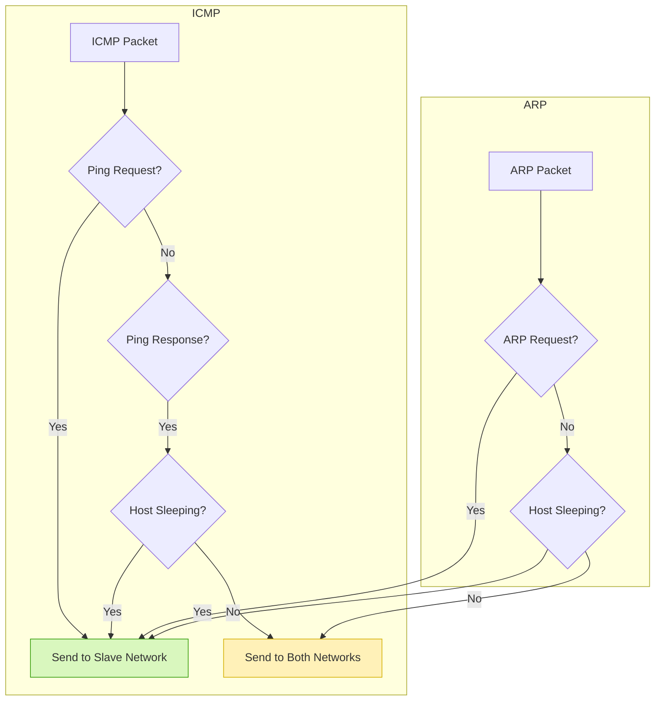

# Network Split Feature

<details>
<summary>Index</summary>

1.  [Introduction](#1-introduction)
2.  [Network Architecture](#2-network-architecture)
      - [2.1. High-level Overview](#21-high-level-overview)
          - [Packet routing entry](#packet-routing-entry)
          - [TCP Packets](#tcp-packets)
          - [UDP Packets](#udp-packets)
          - [ICMP & ARP Packets](#icmp--arp-packets)
      - [2.2. Packet Routing Summary](#22-packet-routing-summary)
3.  [Enable Network Split](#3-enable-network-split)
      - [3.1. Configure the ESP Firmware](#31-configure-the-esp-firmware-for-linux-host)
      - [3.2. Configure the Linux Host System](#32-configure-the-linux-host-system)
4.  [Troubleshooting](#4-troubleshooting)

</details>

## 1. Introduction

**Network Split** allows a **Linux Host** and an **ESP32 Slave** to share a single IP address and intelligently split network traffic between them. This means the ESP can continue handling selected network activity (like MQTT or DNS) even when the host is in a low-power "sleep" state, conserving energy without interrupting essential connectivity.

**Highlights:**

  * Port-based traffic splitting between the host and slave.
  * Shared IP address with intelligent packet routing.
  * Deep Packet Inspection (DPI) for custom handling and routing of packets.

##### Co-Processor Supported

| Supported Slave Targets | ESP32-C5 | ESP32-C6/C61 | ESP32-S2 | ESP32-S3 | ESP32 |
| :---------------------- | :------: | :----------: | :------: | :------: | :---: |

##### Communication Bus Supported

| Transports Supported | SPI | SDIO |
| :-------------------: | :-: | :--: |

-----

## 2. Network Architecture

The Network Split architecture divides incoming network traffic based on destination port ranges. By default:

  * The **Host** handles ports **49152-61439**.
  * The **Slave** handles ports **61440-65535**.

This port-based routing is transparent to remote endpoints, making it appear as a single device with one IP address.

### 2.1. High-level Overview

The core packet routing logic resides in `lwip_filter.c` and `lwip_filter.h` on the slave side, managing all packet routing decisions. The packet routing logic implementation:

https://github.com/espressif/esp-hosted/blob/ba39e6392f4f1c2e9ace3c5fa463bab34a42cb31/esp_hosted_fg/esp/esp_driver/network_adapter/main/lwip_filter.c#L347-L520

The routing logic includes special handling for:

  * **Priority ports** (e.g., SSH, HTTP, RTSP, DNS, NTP).
  * **MQTT messages** containing "wakeup-host" content.
  * **iPerf** performance testing traffic.
  * **DHCP client** traffic.
  * **ARP** and **ICMP** protocols.

The diagrams below illustrate the packet classification and routing logic:

#### Packet routing entry



#### TCP Packets



#### UDP Packets



#### ICMP & ARP Packets



The slave determines if the host is "sleeping" by monitoring the host's activity or a dedicated control signal, ensuring packets are routed appropriately to wake the host when necessary or handled by the slave directly.

### 2.2. Packet Routing Summary

All incoming packets are evaluated by `lwip_filter.c`. The slave routes packets based on these rules:

| Packet Type                           | Destination Port Condition                 | Routed To                          |
| :------------------------------------ | :----------------------------------------- | :--------------------------------- |
| Broadcast, ARP Request, ICMP Request  | N/A                                        | Slave Network Stack                |
| TCP/UDP                               | Listed in Static Port Forwarding           | Host Network Stack                 |
| TCP/UDP                               | Within Host Port Range (49152-61439)       | Host Network Stack                 |
| TCP/UDP                               | Within Slave Port Range (61440-65535)      | Slave Network Stack                |
| Others                                | Not matched by any rule                    | Default Destination (as configured)|
| iperf (-p 5001 default port)          | If 5001 is open at slave                   | Slave Network Stack. Else Host Network Stack |

-----

## 3. Enable Network Split

### 3.1. Configure the ESP Firmware (for Linux Host)

The firmware source is located at: [esp\_hosted\_fg/esp/esp\_driver/network\_adapter](https://github.com/espressif/esp-hosted/tree/master/esp_hosted_fg/esp/esp_driver/network_adapter)

##### SDK Setup

  * **Linux / Mac users:**
    ```bash
    bash setup-idf.sh
    ```
  * **Windows users:**
    Refer to [setup\_windows11.md](https://github.com/espressif/esp-hosted/blob/master/esp_hosted_fg/esp/esp_driver/setup_windows11.md).

##### Configure Network Split Mode

Run `idf.py menuconfig` from your firmware directory.

Enable the feature:

```
Example Configuration
└── [*] Allow Network Split using packet port number
```

(Optional) Customize under `Network Split Configuration`:

```
├── Extra port forwarding to host (static)
│   ├── TCP dst: 22,8554  (e.g., SSH, RTSP)
│   └── UDP dst: 53,123   (e.g., DNS, NTP)
├── Port Ranges
│   ├── Host: 49152–61439
│   └── Slave: 61440–65535
└── Default Destination: slave / host / both
```

##### Build and Flash ESP Firmware

```bash
idf.py -p /dev/ttyUSBx build flash monitor
```

(Replace `/dev/ttyUSBx` with your ESP device’s serial port.)

-----

### 3.2. Configure the Linux Host System

The Linux host code is located at: [esp\_hosted\_fg/host/linux](https://www.google.com/search?q=https://github.com/espressif/esp-hosted/tree/master/esp_hosted_fg/host/linux)

##### Sysctl Configuration

Edit `/etc/sysctl.conf`:

```bash
net.ipv4.ip_local_port_range = 49152 61439
```

Apply the changes:

```bash
sudo sysctl -p
```

> [!TIP]
> The port ranges configured on the host and slave **must match exactly** to avoid routing issues.

##### Setup Linux Host Driver and Application

  * **Kernel Module:**
    Build using the [Makefile](https://github.com/espressif/esp-hosted/blob/master/esp_hosted_fg/host/linux/host_driver/esp32/Makefile) or the [helper script](https://github.com/espressif/esp-hosted/blob/master/esp_hosted_fg/host/linux/host_control/rpi_init.sh) (`rpi_init.sh`) for Raspberry Pi.

  * **User Application:**
    Build:

    ```bash
    cd esp_hosted_fg/host/linux/host_control
    make hosted_shell
    ```

    Run:

    ```bash
    sudo ./hosted_shell.out
    ```

    Connect the ESP to Wi-Fi:

    ```bash
    connect_ap <SSID> <Password>
    ```

    This command creates the `ethsta0` network interface, which is then ready for standard socket-based tools like `iperf`.

-----

## 4. Troubleshooting

**Debug Logging:**
To enable verbose logging for the packet routing logic on the slave:

```c
esp_log_level_set("lwip_filter", ESP_LOG_VERBOSE);
```

**Network Monitoring:**
Use `tcpdump` to monitor traffic on the host interface:

```bash
sudo tcpdump -i ethsta0 port 80
```

Check the configured local port range on the host:

```bash
cat /proc/sys/net/ipv4/ip_local_port_range
```

**Common Issues:**

  * **Packets not getting delivered to host or slave:**
      * Check if the socket being opened is using reserved port ranges.
      * If so, you can either handle the packet within the existing packet routing logic or add the destination port to the `Extra port forwarding to host` configuration in `menuconfig`.
  * **DHCP not completing:**
      * Verify where the DHCP packet is destined by checking the `lwip_filter.c` logic related to DHCP (refer to lines [38-42 here](https://github.com/espressif/esp-hosted/blob/ba39e6392f4f1c2e9ace3c5fa463bab34a42cb31/esp_hosted_fg/esp/esp_driver/network_adapter/main/lwip_filter.c#L38-L42)).
  * **Same port needing to be used by both slave and host:**
      * This is already supported for iperf on port 5001. You can amend the packet routing logic in `lwip_filter.c` to handle other specific ports similarly if needed.
