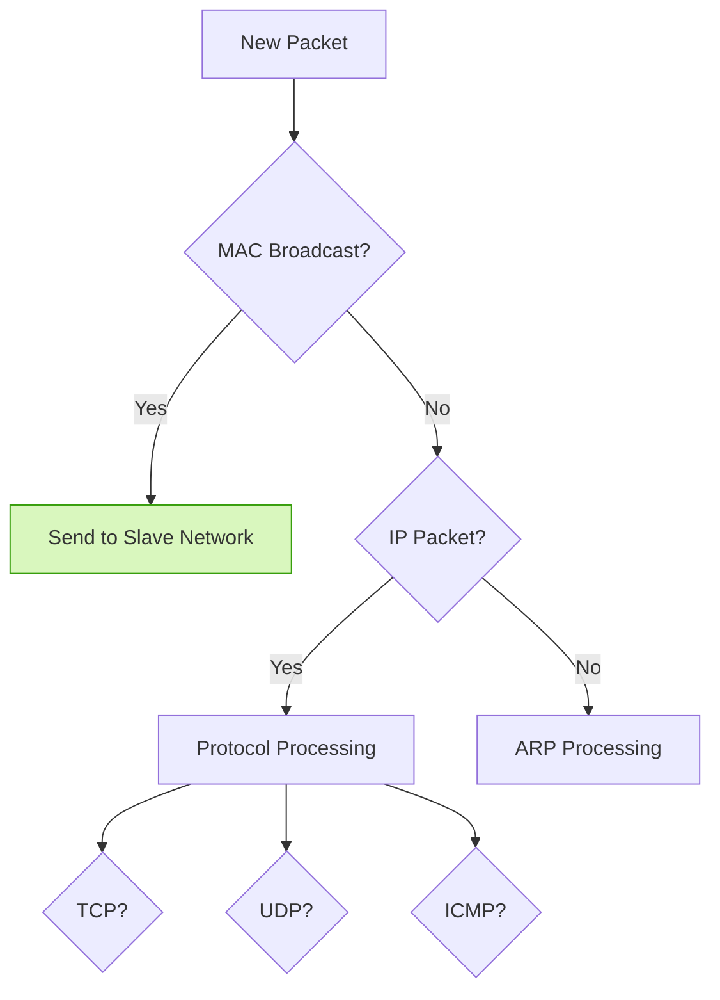
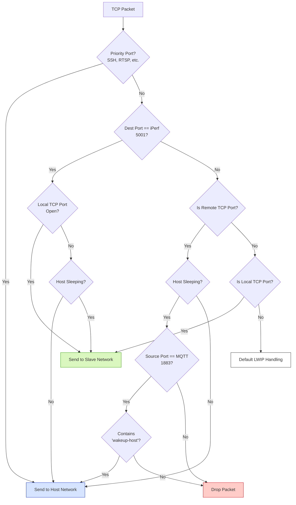
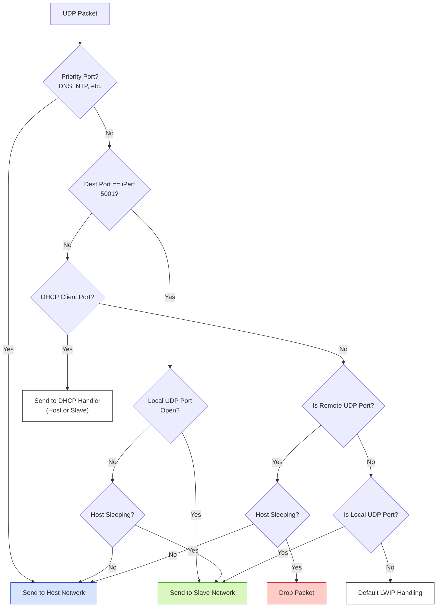
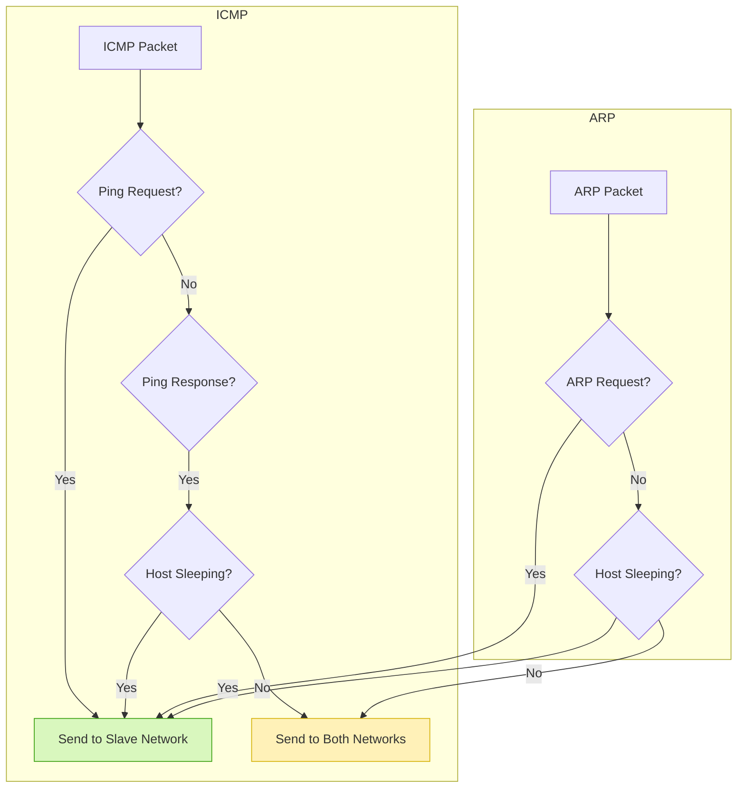

# Network Split Feature

<details>
<summary>Index</summary>

1. [Overview](#1-overview)
2. [Network Architecture](#2-network-architecture)
   - [2.1. Port Configuration](#21-port-configuration)
   - [2.2. Packet Filtering Logic](#22-packet-filtering-logic)
3. [Implementation](#3-implementation)
   - [3.1. Configuration Setup](#31-configuration-setup)
   - [3.2. Host Configuration](#32-host-configuration)
4. [Components](#4-components)
   - [4.1. Network Filter](#41-network-filter)
   - [4.2. Configuration](#42-configuration)
5. [Troubleshooting](#5-troubleshooting)
   - [5.1. Common Issues](#51-common-issues)
   - [5.2. Debug Support](#52-debug-support)

</details>

## 1. Overview

The Network Split feature enables both the host system and ESP device (slave) to share the same IP address while handling network traffic independently. This approach allows the ESP to manage lightweight network tasks even when the host is unavailable or in a power-saving state.

Key features include:
- Port-based traffic splitting between host and slave
- Intelligent packet filtering based on source and destination port
- With Deep Packet Inspection (DPI) special & custom handling of packets possible

## 2. Network Architecture

The Network Split architecture divides network traffic based on destination port ranges:
- Host handles ports 49152-61439
- Slave handles ports 61440-65535

This port-based routing is transparent to remote endpoints, making it appear as a single device with one IP address.

### 2.1. Port Configuration

In the slave device, the port range is configured in the Kconfig.projbuild file:

```c
// In Kconfig.projbuild
/* TCP */
CONFIG_LWIP_TCP_LOCAL_PORT_RANGE_START=61440  // Slave
CONFIG_LWIP_TCP_LOCAL_PORT_RANGE_END=65535    // Slave
CONFIG_LWIP_TCP_REMOTE_PORT_RANGE_START=49152 // Host
CONFIG_LWIP_TCP_REMOTE_PORT_RANGE_END=61439   // Host
/* UDP */
CONFIG_LWIP_UDP_LOCAL_PORT_RANGE_START=61440  // Slave
CONFIG_LWIP_UDP_LOCAL_PORT_RANGE_END=65535    // Slave
CONFIG_LWIP_UDP_REMOTE_PORT_RANGE_START=49152 // Host
CONFIG_LWIP_UDP_REMOTE_PORT_RANGE_END=61439   // Host
```

`LOCAL_PORT_RANGE` represents the port range for the slave, and `REMOTE_PORT_RANGE` is the port range for the host.

### 2.2. Packet Filtering Logic

The traffic routing logic is implemented in the `lwip_filter.c` file in the slave. When a packet is received from the WiFi router, the slave passes it to the `filter_and_route_packet()` function.

This function examines each packet and determines whether it should be processed by the slave, forwarded to the host, or both, based on various criteria including the protocol, port numbers, and host power state.

The diagrams below illustrate the packet classification and routing logic:

##### 2.2.1 Packet filtering entry


##### 2.2.2 TCP Packet filtering



##### 2.2.3 UDP Packet filtering



##### 2.2.4 ICMP & ARP Packet filtering



The packet routing involves:
- Main packet classification (MAC broadcast, protocol)
- TCP processing (priority ports, iPerf, MQTT, remote/local ports)
- UDP processing (priority ports, iPerf, DHCP, remote/local ports)
- ICMP/ARP handling (ping, ARP requests/responses)

## 3. Implementation

### 3.1. Configuration Setup

The Network Split feature is controlled by a configuration option in the slave's `main/Kconfig.projbuild` file:

```
config NETWORK_SPLIT_ENABLED
    bool "Enable the LWIP at slave, in addition to host network stack"
    default y
```

When enabled, this feature allows both the slave and host to handle network traffic using the same IP address with port-based splitting.

Additional configuration options include:

```
menu "Slave side (local) LWIP port range (static)"
    config LWIP_TCP_LOCAL_PORT_RANGE_START
        int "Slave TCP start port"
        default 61440
    config LWIP_TCP_LOCAL_PORT_RANGE_END
        int "Slave TCP end port"
        default 65535
    config LWIP_UDP_LOCAL_PORT_RANGE_START
        int "Slave UDP start port"
        default 61440
    config LWIP_UDP_LOCAL_PORT_RANGE_END
        int "Slave UDP end port"
        default 65535
endmenu

menu "Host side (remote) LWIP port range (static)"
    config LWIP_TCP_REMOTE_PORT_RANGE_START
        int "Host TCP start port"
        default 49152
    config LWIP_TCP_REMOTE_PORT_RANGE_END
        int "Host TCP end port"
        default 61439
    config LWIP_UDP_REMOTE_PORT_RANGE_START
        int "Host UDP start port"
        default 49152
    config LWIP_UDP_REMOTE_PORT_RANGE_END
        int "Host UDP end port"
        default 61439
endmenu

config ESP_HOSTED_HOST_RESERVED_PORTS_CONFIGURED
    bool "Extra port forwarding to host (static)"
    default y
```

There's also support for configuring priority ports that should always be forwarded to the host:

```
menu "Host Static Port Forwarding"
    depends on ESP_HOSTED_HOST_RESERVED_PORTS_CONFIGURED

    config ESP_HOSTED_HOST_RESERVED_TCP_SRC_PORTS
        string "TCP source ports to forward to host (comma separated)"
        default "22,8554"

    config ESP_HOSTED_HOST_RESERVED_TCP_DEST_PORTS
        string "TCP destination ports to forward to host (comma separated)"
        default "22,80,443,8080,8554"

    config ESP_HOSTED_HOST_RESERVED_UDP_SRC_PORTS
        string "UDP source ports to allowed from host (comma separated)"
        default ""

    config ESP_HOSTED_HOST_RESERVED_UDP_DEST_PORTS
        string "UDP destination ports to forward to host (comma separated)"
        default "53,123"
endmenu
```

### 3.2. Host Configuration

The host system's port range must be complementary to the slave's range. This is typically configured by the hosted daemon, which updates the system settings:

- `/etc/sysctl.conf` - The hosted daemon updates this file to set the port range for the host:
  ```
  net.ipv4.ip_local_port_range = 49152 61439
  ```

Changes in `/etc/sysctl.conf` can be applied using command, `sysctl -p`
These changes are also applied in user space demo apps. APIs are defined in [nw_helper_func.c](../../host/linux/host_control/c_support/nw_helper_func.c)

```
int update_host_network_port_range(uint16_t port_start, uint16_t port_end); # Change sysctl.conf and apply host port range
int clear_host_network_port_range(void); # clear host port range and apply
```

## 4. Components

### 4.1. Network Filter

The network filter implementation in `lwip_filter.c` and `lwip_filter.h` handles the packet routing logic:

```c
/* Filter configuration */
#define MQTT_PORT 1883
#define WAKEUP_HOST_STRING "wakeup-host"
#define DEFAULT_IPERF_PORT 5001

/* Main filtering function */
hosted_l2_bridge filter_and_route_packet(void *frame_data, uint16_t frame_length);
```

The filter has special handling for:
- Priority ports (SSH, HTTP, RTSP, DNS, NTP)
- MQTT messages with "wakeup-host" content
- iPerf performance testing
- DHCP client traffic
- ARP and ICMP protocols

### 4.2. Configuration

The network split configuration includes:

- **Network Split Enable**:
  - `CONFIG_NETWORK_SPLIT_ENABLED`: Enable LWIP at slave, in addition to host network stack

- **Port Range Configuration**:
  - TCP/UDP port ranges for both slave and host
  - Priority port forwarding for specific applications

- **Default Routing**:
  ```
  choice
      prompt "Destination LWIP for unfiltered packet"
      default ESP_DEFAULT_LWIP_SLAVE

      config ESP_DEFAULT_LWIP_SLAVE
          bool "Send packet to slave LWIP"

      config ESP_DEFAULT_LWIP_HOST
          bool "Send packet to host LWIP"

      config ESP_DEFAULT_LWIP_BOTH
          bool "Send packet to both LWIPs"
  endchoice
  ```

## 5. Troubleshooting

### 5.1. Common Issues

1. **Port Conflict Issues**
   - Check port range configuration on both host and slave
   - Verify applications are using the correct port ranges
   - Ensure there's no overlap in port assignments

2. **Packet Routing Problems**
   - Monitor packet flow with packet capture tools
   - Check if packets are being sent to the correct interface
   - Verify filter logic is working as expected

3. Same port to be used at both slave and host
   - This is already supported for iperf port 5001
   - In the same fashion, any new port could be ammended

### 5.2. Initial Debugging

1. **Network Traffic Monitoring**
   ```
   # On host:
   sudo tcpdump -i ethsta0

   # Filter by port:
   sudo tcpdump -i ethsta0 port 80

   # Check port ranges:
   cat /proc/sys/net/ipv4/ip_local_port_range
   ```

2. **Slave Packet Filtering Debug**
   - Enable verbose logging in `lwip_filter.c`
   - Monitor ESP logs for packet routing decisions:
   ```
   ESP_LOGV(TAG, "TCP dst_port: %u, src_port: %u", dst_port, src_port);
   ESP_LOGV(TAG, "Packet sent to: %s", result == SLAVE_LWIP_BRIDGE ? "Slave" : "Host");
   ```
