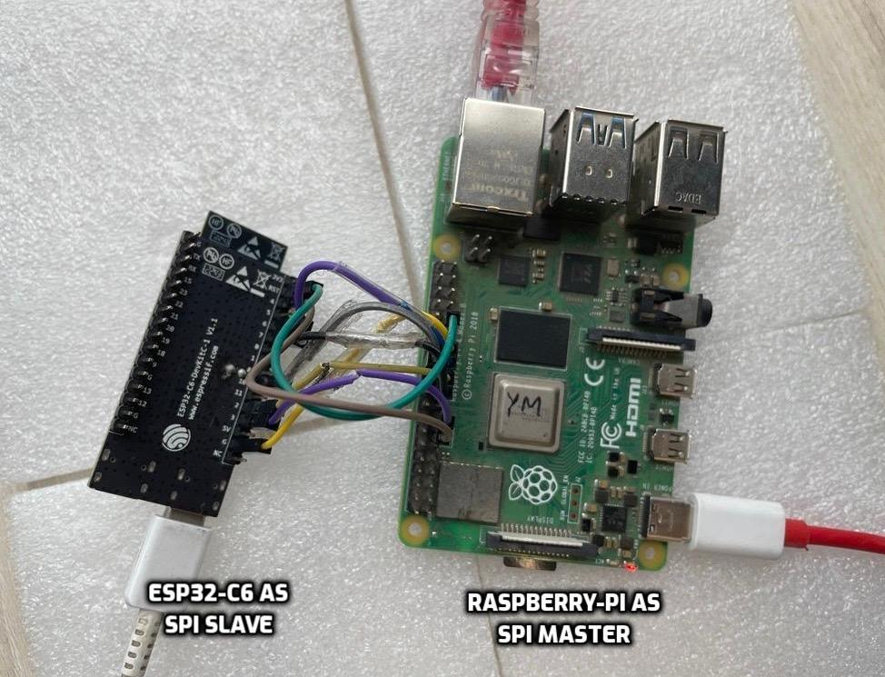

# Wi-Fi and BT/BLE connectivity Setup over SPI

| Supported Targets | ESP32 | ESP32-S2 | ESP32-S3 | ESP32-C2 | ESP32-C3 | ESP32-C6 |
| ----------------- | ----- | -------- | -------- | -------- | -------- | -------- |

## 1. Setup
### 1.1 Hardware Setup
In this setup, ESP board acts as a SPI peripheral and provides Wi-Fi capabilities to host. Please connect ESP board to Raspberry-Pi with jumper cables as mentioned below.
It may be good to use small length cables to ensure signal integrity.
Raspberry Pi should be powered with correct incoming power rating.
ESP can be powered through PC using micro-USB/USB-C cable.

Raspberry-Pi pinout can be found [here!](https://pinout.xyz/pinout/spi)

#### 1.1.1 Pin connections
| Raspberry-Pi Pin | ESP32 | ESP32-S2/S3 | ESP32-C2/C3/C6 | Function |
|:-------:|:---------:|:--------:|:--------:|:--------:|
| 24 | IO15 | IO10 | IO10 | CS0 |
| 23 | IO14 | IO12 | IO6 | SCLK |
| 21 | IO12 | IO13 | IO2 | MISO |
| 19 | IO13 | IO11 | IO7 | MOSI |
| 25 | GND | GND | GND | Ground |
| 15 | IO2 | IO2 | IO3 | Handshake |
| 13 | IO4 | IO4 | IO4 | Data Ready |
| 31 | EN  | RST | RST | ESP32 Reset |

Sample SPI setup with ESP32-C6 as slave and RaspberryPi as Host looks like:



- Use good quality extremely small (smaller than 10cm) jumper wires, all equal length
- Optionally, Add external pull-up of min 10k Ohm on CS line just to prevent bus floating
- In case of ESP32-S3, For avoidance of doubt, You can power using [UART port](https://docs.espressif.com/projects/esp-idf/en/latest/esp32s3/hw-reference/esp32s3/user-guide-devkitc-1.html#description-of-components)

### 1.2 Raspberry-Pi Software Setup
The SPI master driver is disabled by default on Raspberry-Pi OS. To enable it add following commands in  _/boot/config.txt_ file
```
dtparam=spi=on
dtoverlay=disable-bt
```
In addition, below options are set as the SPI clock frequency in analyzer is observed to be smaller than expected clock. This is RaspberryPi specific [issue](https://github.com/raspberrypi/linux/issues/2286).
```
core_freq=250
core_freq_min=250
```
Please reboot Raspberry-Pi after changing this file.
Also, please disable the default Wi-Fi network interface (e.g `wlan0`) using networking configuration on your Linux host so that we will be sure that Wi-Fi is only provided with ESP-Hosted. Every packet would be passed through the ESP-Hosted Wi-Fi interface and not the native onboard Wi-Fi.

## 2. Load ESP-Hosted Solution
### 2.1 Host Software
* Execute following commands in root directory of cloned ESP-Hosted repository on Raspberry-Pi
```sh
$ cd esp_hosted_fg/host/linux/host_control/
$ ./rpi_init.sh spi
```
* This script compiles and loads host driver on Raspberry-Pi. It also creates virtual serial interface `/dev/esps0` which is used as a control interface for Wi-Fi on ESP peripheral

### 2.2 ESP Peripheral Firmware
One can load pre-built release binaries on ESP peripheral or compile those from source. Below subsection explains both these methods.

#### 2.2.1 Load Pre-built Release Binaries
* Download pre-built firmware binaries from [releases](https://github.com/espressif/esp-hosted/releases)
* Follow `readme.txt` from release tarball to flash the ESP binary
* :warning: Make sure that you use `Source code (zip)` in `Assets` fold with associated release for host building.
* Windows user can use ESP Flash Programming Tool to flash the pre-built binary.
* Collect firmware log
    * Use minicom or any similar terminal emulator with baud rate 115200 to fetch esp side logs on UART
```sh
$ minicom -D <serial_port>
```
serial_port is device where ESP chipset is detected. For example, /dev/ttyUSB0

#### 2.2.2 Source Compilation

Make sure that same code base (same git commit) is checked-out/copied at both, ESP and Host

##### Set-up ESP-IDF
- :warning: Following command is dangerous. It will revert all your local changes. Stash if need to keep them.
- Install the ESP-IDF using script
```sh
$ cd esp_hosted_fg/esp/esp_driver
$ cmake .
```
- Set-Up the build environment using
```sh
$ . ./esp-idf/export.sh
# Optionally, You can add alias for this command in ~/.bashrc for later use
```

##### Configure, Build & Flash SPI ESP firmware
* Set slave chipset environment
```
$ cd network_adapter
$ rm -rf sdkconfig build
$ idf.py set-target <esp_chipset>
```

For SPI, <esp_chipset> could be onr of `esp32`, `esp32s2`, `esp32s3`, `esp32c2`, `esp32c3`, `esp32c6`
* Execute following command to configure the project
```
$ idf.py menuconfig
```
* This will open project configuration window. To select SPI transport interface, navigate to `Example Configuration ->  Transport layer -> SPI interface -> select` and exit from menuconfig.

* For ESP32-C3, select chip revision in addition. Navigate to `Component config → ESP32C3-Specific → Minimum Supported ESP32-C3 Revision` and select chip version of ESP32-C3.

* Use below command to compile and flash the project. Replace <serial_port> with ESP peripheral's serial port.
```
$ idf.py -p <serial_port> build flash
```
* Collect the firmware log using
```
$ idf.py -p <serial_port> monitor
```

## 3. Checking the Setup

- Firmware log
On successful flashing, you should see following entry in ESP log:

```
[   77.877892] Features supported are:
[   77.877901]   * WLAN
[   77.877906]   * BT/BLE
[   77.877911]     - HCI over SPI
[   77.877916]     - BLE
```

- Host log
    If the transport is setup correctly, you should receive INIT event similar to above from ESP to host in `dmesg` log

**If intended transport is SPI+UART, please continue ahead with UART setup**
