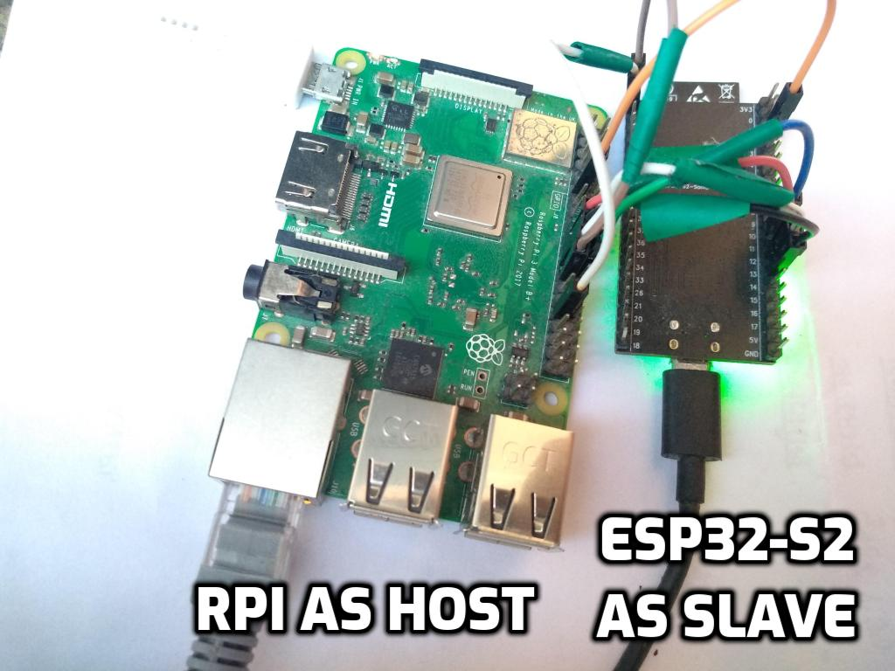
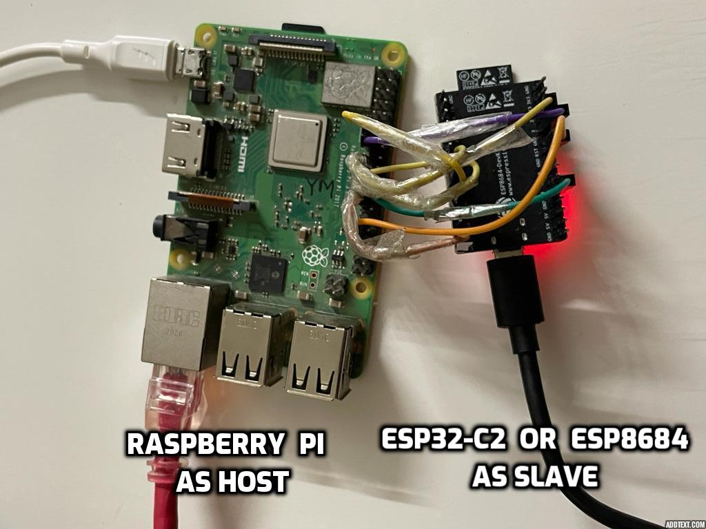

# Wi-Fi and BT/BLE connectivity Setup over SPI
## 1. Setup
### 1.1 Hardware Setup
In this setup, ESP board acts as a SPI peripheral and provides Wi-Fi capabilities to host. Please connect ESP peripheral to Raspberry-Pi with jumper cables as mentioned below. It may be good to use small length cables to ensure signal integrity. Power ESP and Raspberry Pi separately with a power supply that provide sufficient power. ESP can be powered through PC using micro-USB cable.

Raspberry-Pi pinout can be found [here!](https://pinout.xyz/pinout/spi)

#### 1.1.1 ESP32 setup
| Raspberry-Pi Pin | ESP32 Pin | Function |
|:-------:|:---------:|:--------:|
| 24 | IO15 | CS0 |
| 23 | IO14 | SCLK |
| 21 | IO12 | MISO |
| 19 | IO13 | MOSI |
| 25 | GND | Ground |
| 15 | IO2 | Handshake |
| 13 | IO4 | Data Ready |
| 31 | EN  | ESP32 Reset |

Setup image is here.


#### 1.1.2 ESP32-S2 setup
| Raspberry-Pi Pin | ESP32-S2 Pin | Function |
|:----------------:|:------------:|:--------:|
| 24 | IO10 | CS0 |
| 23 | IO12 | SCLK |
| 21 | IO13 | MISO |
| 19 | IO11 | MOSI |
| 25 | GND | Ground |
| 15 | IO2 | Handshake |
| 13 | IO4 | Data ready |
| 31 | RST | ESP32 Reset |

Setup image is here.



#### 1.1.3 ESP32-C2 setup
| Raspberry-Pi Pin | ESP32-C2 Pin | Function |
|:----------------:|:------------:|:--------:|
| 24 | IO10 | CS0 |
| 23 | IO06 | SCLK |
| 21 | IO02 | MISO |
| 19 | IO07 | MOSI |
| 25 | GND | Ground |
| 15 | IO03 | Handshake |
| 13 | IO04 | Data ready |
| 31 | RST | ESP32 Reset |

Setup image is here.




#### 1.1.3 ESP32-C3 setup
| Raspberry-Pi Pin | ESP32-C3 Pin | Function |
|:----------------:|:------------:|:--------:|
| 24 | IO10 | CS0 |
| 23 | IO06 | SCLK |
| 21 | IO02 | MISO |
| 19 | IO07 | MOSI |
| 25 | GND | Ground |
| 15 | IO03 | Handshake |
| 13 | IO04 | Data ready |
| 31 | RST | ESP32 Reset |

Setup image is here.


#### 1.1.4 ESP32-S3 setup
- For ESP32-S3, microUSB power is expected to insert in [UART port](https://docs.espressif.com/projects/esp-idf/en/latest/esp32s3/hw-reference/esp32s3/user-guide-devkitc-1.html#description-of-components)

| Raspberry-Pi Pin | ESP32-S3 Pin | Function |
|:----------------:|:------------:|:--------:|
| 24 | IO10 | CS0 |
| 23 | IO12 | SCLK |
| 21 | IO13 | MISO |
| 19 | IO11 | MOSI |
| 25 | GND | Ground |
| 15 | IO2 | Handshake |
| 13 | IO4 | Data ready |
| 31 | RST | ESP32 Reset |

Setup image is here.


### 1.2 Raspberry-Pi Software Setup
The SPI master driver is disabled by default on Raspberry-Pi OS. To enable it add following commands in  _/boot/config.txt_ file
```
dtparam=spi=on
dtoverlay=disable-bt
```
In addition, below options are set as the SPI clock frequency in analyzer is observed to be smaller than expected clock. This is RaspberryPi specific [issue](https://github.com/raspberrypi/linux/issues/2286).
```
core_freq=250
core_freq_min=250
```
Please reboot Raspberry-Pi after changing this file.

## 2. Load ESP-Hosted Solution
### 2.1 Host Software
* Execute following commands in root directory of cloned ESP-Hosted repository on Raspberry-Pi
```sh
$ cd esp_hosted_fg/host/linux/host_control/
$ ./rpi_init.sh spi
```
* This script compiles and loads host driver on Raspberry-Pi. It also creates virtual serial interface `/dev/esps0` which is used as a control interface for Wi-Fi on ESP peripheral

### 2.2 ESP Peripheral Firmware
One can load pre-built release binaries on ESP peripheral or compile those from source. Below subsection explains both these methods.

#### 2.2.1 Load Pre-built Release Binaries
* Download pre-built firmware binaries from [releases](https://github.com/espressif/esp-hosted/releases)
* Follow `readme.txt` from release tarball to flash the ESP binary
* :warning: Make sure that you use `Source code (zip)` in `Assets` fold with associated release for host building.
* Windows user can use ESP Flash Programming Tool to flash the pre-built binary.

#### 2.2.2 Source Compilation
- Note: Please use the same git commit both at ESP and Host
- Clone the ESP-IDF [release/v5.0](https://github.com/espressif/esp-idf/tree/release/v5.0) and git checkout to `release/v5.0` branch.
- [Set-up the ESP-IDF](https://docs.espressif.com/projects/esp-idf/en/release-v5.0/esp32/get-started/index.html)
- In root directory of ESP-Hosted repository, execute below command

```sh
$ cd esp_hosted_fg/esp/esp_driver/network_adapter
```

##### Using cmake

* :warning: `Set target if the ESP32-S2/ESP32-C2/ESP32-C3/ESP32-S3 is being used. Skip if ESP32 is being used.`
```
$ idf.py set-target esp32s2
```
or
```
$ idf.py set-target esp32c2
```
or
```
$ idf.py set-target esp32c3
```
or
```
$ idf.py set-target esp32s3
```

* Execute following command to configure project
```sh
$ idf.py menuconfig
```
* This will open project configuration window. To select SPI transport interface, navigate to `Example Configuration ->  Transport layer -> SPI interface -> select` and exit from menuconfig.

* For ESP32-C3, select chip revision in addition. Navigate to `Component config → ESP32C3-Specific → Minimum Supported ESP32-C3 Revision` and select chip version of ESP32-C3.

* Use below command to compile and flash the project. Replace <serial_port> with ESP peripheral's serial port.
```sh
$ idf.py -p <serial_port> build flash
```

## 3. Checking the Setup for SPI
Once ESP peripheral has a valid firmware and booted successfully, you should be able to see successful enumeration on Raspberry Pi side as:
```
$ dmesg
[   47.150740] OF: overlay: WARNING: memory leak will occur if overlay removed, property: /soc/spi@7e204000/spidev@0/status
[   47.346754] Bluetooth: Core ver 2.22
[   47.346812] NET: Registered protocol family 31
[   47.346815] Bluetooth: HCI device and connection manager initialized
[   47.346830] Bluetooth: HCI socket layer initialized
[   47.346837] Bluetooth: L2CAP socket layer initialized
[   47.346856] Bluetooth: SCO socket layer initialized
[   65.589406] esp32_spi: loading out-of-tree module taints kernel.
[   65.591409] esp32: Resetpin of Host is 6
[   65.591541] esp32: Triggering ESP reset.
[   65.593385] ESP32 device is registered to SPI bus [0],chip select [0]
[   66.201597] Received INIT event from esp32
[   66.201613] ESP32 capabilities: 0x78
[   66.619381] Bluetooth: BNEP (Ethernet Emulation) ver 1.3
[   66.619388] Bluetooth: BNEP filters: protocol multicast
[   66.619404] Bluetooth: BNEP socket layer initialized
```
