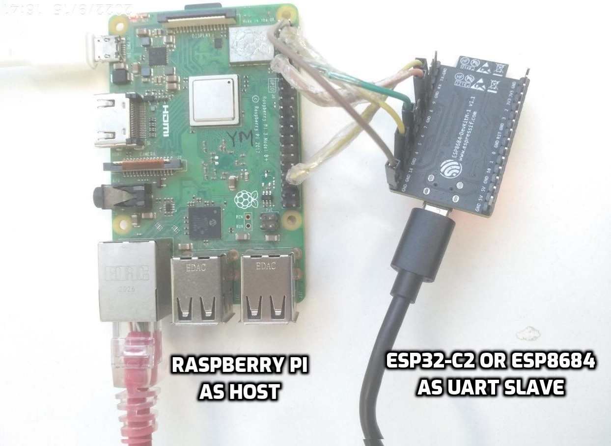

# Bluetooth/BLE connectivity Setup over UART
This section is only applicable to ESP32, ESP32-C3 and ESP32-S3 boards. ESP32-S2 does not support Bluetooth/BLE.

## 1. Setup
### 1.1 Hardware Setup
In this setup, ESP chipset provides Bluetooth/BLE capabilities to host over UART interface. Please connect ESP peripheral to Raspberry-Pi with jumper cables as mentioned below. It may be good to use small length cables to ensure signal integrity. Power ESP32 and Raspberry Pi separately with a power supply that provide sufficient power. ESP chipset can be powered through PC using micro-USB cable.

Raspberry-Pi pinout can be found [here!](https://pinout.xyz/pinout/uart)

#### 1.1.1 ESP32 setup
| Raspberry-Pi Pin Function | Raspberry-Pi Pin | ESP32 Pin | ESP32 Pin Function |
|:-------:|:--------:|:---------:|:--------:|
| RX | 10 | IO5 | TX |
| TX | 8 | IO18 | RX |
| CTS | 36 | IO19 | RTS |
| RTS | 11 | IO23 | CTS |

Setup image is here.


#### 1.1.2 ESP32-C2 setup
| Raspberry-Pi Pin Function | Raspberry-Pi Pin | ESP32-C2 Pin | ESP32-C2 Pin Function |
|:-------:|:--------:|:---------:|:--------:|
| RX | 10 | IO5 | TX |
| TX | 8 | IO18 | RX |

Setup image is here.



#### 1.1.2 ESP32-C3 setup
| Raspberry-Pi Pin Function | Raspberry-Pi Pin | ESP32-C3 Pin | ESP32-C3 Pin Function |
|:-------:|:--------:|:---------:|:--------:|
| RX | 10 | IO5 | TX |
| TX | 8 | IO18 | RX |
| CTS | 36 | IO19 | RTS |
| RTS | 11 | IO8 | CTS |

Setup image is here.


#### 1.1.3 ESP32-S3 setup
- microUSB power is expected to insert in [UART port](https://docs.espressif.com/projects/esp-idf/en/latest/esp32s3/hw-reference/esp32s3/user-guide-devkitc-1.html#description-of-components)

| Raspberry-Pi Pin Function | Raspberry-Pi Pin | ESP32-S3 Pin | ESP32-S3 Pin Function |
|:-------:|:--------:|:---------:|:--------:|
| RX | 10 | IO17 | TX |
| TX | 8 | IO18 | RX |
| CTS | 36 | IO19 | RTS |
| RTS | 11 | IO20 | CTS |

Setup image is here.


### 1.2 Raspberry-Pi Software Setup
By default, the UART pins on Raspberry-Pi are in disabled state. In order to enable UART and setup it for bluetooth connection, follow below steps.
1. Enable UART pins and disable in built bluetooth on Raspberry-Pi by appending following lines to _/boot/config.txt_ file
```
enable_uart=1
dtoverlay=disable-bt
```
2. Remove following from _/boot/cmdline.txt_. Leave everything else untouched.
```
console=serial0,115200
```
e.g. If _/boot/cmdline.txt_ is as below:
```
$ cat /boot/cmdline.txt
dwc_otg.lpm_enable=0 console=tty1 console=serial0,115200 root=PARTUUID=5c2c80d1-02 rootfstype=ext4 elevator=deadline fsck.repair=yes rootwait quiet splash plymouth.ignore-serial-consoles spidev.bufsiz=32768
````
Then after removal of above mentioned arguments, it should look as below:
```
$ cat /boot/cmdline.txt
dwc_otg.lpm_enable=0 console=tty1 root=PARTUUID=5c2c80d1-02 rootfstype=ext4 elevator=deadline fsck.repair=yes rootwait quiet splash plymouth.ignore-serial-consoles spidev.bufsiz=32768
```
3. Disable hciuart on Raspberry-Pi
```
$ sudo systemctl disable hciuart
```
4. Reboot Raspberry-Pi

## 2. Load ESP-Hosted Solution
### 2.1 Host Software
- Clone ESP-Hosted repository on Raspberry-Pi
- Build and load kernel module
```sh
$ cd esp_hosted_fg/host/linux/host_control/
$ ./rpi_init.sh <transport> <bt_over_uart>
```
	- <transport> can take value `sdio` or `spi`. Defaults to `sdio`
	- <bt_over_uart> can take value `btuart` or `btuart_2pins`.
	  - This option will setup HCI over UART
	  - :warning: Note:
	    - For ESP32-C2, 2 pin UART (TX & RX only) is supported. So `btuart_2pins` should be used for ESP32-C2.
		- For other chipsets, `btuart` should be used, where 4 pin UART (TX, RX, CTS, RTS) is only supported.

### 2.2 ESP Peripheral Firmware
One can load pre-built release binaries on ESP peripheral or compile those from source. Below subsection explains both these methods.

#### 2.2.1 Load Pre-built Release Binaries
* Download pre-built firmware binaries from [releases](https://github.com/espressif/esp-hosted/releases)
* Follow `readme.txt` from release tarball to flash the ESP binary
* :warning: Make sure that you use `Source code (zip)` for host building.
* Windows user can use ESP Flash Programming Tool to flash the pre-built binary.

#### 2.2.2 Source Compilation
- Note: Please use the same git commit both at ESP and Host
- Clone the ESP-IDF [release/v5.0](https://github.com/espressif/esp-idf/tree/release/v5.0) and git checkout to `release/v5.0` branch.
- [Set-up the ESP-IDF](https://docs.espressif.com/projects/esp-idf/en/release-v5.0/esp32/get-started/index.html)
- In root directory of ESP-Hosted repository, execute below command

```sh
$ cd esp_hosted_fg/esp/esp_driver/network_adapter
```

##### Using cmake

- Set target
	- ESP32-C2
	```
	$ idf.py set-target esp32c2
	```
	- ESP32-C3
	```
	$ idf.py set-target esp32c3
	```
	- ESP32-S3
	```
	$ idf.py set-target esp32s3
	```
	- ESP32
	Skip to next step


- Open project config
```sh
$ idf.py menuconfig
```

- Set ESP-Hosted transport
	- ESP32
		- Select transport either SDIO or SPI
		- Navigate to `Example Configuration -> Transport layer` select `SDIO interface` or `SPI interface`, whichever expected
	- ESP32-C2 / ESP32-C3 / ESP32-S3
		- SPI is automatically selected. Nothing to be done, skip to next step

- Set Bluetooth over UART
	- ESP32 / ESP32-C3 / ESP32-S3
		- navigate to `Component config -> Bluetooth -> Bluetooth controller -> HCI mode`, select `UART(H4)`
	- ESP32-C2
		- Navigate to `Component config -> Bluetooth -> Bluetooth -> Controller`, select `Enabled`
		- Navigate to `Component config -> Bluetooth -> Controller Options -> HCI Config -> Select HCI interface`, select `uart`
		- Navigate to `Component config > Bluetooth > Controller Options > HCI Config` and enable `HCI uart Hardware Flow ctrl`

- Set UART baud rate
	Default HCI over baud rate is 921600. In case need to change,
	- ESP32
		- Navigate and change using `Component config -> Bluetooth -> Bluetooth controller -> HCI UART(H4) Options -> UART Baudrate for HCI`
	- ESP32-C3 / ESP32-S3
		- Navigate and change using `Component config -> Example Configuration -> UART Baudrate for HCI`
	- ESP32-C2
		- Navigate and change using `Component config -> Bluetooth -> Controller Options -> HCI Config`

- Additional settings
	- ESP32-C3
		- Select chip revision in addition. Navigate to `Component config → ESP32C3-Specific → Minimum Supported ESP32-C3 Revision` and select chip version of ESP32-C3.
	- Other ESP chipsets
		- None, skip to next step

- Build and flash the project. Replace <serial_port> with ESP peripheral's serial port.
```sh
$ idf.py -p <serial_port> build flash
```

## 3. Post Setup
- After setting up host and loading ESP firmware, execute below command to create `hci0` interface
	```sh
	$ sudo hciattach -s <baud_rate> /dev/serial0 any <baud_rate> flow
	```
- <baud_rate> should match UART baud rate while flashing ESP peripheral

### For ESP32
- Check `CONFIG_BT_HCI_UART_BAUDRATE` parameter in *esp_hosted_fg/esp/esp_driver/network_adapter/sdkconfig*
- Alternatively baud rate could be located in menuconfig at, * Alternatively baud rate could be located in menuconfig at, `Component config ->  Bluetooth -> Bluetooth controller ->  HCI UART(H4) Options -> UART Baudrate for HCI`

### For ESP32-C3 or ESP32-S3
- Check `CONFIG_EXAMPLE_HCI_UART_BAUDRATE` parameter in *esp_hosted_fg/esp/esp_driver/network_adapter/sdkconfig*
- Alternatively baud rate could be located in menuconfig at, `Component config -> Example Configuration -> UART Baudrate for HCI`

## 4. Points to note

#### 4.1 Restart HCI on every reloading of kernel module
- Remove and reattach `HCI over UART`
  ```sh
  $ hciconfig -a
  $ sudo killall hciattach
  $ sudo hciattach -s <baud_rate> /dev/serial0 any <baud_rate> flow
  $ hciconfig -a
  ```
- <baud_rate> should match UART baud rate while flashing ESP peripheral

#### 4.2 Restart Bluetooth apps
- Any third party apps such as pulseaudio or alsa should be restarted after restarting HCI
