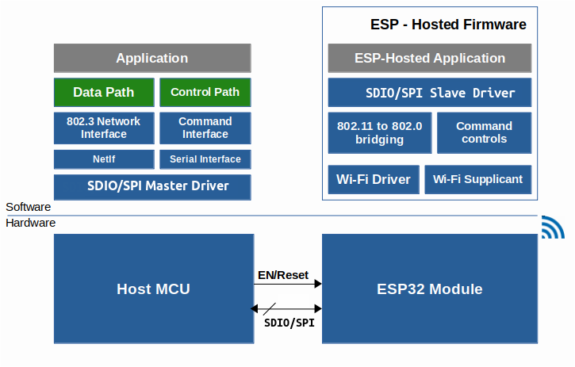

# Getting Started with MCU based host
- Directory structure for microprocessor based host is explained [here](directory_structure.md)
- Below diagram shows hardware and software block diagram for a typical MCU based system built with ESP-Hosted.



# 1. Development Environment Setup

## 1.1 Preconditions

### 1.1.1 STM32CubeIDE installation

We recommend the latest version of STM32CubeIDE from STMicroelectronics on PC. User can download IDE from [Here](https://www.st.com/en/development-tools/stm32cubeide.html#get-software).

### 1.1.2 Tools for testing
* **Arping**:
	Arping software is needed for testing the project.
	Arping is a software tool which probes hosts on the network link by sending Link Layer frames using the ARP request to host identified by its MAC address. More details could be found on [this link](https://devconnected.com/arping-command-on-linux-explained/).

	To install arping on ubuntu based system, please use
	```
	$ sudo apt install arping
	```
	For installation on Windows hosts, [check this link](https://elifulkerson.com/projects/arp-ping.php)

	arping can easily be installed on other architectures.

* **Serial port communication program**:
	For Linux and Mac development hosts, minicom is needed. For Windows based hosts Tera Term is needed.

### 1.1.3 Things worth noting
* **Porting solution to Non-STM32 MCUs**
	ESP-Hosted solution using one ESP chipset and host and other as slave can be found at [ESP as Host](https://github.com/espressif/esp-hosted/issues/186#issuecomment-1429252815)
	This solution can be checked for easy porting to non-STM32 based MCUs. Port layer is much simplified here. Formal support is coming soon in upcoming releases.

* **Network stack integration**
	Although currently network stack is kept open to port for user, in the upcoming releaes, we plan to showcase lwip as example network stack.
	Sample example of porting done by [Dror Gluska](https://github.com/drorgl) can be referred at https://github.com/drorgl/stm32-lwip-esp-hosted

* **Clock considerations for STM32**
	For STM32 based hosts, the default clocks are intentionally kept smaller for simplicity. Once base solution is working, It is recommended to increase/tune the SPI clock using ioc in STM32CubeIDE or STM32CubeMX.

### 1.1.4 ESP-Hosted Code Repository
Clone ESP-Hosted repository on machine, where STM32CubeIDE used to connect/flash to host.
```
$ git clone --recurse-submodules <url_of_esp_hosted_repository>
$ cd esp-hosted
$ git submodule update --init --recursive
```

# 2. Setup

Prepare connections based on interface requirements and setup ESP peripheral as below.

* **Wifi over SDIO on STM32F412ZGT6-Nucleo 144**
	* Connection Setup
		* Prepare connections as per section [1.1 Hardware Setup](SDIO_setup.md#11-hardware-setupconnections) of [SDIO setup document](SDIO_setup.md)
	* ESP peripheral setup
		* ESP peripheral setup as per section [2.2 ESP peripheral setup](SDIO_setup.md#22-setup) of [SDIO setup document](SDIO_setup.md)

* **Wifi over SPI on STM32F469I-Discovery**
	* Connection Setup
		* Prepare connections as per section [1.1 Hardware Setup](SPI_setup.md#11-hardware-setupconnections) of [SPI Setup document](SPI_setup.md)
	* ESP peripheral setup
		* ESP peripheral setup as per section [2.2 ESP peripheral setup](SPI_setup.md#22-setup) of [SPI setup document](SPI_setup.md)

# 3. ESP-Hosted Usage Guide
Following guide explains how to use ESP-Hosted soultion with MCU based platform.
* [User Guide for MCU based Host](./Getting_started.md)
