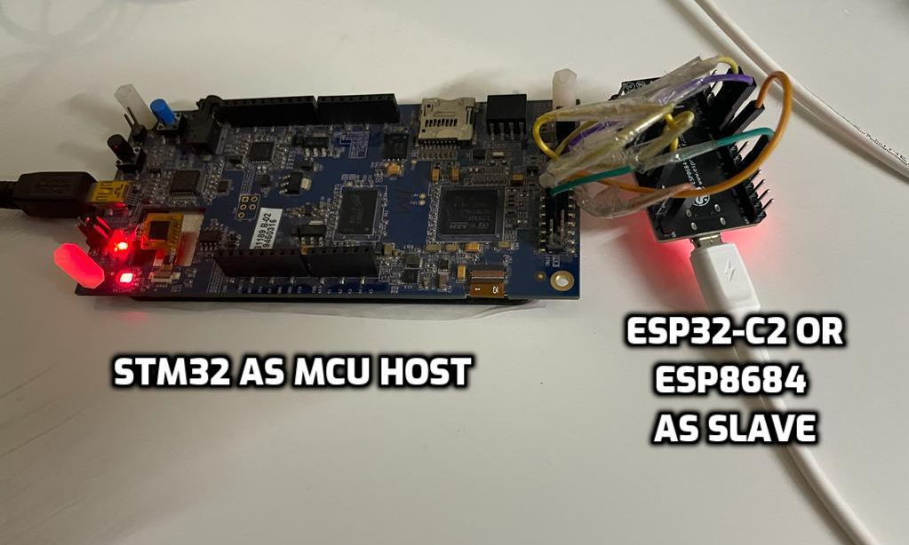
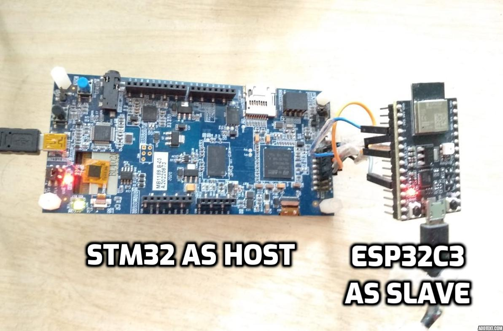

# Getting Started with MCU based host (STM32F469I)
- Directory structure for microprocessor based host is explained [here](directory_structure.md)
- Below diagram shows hardware and software block diagram for a typical MCU based system built with ESP-Hosted.


# 1. Development Environment Setup

## 1.1 Preconditions

### 1.1.1 STM32CubeIDE installation

We recommend STM32CubeIDE version 1.4 IDE from STMicroelectronics on host machine(Laptop, Desktop etc.). User can download IDE from [Here](https://www.st.com/en/development-tools/stm32cubeide.html#get-software).

### 1.1.2 Tools for testing
* **Arping**:
	Arping software is needed for testing the project.
	Arping is a software tool which probes hosts on the network link by sending Link Layer frames using the ARP request to host identified by its MAC address. More details could be found on [this link](https://devconnected.com/arping-command-on-linux-explained/).

	To install arping on ubuntu based system, please use
	```
	$ sudo apt install arping
	```
	For installation on Windows hosts, [check this link](https://elifulkerson.com/projects/arp-ping.php)

	arping can easily be installed on other architectures.

* **Serial port communication program**:
	For Linux and Mac development hosts, minicom is needed. For Windows based hosts Tera Term is needed.

### 1.1.3 ESP-Hosted Code Repository
Clone ESP-Hosted repository on machine, where STM32CubeIDE used to connect/flash to host.
```
$ git clone --recurse-submodules <url_of_esp_hosted_repository>
$ cd esp-hosted
$ git submodule update --init --recursive
```

# 2. Wi-Fi connectivity Setup over SPI
## 2.1 Hardware Setup/Connections
In this setup, ESP board acts as a SPI peripheral and provides Wi-Fi capabilities to host. Please connect ESP peripheral to STM32F469I board's CN12 Extension connecter with jumper cables as mentioned below. It may be good to use small length cables to ensure signal integrity.
BT/BLE support will be added in upcoming release.
Power ESP peripheral and STM32F469I separately with a power supply that provide sufficient power. ESP peripheral can be powered through PC using micro-USB cable. STM32 can be powered with mini-B cable. It is also used as USART connection for debug logs from host. Serial port communicaton program like tera term or minicom used to print the logs.


#### Hardware connections for ESP32
| STM32 Pin | ESP32 Pin | Function |
|:----------:|:---------:|:--------:|
| PB4 (pin5) | IO19 | MISO |
| PA5 (pin7) | IO18 | CLK  |
| PB5 (pin9) | IO23 | MOSI |
| PA15 (pin11) | IO5 | CS |
| GND (pin2) | GND | GND |
| PC6 (pin6) | IO2 | Handshake |
| PC7 (pin8) | IO4 | Data Ready from ESP |
| PB13 (pin10) | EN | Reset ESP |

Setup image is here.


#### Hardware connections for ESP32-S2
| STM32 Pin | ESP32-S2 Pin | Function |
|:---------:|:-----------:|:--------:|
| PB4  (pin5) | IO13 | MISO |
| PA5  (pin7) | IO12 | CLK |
| PB5  (pin9) | IO11 | MOSI |
| PA15 (pin11)| IO10 | CS |
| GND  (pin2) | GND | GND |
| PC6  (pin6) | IO2 | Handshake |
| PC7  (pin8) | IO4 | Data ready from ESP |
| PB13  (pin10) | RST | Reset ESP |

Setup image is here.


#### Hardware connections for ESP32-C2
| STM32 Pin | ESP32-C2 Pin | Function |
|:---------:|:-----------:|:--------:|
| PB4  (pin5) | IO02 | MISO |
| PA5  (pin7) | IO06 | CLK |
| PB5  (pin9) | IO07 | MOSI |
| PA15 (pin11)| IO10 | CS |
| GND  (pin2) | GND | GND |
| PC6  (pin6) | IO03 | Handshake |
| PC7  (pin8) | IO04 | Data ready from ESP |
| PB13  (pin10) | RST | Reset ESP |

Setup image is here.



#### Hardware connections for ESP32-C3
| STM32 Pin | ESP32-C3 Pin | Function |
|:---------:|:-----------:|:--------:|
| PB4  (pin5) | IO02 | MISO |
| PA5  (pin7) | IO06 | CLK |
| PB5  (pin9) | IO07 | MOSI |
| PA15 (pin11)| IO10 | CS |
| GND  (pin2) | GND | GND |
| PC6  (pin6) | IO03 | Handshake |
| PC7  (pin8) | IO04 | Data ready from ESP |
| PB13  (pin10) | RST | Reset ESP |

Setup image is here.



#### Hardware connections for ESP32-S3
| STM32 Pin | ESP32-S3 Pin | Function |
|:---------:|:-----------:|:--------:|
| PB4  (pin5) | IO13 | MISO |
| PA5  (pin7) | IO12 | CLK |
| PB5  (pin9) | IO11 | MOSI |
| PA15 (pin11)| IO10 | CS |
| GND  (pin2) | GND | GND |
| PC6  (pin6) | IO02 | Handshake |
| PC7  (pin8) | IO04 | Data ready from ESP |
| PB13  (pin10) | RST | Reset ESP |

Setup image is here.


# 2. ESP peripheral setup
## 2.1 ESP-IDF requirement
:warning:`Note: ESP-IDF is needed to compile ESP-Hosted firmware source. Skip this step if you are planning to use pre-built release binaries.`

- Clone the ESP-IDF [release/v5.0](https://github.com/espressif/esp-idf/tree/release/v5.0)  and checkout to `release/v5.0` branch.
- The control path between MCU host and ESP peripheral is based on `protobuf`. For that, corresponding stack layer, `protocomm` from ESP-IDF is used. It will be already present in ESP-IDF, no extra setup required for that.

### 2.2 Setup
#### 2.2.1 Using pre-built binary
* Download pre-built firmware binaries from [releases](https://github.com/espressif/esp-hosted/releases)
* Follow `readme.txt` from release tarball to flash the ESP binary
* :warning: Make sure that you use `Source code (zip)` in `Assets` fold with associated release for host building.
* Windows user can use ESP Flash Programming Tool to flash the pre-built binary.

#### 2.2.2 Compilation using source

- Note: Please use the same git commit both at ESP and Host
- Clone the ESP-IDF [release/v5.0](https://github.com/espressif/esp-idf/tree/release/v5.0) and git checkout to `release/v5.0` branch.
- [Set-up the ESP-IDF](https://docs.espressif.com/projects/esp-idf/en/release-v5.0/esp32/get-started/index.html)
- Navigate to `esp_hosted_fg/esp/esp_driver/network_adapter` directory.

##### Using cmake

```
$ idf.py fullclean
```
:warning: Skip this step for ESP32. Run for ESP32-S2 / ESP32-C2 / ESP32-C3
```
$ idf.py set-target esp32s2
```
or
```
$ idf.py set-target esp32c2
```
or
```
$ idf.py set-target esp32c3
```

Run following command and navigate to `Example Configuration -> Transport layer -> SPI interface -> select` and exit from menuconfig. Read more about [idf.py](https://docs.espressif.com/projects/esp-idf/en/latest/esp32s2/api-guides/build-system.html#using-the-build-system) here.
```
$ idf.py menuconfig
```

:warning: Skip below step for ESP32-S2 / ESP32-C2 / ESP32-C3. Run for  ESP32 only.

Change SPI controller to VSPI. Please navigate to `Example Configuration → SPI Configuration` and change value of `SPI controller to use` to `3`

To build and flash the app on ESP peripheral, run

```sh
$ idf.py -p <serial_port> build flash
```

# 3. ESP-Hosted Usage Guide
Following guide explains how to use ESP-Hosted soultion with MCU based platform.
* [User Guide for MCU based Host](./Getting_started.md)
