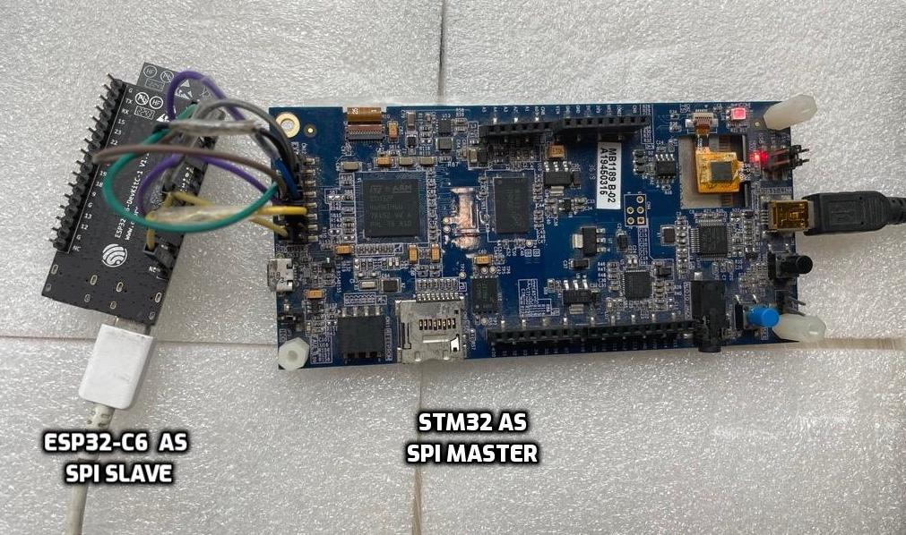

# Wi-Fi connectivity Setup over SPI
## 1. Setup

| Supported Targets | ESP32 | ESP32-S2 | ESP32-S3 | ESP32-C2 | ESP32-C3 | ESP32-C6 |
| ----------------- | ----- | -------- | -------- | -------- | -------- | -------- |

### 1.1 Hardware Setup/Connections
* In this setup, ESP board acts as a SPI peripheral and provides Wi-Fi capabilities to host. Please connect ESP board to STM32F469I board's CN12 Extension connecter with jumper cables as mentioned below. It may be good to use small length cables to ensure signal integrity.
* STM32F469I should be powered with correct incoming power rating. ESP peripheral can be powered through PC using micro-USB/USB-C cable. STM32 can be powered with mini-B cable. It is also used as USART connection for debug logs from host. Serial port communicaton program like tera term or minicom used to print the logs.
* BT/BLE support will be added in upcoming release.

#### Hardware connections for ESP32
| STM32 Pin | ESP32 Pin | ESP32-S2/S3 | ESP32-C2/C3/C6 | Function |
|:----------:|:---------:|:--------:|:--------:|:--------:|
| PB4 (pin5) | IO19 | IO13 | IO2 | MISO |
| PA5 (pin7) | IO18 | IO12 | IO6 | CLK  |
| PB5 (pin9) | IO23 | IO11 | IO7 | MOSI |
| PA15 (pin11) | IO5 | IO10 | IO10 | CS |
| GND (pin2) | GND | GND | GND | GND |
| PC6 (pin6) | IO2 | IO2 | IO3 | Handshake |
| PC7 (pin8) | IO4 | IO4 | IO4 | Data Ready from ESP |
| PB13 (pin10) | EN | RST | RST | Reset ESP |

SPI setup sample image with ESP32-C6 as slave & STM32 as Host:


- Use good quality extremely small (smaller than 10cm) jumper wires, all equal length
- Optionally, Add external pull-up of min 10k Ohm on CS line just to prevent bus floating
- In case of ESP32-S3, For avoidance of doubt, You can power using [UART port](https://docs.espressif.com/projects/esp-idf/en/latest/esp32s3/hw-reference/esp32s3/user-guide-devkitc-1.html#description-of-components)

## 2. ESP peripheral setup

One can load pre-built release binaries on ESP peripheral or compile those from source. Below subsection explains both these methods.

### 2.1 Load Pre-built Release Binaries
- Download pre-built firmware binaries from [releases](https://github.com/espressif/esp-hosted/releases)
- Follow `readme.txt` from release tarball to flash the ESP binary
- :warning: Make sure that you use `Source code (zip)` in `Assets` fold with associated release for host building.
- Windows user can use ESP Flash Programming Tool to flash the pre-built binary.
- Collect firmware log
    - Use minicom or any similar terminal emulator with baud rate 115200 to fetch esp side logs on UART
```sh
$ minicom -D <serial_port>
```
serial_port is device where ESP chipset is detected. For example, /dev/ttyUSB0


### 2.2 Source Compilation

Make sure that same code base (same git commit) is checked-out/copied at both, ESP and Host

##### Set-up ESP-IDF
- :warning: Following command is dangerous. It will revert all your local changes. Stash if need to keep them.
- Install the ESP-IDF using script
```sh
$ cd esp_hosted_fg/esp/esp_driver
$ cmake .
```
- Set-Up the build environment using
```sh
$ . ./esp-idf/export.sh
# Optionally, You can add alias for this command in ~/.bashrc for later use
```

##### Configure, Build & Flash ESP firmware
- Set slave chipset environment
```
$ cd network_adapter
$ rm -rf sdkconfig build
$ idf.py set-target <esp_chipset>
```
where <esp_chipset> could be one from "esp32", "esp32s2", "esp32s3", "esp32c2", "esp32c3", "esp32c6"

- Execute following command to configure the project
```sh
$ idf.py menuconfig
```
- This will open project configuration window. To select SPI transport interface, navigate to `Example Configuration ->  Transport layer -> SPI interface -> select` and exit from menuconfig.

:warning: Skip below step for ESP32-S2/S3/C2/C3/C6. Run for  ESP32 only.

- If ESP32 slave, Change SPI controller to VSPI. Please navigate to `Example Configuration → SPI Configuration` and change value of `SPI controller to use` to `3`

To build and flash the app on ESP peripheral, run

```sh
$ idf.py -p <serial_port> build flash
```

- Collect the firmware log using
```sh
$ idf.py -p <serial_port> monitor
```

## 3. Checking the Setup

- Firmware log
On successful flashing, you should see following entry in ESP log:

```
[   77.877892] Features supported are:
[   77.877901]   * WLAN
[   77.877906]   * BT/BLE
[   77.877911]     - HCI over SPI
[   77.877916]     - BT/BLE dual mode
```

- Host log
If the setup is functioning fine, you should receive `INIT` event similar to above from ESP chipset
